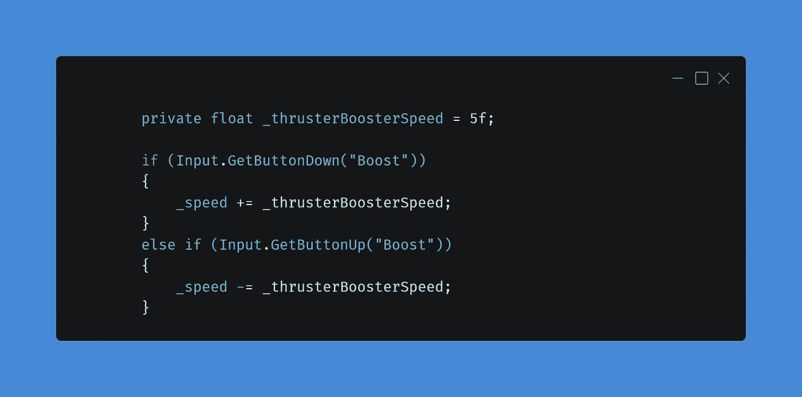
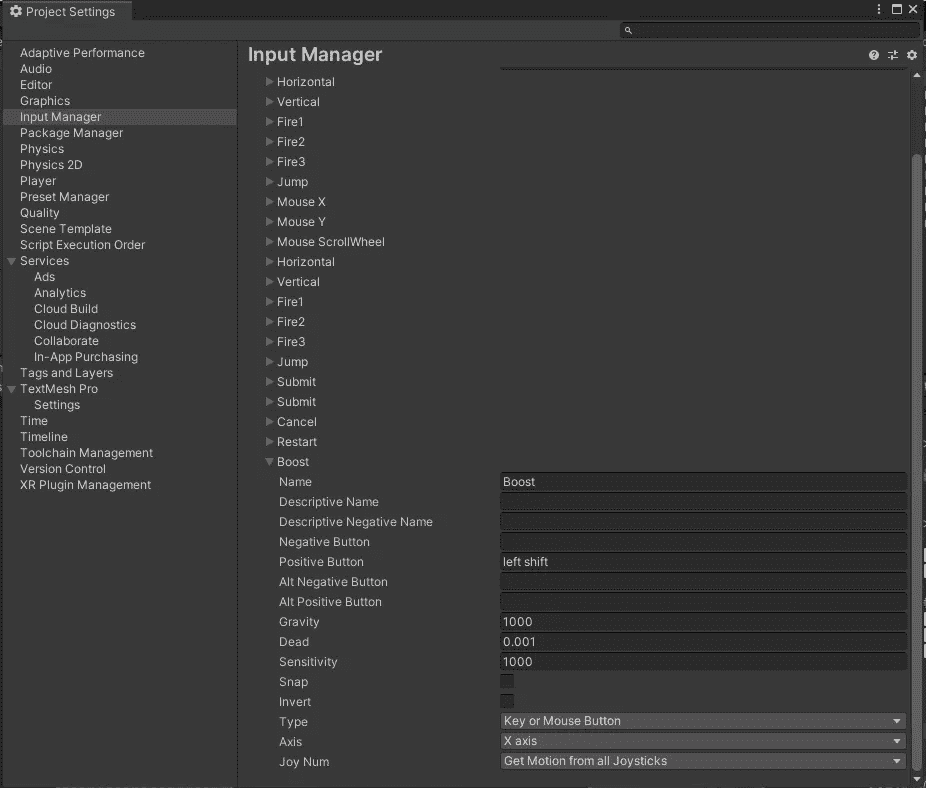

# 第一阶段:推进器助推

> 原文：<https://medium.com/nerd-for-tech/phase-1-thruster-boost-fd4eab70500d?source=collection_archive---------21----------------------->

在过去的一个月里，自从我开始这个项目以来，我一直在开发太空射击游戏。这个游戏是一门课程的一部分，在这门课程中，我按照包含不同部分的视频集的指示进行操作。在每一节之后，我会写各种各样的文章，涵盖我所学到的东西，但今天我被赶出了隐喻的巢穴，必须学会飞翔，而且要快！

鸣谢:Pinterest

第一阶段的框架包括 8 个特性，我必须在没有教练的任何帮助或指导下在我的游戏中实现这些特性。每个功能都有一个或多个我必须满足的要求，今天我将写第一个，希望你有一个降落伞！

# 推进器助推

第一个特点是给游戏增加了一个推进器系统，当你按下一个键来加快移动速度时。

> 当“左移”被按下时，以增加的速率移动玩家。
> 松开“左移”键时，重置回正常速度。

作为我的第一个“任务”,我觉得这真的是一个很容易的任务，并立即加入了这个特性。因为我们的玩家脚本已经有了一个 Movement()函数，所以我决定在我们的玩家动作下面添加这个新函数。但是在我们开始之前，我们需要理解代码的一个基本部分，当用户按下按钮时，速度会增加。并且当用户释放按钮时，速度降低。

# 代码

如果你一直关注我的文章，你会注意到我经常使用输入。GetButton("ButtonName ")。但在这种情况下，我们更应该使用输入。GetButtonDown("ButtonName ")，因为这只会触发一次，而不是连续的，如果它连续运行，它会不断增加速度，我们不希望这样。我还再次使用了“GetButton”系统，因为我可以使用 Unity 的输入系统创建按钮，并且以后可以更改按钮，而无需重新编写代码。

# 结论

通过简单地添加 5 行代码到我们的游戏中，我们就添加了一个新的功能。我认为这是目前为止最容易从框架中实现的功能，但是我们将在不久的将来重新考虑这个功能，以创建一个充电或冷却时间，这样人们就不能无限期地使用这个提升。