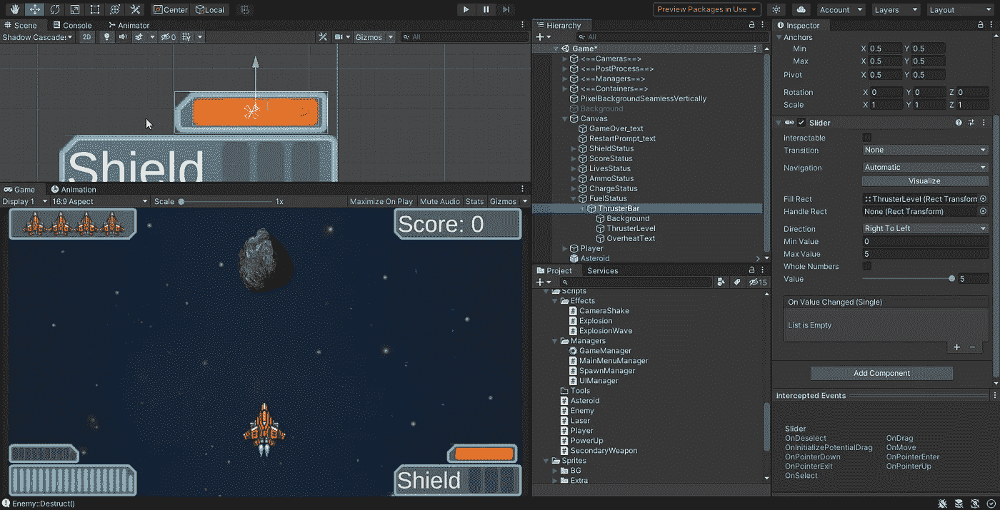
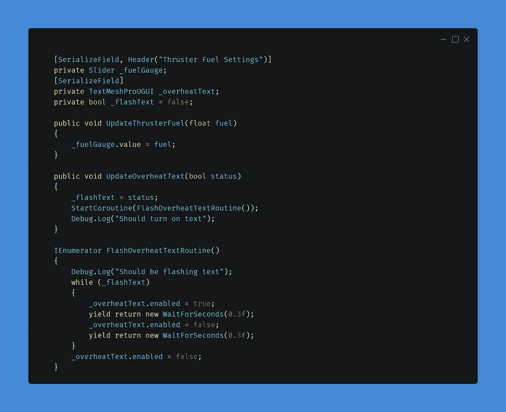
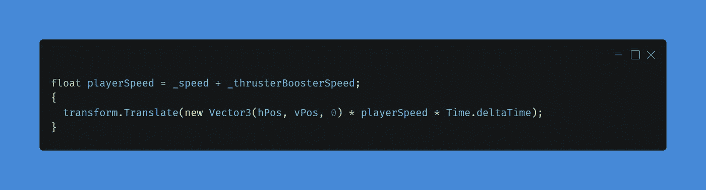
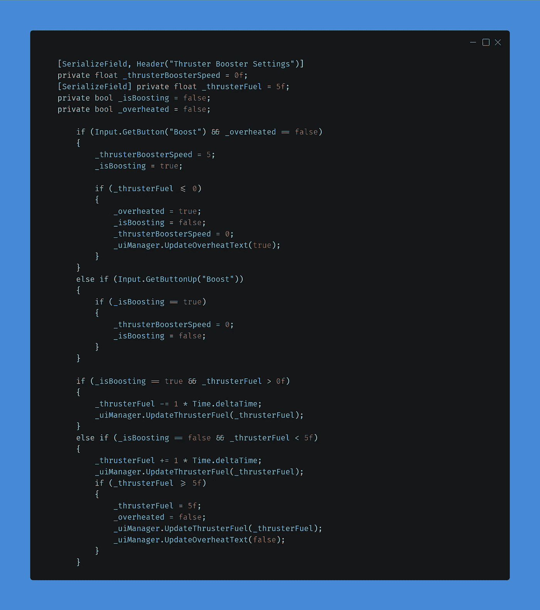
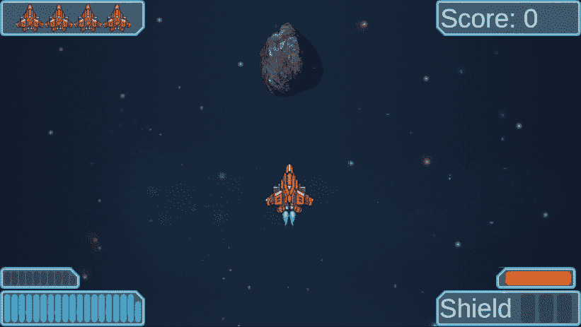

# 第一阶段:推进器比例尺

> 原文：<https://medium.com/nerd-for-tech/phase-1-thruster-scaling-bar-edf3a4eae84e?source=collection_archive---------21----------------------->

不久前，我不得不实现一个推进器的速度提升，用户可以按下 shift 键来加快速度。这个系统是非常基础的，没有冷却时间，所以玩家可以保持变速，并有无限的速度提升。今天的挑战将会改变这一切。

> 创建一个 UI 元素来可视化你的推进器的电荷元素。需要一个冷却系统。

伙计，这是迄今为止最艰难的挑战。看起来实现起来很简单，但是在 3 次迭代之后，当你用完时间的时候，我仍然不能停止加速。其他一切都在工作，我不得不在 slack 程序中寻求帮助，最终，当一个同学[T2 帮助我时，它点击了。对你来说幸运的是，一切都已经想好了，所以今天我将分享实现是如何工作的。](https://geraldclarkaudio.medium.com/)

# 从 UI 开始

一如既往，我喜欢先实现 UI，然后从那里开始工作。但是这次我们将使用一些不同于常规图像部分的东西。我创建了一个新的图像组件，并添加了一个将创建房屋的图像，并将其命名为“FuelStatus”。在小时候的图片中，我添加了一个空对象，命名为“ThrusterBar ”,并在该对象上添加了一个滑块组件。我取消了交互式按钮，并将过渡设置为无。我们不会使用滑块作为一个真正的滑块，但我们将使用值作为一个简单而漂亮的方式来创建一个可填充栏。我将最小值设置为 0，最大值设置为 5，给玩家 5 秒的推进器加速时间。

我还在 ThrusterBar 对象上添加了两个 image 对象作为子对象。我将其中一个命名为“Background ”,用于保存半透明的阴影图像，将另一个命名为“ThrusterLevel ”,用于保存我们用作填充的实际图像。最后，我添加了一个文本组件，并将其命名为“OverheatText ”,当燃料棒达到零时，它会闪烁，并阻止玩家增加燃料，直到燃料棒再次充满。

在 UIManager 脚本中，我创建了我需要的变量，还创建了三个新函数来更新滑块的值，并闪烁过热文本。

# 与播放器一起结束

你可能还记得我以前的文章，在那里我使用了“GetButtonDown”和“GetButtonUP”。使用这些函数会导致该部分代码在按钮被按下时只运行一次。我需要对推进器的工作原理做一些改变。我需要添加相当多的逻辑来使这个工作。我必须在函数中创建两个新的系统，如果用户按下升压按钮，“燃料”将下降，直到它达到 0，并返回到正常的播放器速度，播放器不能再次升压，直到“燃料”回到 5。并且如果用户释放按钮，速度将恢复正常，并且“燃料”将再生。

我还需要确保如果玩家在燃料耗尽前停止推进，他们可以再次推进。我需要创建一个 bool 来检查我们是否正在推进，我需要另一个 bool 来检查我们是否过热或没有“燃料”。我们需要两个浮子，一个用于“燃料”,一个用于推进器推进。

因为我们有一个速度提升动力，所以我决定修改移动方法中的速度工作方式，以有一个单独的值来修改，用户仍然可以使用动力和推进器提升高达 15 个速度。

ThrusterSpeedBoost()函数发生了很多事情。我首先检查我是否按下了加速按钮，如果我有足够的燃料，我会让推进器加速。如果我放开按钮，助推力就会停止。然后，我还需要检查我是否增压，以减少剩余的燃料，最后，如果我不增压，那么燃料应该再生。

在整个 if-else 语句中，我还需要更新 UI，并在燃料耗尽时切换过热文本。在这一点上，使用过热文本和燃料可能不一致，但没有人会知道这实际上是燃料或电荷或其他东西。在一个成熟的商业游戏中，在代码和游戏中保持一致的命名是明智的，但现在，它不是一个火车粉碎。

# 结论

虽然这个概念看起来很简单，但是实现起来花了很长时间，只有第四次迭代没有问题。我很喜欢滑块设置的最终结果，我正在考虑用它替换我现有的所有系统，因为你可以稍后在商店升级你的弹药以容纳更多弹药，然后你可以改变最大值，你永远不会遇到任何类型的越界异常，这些异常有时是由于糟糕的编码实现而发生的。

