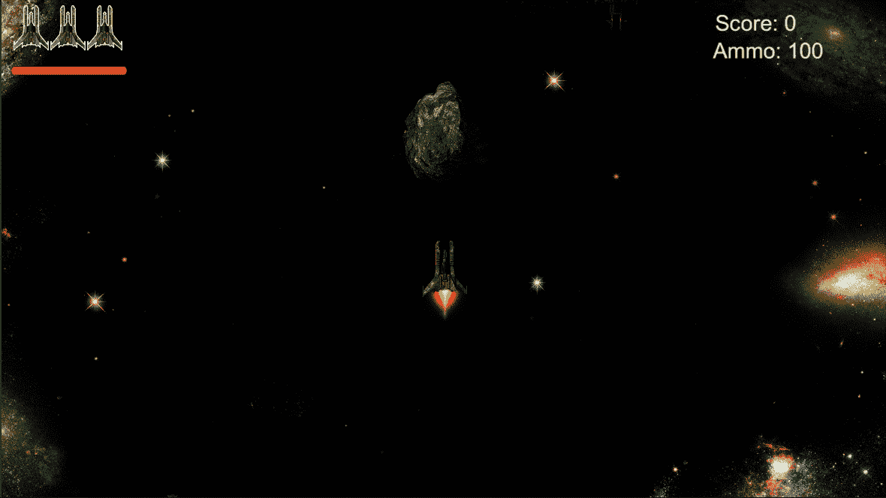
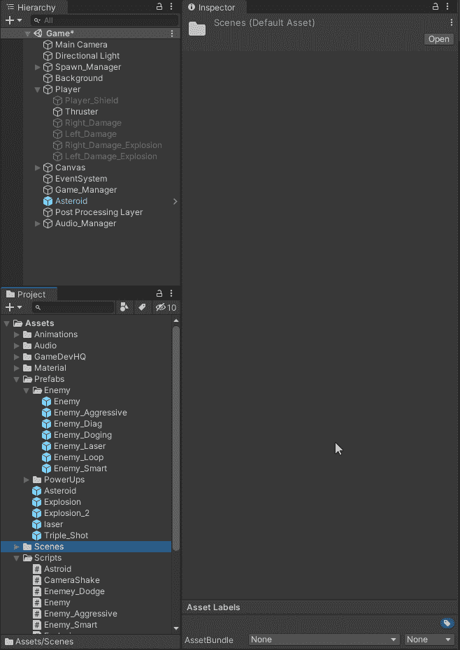
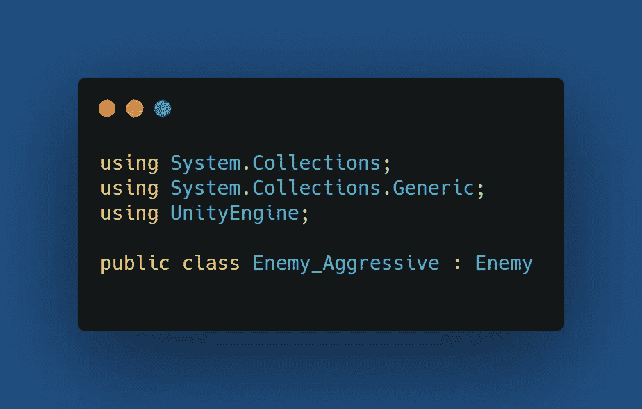
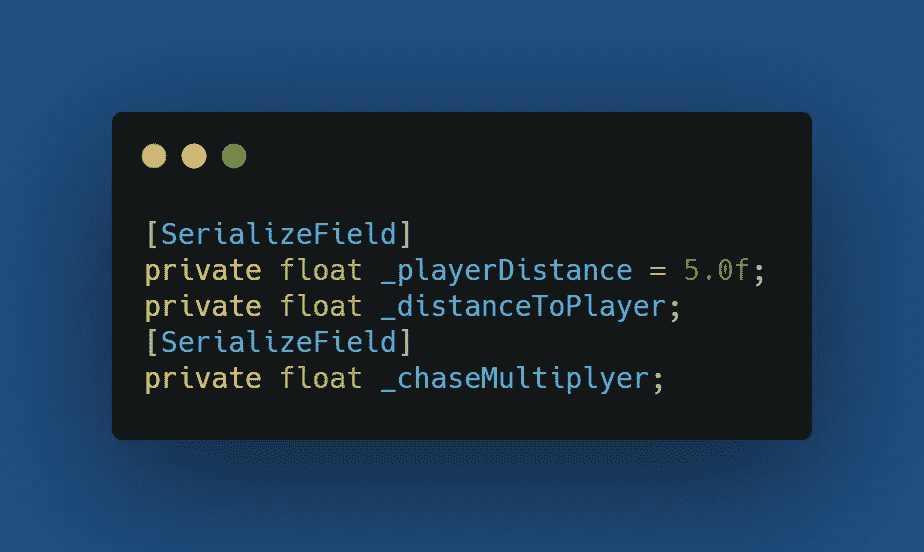
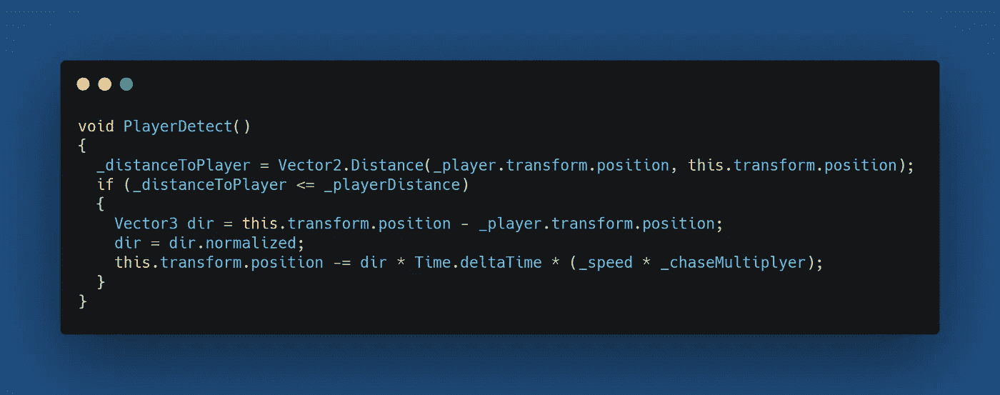

# 第二阶段:咄咄逼人的敌人

> 原文：<https://medium.com/nerd-for-tech/phase-2-an-aggressive-enemy-8cf928b03279?source=collection_archive---------15----------------------->

目标:当敌人靠近玩家时，敌人会试图“撞上它”

首先要做的是创造一个新的敌人。我将复制当前的敌人，重命名为敌人 _ 侵略性，改变色调，并添加一个新的脚本。

新的脚本将被命名为敌人 _ 侵略性，并将固有的脚本敌人。这将允许我重复使用已经为敌人设置的代码。

下面是我将使用的变量。我需要检查玩家的距离，玩家离开的距离，我想在敌人追赶玩家的时候增加一个速度倍增(只是为了好玩)

我将创建一个名为 PlayerDetect()的方法来检查玩家是否足够近，如果很近，敌人将开始向玩家移动并以倍增的速度移动。

让我们看看这是怎么回事！

编码快乐！！