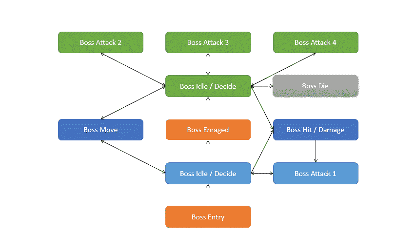

# 第二阶段:Boss AI-第一部分

> 原文：<https://medium.com/nerd-for-tech/phase-2-boss-ai-part-1-9901c12b20f6?source=collection_archive---------18----------------------->

在课程的最后一个挑战中，我们要创造一个你必须在最后一波对抗的 boss。我的意思是没有一个难对付的老板的游戏是什么？

> 创建一个最后的波，包括一个老板在结束。向下移动到屏幕中央并停留在那里。
> 对玩家的独特攻击。

我真的不知道从哪里开始这个挑战，因此我决定做一些研究，然后 [Brackeys](https://www.youtube.com/user/Brackeys) 制作了一个视频，讲述如何使用一种叫做有限状态机或简称 FSM 的东西来创建一个老板。如果你以前在 Unity 中做过动画，那么你已经用过 FSM 了。每个动画都是一个独立的状态，通过逻辑，你可以触发这些状态。当你开始使用混合树的时候，这变得更加复杂，但是对于老板来说，我们不需要变得那么复杂。

如果你不知道什么是 FSM，我会很快解释。基本上，FSM 是一种自动化发挥作用的设计模式。通常在人工智能实现中用于某些行为。使用 FSM 你可以为 NPC 的敌人和老板创造复杂的人工智能。在这种情况下，我将使用 FSM 为我们的老板创建各种状态、动画和动作。

在这篇文章中，我将解释我的老板将拥有的状态，在下一篇文章中，我将以一种(希望)容易理解的方式实现这些状态。

# Boss FSM 声明

这个项目的艺术资产包括一个拥有各种动画精灵的老板。为了简化，我将使用这些动画作为每个状态的基础。boss 有闲，动，死，四个攻击动画。我从骰子动画中创建了一个伤害动画。我刚刚使用了前几个精灵来创建这个动画。此时，我们有 8 个基本动画状态可以使用。

在上图中，我已经计划好了各种状态，我将逐一解释。

入门状态就是 boss 进入游戏的状态。在这种状态下，boss 将向下移动到屏幕上的一个点，然后转换到空闲状态。当老板进入游戏时，他将不会受到攻击。在空闲状态下，老板会决定他下一步要做什么，他要么移动，要么进攻。如果老板决定移动，他将再次变得无懈可击，并移动到三个预先定义的位置之一。一旦达到这个位置，老板就会再次变得脆弱。如果玩家在 boss 的第一阶段伤害了 boss，他会立刻反击。老板将从 50 点生命值开始，当大约一半的生命值损失时，老板会变得愤怒。

在愤怒状态期间，老板将再次变得刀枪不入，在状态结束时，老板将再次变得脆弱，但这一次他将有更多的攻击可以使用，他将移动得更快，决定得更快。

# 计划中的武器

这个挑战要求这个 boss 有独特的攻击，因为我们有四种不同的攻击，我决定在攻击 1 状态中重复使用敌人的激光。攻击 2 也会发射激光，但更具攻击性，而攻击 3 也会重复使用敌人的导弹并发射它们。对于最后一次攻击，我将创建一个新的武器类型。我真的很喜欢大型相位器或激光束的想法，它会直接射向屏幕，并可能损坏播放器。

我发现重复使用敌人拥有的一些武器是一个好主意，这样可以在关卡和不同的波中保持一致性。不同的敌人有一些差异，但看起来或多或少还是一样的，对老板来说也是如此，对我来说有一些相同的行为或机制是有意义的。

我想做的最后一件事是创造一些胜利的状态，自然，赢得游戏的最好方法是击败老板，但我喜欢放弃一些项目作为奖励的想法。我决定老板死后会掉落一颗星星或一个奖杯，只有当玩家收集到这个物品时游戏才会结束。我想用类似星球大战的滚动文本来结束我的游戏，并提供一些背景故事，说明为什么玩家最终向敌人射击并击败了老板。虽然我的游戏从一开始就没有真实的故事，但我决定用一个小故事来结束它。

我希望你会喜欢和我一起创造最终老板的旅程，我会尽我所能尽可能清晰易懂地解释一切。这将是我创建的第一个老板，我相信这将是一次有趣而有益的经历。