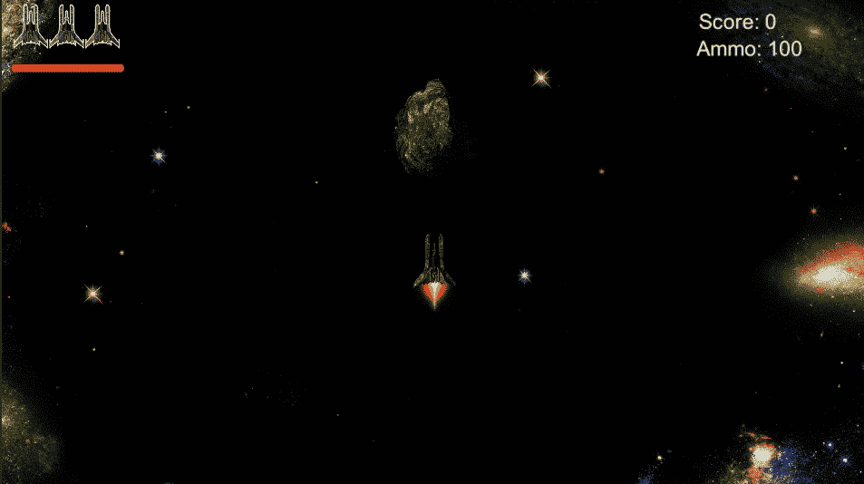
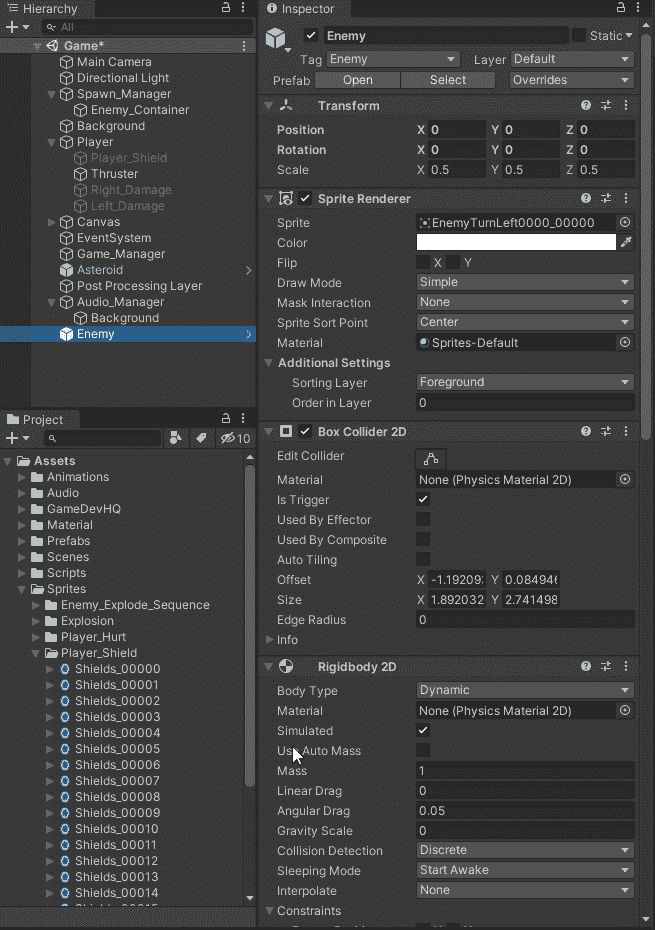
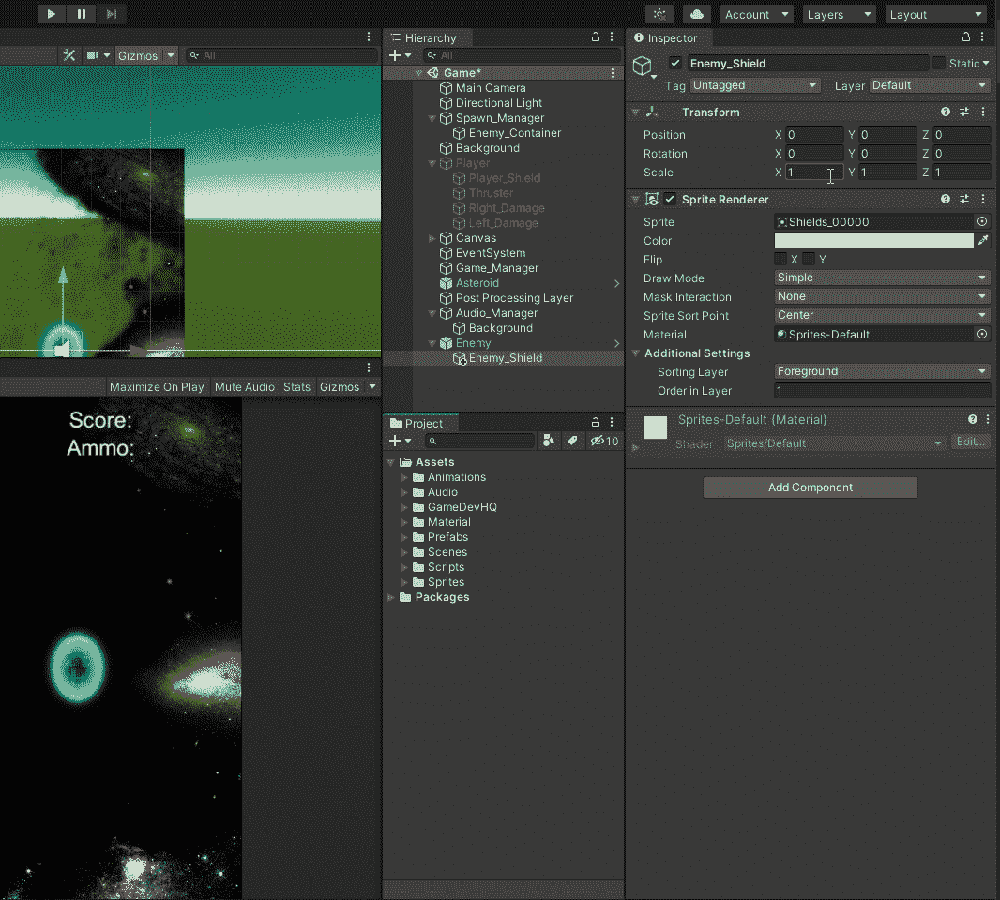
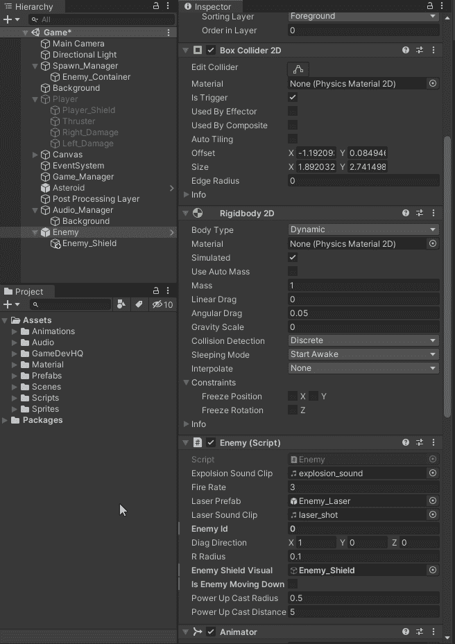
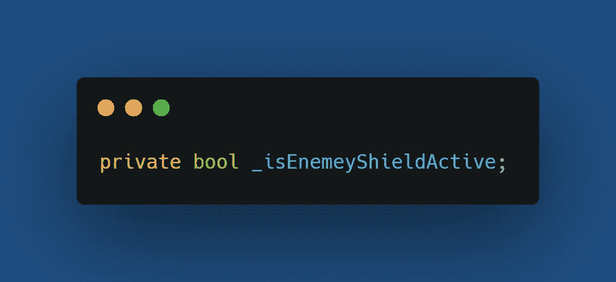
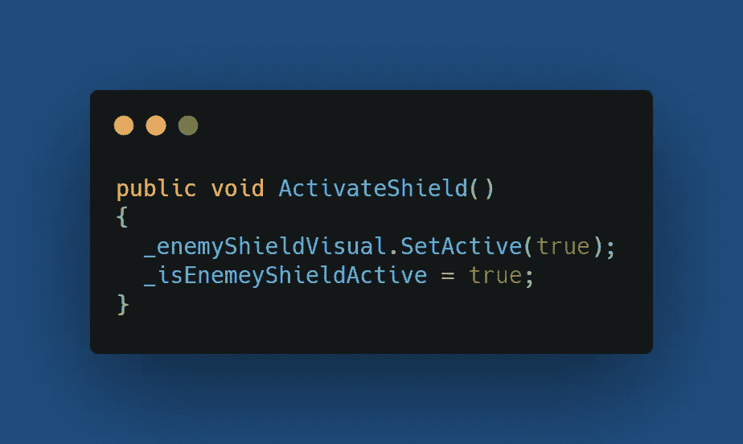
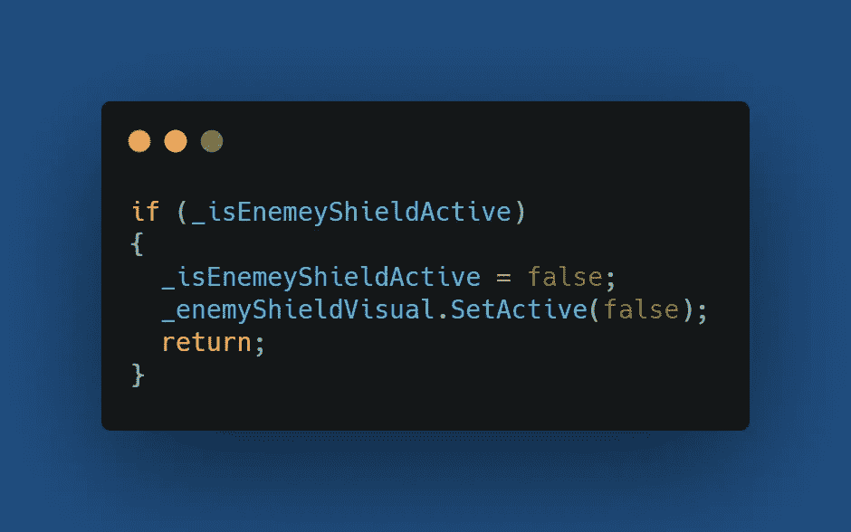
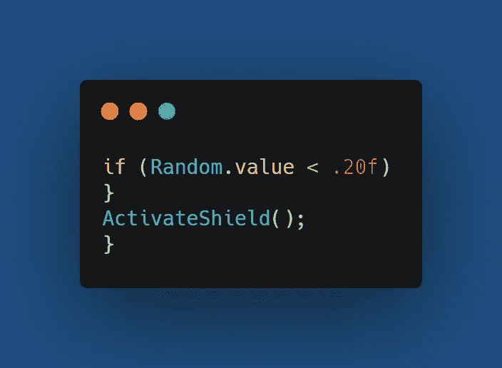

# 第二阶段:敌人护盾

> 原文：<https://medium.com/nerd-for-tech/phase-2-enemy-shields-b98c26be09cd?source=collection_archive---------14----------------------->

**目的:**提供让部分敌人拥有护盾的能力。护盾可以让敌人受到一次攻击。

敌人护盾启动

首先要做的是给敌人加一个盾精灵。我将把它命名为敌人之盾。此外，我们需要调整大小，并将其添加到前景改变秩序层，使其显示在敌人

接下来，我们要调整颜色并保存对预设的修改。

现在是更新脚本的时候了，我们将会给敌人的脚本添加一些逻辑。首先，我们需要一个敌人的参照物。

在检查器中添加并分配它

分配敌人 _ 盾牌

接下来，我们需要一个变量来让我们知道敌人什么时候激活了护盾。

防护罩启动了吗

当敌人的护盾被激活时，我们将调用一个方法来打开护盾视觉。我将调用方法 ActivateShield。此方法将打开 visual 并将 bool _isEnemyShieldActive 设置为 true。

在 OnTriggerEnter2D 方法中，我们将添加一个检查，检查敌人的护盾是否处于活动状态。如果是 active，我们关闭可视屏蔽并将 _isEnemeyShieldActive 设置为 false，然后返回以便跳过方法中的其余代码。

为了随机选择拥有护盾的敌人，我使用了 RandomValue 来得到一个介于 0.0f 和 1.0f 之间的数。我将只在值< 0.20f 时调用 ActivateShield 方法。

让我们来看看实际情况

敌人盾牌演示

编码快乐！！