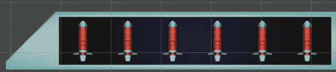
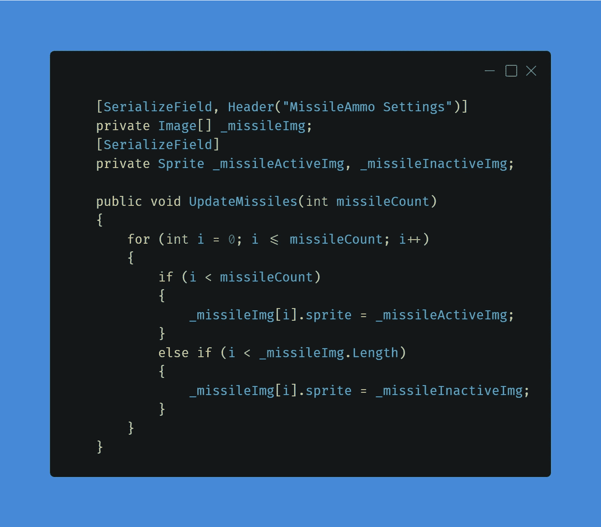
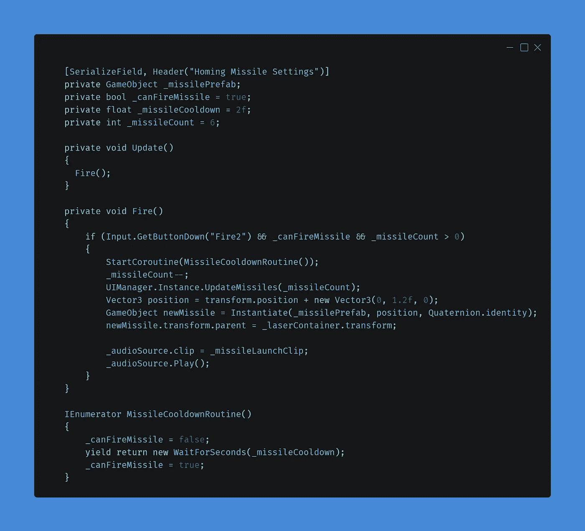
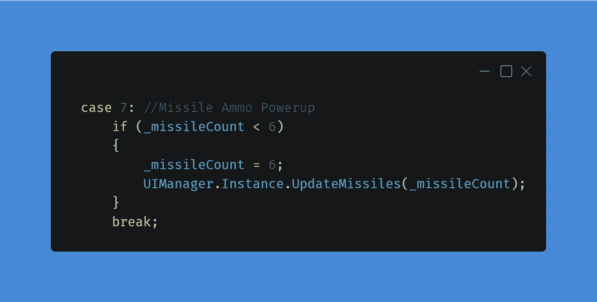
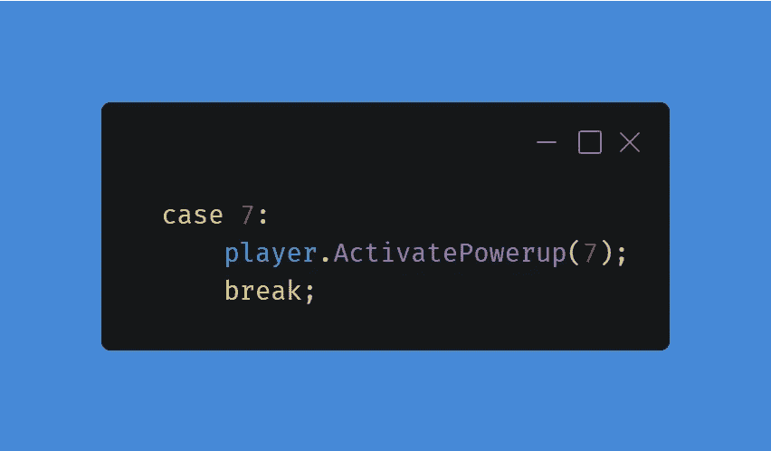
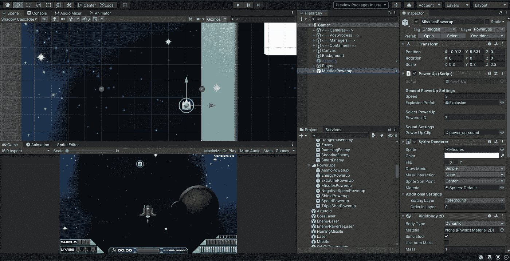
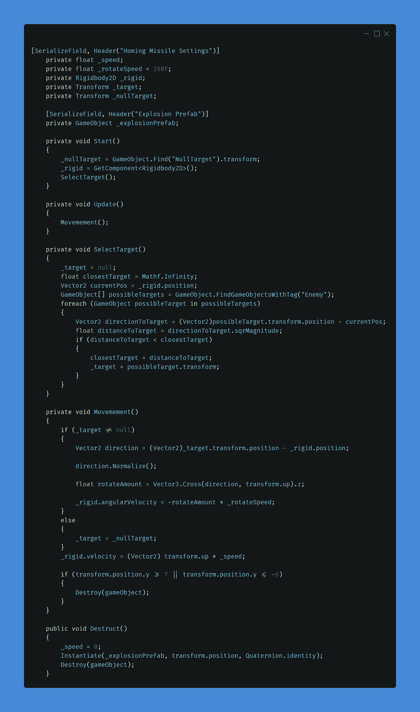
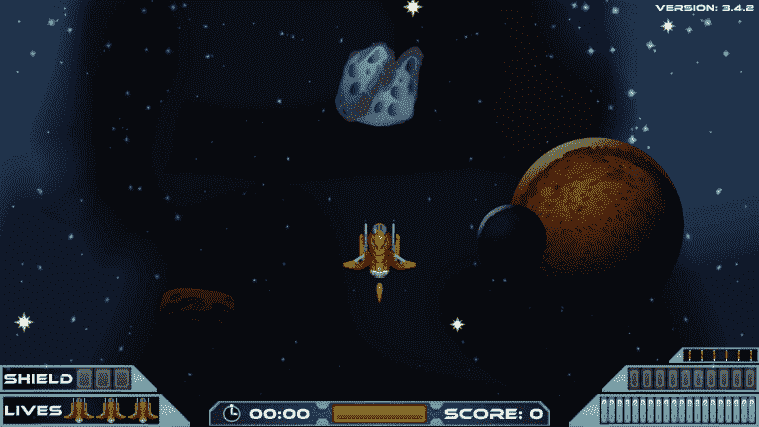

# 第二阶段:制导炮弹

> 原文：<https://medium.com/nerd-for-tech/phase-2-homing-projectile-4d489f3c09e0?source=collection_archive---------17----------------------->

在这个挑战中，我必须创造一个能锁定最近的敌人并瞄准它摧毁敌人的投射物。

> 创建一个寻找最近目标的自导射弹。变成一种罕见的力量。

我把这个挑战分成了三个部分。

1.  储存导弹弹药和发射的玩家。
2.  补充导弹弹药的能量。
3.  导弹本身会选择并瞄准最近的敌人。

# 玩家逻辑

我们的玩家脚本负责动作、武器和实际的能量。创建发射导弹的逻辑是挑战的第一个也是最重要的部分。原因是它允许我们开始测试寻的导弹并进行调整。

打开播放器脚本，我开始添加我需要的变量。我创建了一个名为“_missilePrefab”的私有游戏对象来存储我们的导弹预置。我还创建了一个名为“_canFireMissile”的 bool 变量来检查我们是否可以发射导弹，最后创建了一个名为“_missileCooldown”的浮点变量，值为 2f。冷却是为了防止玩家发射导弹太快。

在进入播放器逻辑的其余部分之前，我快速创建了 UI 元素，在 UIManager 脚本中，我创建了一个名为“_MissileImg”的数组来存储所有 UI 导弹，并创建了一个名为“_missileActiveImg”和“_ missile activeimg”的 Sprite 变量，该变量将用灰色的导弹图像替换导弹图像，以指示导弹已耗尽。

在我以前的一篇[文章](https://domi5254.medium.com/phase-1-secondary-fire-powerup-part-3-d772a1accda2)中，我创造了一个叫做毁灭之球的辅助能源，并使用鼠标右键作为发射这个武器的按钮，但由于这更像是一个炸弹而不是武器，我决定将那个键重新绑定到空格键，并将使用右键发射寻的导弹。

玩家脚本有一个 Fire()函数，在我们的主要武器下，我创建了发射寻的导弹的逻辑。我不会详细解释我将如何创建这个逻辑，因为我已经多次谈到过，而是想把重点放在寻的导弹上。

# 加电逻辑

仍然在编辑玩家脚本，我们将添加第一个加电逻辑。根据以前的文章，比如[这篇](https://domi5254.medium.com/modular-power-ups-e835a3ed6d86)，我创建了一个非常模块化的加电系统，很容易添加更多的加电装置。我强烈推荐阅读那篇文章，因为我将简要介绍这个逻辑。

在 ActivatePowerup()函数中，我们将在开关中创建一个新的 case，它将把“_missileCount”重新生成为 6。

我们的电源有自己的脚本，负责提供正确的电源，也负责电源向下移动。这个脚本也需要用另一个开关案例来更新。

通电的最后一部分是创建实际的通电。每一次新的加电，我只需要使用一个现有的预置，然后在层级中打开预置，这样我就可以把这个加电保存为一个新的预置。一旦我打开了电源，我就把它的 ID 改为 7，并替换了图像来表示将要进行的电源。

# 导弹逻辑

我把这个挑战中最精彩也是最难的部分留到了最后。寻的导弹由两个重要部分组成。第一部分是负责选择屏幕上最近的敌人，第二部分是飞向选定的敌人。老实说，第一部分是最难的，因为这一部分的数学很强。

为了创建导弹逻辑，我创建了一个名为 HomingMissile 的新脚本，并用 Rider 打开它。我需要创建相当多的变量，并解释每个变量的作用。

我创建的第一个变量是一个名为“_speed”的浮点数，表示导弹的速度，并给它赋值 10f。接下来，我创建了另一个名为“_rotateSpeed”的浮点数，并将该值设置为 250f。这个变量决定了导弹向目标旋转的速度。我还为我们的 RigidBody2D 创建了一个变量，命名为“_rigid”。最后，我创建了两个转换变量。一个名为“_target”的是导弹的目标，另一个是名为“_nullTarget”的次级目标。这是为了确保当没有目标时，游戏不会抛出空错误。空目标是一个设置在屏幕外的空游戏对象。请注意，这是一个廉价的修复，以后会改变这一点。

然后，我创建了一个名为 SelectTarget()的函数，用于选择一个新的目标。在该函数中，我通过将“_target”设置为 null 来确保它没有被选中。然后我创建了一个名为“closestTarget”的新 float，并将其设置为 [MathF。无穷大](https://docs.unity3d.com/ScriptReference/Mathf.Infinity.html)。接下来，我使用名为“currentPos”的 Vector2 获取导弹的当前位置，接下来，我获取所有潜在目标。所有的敌人都有一个名为“敌人”的标签，我将用它来获取场景中的所有敌人，方法是使用一个名为“可能目标”的数组，并获取所有带有标签“敌人”的对象。在这一点上，大部分的初始设置已经完成，现在我们需要循环通过每个敌人，并与导弹的位置进行比较。为此，我们使用了一个 foreach 循环，我们将在名为“possibleTarget”的数组中定义一个名为“possible target”的游戏对象。

在 foreach 循环中，我们将创建另一个名为“directionToTarget”的局部 Vector2 变量，并从可能的目标位置减去“currentPos”。接下来，我们将创建另一个局部浮点变量“distanceToTarget ”,并将其设置为“directionToTarget”。 [sqrMagnitute](https://docs.unity3d.com/ScriptReference/Vector3-sqrMagnitude.html) ”。此时，我们可以检查我们的“distanceToTarget”是否小于“closestTarget”。如果这是真的，那么我们的“最近目标”等于“距离目标”。最后，我们的“_target”变成了我们的“possibleTarget”。

我希望你能理解我的解释。这对我来说很复杂，但结果很好。在我们的 Start()函数中，我们将调用这个函数来获得一个目标。现在是时候开始我们的运动了。由于这是一个非常简单的脚本，不需要一次更新大量的内容，所以我决定将移动逻辑直接添加到我们的 update()函数中。

除了瞄准系统之外，这个脚本使用了我们的敌人导弹正在使用的确切功能。在那篇[文章](/nerd-for-tech/phase-2-new-enemy-type-47a371282fe8)中，我介绍了交叉点的基础知识以及如何专注于一个选定的目标。对于这个导弹，在导弹开始移动之前，我们检查我们的目标不是空的。如果目标为空，那么我们的“_nullTarget”将被选中，导弹将被射向空中并被摧毁。

我在 HomingMissile 脚本中添加的最后一个东西是所有导弹、敌人等等都有的标准毁灭()功能。

最后一件需要做的事情实际上是在层级中构建出导弹，并将其附加到玩家身上。

我把我想用于导弹的精灵拖到层次结构中，把 HomingMissile 脚本附加到 GameObject 上，并把它重命名为 HomingMissile，接下来，我添加了爆炸并预先制作了导弹。最后，我不得不把 HomingMissile 预置附加到我们的玩家身上，这样才能射击它。

# 结论

今天这是一篇相当长的文章，但是寻的导弹的逻辑很难解释，尽管它看起来像代码一样简单。我希望你喜欢这篇文章，我期待着下一篇文章，它可能会跨越三篇或更多的文章，因为我将写我们最后的老板。