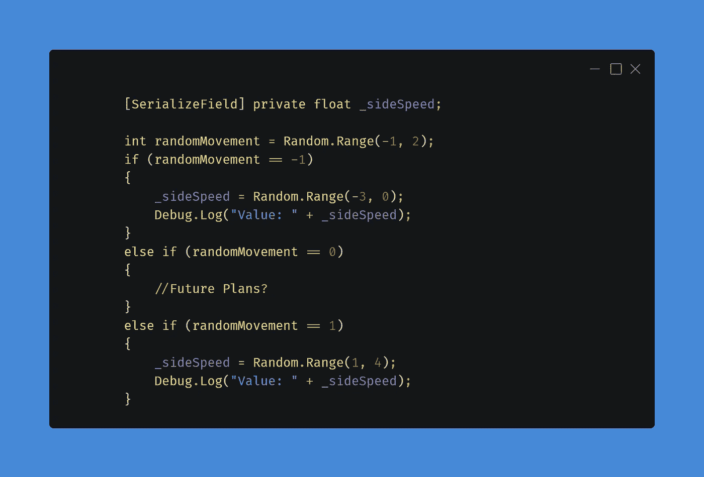
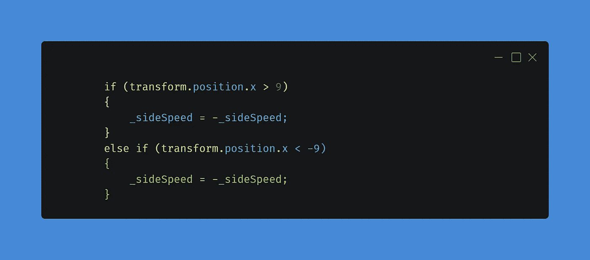
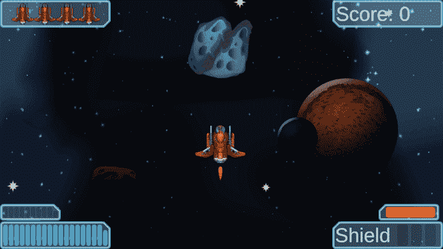

# 第二阶段:新的敌人运动

> 原文：<https://medium.com/nerd-for-tech/phase-2-new-enemy-movement-54ec46d3513a?source=collection_archive---------28----------------------->

欢迎参加第二阶段的挑战。这一系列新的挑战更具挑战性，有许多计划好的东西要与你们分享。第一个挑战是创造一个新的敌人运动。

> 使敌人能够以一种新的方式移动，从一边到另一边，盘旋，或者以一个新的角度进入游戏场。

我对这个挑战进行了一番思考，并决定创造一些随机性，让玩家保持警惕。当产生一个敌人时，它会产生一个[随机数。范围](https://docs.unity3d.com/ScriptReference/Random.Range.html)介于-1 和 2 之间的数字，返回值为-1、0 或 1。如果值是-1，那么敌人会向左移动，如果值是 0，敌人会向下移动，如果值是 1，那么敌人会向右移动。我还设置了如果敌人移动到屏幕边缘，他们会转向相反的方向。

# 随机运动

在 Start 函数中，我添加了一个新的 int 并将其命名为 randomMovement，并设置了 Random。范围在-1 和 2 之间。一旦有了值，我就运行 3 个 if/else 语句中的一个来确定移动。我还创建了一个名为 _sideSpeed 的新浮点值来确定敌人向侧面移动的速度。这里我也用了 Random。范围值在 0 到 3 之间会导致一些敌人比其他人更快地向侧面移动。

# 敌方屏幕夹紧

在这一点上，敌人像预期的那样向侧面移动，但是在某一点上，他们离开了我们不想要的屏幕。我们需要检查它们何时到达屏幕的一侧，然后让它们向另一个方向移动。

敌人有一个名为 EnemyMovement()的功能，我们可以添加我们的位置检查，并翻转敌人移动的方向。我们所要做的就是检查敌人是否到达了屏幕上的-9 和 9 的位置，并逆转速度。还记得我创建了一个叫做 _sideSpeed 的浮点数吗？嗯，当我们到达边上时，我们需要做的就是 _ 边速=-_ 边速；这将扭转横向运动。

# 结论

大约有 30 行代码，我们有随机移动行为的敌人，这给敌人增加了一个很好的接触，从预测的向下方向移动。

剧透警告:你可能会在 gif 中看到我还没有涉及到的东西。我的课程进度稍微领先于我的文章。此外，我重新设计了我的游戏，为未来的挑战和即将到来的大结局做准备。

