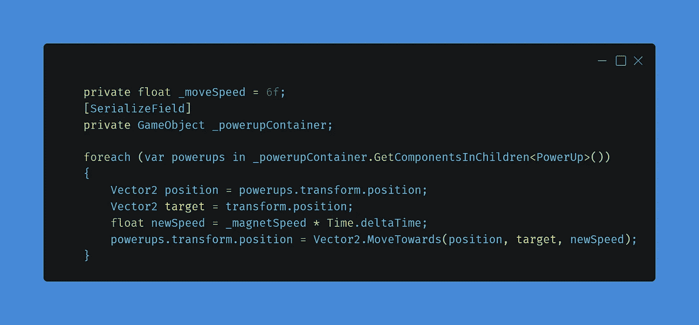
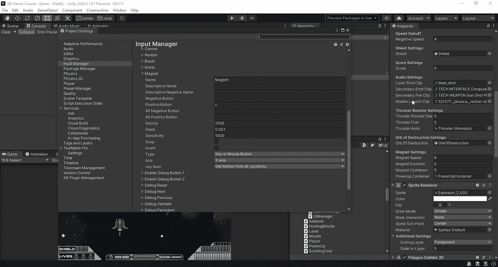
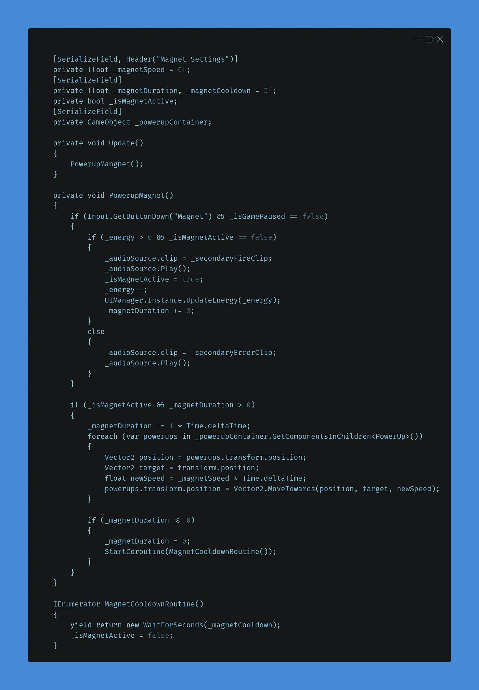
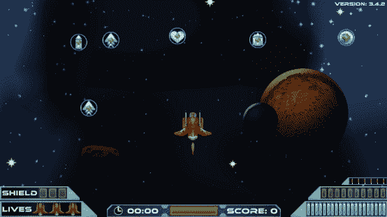

# 第二阶段:通电磁铁

> 原文：<https://medium.com/nerd-for-tech/phase-2-powerup-magnet-af28560ac6fc?source=collection_archive---------19----------------------->

在这篇挑战文章中，我需要创建一个系统，玩家按下一个键，将屏幕上所有的电源吸引到玩家那里。我觉得这是利用我创造的能源系统的好方法。

> 当玩家按下“C”键时，拾音器移动到玩家。

当我为我的 EMP 炸弹“毁灭之球”创造能量系统时，我想把它作为一个独立的武器，而不是另一个电源，但我也想让它很难得到，这就是当我创造能量系统时，EMP 炸弹需要 10 个能量才能产生。我认为这个新功能将是一个很好的补充，玩家需要一种能量来使用磁铁。我会解释我是怎么做到的。但是在你继续之前，我建议你先阅读这篇文章，理解能量系统是如何产生的，因为我不想在这篇文章中涉及太多。

# 房间里的大象

所以我们先来讨论一下这个功能最大的挑战。当我们按下“C”时，我们需要检查场景中的每一个电源，并告诉它改变方向。有几种方法可以获得我们想要的对象，但是因为我们所有的加电都产生在一个名为“PowerupContainer”的父容器中，我们需要做的就是获得对该容器的引用，然后运行 foreach 循环来获得该容器中的所有加电，最后改变这些对象的行为。现在，我们可以在这些加电中运行一个函数来告诉它做什么，但是因为我们只需要在磁铁激活时将它的目标改为播放器，所以我决定在 foreach 循环中创建这个逻辑。

在这个循环中，我们将定义一个位置，这是 powerup 的位置，我们将定义一个目标，这是我们的球员。有一种东西叫做 [Vector2。向](https://docs.unity3d.com/ScriptReference/Vector2.MoveTowards.html)移动，它所做的是获取当前位置、目标位置和速度，然后以指定的速度将游戏对象从当前位置移动到目标位置。现在，这不影响游戏对象的旋转，但对我们的电源来说没问题。

正如你所看到的，这是一个非常简单的方法来获取父容器中存在的每个对象并改变它的运动。最好的部分是，如果磁铁不再活跃，那么屏幕上的电源将继续像往常一样移动。但这只是逻辑的一小部分。是时候创建功能了，我们可以按下 C 键，让磁铁做它的事情。

从键盘输入有几种方法，但我一直使用 Unity Input 系统，因为我们可以创建按钮并引用这些按钮，但以后如果我们对选择的键不满意，我们可以更改分配的键。要访问这些按钮，我们将转到文件，项目设置，然后选择输入管理器。在那里，我创建了一个新的轴称为磁铁，并添加了“c”到积极的按钮。现在我们可以参考那个按钮，我们将设置。

接下来，我打开我的播放器脚本，首先创建一些变量。我为磁体速度创建了一个浮点值，名为 _magnetSpeed，值为 6，为磁体持续时间创建了两个额外的浮点值，名为 _magnetDuration，没有值，冷却时间名为 _magnetCooldown，值为 6。接下来，我添加了一个名为 _isMagnetActive 的 bool，并创建了一个名为 _powerupContainer 的 GameObject 来获取对实际容器的引用。

创建完所有变量后，我添加了一个名为 PowerupMagnet()的新函数。在函数内部，我创建了一个 if 语句来使用 Input 获取按钮。GetButtonDown("Magnet ")，在 if 语句中，我们需要创建另一个 if 语句来检查您的能量是否大于 0 (1 或更大)，并检查我们的磁体是否不活动。现在，如果这两个要求得到满足，我们可以激活我们的磁铁。在这个函数中，我们使用我们的音频管理器播放一个声音剪辑来表明磁铁被激活，我们扣除了一个能量，用我们的剩余能量更新了 UI，并将 3 加到我们的 _magnetDuration(这是磁铁将被激活的时间)。在 if 语句下面，我创建了一个 else 语句，如果没有满足这些要求，它将播放一个错误片段。

接下来，我们需要创建另一个 if 语句，但是这个语句将独立于第一个 if 语句运行。在这个 if 语句中，我们检查我们的磁体是否是活动的，以及我们的磁体持续时间是否大于 0。在语句中，我们从持续时间中扣除时间，并运行 foreach 循环，告诉所有的电源向玩家移动。接下来，我创建了另一个 if 语句来检查我们的磁体持续时间是否小于或等于 0，以再次禁用磁体并启动冷却协程。

有了脚本和完成的一切，是时候测试我们的新功能了，你会发现它真的很棒。

# 结论

这个挑战非常有趣，我喜欢我可以建立我的能量系统，我期待着在未来使用这个系统添加更多的功能，即使在挑战和课程完成后。