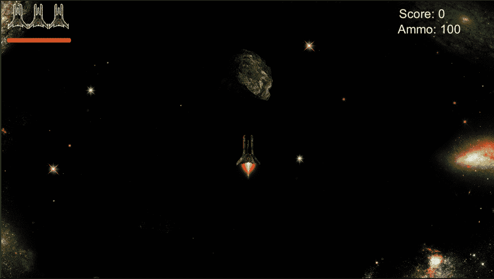
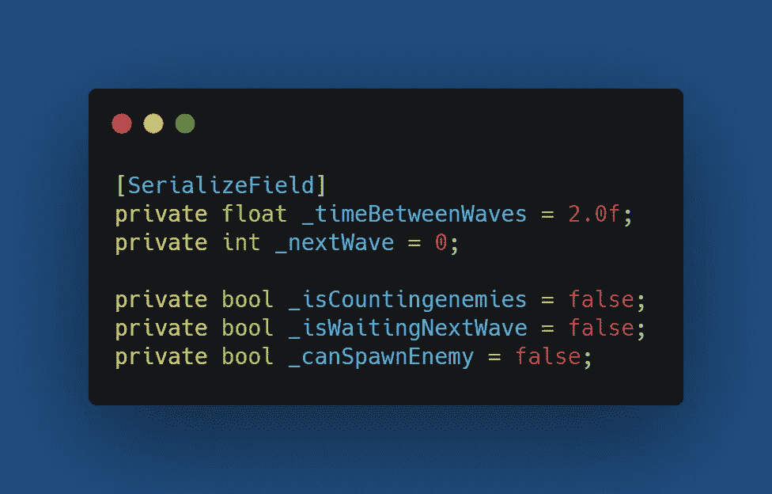
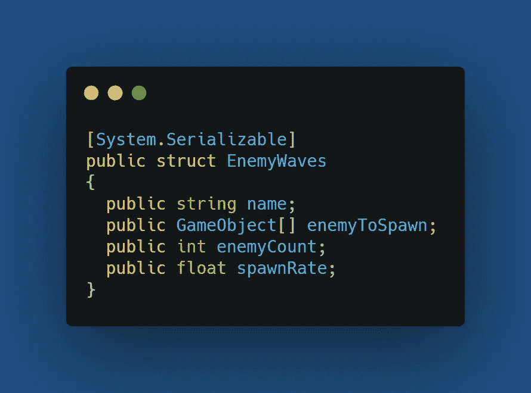
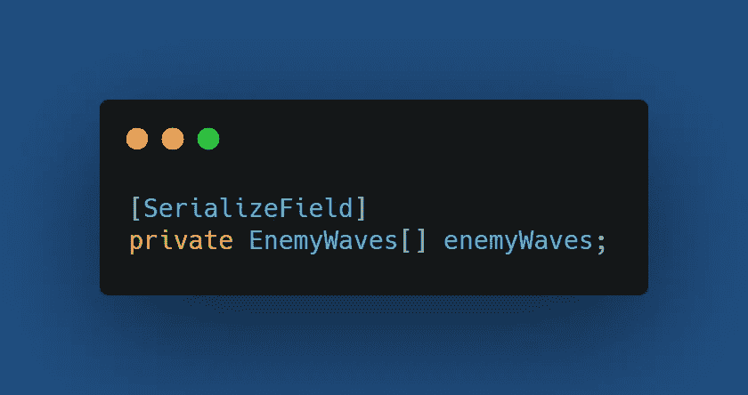
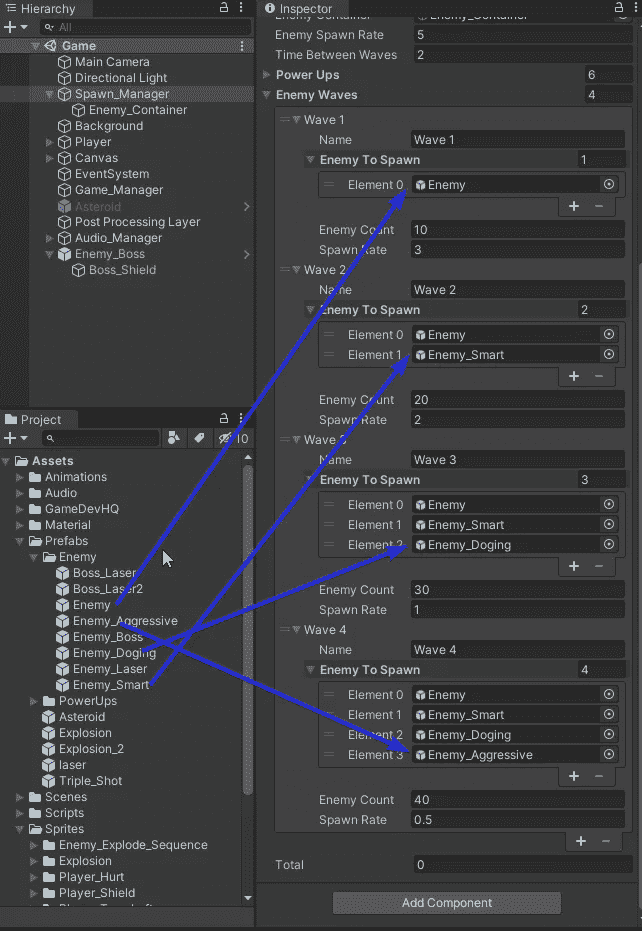
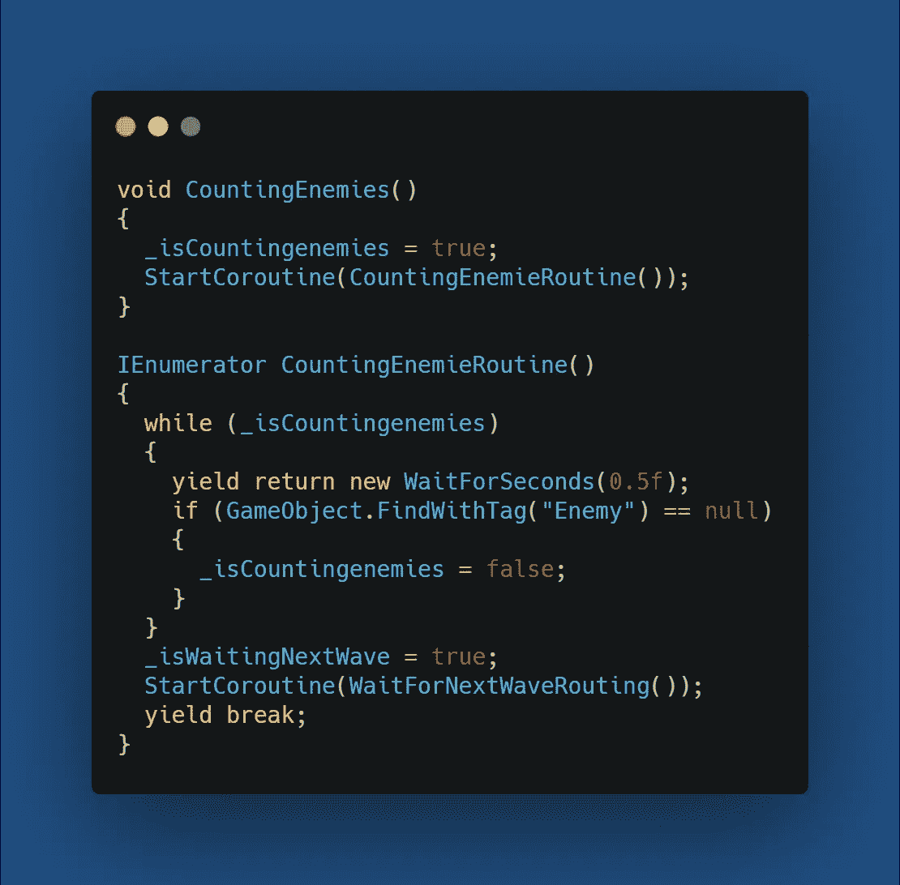
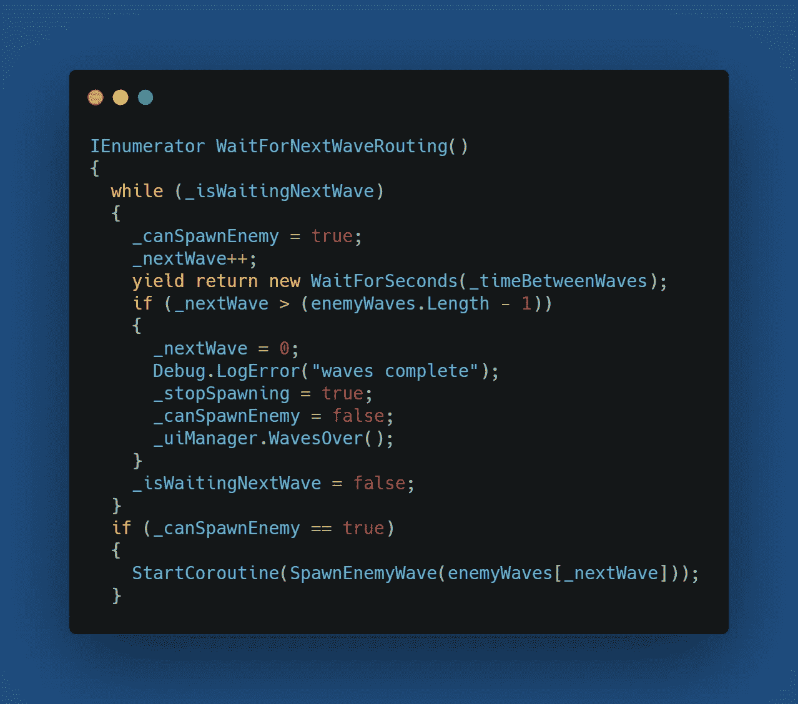
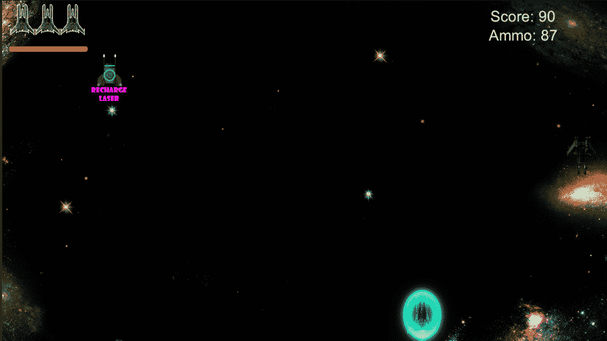

# 第二阶段:波浪系统

> 原文：<https://medium.com/nerd-for-tech/phase-2-wave-system-2ff6b7353a4?source=collection_archive---------8----------------------->

**目标:**实施一波敌人序列，每波都有更多的敌人到来

第一波

实现这个 wave 系统需要大量的编码，因此，我们需要一些变量。一个存储波之间时间的浮点数，一个跟踪波的整数。最后是几本书，一本告诉我们是否能产生敌人，一本让我们知道我们是否在等待下一波，还有一本让我们知道这一波什么时候结束，我们正在检查所有被消灭的敌人，这样我们就可以进入下一波了。

我要做的第一件事是创建一个结构来存储波形的属性。它将有波的名称，敌人产卵，敌人产卵的数量和敌人产卵的速度。

接下来，我将创建该结构的数组，并在检查器中分配属性。

为每一波分配敌人的游戏对象和属性。

下面是用来繁殖敌人的程序和方法。

当这一波的所有敌人都被繁殖后，我调用一个方法来检查所有的敌人都被消灭了。

当这一波的所有敌人都被消灭时，我启动协程等待下一波。这让玩家在下一波敌人开始前有一点时间放松。

让我们来看看实际情况。

编码快乐！！