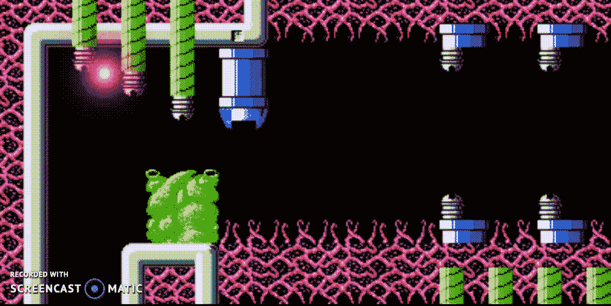
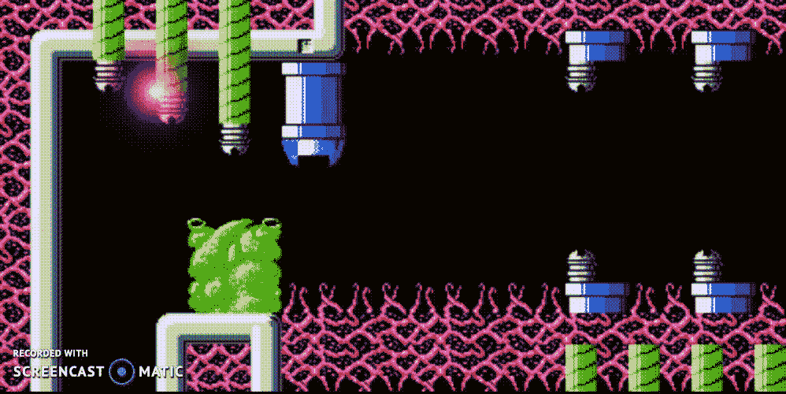
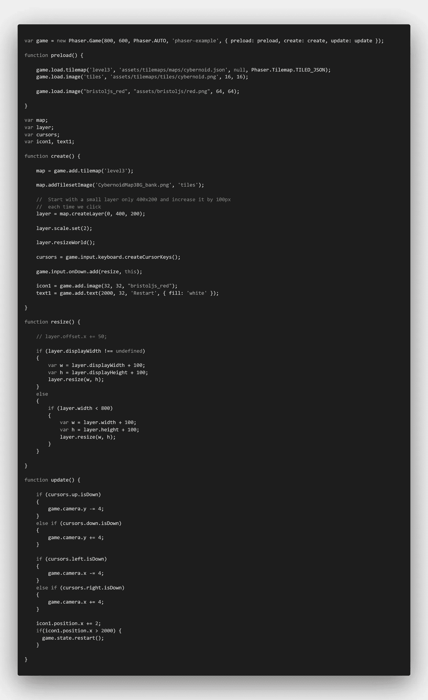
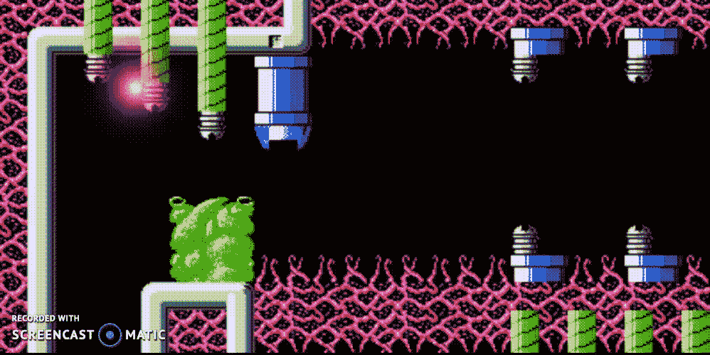
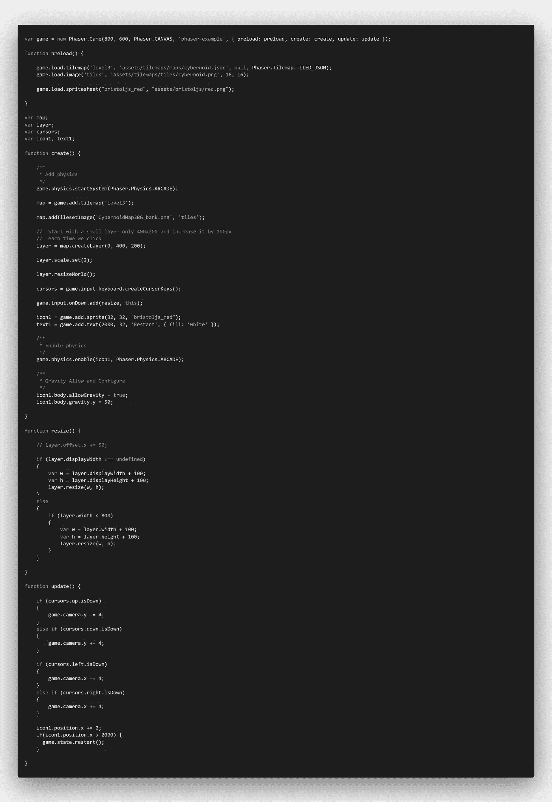
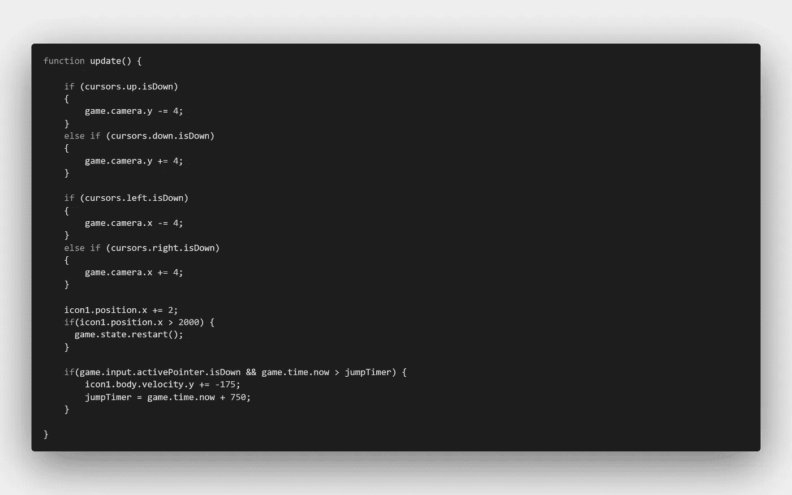
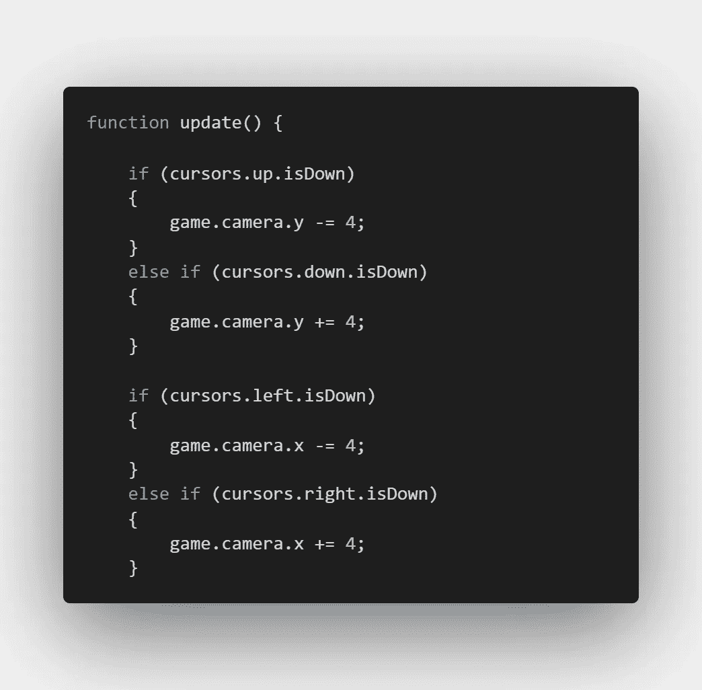

# 带有代码示例和演示的画布图形 PhaserJS 教程

> 原文：<https://medium.com/nerd-for-tech/phaserjs-tutorial-for-canvas-graphics-with-code-examples-and-demonstration-38d0cae6df07?source=collection_archive---------19----------------------->



## PhaserJS 教程，包含代码示例和演示

[*phase rjs*](https://phaser.io)*是一款面向 web 的游戏引擎。在网络和移动平台上开发游戏很容易。*

# 游戏初始化

每次 [PhaserJS 游戏](https://phaserjs.com/)开始都有`**init**`、`**preload**`、`**create**`、**、`**update**`、**、**的方法。更新方法是一个事件循环，用于重新启动游戏初始化。这些方法可以附加到游戏或场景中，我们将在本文稍后描述。**

# **游戏或场景重启**

在游戏中，通常会重置游戏拥有的资产。这可以基于`**game**` 或`**scene**` 持有的底层数据。在游戏重启时，`**preload**` 方法用于加载图像或精灵，`**create**` 方法用于将图像加载到画布上。`**init**` 方法是游戏或场景的构造器，通过它数据注入是可行的。依赖注入发生在使用`**.setData**`方法的`**init**` 或`**create**` 阶段。

> 游戏状态也有同样的方法:`**preload**`**`**create**`**`**update**`**。游戏状态可以像游戏场景一样操作，但它是一个权重较小的 Phaser 实体。游戏以默认状态开始，这意味着 PhaserJS 库允许您将游戏状态添加到注册了这些方法的游戏中。******

************

********显示游戏重启的示例********

## ******[代码](https://phaser.io/examples)******

************

********显示游戏状态重启的 PhaserJS 代码示例********

# ******游戏物理重力******

******物理可以在系统上启用。新版本的 PhaserJS 为图像`game.load.image`提供了物理实体，而旧版本的 PhaserJS 只为精灵和其他对象提供物理实体。******

> ******游戏物理是初始化游戏的一部分。游戏对象`gameObject`的身体属性具有允许重力的属性。这里的代码和演示解释了这一点。******

```
****/*** Add physics*/game.physics.startSystem(Phaser.Physics.ARCADE);....../*** Enable physics*/game.physics.enable(icon1, Phaser.Physics.ARCADE);....../*** Gravity Allow and Configure*/icon1.body.allowGravity = true;icon1.body.gravity.y = 50;****
```

************

********PhaserJS 游戏对象显示重力启用********

## ******[代码](https://phaser.io/examples)******

************

********显示重力启用的 PhaserJS 代码示例********

# ******游戏输入指针向下******

******在更新方法中，如果你添加了一个指定`activePointer` `isDown`的代码块，那么循环将检查指针事件或者鼠标点击。您还可以通过以下方式指定 pointerDown:******

******`game.input.on(PointerDown , method)`在更新的版本中。******

```
****if(game.input.activePointer.isDown && game.time.now > jumpTimer) { icon1.body.velocity.y += -175; jumpTimer = game.time.now + 750;}****
```

************

********PhaserJS 玩起来像直升机游戏********

## ******密码******

************

********PhaserJS 游戏的更新方法********

*********在这个例子中使用光标键检查游戏屏幕移动是如何完成的。*********

```
****cursors = game.input.keyboard.createCursorKeys();****game.input.onDown.add(resize, this);****
```

## ****[代码](https://phaser.io/examples)****

********

******PhaserJS 屏幕移动******