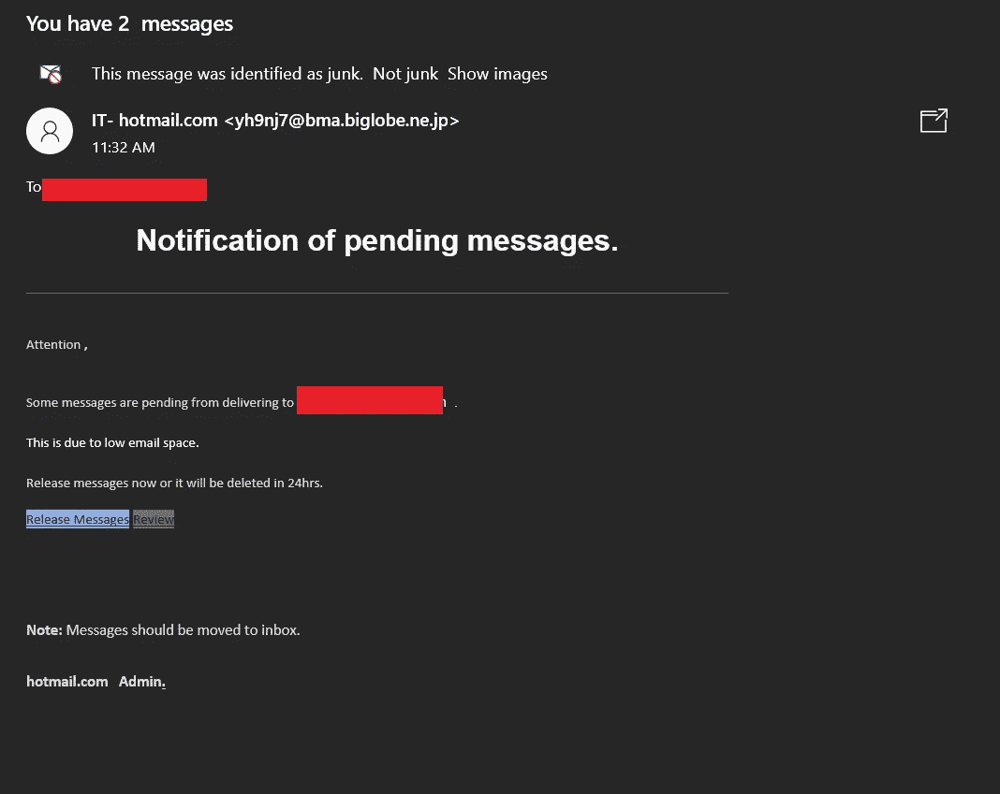
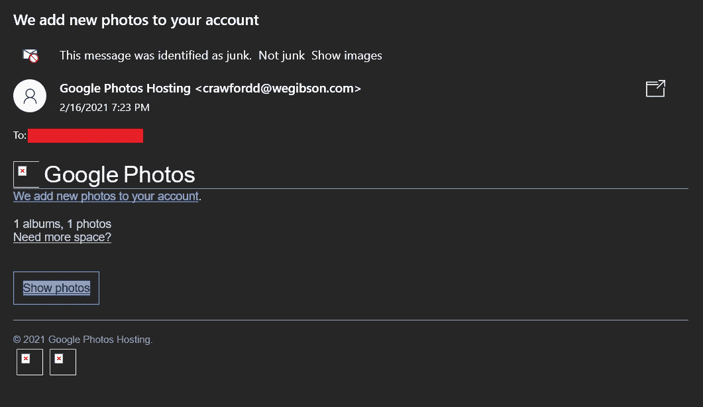
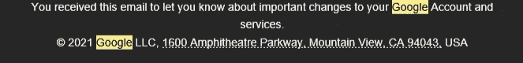
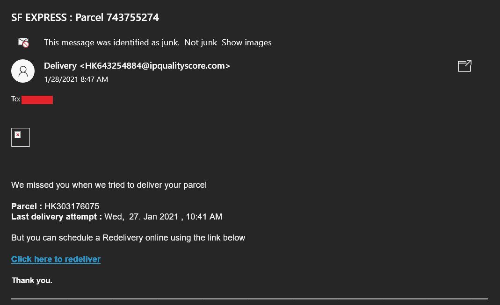
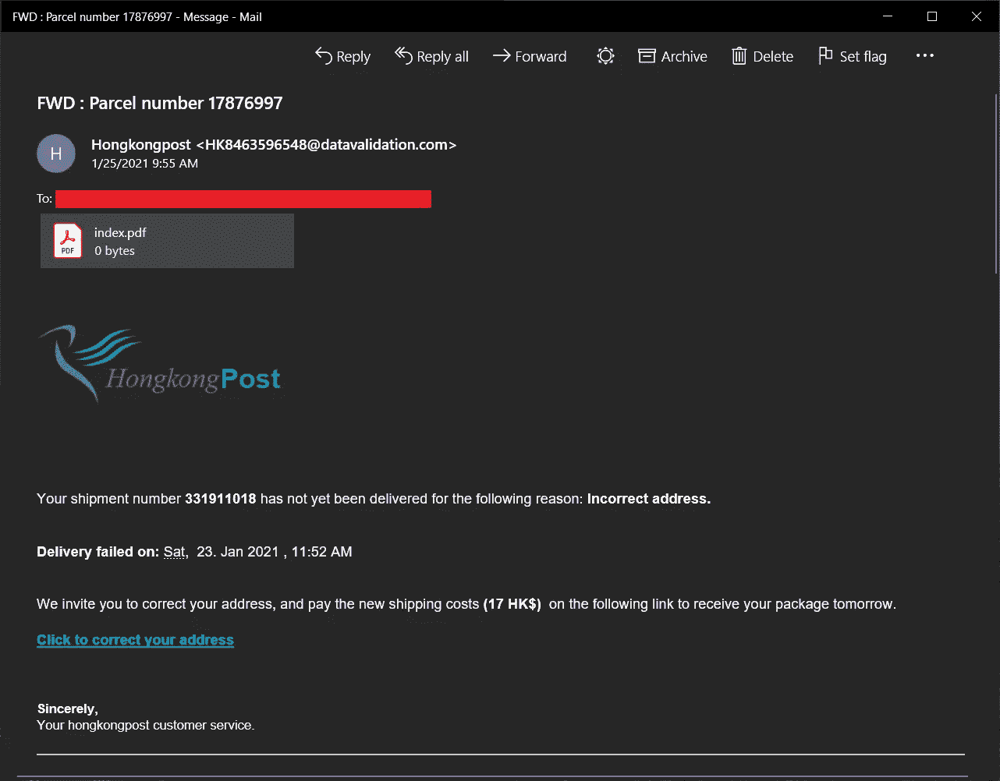
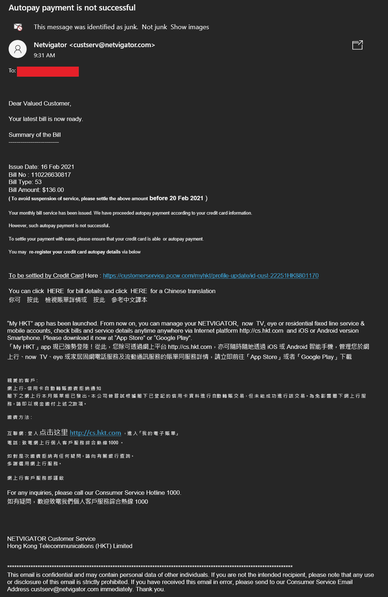
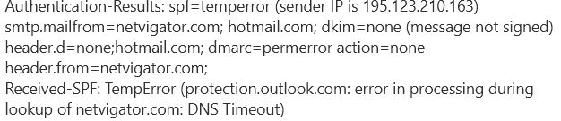
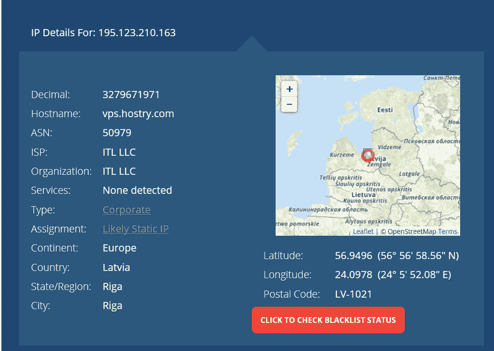
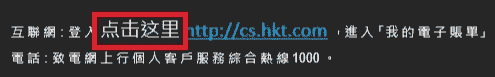

# 网络钓鱼邮件样本和检查

> 原文：<https://medium.com/nerd-for-tech/phishing-mail-samples-and-inspection-f5a3eaa8d257?source=collection_archive---------6----------------------->

网络钓鱼邮件通常很容易识别，其中大多数都不是精心制作的，例如:

## 样本 1

主题“IT- hotmail.com”与域发件人电子邮件“bma.biglobe.ne.jp”根本不一致，对于 hotmail，我期待漂亮的 HTML 电子邮件与图形和更好的布局(并大写“Hotmail”)

## 样本 2

同样，谷歌(Google Photos 托管的并不意味着它就是我们所知道的著名谷歌公司)如何从域名“wegibson.com”发送电子邮件？和谷歌通常有具体的主题和更好的页脚设计和免责声明

我过去经常看到的一个有效的谷歌电子邮件页脚:

## 样本 3

这封邮件是一封常见的发送钓鱼上下文邮件，首先是邮件内容中的收件人使用了我的电子邮件别名(不是我的名字)，所以他们根本不知道我的名字，这很奇怪。顺丰快递是香港本地的一家公司，我在等一封中文邮件，邮件内容不是商业用的(太短、太简单、太直接)。

同样，关键是电子邮件域与顺丰快递不一致。

参见我关于 ipqualityscore.com 的另一封邮件(再次向 ipqualityscore.com 表示敬意，他们及时回复并采取行动检查他们被滥用的服务，而文章中的其他服务提供商甚至不回复)

[https://stephencowchau . medium . com/concern-about-phishing-mail-from-hong kong-using-email-verification-and-tracking-service-like-404 f19d 68883](https://stephencowchau.medium.com/concern-about-phishing-mail-from-hong-kong-using-email-verification-and-tracking-service-like-404f19d68883)

# 在一个更复杂的案件之前下简短的结论

电子邮件发件人的域名是非常重要的信息，当电子邮件发件人来自未知的域或与他们的公司名称不同的域名时(有时他们很聪明地注册非常相似的内容，如使用“1”伪造“l”或使用“l”伪造“I”(大写字母“I”)。

对于所有这样的电子邮件，在 PC 上比在屏幕更小的移动设备上更容易发现，应用程序设计者可能会决定隐藏一些不太重要的信息或让它们看起来很小。

## 样本 4

这个看起来更“有效”，因为电子邮件内容看起来更“真实”(HTML 电子邮件正文、图像、布局)。

我们仍然可以看到一些不一致的地方。首先，我们有一个 0 字节的附件，这非常可疑。而页脚我们有公司名称“hongkongpost”(没有大写，空格适当，真名是“Hongkong Post”)。最后，同样重要的是，这是一个领域。

## 样品 5

这实际上被垃圾邮件检测器捕捉到了，但我花了一些时间来确认。

首先，电子邮件看起来合法，页脚看起来非常真实。这个域名是真实的，我也去查了服务提供商，他们的客服邮箱实际上是“custserv@netvigator.com”。

然后，我会怀疑这封邮件是否可能是伪造的“发件人”,而实际上是发自另一封邮件，所以我继续阅读邮件来源

电子邮件标题显示了一些有趣的行:

首先，spf 没有通过，netvigator.com 的查找在 DNS 超时时失败，在我深入挖掘之前，我认为这只是因为 DNS 在邮件被检查时有问题。

然后我取 IP 地址 195.123.210.163，它来自拉托维亚，viola，它一定是垃圾邮件(如果它来自美国，我可能会更加困惑)

## 边注

当我写这篇文章时，我意识到电子邮件内容中有一件奇怪的事情，那就是“真正的”页脚，在繁体中文的内容中有一个简体中文的“单击此处”:

此外，字体大小现在看起来并不合适(当我仔细检查时)

# 结论

即使垃圾邮件检测器做得很好，小心那些垃圾邮件/钓鱼邮件仍然是我们自己责任。

# 伟大的参考

[https://www . pepipost . com/blog/how-to-read-email-headers-to-identify-spam/](https://www.pepipost.com/blog/how-to-read-email-headers-to-identify-spam/)