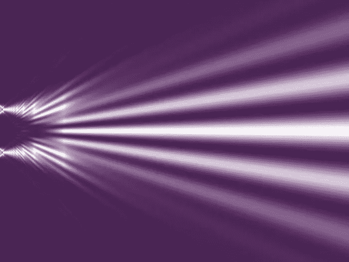
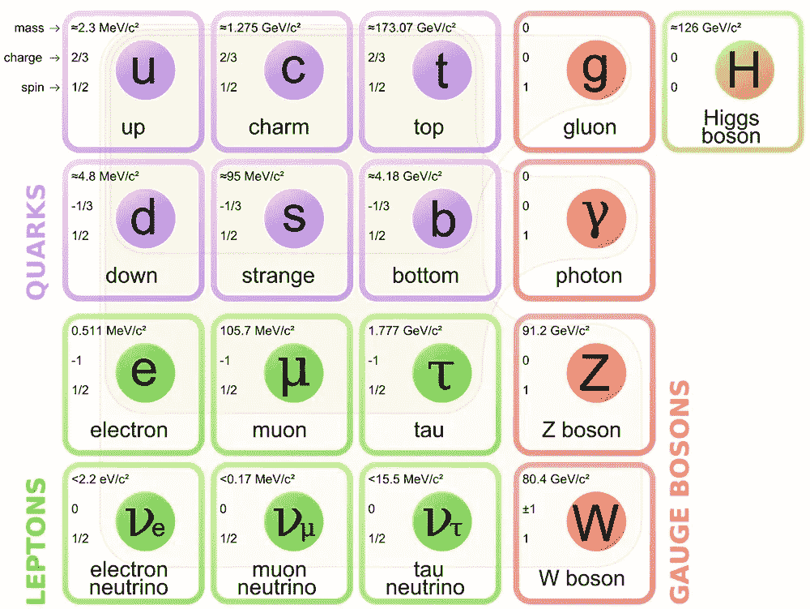
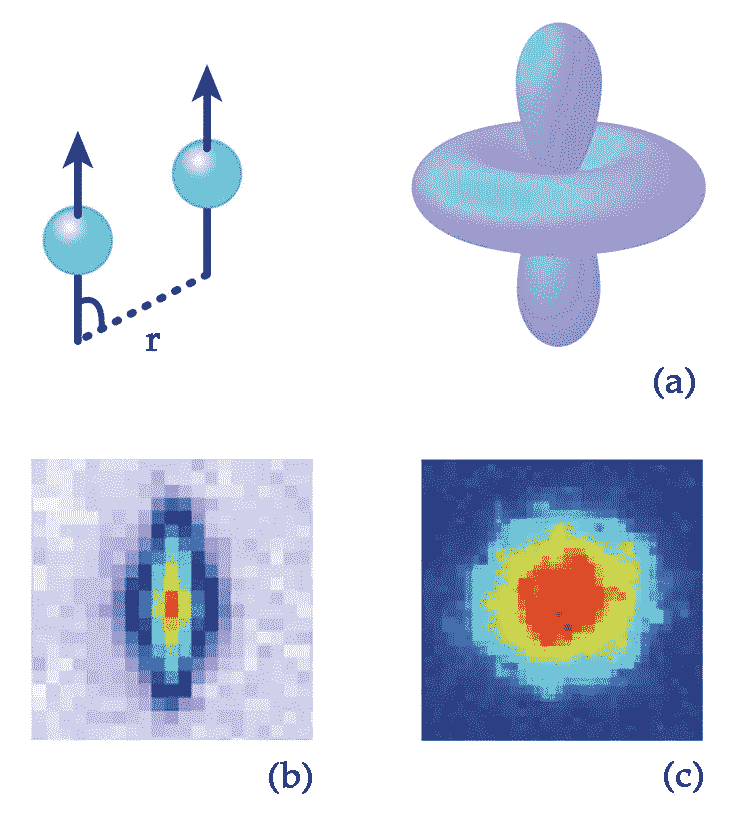
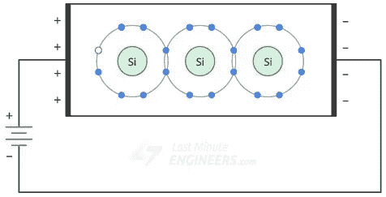

# 声子 vs 费米子 vs 玻色子

> 原文：<https://medium.com/nerd-for-tech/phonon-vs-fermion-vs-boson-8f2308b9c716?source=collection_archive---------3----------------------->

## 准粒子

> 声子是一种准粒子，由晶格振动的基本激发产生。

这里的文章已经解释了声子

 [## 什么是声子？

### 晶格振动的量子力学处理中的基本激发。一个能量束…

link.medium.com](https://link.medium.com/UxpRul3KV9) 

## 费米子

> 费米子是一种准粒子，它的一对粒子的波函数是反对称的。因此，它是由基本激发产生的。

由弱核力产生的中微子是费米子。中微子有奇数自旋(即 1/2，3，2，…)和电子一样，电子也是费米子。

在一对粒子的波函数表示中，如果不存在可以在两个粒子之间交换的波函数(即如果 1，2 = - 2，1)，那么这个准粒子或粒子就叫做费米子。

电子是费米子，因为它的自旋数是奇数。没有两个电子可以占据同一个量子态或与其波函数互换。

## 玻色子

> 玻色子是一种准粒子，它的一对粒子的波函数是对称的。因此，它是集体激发的结果。

磁振子是玻色子，是电子自旋的集体激发。玻色子有偶数自旋半(即 0，1，2，…)。光子是自旋= 1 的无质量玻色子。

在一对粒子的波函数表示中，如果存在一个可以在两个粒子之间交换的波函数，(即 1，2 = 2，1)，那么这个准粒子或粒子就叫做玻色子。

电子-空穴对是一种玻色子，由集体激发形成。一对电子空穴组合可以相互交换。

> 下面给出的是 PN 结二极管中的电子空穴对。

> 宇宙中几乎所有的粒子不是费米子就是玻色子。声子是集体激发，因此它是玻色子。

## 更多细节请阅读麻省理工学院提供的材料科学课程。