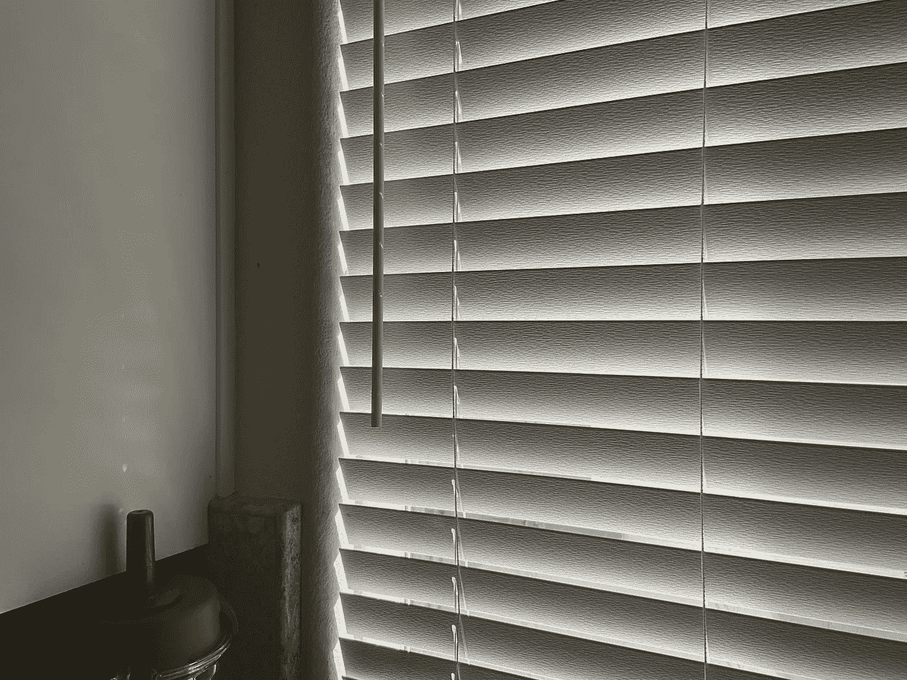
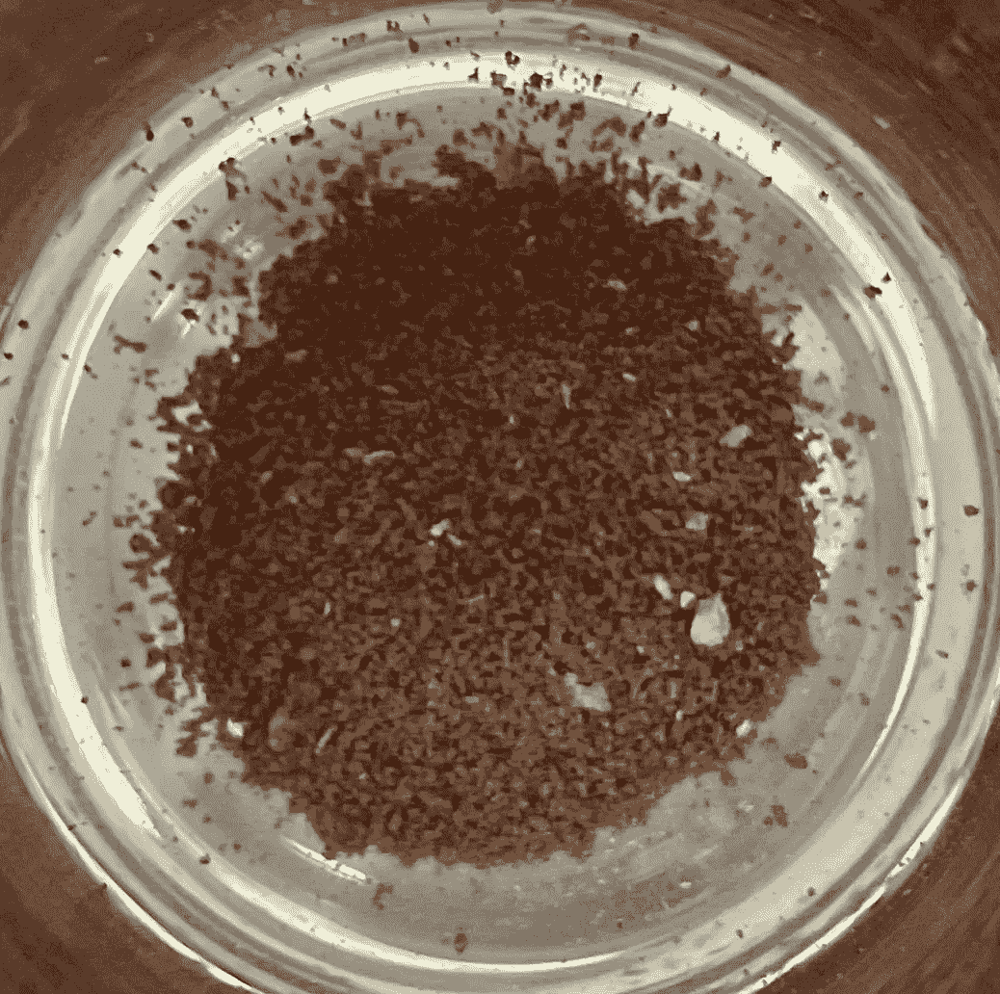
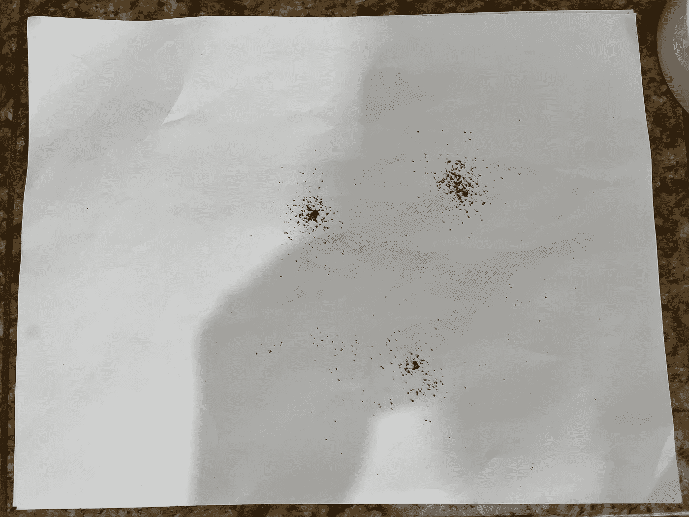
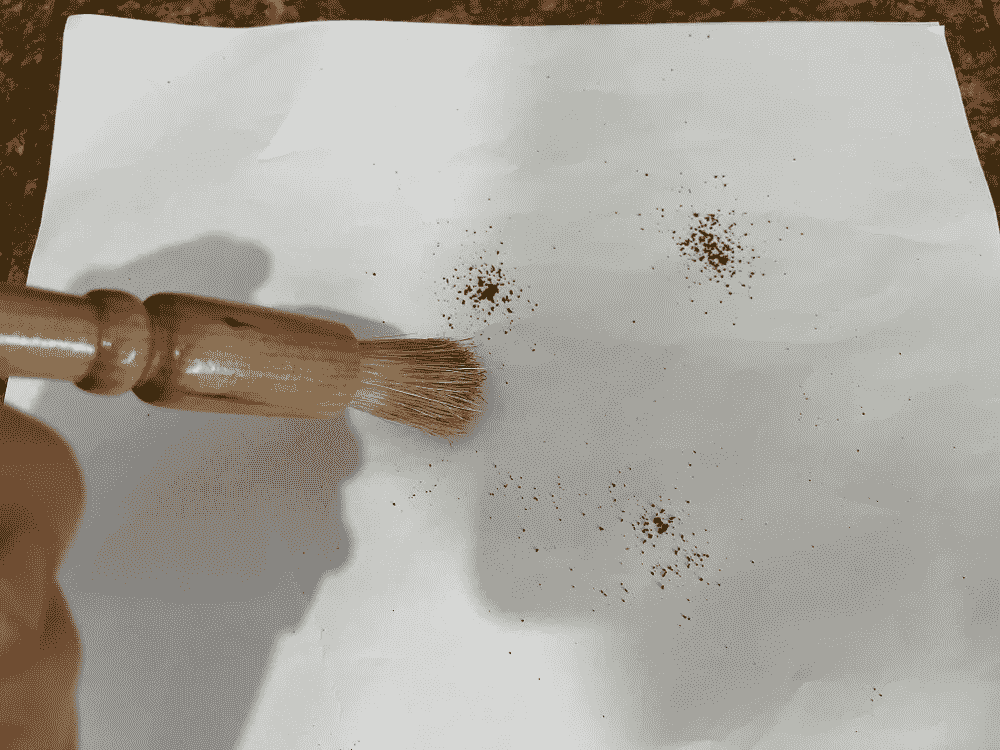
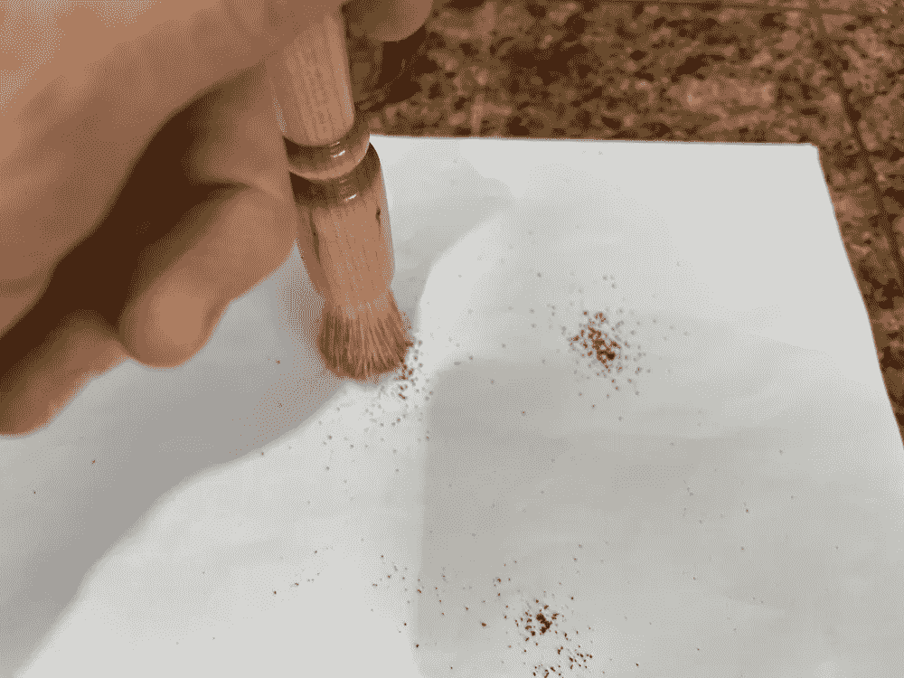
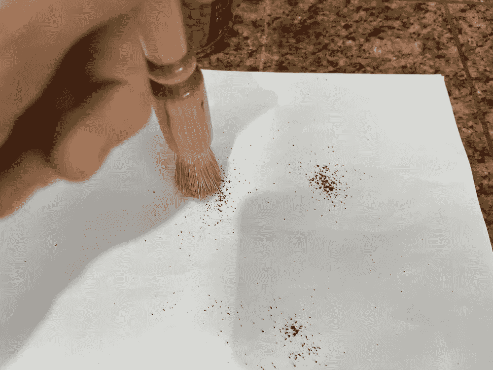
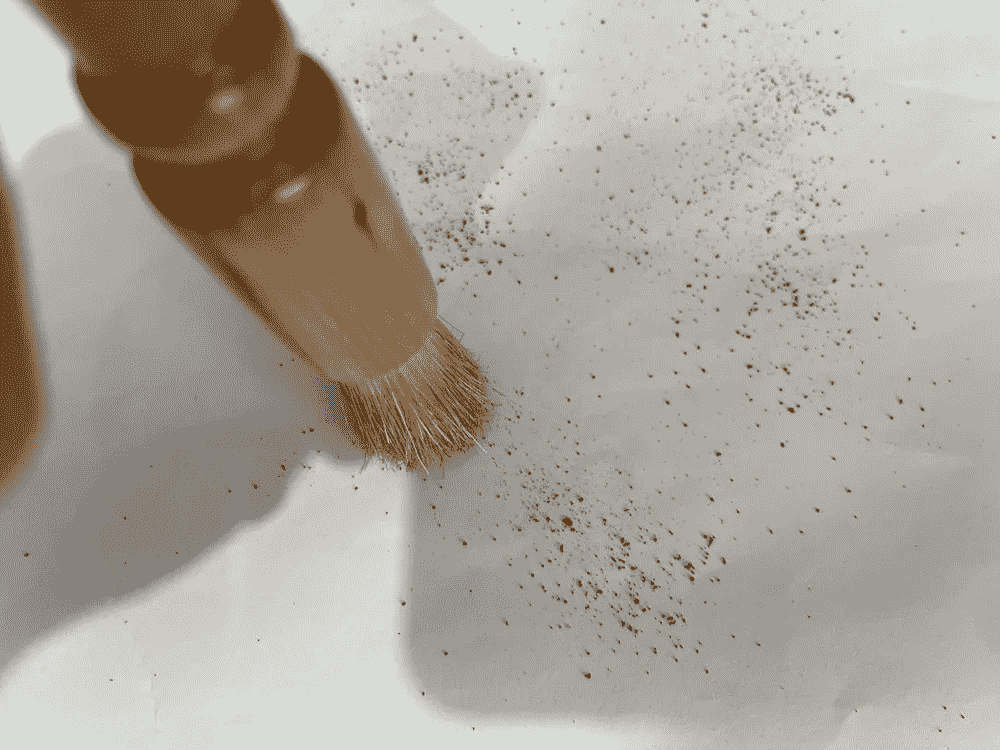
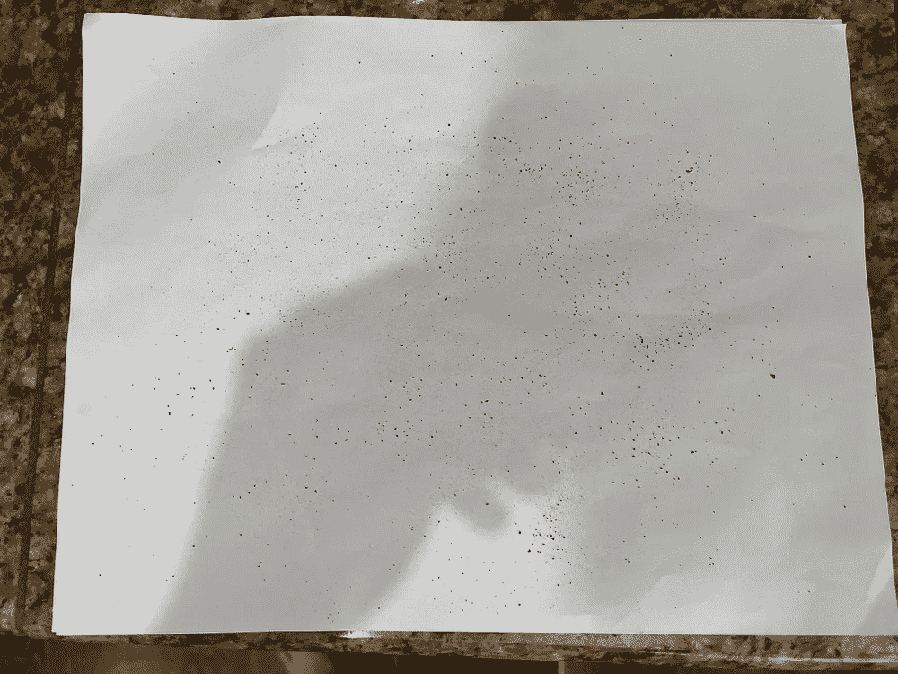
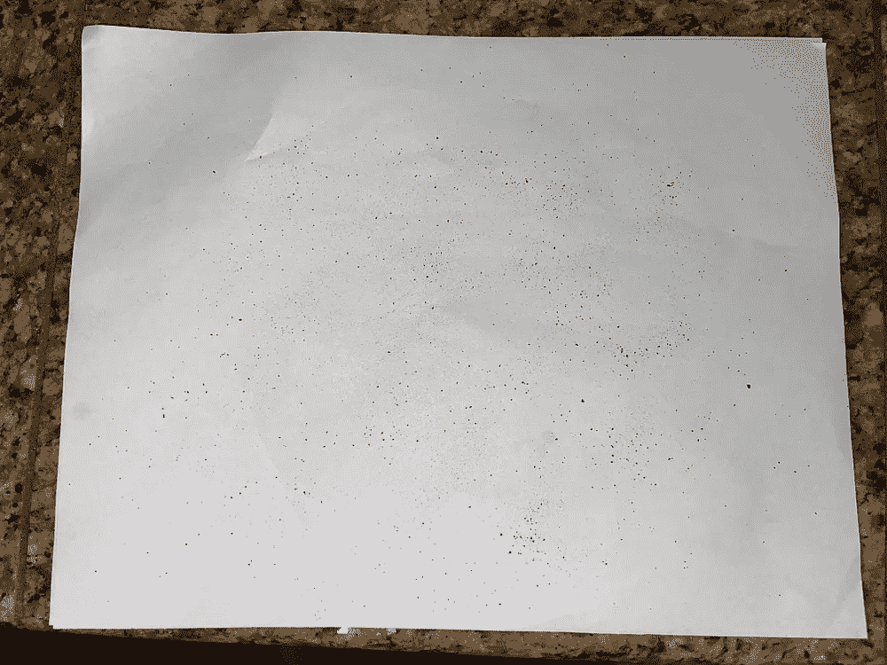

# 拍摄咖啡渣进行研磨分布分析

> 原文：<https://medium.com/nerd-for-tech/photographing-coffee-grounds-for-grind-distribution-analysis-d3494e980c28?source=collection_archive---------11----------------------->

## 咖啡数据科学

## 给那些好奇的人一点安慰

目的是在最佳环境下拍摄咖啡渣。目的是减少所有变量，使颗粒分析更容易。

# 准备环境

1.  关闭大多数顶灯
2.  关上百叶窗
3.  将一张 8.5 x 11 的纸放在平面上
4.  准备好你的相机，打开闪光灯

所有图片由作者提供

# 准备咖啡渣

1.研磨 3 或 4 颗豆子

2.从一小撮咖啡开始

3.从纸上方一英尺处开始撒

4.用细刷子轻敲粉末，以帮助将较细的颗粒与较粗的颗粒分开

# 拍照

1.  打开相机或相机应用程序
2.  打开闪光灯

左:不带闪光灯，右:带闪光灯

1.  将手机水平放置在页面上方一英尺左右，这样整个页面都可以在视野中看到
2.  拍些照片
3.  额外收获:从同一高度打开其中一个变焦镜头，拍一张照片。

通过这些步骤，您可以获得一些好的咖啡研磨物图像，然后可以更容易地进行颗粒分析。

如果你愿意，可以在 Twitter 和 YouTube 上关注我，我会在那里发布不同机器上的浓缩咖啡视频和浓缩咖啡相关的东西。你也可以在 [LinkedIn](https://www.linkedin.com/in/robert-mckeon-aloe-01581595?source=post_page---------------------------) 上找到我。也可以关注我[中](https://towardsdatascience.com/@rmckeon/follow)。

# [我的进一步阅读](https://rmckeon.medium.com/story-collection-splash-page-e15025710347):

[浓缩咖啡系列文章](https://rmckeon.medium.com/a-collection-of-espresso-articles-de8a3abf9917?postPublishedType=repub)

[工作和学校故事集](https://rmckeon.medium.com/a-collection-of-work-and-school-stories-6b7ca5a58318?source=your_stories_page-------------------------------------)

[个人故事和关注点](https://rmckeon.medium.com/personal-stories-and-concerns-51bd8b3e63e6?source=your_stories_page-------------------------------------)

[乐高故事启动页面](https://rmckeon.medium.com/lego-story-splash-page-b91ba4f56bc7?source=your_stories_page-------------------------------------)

[摄影启动页面](https://rmckeon.medium.com/photography-splash-page-fe93297abc06?source=your_stories_page-------------------------------------)

[使用图像处理测量咖啡研磨颗粒分布](https://link.medium.com/9Az9gAfWXdb)

[浓缩咖啡过滤器:分析](https://towardsdatascience.com/espresso-filters-an-analysis-7672899ce4c0?source=your_stories_page-------------------------------------)

[浓缩咖啡过滤篮:可视化](/@rmckeon/espresso-filter-baskets-visualized-189043a8929d?source=your_stories_page-------------------------------------)

[建模咖啡研磨机](https://towardsdatascience.com/modeling-coffee-gringers-afb7c4949d6b?source=your_stories_page-------------------------------------)

[浓缩咖啡过滤器对比:佩萨多 vs VST](https://towardsdatascience.com/espresso-filter-comparison-pesado-vs-vst-18a1321e62d?source=your_stories_page-------------------------------------)

[浓缩咖啡篮(VST):有脊与无脊](/swlh/espresso-baskets-vst-ridged-vs-ridgeless-89ac52767f13?source=your_stories_page-------------------------------------)

[IMS superficial vs VST:小样浓缩咖啡过滤器对比](https://towardsdatascience.com/ims-superfine-vs-vst-a-small-sample-espresso-filter-comparison-4c9233e194?source=your_stories_page-------------------------------------)

[浓缩咖啡模拟:计算机模型的第一步](/@rmckeon/espresso-simulation-first-steps-in-computer-models-56e06fc9a13c?source=your_stories_page-------------------------------------)

[克鲁夫:对技术状态的进一步分析](/overthinking-life/kruve-further-analysis-on-the-state-of-the-art-18cf2f3b142c?source=your_stories_page-------------------------------------)

[克鲁夫咖啡筛:一项分析](/overthinking-life/kruve-coffee-sifter-an-analysis-c6bd4f843124?source=your_stories_page-------------------------------------)

[浓缩咖啡篮隆隆作响:机器人 vs 铂尔曼 vs 正派](https://towardsdatascience.com/espresso-basket-rumble-robot-vs-pullman-vs-decent-9a63e9963a74?source=your_stories_page-------------------------------------)