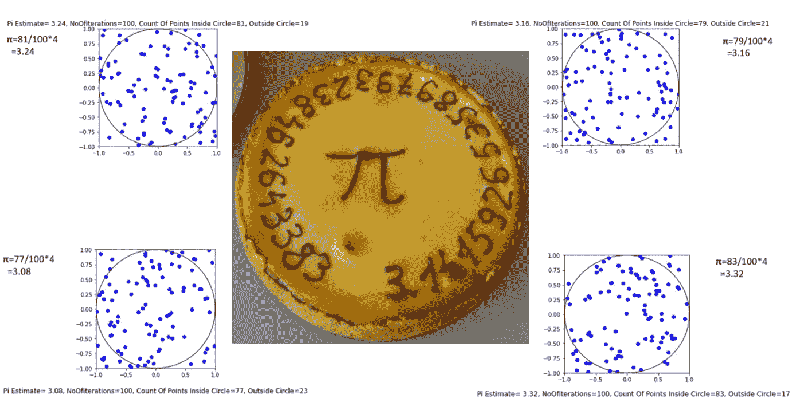
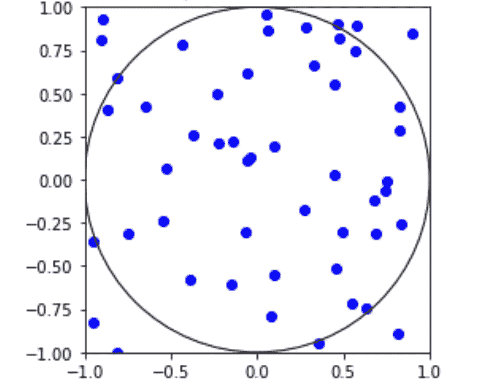
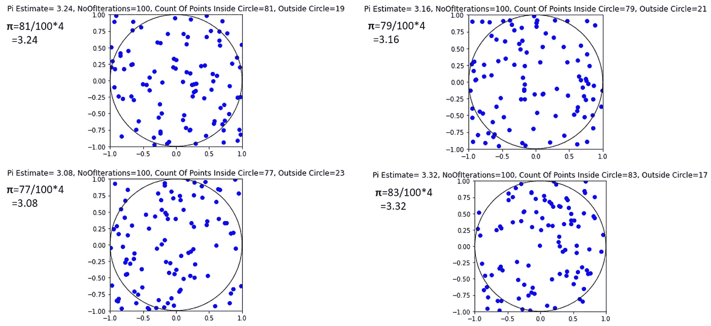
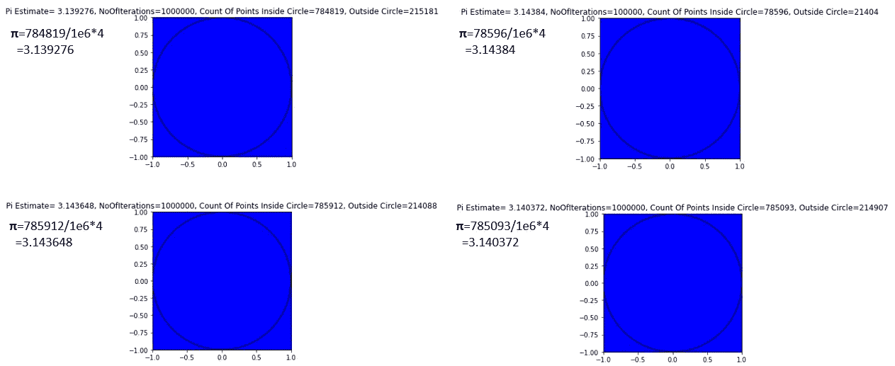
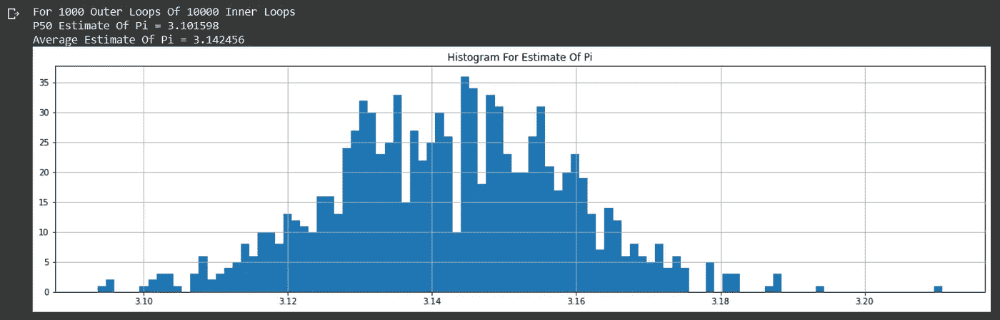
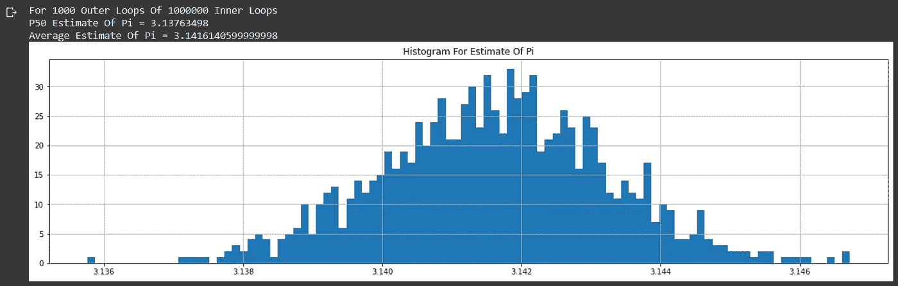

# 圆周率日特辑:使用蒙特卡罗方法估计π

> 原文：<https://medium.com/nerd-for-tech/pi-day-special-estimating-%CF%80-using-the-monte-carlo-method-2663edc9c01d?source=collection_archive---------4----------------------->

## 大家π日快乐！来一个，来全部——收集“a 轮”，因为我分享了如何使用蒙特卡罗模拟方法来估计π的值

[](https://en.wikipedia.org/wiki/Pi_Day) [## 圆周率

### 圆周率日是一年一度庆祝数学常数的节日。圆周率日是在 3 月 14 日(3/14 月/日…

en.wikipedia.org](https://en.wikipedia.org/wiki/Pi_Day) 

**是的，我知道从技术上来说这是一个快乐的“迟来的”π日，因为它已经过了 2021 年 3 月 14 日，但我的借口是我以太低的迭代次数运行我的模拟:P，我懒得等待 2021 年 7 月 22 日(* [*圆周率逼近日*](https://www.huffpost.com/entry/pi-approximation-day-_n_1693199)*——查一下——这是一个真实的事情)*

**公平的警告——这是一个有点怪的帖子，但我希望我的普通读者会原谅我的“*非理性的*”行为(Geddit？！抱歉更多糟糕的数学双关语来袭)**

因为我已经写了许多关于蒙特卡洛模拟的其他中型文章([这里](/analytics-vidhya/building-a-probabilistic-risk-estimate-using-monte-carlo-simulations-cf904b1ab503)、这里[这里](/analytics-vidhya/building-a-monte-carlo-method-stock-price-simulator-with-geometric-brownian-motion-and-bootstrap-e346ff464894)和[这里](/analytics-vidhya/how-to-estimate-optimal-stock-portfolio-weights-using-monte-carlo-simulations-modern-portfolio-d27d534e8a1a))，为了庆祝π日，我分享一个基于 Google Colab 构建的简单 python 脚本(点击下面自行探索)，它使用蒙特卡洛模拟对π进行估计。

[](https://colab.research.google.com/drive/1uyZGCogD0evDim5rk0Hty7KD3eTpJdyx?usp=sharing) [## 谷歌联合实验室

### 编辑描述

colab.research.google.com](https://colab.research.google.com/drive/1uyZGCogD0evDim5rk0Hty7KD3eTpJdyx?usp=sharing) 

# 概述

1.  [**如何估算π的基本理论**](#7aed)
2.  [**用 Python 代码实现**](#71e8)
3.  [**迭代次数变化的结果**](#c326)
4.  [**通过改变(内部)子循环**](#87bc) 的数量得到结果
5.  [**结论**](#4e70)

# 1.如何估算 **π** 的基本理论

基本理论如下:



*   考虑一个以原点(0，0)为圆心、半径为 1.0 的圆和一个从-1.0 到 1.0 的正方形
*   正方形的面积= 2 x 2
*   圆的面积= **π** x 半径**2 = **π** x 1 x 1
*   如果我们绘制一组从-1.0 到 1.0 的随机坐标，并“计数”圆内和圆外的点…
*   随着随机坐标的数量增加到一个大的数字；圆内的点/正方形内的点的比率将趋向于圆的面积/正方形的面积
*   **因此** **π ~圆内点数/总点数×4**

# 2.用 Python 代码实现

在 Python 代码中，它看起来有点像下面这样:

```
import pandas as pd
import numpy as np
import matplotlib.pyplot as plt
import randomN=100 # No of Monte Carlo Iterations#Function to estimate Pi based on no of iterationsdef pi_estimate(N,typeOfRandDistribution,showChart=True):
  x=[]
  y=[]
  inside_quadrant=0for i in range(0,N):
    if typeOfRandDistribution=='random.uniform':
      x_i=random.uniform(-1.00000, 1.00000)
      y_i=random.uniform(-1.00000, 1.00000)
    elif typeOfRandDistribution=='random.random':
      x_i=random.random()*2+-1
      y_i=random.random()*2+-1
    x.append(x_i)
    y.append(y_i)
    if (x_i**2+y_i**2)<=1:
      inside_quadrant+=1# I've included as an option to select between random.uniform and random.random. The post below says they are similar...but apparently due to floating-point rounding you can sometimes hit the upper bound in random.uniform vs random.random# Ref https://stackoverflow.com/questions/30030659/in-python-what-is-the-difference-between-random-uniform-and-random-random#:~:text=74-,random.,end%20up%20giving%20you%20b%20if showChart==True:
    figure, axes = plt.subplots()
    plt.scatter(x, y, c='blue')axes.set_aspect(1)
    axes.add_artist(plt.Circle((0,0),1, color = 'k', fill = False))
    plt.xlim(left=-1)
    plt.xlim(right=1)
    plt.ylim(bottom=-1)
    plt.ylim(top=1)
    pi_estimate= (inside_quadrant/N)*4
    outside_quadrant=N-inside_quadrant
    plt.title('Pi Estimate= '+str(pi_estimate)+', NoOfIterations='+str(N)+', Count Of Points Inside Circle='+str(inside_quadrant)+', Outside Circle='+str(outside_quadrant))
    plt.show()

  if showChart==False:
    pi_estimate= (inside_quadrant/N)*4
    outside_quadrant=N-inside_quadrantreturn pi_estimatepi_estimate(10,'random.random')
```

# 3.变化迭代次数的结果

我们马上会将上述方法的结果与 **π** 的“实际”值进行比较:

[](http://www.geom.uiuc.edu/~huberty/math5337/groupe/digits.html) [## 100，000 位数的圆周率

### 3.141592653589793238462643383279502884197169399375105820974944592307816406286…

www.geom.uiuc.edu](http://www.geom.uiuc.edu/~huberty/math5337/groupe/digits.html) 

例如，如果我们仅使用 100 次迭代进行(粗略)近似，并运行四次，我们会得到类似下图的结果:



这并不准确，因为这些都没有达到 3.1415926 的水平…..

然而，如果将迭代次数从 100 次增加到 100 万次，π的估计值会更接近一些(至少达到两位小数) :



# 4.改变(内部)子循环数量的结果

更有趣的是，我们可以做一个内循环和外循环，下面是使用 10，000 次内循环迭代的 1，000 次外循环迭代的π估计直方图，以及由此产生的π的中值和平均值估计

```
#Example Of 100 Iterations Of 10Mil Sub-IterationsPi_Estimate_Array=[]OuterLoopIterations=1000InnerLoopIterations=10000for i in range(0,OuterLoopIterations):Pi_Estimate_Array.append(pi_estimate(InnerLoopIterations,'random.random',showChart=False))pd.DataFrame(Pi_Estimate_Array).hist(bins=100)plt.title("Histogram For Estimate Of Pi")print("For "+str(OuterLoopIterations)+" Outer Loops Of "+str(InnerLoopIterations)+" Inner Loops")print("P50 Estimate Of Pi = "+str(np.percentile(Pi_Estimate_Array,0.5)))print("Average Estimate Of Pi = "+str(np.average(Pi_Estimate_Array)))
```



对于 1000 个外循环和 10，000 个内循环，π到四位数的平均估计值为 3.1425…

如果我们有点疯狂，并且不介意‘最大化’谷歌的免费分配——我们可以用**100 万(！)**内部循环，用 Google Colab 的 GPU 模式重新运行(这有点像用一辆布加迪开到你街角的杂货店买牛奶)



对于 1000 个外循环和 100 万个内循环，π到四位数的平均估计值是 3.1416…(注意，即使在 GPU 上运行，这仍然需要大约 9 分钟)

# 4.结论

虽然这是一个有趣的练习，但我猜你们中的一些人可能会问，计算这么多位数的 **π** 的值是否有任何实际用途…


左边的图片——一篇有趣的文章，一位[谷歌云开发者计算出圆周率为 31.4 万亿(！)数字](https://cloud.google.com/blog/products/compute/calculating-31-4-trillion-digits-of-archimedes-constant-on-google-cloud)通过 96 个虚拟 CPU(内存为 1.4 万亿字节)和 24 个 10TB 固态硬盘阵列来存储对比结果，图像在右边[我的小马 S07 E23 中非常特别的一集，其中 Pinky Pie 为 Pies 疯狂](https://tvtropes.org/pmwiki/pmwiki.php/Recap/MyLittlePonyFriendshipIsMagicS7E23SecretsAndPies) …

虽然谷歌试图推动这一限制是有趣的…根据美国宇航局，15 位数足以获得他们的太空任务轨迹计算的可接受误差。

[](https://www.jpl.nasa.gov/edu/news/2016/3/16/how-many-decimals-of-pi-do-we-really-need/) [## 我们真正需要的圆周率的小数位数是多少？- Edu 新闻|美国宇航局/JPL·edu

### 本周早些时候，我们收到了一位脸书迷的提问，他想知道数学中有多少位小数…

www.jpl.nasa.gov](https://www.jpl.nasa.gov/edu/news/2016/3/16/how-many-decimals-of-pi-do-we-really-need/) [](https://blogs.scientificamerican.com/observations/how-much-pi-do-you-need/) [## 你需要多少圆周率？

### 我希望你为明天的圆周率逼近日派对做好准备了。你可能在 3 月 14 日观察过圆周率日。它…

blogs.scientificamerican.com](https://blogs.scientificamerican.com/observations/how-much-pi-do-you-need/) 

不管怎样，尽管事实如此，希望这仍然是蒙特卡罗方法的一个有趣的应用。

希望每个人都度过了美好的一天！

下次见！