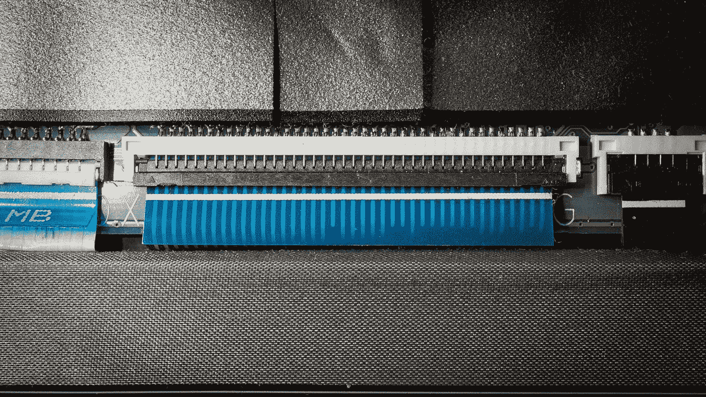
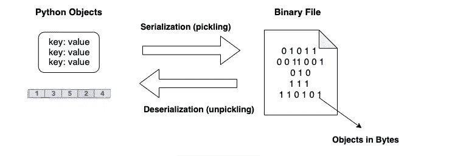
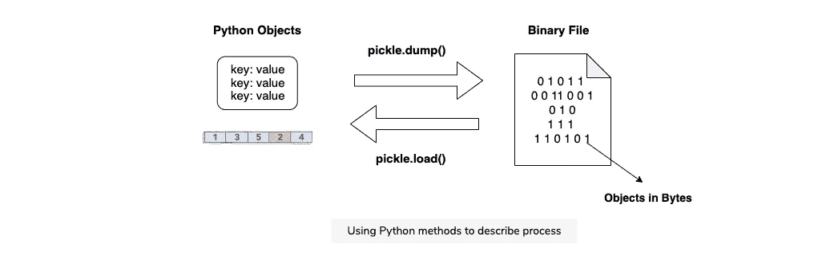

# 蟒蛇皮腌制

> 原文：<https://medium.com/nerd-for-tech/pickling-in-python-b5abbe4fbead?source=collection_archive---------0----------------------->

根据 [Python 文档](https://docs.python.org/3/library/pickle.html#:~:text=%E2%80%9CPickling%E2%80%9D%20is%20the%20process%20whereby,back%20into%20an%20object%20hierarchy.)，pickle 是将 Python 对象层次转换成字节流的过程，而 Un-pickle 是相反的操作，字节流(来自[二进制文件](https://docs.python.org/3/glossary.html#term-binary-file)或[类字节对象](https://docs.python.org/3/glossary.html#term-bytes-like-object))被转换回对象层次。

> 酸洗和去酸洗也称为“序列化”、“编组”或“展平”。此外，请注意
> 
> **警告:**`pickle`模块**不安全**。只对您信任的数据进行解密。
> 
> 有可能构建恶意 pickle 数据，该数据将在取消 pickle 期间**执行任意代码。不要对可能来自不可信来源或可能被篡改的数据进行解压缩。**

在这篇文章中，让我们深入探究腌制的概念



照片由[米卡·鲍梅斯特](https://unsplash.com/@mbaumi?utm_source=medium&utm_medium=referral)在 [Unsplash](https://unsplash.com?utm_source=medium&utm_medium=referral) 上拍摄

## 电子监管简介

**序列化**一个对象把它变成一个线性字节流。这样做可以将一个对象保存到一个文件中，或者将它传输到另一个进程中。字节流可以被**解串行化** ( **解编组**)以重构原始对象。

最常见的序列化 Python 对象的方法叫做**pickle**。Python 也可以使用 JSON 和 XML 进行序列化。



一般过程

Python **值**和大多数**内置对象**都可以被酸洗，包括模块顶层的用户自定义类。**递归**和**互联对象**也可以被酸洗。然而，**生成器**， **lambda 函数**，**数据库连接**，以及**线程**，这些都是**无法**腌制的东西。

## 酸洗和非酸洗方法

要 pickle 或 un pickle 对象，首先必须导入它的模块。这可以通过`import pickle`命令来完成。现在，您可以使用以下方法:

*   `pickle.dump(object, file)`将`object`保存到`file`，必须在`wb`(写二进制)模式下打开。
*   `variable = pickle.load(file)`重建先前写入`file`的对象，该对象必须在`rb`(读取二进制)模式下打开。
*   `str = pickle.dumps(object`)将`object`作为字符串保存到`str`变量中。
*   `object = pickle.loads(str)`重建先前写入字符串`str`的对象。

下图将帮助您更好地理解这些方法的功能。



```
import os
import picklex = {'a': 1, 'b': 2} 
y = [x, 3, x] 
x['c'] = y 
print('x {} \nBefore pickling: {}'.format(x, y))fi = open('ptest', 'wb') 
pickle.dump(y, fi) 
fi.close()fi = open('ptest', 'rb') 
z = pickle.load(fi) 
print('After pickling:', z)
```

**使用 Pickle 模块的优势:**

1.  **递归对象(包含对自身的引用的对象):** Pickle 跟踪它已经序列化的对象，因此以后对同一对象的引用不会被再次序列化。
2.  **对象共享(不同地方对同一对象的引用):**这类似于自引用对象；pickle 将对象存储一次，并确保所有其他引用都指向主副本。共享对象保持共享，这对可变对象非常重要。
3.  **自定义类及其实例:** Marshal 根本不支持这些，但是 pickle 可以透明的保存和恢复类实例。类定义必须是可导入的，并且与对象存储在同一个模块中。

我前面说过，腌制是**不安全的**。它可能包含攻击您系统的代码对象和数据。请确保您解压缩的任何内容都来自可靠的来源，并且在传输过程中没有被篡改。下次再见！