# 管道梦想用管道轻松部署

> 原文：<https://medium.com/nerd-for-tech/pipeline-to-atlantis-18aa36dc6ecf?source=collection_archive---------12----------------------->

> “你可能会说我是一个梦想家，但我不是唯一的一个”
> 
> 约翰·列侬

# 想象一下没有部署斗争

想象一下，作为一名开发人员，您编写代码，在本地进行测试，然后将其推送到远程存储库。从那里，它会被自动测试，如果通过了所有测试，它就会被部署到生产服务器上。在整个过程中，您都会通过 Slack 得到任何失败的通知。想象一下，您不必担心手动配置您的生产服务器。想象一下，在生产中，就像在本地一样，一切正常。

这不是一个停留在潜意识中的梦想，这是一个需要行动、知识和意志去实现的梦想。在我自己的旅程中，我被我全心全意投入的项目所困扰，当我试图部署我的 web 应用程序并解决所有生产 bug 时，我的头撞上了柏林墙。我环顾四周，不仅是我，还有我所有的开发伙伴，都在为类似的问题而挣扎。然后我听到它在呼唤…我脑海中的那个声音，它说，“有一个更简单的方法。”

下降到[西尔克斯](https://searx.github.io/searx/)兔子洞的黑暗中，DevOps 作为[一个真正的救赎教会](https://en.wikipedia.org/wiki/One_true_church)出现。根据[阿特拉斯](https://www.atlassian.com/devops):

> DevOps 是一组实践，用于自动化和集成软件开发和 IT 团队之间的过程，因此他们可以更快、更可靠地构建、测试和发布软件。

DevOps 建立在[敏捷开发](https://www.atlassian.com/agile)的基础上，封装并自动化了从集成到持续监控生产服务器的流程的每个部分。这种自动化实践被称为 [CI/CD 管道](https://www.katalon.com/resources-center/blog/ci-cd-introduction/)或*管道*。

DevOps 构建敏捷开发管道，由[来源](https://i.pinimg.com/originals/6e/be/14/6ebe1464624cd2bdeae9655579e7ce29.jpg)提供

有过多的工具[允许人们创建这些管道。我们将尝试 GitHub Actions、CircleCI 和 TravisCI。将来，我希望将这篇文章扩展到包括 Jenkins、Bamboo 和 GitLab。](https://www.katalon.com/resources-center/blog/ci-cd-tools/)

# 想象变成计划

首先，我创建了一个基础项目，它可以被克隆，以便使用上面概述的每个工具建立三个不同的管道。[这不是财务建议](https://github.com/starlightromero/this-is-not-financial-advice)，有一个没有风格的普通用户界面，但包含了一个基本节点应用程序的所有必要部分，包括 CRUD 路线和测试。此外， [Docker](https://invidious.tube/watch?v=Gjnup-PuquQ) 用于允许在独立环境中轻松部署。

花点时间熟悉一下项目回购。现在，我们准备停止想象，开始实现。

# 现实化

我选择 GitHub Actions、CircleCI 和 TravisCI 是因为它们的流行和易于集成。我想象中的管道很简单。

在推送到`development`分支时，管道将:

1.  检查代码
2.  安装依赖项
3.  在 Node 的四个不同的主要版本(10、12、14、15)上测试代码

在推送到`production`分支时，管道将以与上面相同的方式启动。然后，如果代码通过了测试，管道将:

1.  检查代码
2.  建立 Docker 形象
3.  把图像推给 Heroku

此外，我希望收到一个关于过程中任何失败的 Slack 通知，或者一个成功通知，如果管道执行时没有失败。

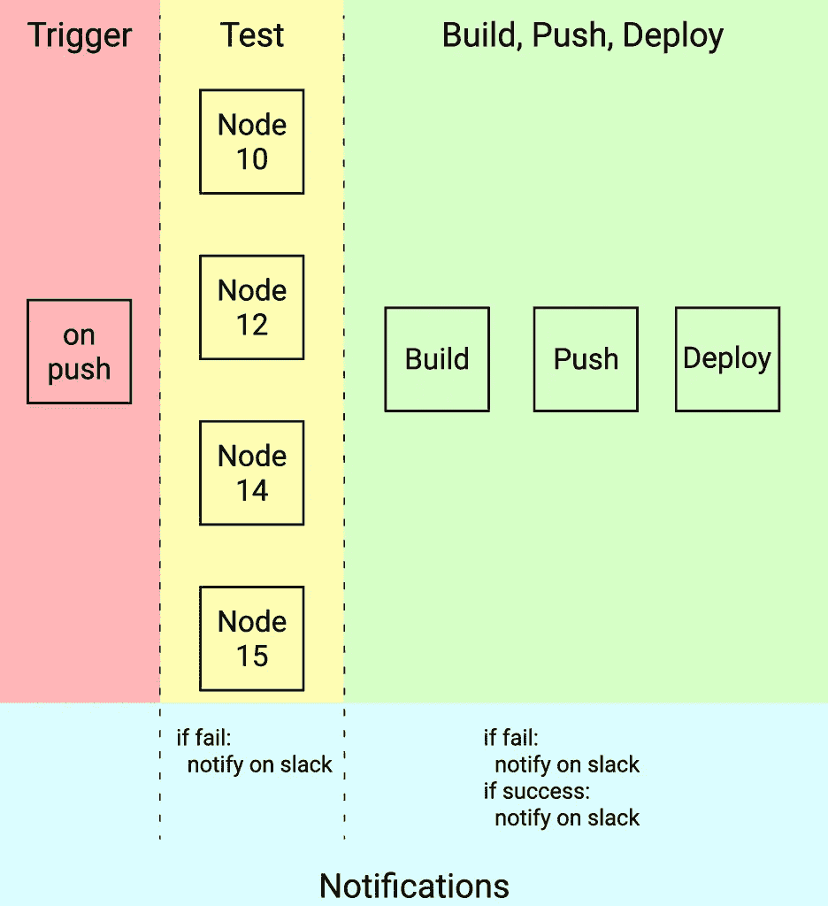

## 文档文件

这是我们将用来构建图像的 Dockerfile 文件。

# GitHub 操作

GitHub Actions 和大多数其他管道工具一样，使用 yaml 文件格式。GitHub Actions 利用了[工作流](https://docs.github.com/en/actions/reference/workflow-syntax-for-github-actions)。

> 工作流是由一个或多个作业组成的可配置自动化流程。您必须创建 YAML 文件来定义您的工作流配置。
> 
> 工作流运行由一个或多个作业组成。默认情况下，作业并行运行。
> 
> 作业包含一系列称为步骤的任务。

要创建一个工作流，在你的项目 repo 的根目录下创建一个文件夹，`.github`。在新创建的文件夹中创建一个文件夹，`workflows`。这些目录的名字很重要，因为 GitHub 专门在`.github/workflows/`中查看是否有应该执行的工作流。

我们将从`development`分支开始，创建一个工作流并定义一个名称`Test`。在向分支推送时，`test`作业将被触发。这项工作将在 Ubuntu 上运行。然后我们定义一个节点版本矩阵来安装和测试代码。然而，在进行实际测试之前，我们检查代码。然后，我们安装依赖项并测试代码。我们设置了 Slack 通知来提醒我们任何失败，或者是否一切顺利。

再深入一点，`Checkout`和`Use Node.js`步骤是预定义的内置动作。你可以把这些想成 JS 里的`Math.pow()`。这与我们运行自己的命令的`Install Dependencies`步骤不同。松弛通知使用`[voxmedia/github-action-slack-notify-build@v1](https://github.com/voxmedia/github-action-slack-notify-build)`。你可以认为这是一个像 Express 一样的外部依赖。通过探索 [GitHub Marketplace](https://github.com/marketplace?type=actions) 你可以找到各种可以在你的工作流程中使用的操作。

这不是财务建议 GitHub 行动 yaml 文件。想象我自己的。

对于`production`工作流，在第 6 行，我们指定在推送到生产分支时触发的工作流。创建一个额外的作业`build`，它依赖于`test`首先完成。如果我们在第 44 行没有这个规范，这两个作业将并行运行。我们再次签出代码，但是这一次我们使用了别人为我们预定义的动作，以便[构建、推送和部署到 Heroku](https://github.com/jctaveras/heroku-deploy) 。最后，我们有我们的 Slack 通知。

这不是用于生产工作流程的财务建议 Github Actions yaml 文件。想象我自己的。

## **环境变量呢？**

环境变量是任何 web 应用程序的重要组成部分。在 GitHub repo 中导航到`Settings`选项卡，然后在侧边栏上点击`Secrets`。在右上方附近可以找到`New repository secret`。输入名称和值后，您将被重定向到机密页面，列表中会显示您的新机密。正如你在上面的代码片段中看到的，我们可以通过使用语法`${{ secrets.NAME_OF_SECRET }}`来访问它，秘密将在运行时动态注入。

## 我们如何设置 Heroku？

通过查看密钥，Heroku 有点简单明了。您将需要您的 Heroku 电子邮件、API 密钥和应用程序名称。我假设你知道你的邮箱。要获取应用名称，您首先需要登录并创建一个应用。要获取 API 密匙，点击右上角的忍者档案图标进入`Account Settings`。向下滚动到`API Key`部分并选择`Reveal`。现在，将此密钥与您的电子邮件和应用程序名称一起保存在您的秘密中。

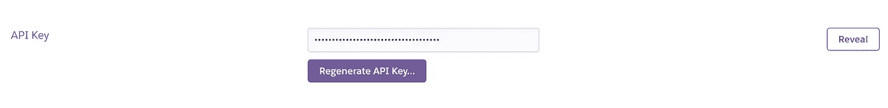

回到仪表板，点击`New`，在下拉菜单中点击`Create new app`。输入应用名称`tinfa-gh-actions`，点击`Create app`。创建应用程序后，单击该应用程序。在顶部附近，在导航栏上单击`Settings`，然后向下滚动到`Config Vars`，在该部分中单击`Reveal Config Vars`。我们将在这里输入生产所需的任何秘密变量。我们将添加`MONGODB_URI`，作为键，URI 作为值。

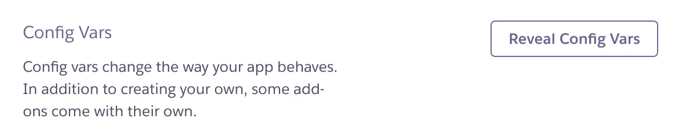

## **还有时差通知？**

时差通知需要一些时间来设置。首先，确保您登录到 Slack，然后导航到`[https://api.slack.com/](https://api.slack.com/)`并点击`Create Custom App`。接下来，点击带有文本`Create New App`的绿色按钮。当弹出窗口出现时，选择`From Scratch`。我将应用程序命名为`TINFA-GH-Actions`，并选择了合适的工作空间。

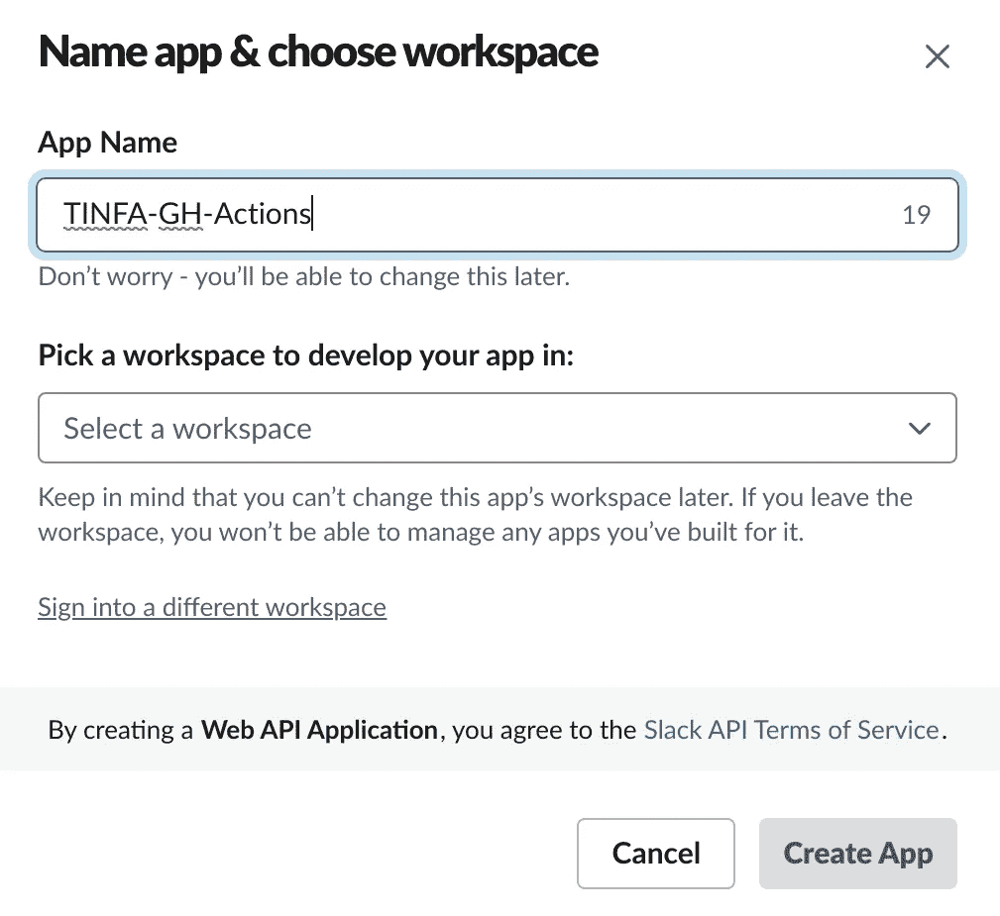

一旦应用程序被创建，我们需要设置允许 Slackbot 发送通知的权限。在`Features`部分的左侧导航栏上，点击`OAuth & Permissions`。向下滚动到`Scopes`，在`Bot Token Scopes`下点击`Add an OAuth Scope`。我们需要的三个示波器是`channels:read`、`chat:write`和`groups:read`。

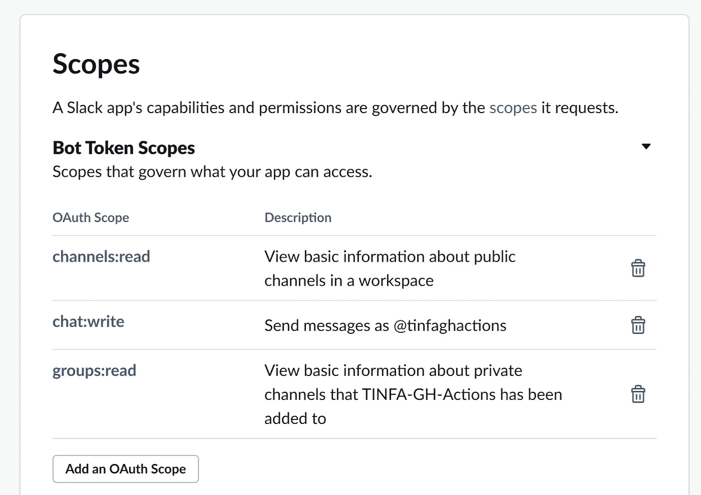

如果你想定制你的机器人的外观，使用侧边栏导航到`Basic Information`页面。向下滚动到`Display Information`。在这里，您可以更改应用程序名称、添加描述、更改颜色以及添加应用程序图标。

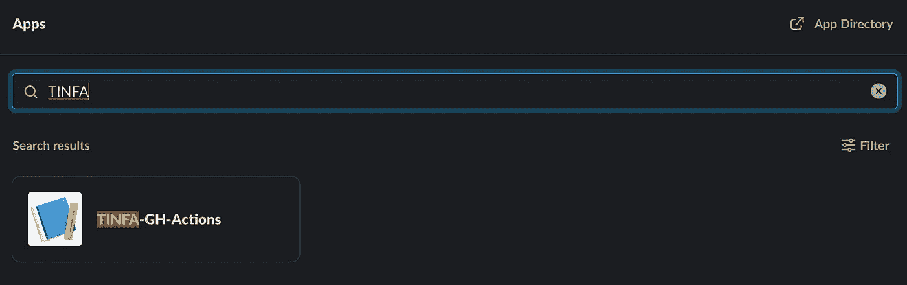

bot 的下一步是将其安装到工作区。导航至`Install App`。你会看到你的`Bot User OAuth Token`和下面的按钮`Install to Workspace`。点击那个，现在，我们只需要得到`channel id`。打开 Slack 桌面应用程序，添加您刚刚创建的新应用程序。安装完成后，右击频道，选择`Copy Link`，粘贴到某个地方。它可能是 Slackbot 频道中的文本框。`/archives/`后的字母数字字符串就是`channel id`。将它添加到您的 GitHub secrets 中，以便在通知步骤中用作`${{ secrets.SLACK_CHANNEL_ID }}`。成功通知将如下图所示。

试一试，看看会发生什么。可以查看[回购](https://github.com/starlightromero/TINFA-GH-Actions)，查看[部署 app](https://tinfa-gh-actions.herokuapp.com) 。

## 切尔莱西

另一个 CI/CD 工具是 CircleCI。在继续之前，注册 CircleCI 并连接您的 GitHub 帐户。如果你在这方面遇到麻烦，请查看 [Circle CI 文档](https://circleci.com/docs/2.0/first-steps/)。

就像 GH Actions 使用我们可以使用的预定义动作一样，CircleCI 使用 orb。我们将使用 Node、Slack 和 Heroku obs。你可以在这里找到可用的球体以及如何使用它们[。](https://circleci.com/developer/orbs)

> rbs 是可重用的代码片段，有助于自动化重复的过程，加速项目设置，并使其易于与第三方工具集成。

在进入我们的`yml`文件之前，我们需要创建目录`.circleci`。在目录中我们可以创建`config.yml`。CircleCI 专门在`.circleci`目录中查找文件`config.yml`。

在我们的`yml`文件的顶部，我们将版本设置为 2.1。这很重要，因为`orbs`、`parameters`和`executors`都需要 2.1 版。接下来，我们定义我们的执行者。这仅仅意味着运行作业步骤的环境。我们可以选择在 machine、macos、windows 或 docker 上运行它。我们会选择 docker。

在定义 orb 之后，我们可以继续定义工作流。CircleCI 类似于 GH Actions，因为它的工作流包含包含步骤的作业。工作流在版本 2 上运行，名称为`test-build-and-deploy`。我们将有两个职位`test`和`build-deploy`。`test`设置一个上下文 Slack，它将使我们能够发送通知。接下来，我们过滤作业，使它只在`development`和`production`分支上运行。然后，我们在 Linux 操作系统上设置不同节点版本的矩阵。

进入`test`工作，我们设置参数。执行器将在我们在工作流部分定义的矩阵上运行。这些步骤包括检查代码、安装特定的节点版本、安装依赖项、测试代码，然后在出现任何故障时发送 Slack 通知。

回到我们的工作流程，我们可以定义下一个任务`build-deploy`。需要`test`先跑。我们将上下文设置为 Slack，并且只过滤到`production`的分支。

在`build-deploy`作业中，我们初始化 Docker，因为我们稍后将需要它来构建我们的映像。在这些步骤中，我们检查代码，设置 Docker，安装 Heroku，构建映像并将其推送到 Heroku，然后发布映像。最后，我们通知成功或失败。

CircleCI 为我们提供了一个很好的可视化管道流动的方式，如下图所示。我们所有的测试都是并行运行的。在所有测试成功之后，我们接着进行构建和部署。

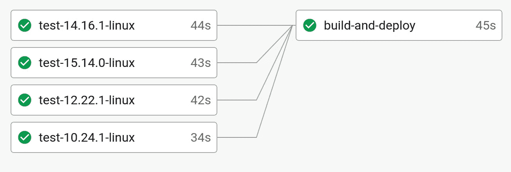

## CircleCI 中的环境变量是如何工作的？

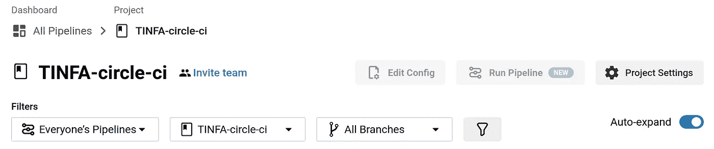

登录并确保您的项目被选中后，我们可以点击`Project Settings`。在左侧，我们可以点击`Environment Variables`。一旦我们添加了环境变量，我们就可以通过在关键字前加前缀`PROJECT_`在`yml`文件中使用它们。如果我想访问我的`MONGODB_URI`，我们可以使用`PROJECT_MONGODB_URI`来完成。我们必须给它加上前缀，因为这些变量不同于定义为上下文的变量，也不同于在步骤或作业中定义的变量。

注意`PROJECT_MONGODB_URI`在`yml`文件中是怎么找不到的。这是因为它在终端中的作用类似于导出变量。当运行测试或构建图像时，代码将自动寻找变量，因为它对整个项目都是可访问的。这与我们必须明确说明在给定的步骤中哪些环境变量是可用的 GH 行为正好相反。

## 通知

设置一个 Slackbot 将类似于 GH 动作。有关更多详细信息，请参见该部分。我们将在`OAuth & Permissions`做一点小小的改动。我们将为`chat:write`、`chat:write.public`和`files:write`添加`OAuth Scopes`。

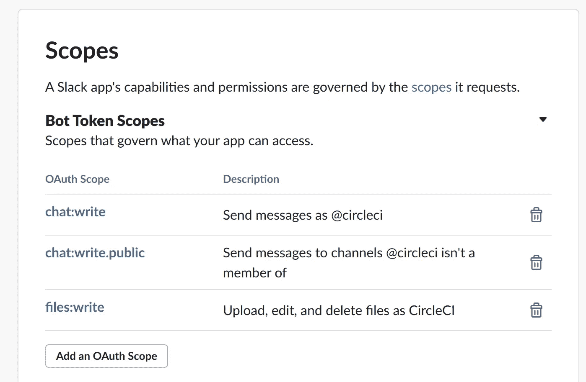

我们可以设置一个频道，但省略它，默认频道将是 Slackbot 应用程序频道。我们需要做的就是添加 API key，将其设置为项目中的环境变量，并在`yml`文件中定义 API key。默认的成功通知将如下图所示。您可以阅读 [Slack orb 文档](https://circleci.com/developer/orbs/orb/circleci/slack)以获得定义自定义通知的指导。

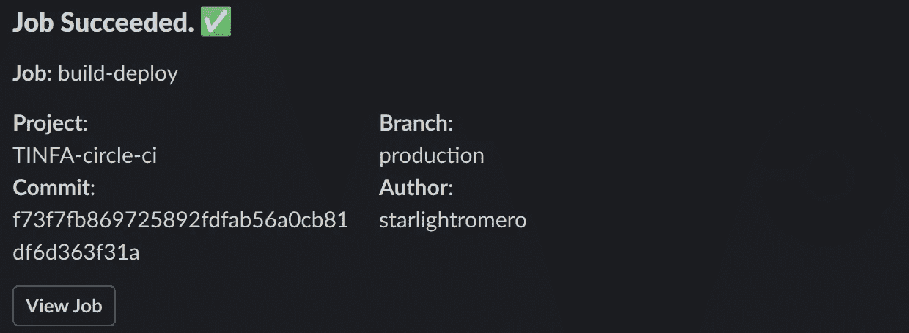

要在 Heroku 上设置，请参考 GitHub 操作部分。以下是 [GitHub repo](https://github.com/starlightromero/TINFA-circle-ci) 和[部署应用](https://tinfa-circle-ci.herokuapp.com/)的链接。

## 特拉维斯奇

首先，我将我的 GitHub 帐户连接到 TravisCI，并授予 OAuth 权限。TravisCI 在`.travis.yml`文件中查找构建配置。我建议查看文档[这里](https://docs.travis-ci.com/user/tutorial/#to-get-started-with-travis-ci-using-github)开始，查看[这里](https://github.com/travis-ci/travis.rb#readme)CLI。

首先我们定义了`os: linux`和 Linux(读作 Ubuntu)发行版`focal`，这只是 Ubuntu 20.04 的发布名称。接下来，我们将语言定义为 node as 集合版本矩阵。我们将 docker 设置为服务，这样我们就可以在管道中访问它。

## 通知

TravisCI 的通知将与我们为 GH Actions 和 CircleCI 配置的不同。配置松弛通知需要一些工作，但是我能够遵循[文档](https://docs.travis-ci.com/user/notifications/#configuring-slack-notifications)。通知不会出现在在`yml`文件中配置的频道中，如 GH Actions 或 CircleCI。相反，在登录 Slack 后，您将进入一个页面，在这里您可以配置发布到哪个频道。

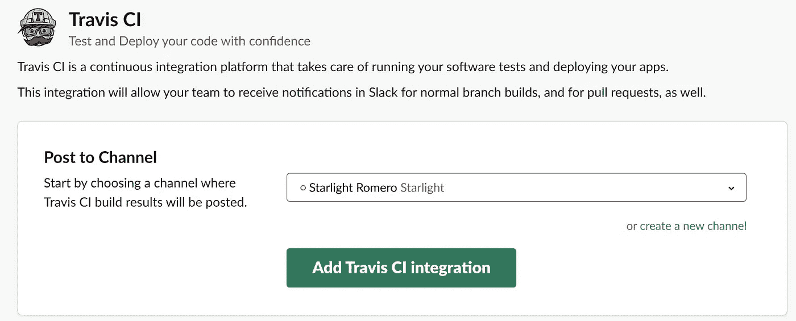

您需要确保使用 CLI 命令`travis encrypt "<account>:<token>" --add notifications.slack -- pro`对`account:token`进行加密。请注意，我们没有指定房间/频道。这是因为如果没有指定房间/频道，TravisCI 会自动向您发送通知。使用 travis-ci.com 作为 API 端点需要使用`--pro`命令。默认的终点是 travis-ci.org，TravisCI 已经声明他们正在远离这个地方。

成功通知将如下图所示。

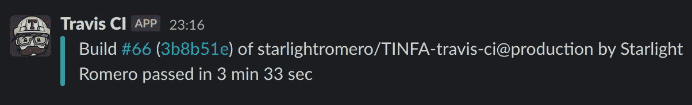

## 构建阶段

对于脚本，我们运行`npm test`。我们之前定义的节点版本矩阵将用于在每个版本上运行脚本。在脚本之后，我们定义了`jobs`，这是我们的部署阶段。我们选择跳过脚本。这一行很重要*，因为我们不想重新运行任何测试。*脚本和作业的分离允许测试运行四次(每个节点版本一次),但只部署一次。这就是特拉维斯奇所说的“构建阶段”。您可以在[文档](https://docs.travis-ci.com/user/build-stages/)中了解更多关于构建阶段的信息。

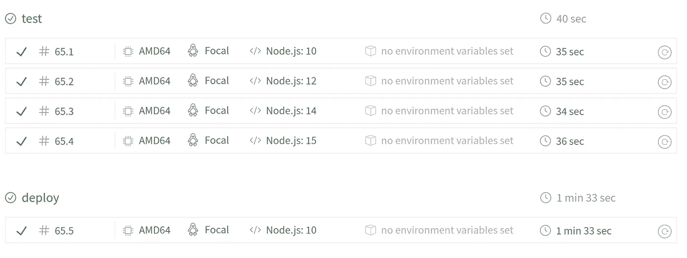

在部署作业中，我们希望部署到 Heroku。我们可以使用 CLI 通过命令`travis encrypt $(heroku auth:token) --add deploy.api_key --pro`来加密`api_key`。我们选择只在`production`分支上部署，然而测试矩阵将在所有分支上运行。最后，我们跳过任何清理。通过防止 Travis 重置工作目录，这允许[稍微优化管道](https://docs.travis-ci.com/user/deployment/#uploading-files-and-skip_cleanup)。

我们的`MONGODB_URI`环境变量呢？在 Travis dashboard 中，单击“更多选项”>设置会将我们带到一个页面，在这里我们可以定义我们的环境变量。如果该值包含空格或特殊字符，请务必用引号括起来。我忘了用引号将`MONGODB_URI`括起来，这使得我的测试失败。相信我，加上引号，这个花了太长时间(几周)来调试。

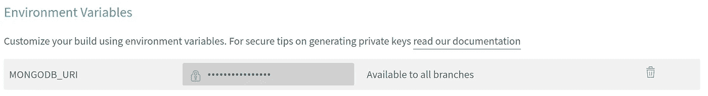

更多关于使用 TravisCI [部署到 Heroku 的信息，请点击](https://docs.travis-ci.com/user/deployment/heroku/)。

我们必须包含 Travis 的另一个文件是`heroku.yml`。这个文件声明了如何为部署构建 docker 容器。我们选择用 Docker 构建，并将 web build `Dockerfile`定义在与`heroku.yml`相同的目录中。如果`Dockerfile`在子目录中，我们将在第 3 行定义路径。最后，我们将配置设置为包含生产中所需的任何环境变量:

要在 Heroku 上设置，请参考 GitHub 操作部分。请随意查看 [GitHub 回购](https://github.com/starlightromero/TINFA-travis-ci)和[现场](https://tinfa-travis-ci.herokuapp.com/)。

# 比较工具

每个工具都有自己的设置和配置挑战。就难度而言，我会说 GH Actions 是最容易配置的，而 TravisCI 是最难的。

TravisCI 有点难，因为它要求你安装 Ruby，以便安装 TravisCI CLI，从而加密某些环境变量。我很欣赏 CircleCI 和 GitHub 在 web 应用程序中处理这些问题的做法。尽管我会说，与 GH Actions 需要的两个单独的`yml`文件相比，我很欣赏 TravisCI 简洁的`yml`文件。

CircleCI 在难度、简洁性和配置能力方面处于中间位置。

总的来说，我认为这三个都是很好的工具，可以极大地改进测试和部署应用程序的过程。以我现在的知识，我可能可以在更短的时间内设置和配置一个管道。

# 反思改进

正如我在本文开头提到的，我希望在不久的将来扩展到包括更多的管道。至于对现有管道的改进，我能想到几个。最好先构建 Docker 映像，然后在容器中测试代码。这可以消除在 Docker 容器中从一个节点环境到另一个节点环境的不一致。构建>测试>部署>发布。

缓存会缩短构建时间。每次管道运行都要重新开始。TravisCI 有`skip_cleanup`，但是与缓存构建映像相比，这也只是一个很小的改进。例如，在包含八个步骤的 docker 文件中，我们可以假设大部分时间我们的基本映像和依赖项不会经常改变。通过缓存这些层，我们将能够从第六步开始。

安全是我的一大兴趣。测试代码的安全缺陷，并进一步测试容器的安全缺陷，也许使用 [Snyk](https://snyk.io/) ，将是一个很大的改进。这将确保即使我们的代码在工作，我们也不会部署任何可能危及用户或任何数据的代码或容器。

最后一个更具挑战性的改进是在 IaaS 而不是 PaaS 服务上部署容器。我还没有研究过这个，但是我认为我们必须自己写脚本来做这件事，而不是回复预先构建的球体/动作等。

你不只是一个梦想家。我希望这篇文章能帮助你进入 CI/CD 管道，并给你一个良好的开端，为你所有的应用程序创建你自己独特的管道。