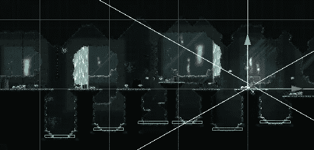
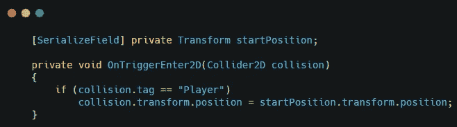
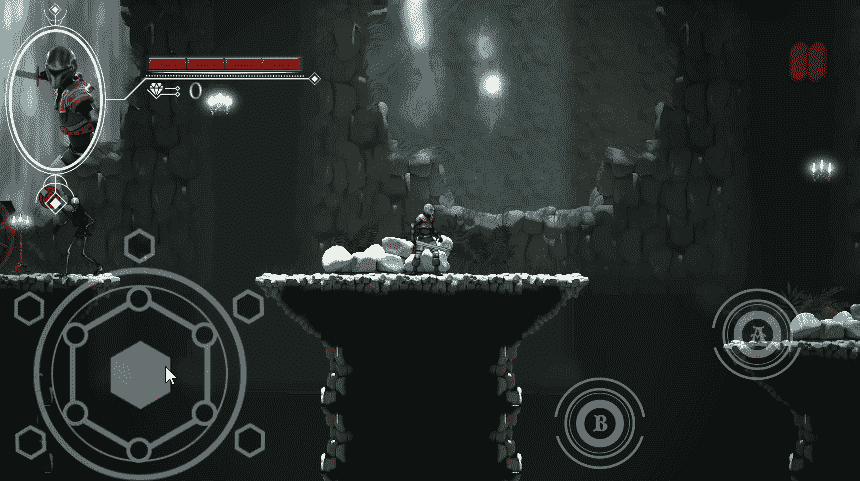

# 统一中的陷阱

> 原文：<https://medium.com/nerd-for-tech/pitfalls-in-unity-e7fbe8c43371?source=collection_archive---------22----------------------->

在我正在开发的游戏中，如果玩家错过了跳跃的时间，就会掉进洞里。我已经创建了一个简单的系统，允许玩家从这些洞中出来。

我在洞的底部添加了一个碰撞器，并将玩家的位置设置为起始位置。

这将使玩家每次掉进洞里时都被传送到起点。

