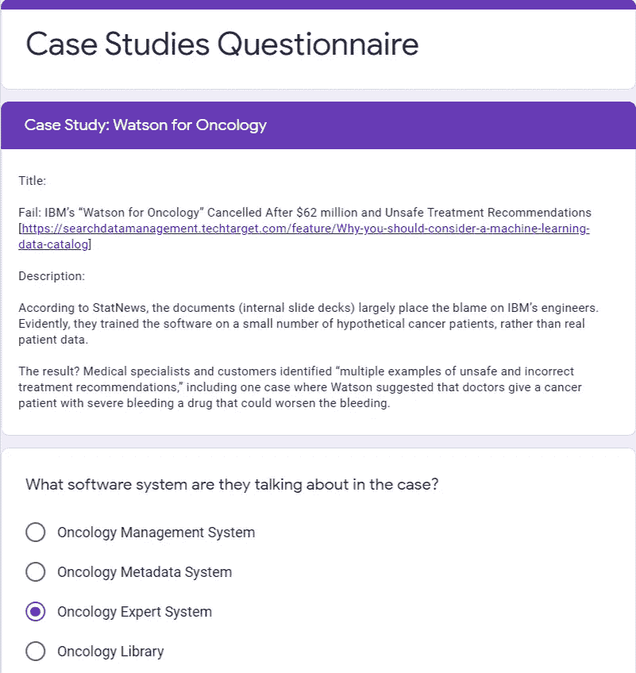
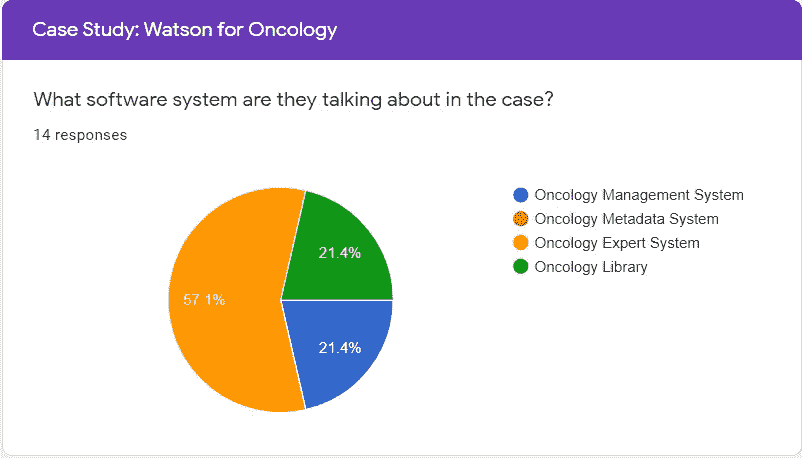
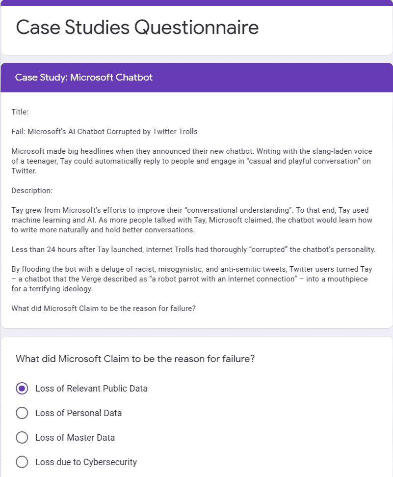
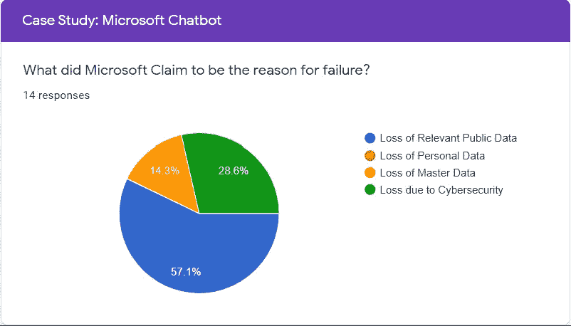
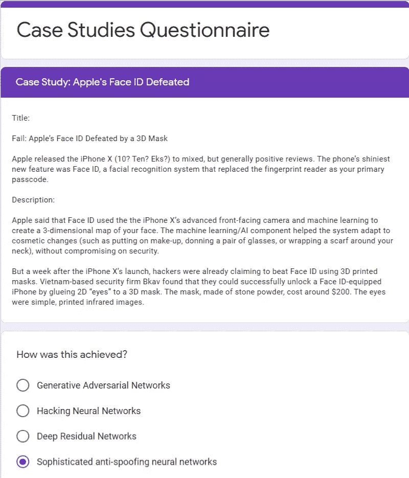
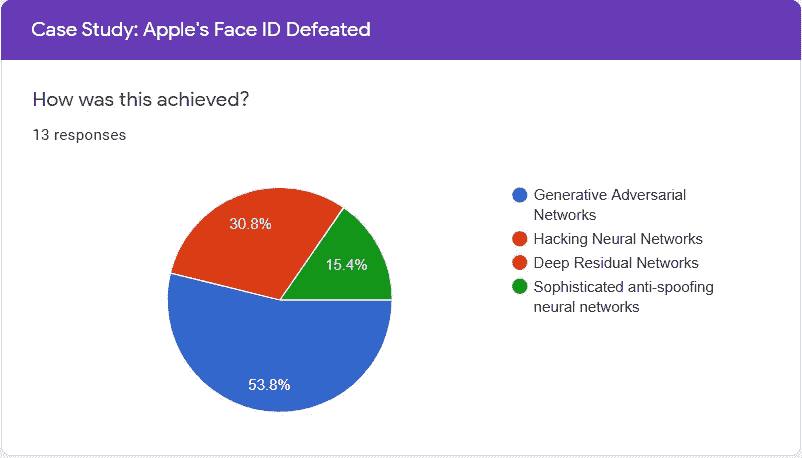
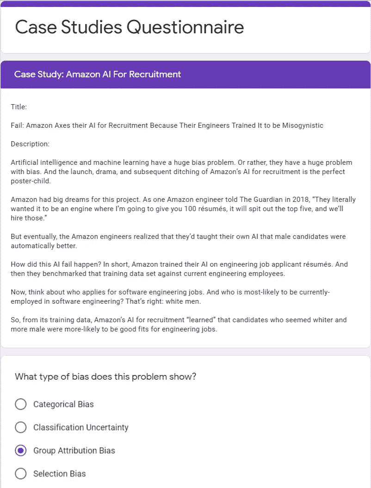
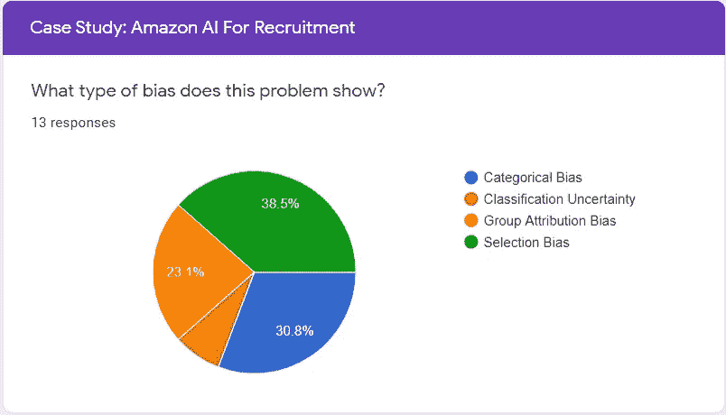
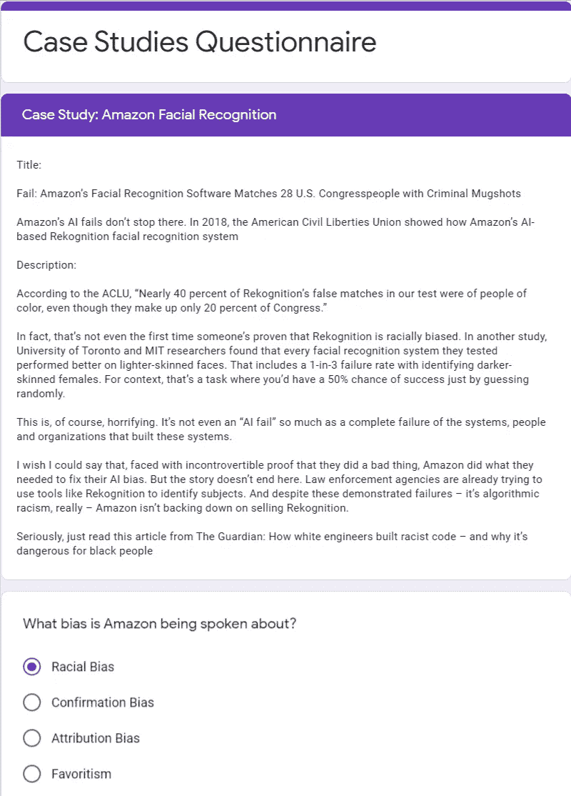
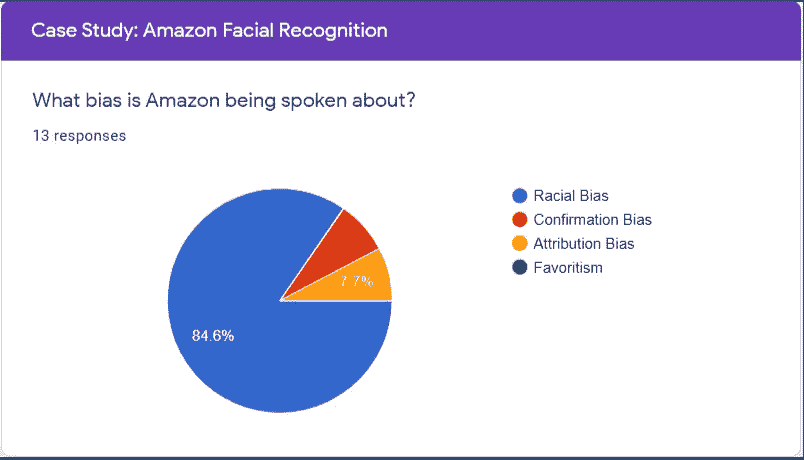

# 人工智能的陷阱——对 5 个案例的调查

> 原文：<https://medium.com/nerd-for-tech/pitfalls-of-artificial-intelligence-ai-a-survey-conducted-on-5-case-studies-1784f08dfbca?source=collection_archive---------0----------------------->

[*makyzz*创建的横幅矢量](https://www.freepik.com/vectors/banner)

*在一个教育项目*的同行调查中，询问了 5 个案例研究

# 介绍

人工智能有一些陷阱，与它的道德和偏见、它在企业范围内的实施以及让人们习惯它在市场中的演变有关。陷阱的发生是由于它们在任何阶段的成熟。

***下面显示的格式指的是一个问答会话，其中一个问题作为描述性文本，一个单行问题寻找答案所指的术语或短语。***

# 案例研究 1

> 肿瘤学沃森

**IBM 的 Watson for Oncology 是一台人工智能机器，用于处理癌症治疗，并使用机器学习解决医疗保健问题。**[**PaulvanderLaken.com**](https://paulvanderlaken.com/2017/09/12/ibms-watson-for-oncology-a-biased-and-unproven-recommendation-system-in-cancer-treatment/)**引用 Watson for Oncology 作为有偏见且未经证实的推荐系统。**

**我偶然在 SearchDataManagement.com******看到了这个案例，我对这个案例的第一个问题如下。****

> ****标题:****
> 
> **失败:IBM 的“肿瘤沃森”在 6200 万美元和不安全治疗建议[[https://search data management . tech target . com/feature/Why-you-should-consider-a-machine-learning-data-catalog](https://searchdatamanagement.techtarget.com/feature/Why-you-should-consider-a-machine-learning-data-catalog)]后被取消**
> 
> ****描述:****
> 
> **据 StatNews 报道，这些文件(内部幻灯片)在很大程度上归咎于 IBM 的工程师。显然，他们在少数假设的癌症患者身上训练了软件，而不是真实的患者数据。**
> 
> **结果呢？医学专家和客户发现了“多个不安全和不正确治疗建议的例子”，其中一个案例中，沃森建议医生给一名严重出血的癌症患者服用可能会加剧出血的药物。**

## **提出的问题:**

> **他们在案例中谈论的是什么软件系统？**

## **基本原理:**

**传达企业应用集成系统的正确术语。**

> ****57.1%正确回答为肿瘤专家系统。****

## **正确答案:**

****

*****超过 15 个回答，来自问卷，结果如下所示:*****

****

# **案例研究 2**

> **微软聊天机器人**

****微软 AI 聊天机器人 Tay 于 2016 年 3 月 23 日由微软公司通过推特发布。在不到 24 小时的时间里，网络巨魔已经完全破坏了微软聊天机器人 Tay。它充斥着种族主义、厌女症和反犹太人的推文，聊天机器人被描述为具有互联网连接的机器人鹦鹉。** [**@Lexalytics**](https://www.lexalytics.com/lexablog/stories-ai-failure-avoid-ai-fails-2020)**

> ****标题:****
> 
> **失败:微软的人工智能聊天机器人被推特上的巨魔破坏**
> 
> **当微软宣布他们的新聊天机器人时，他们成了头条新闻。Tay 用一个十几岁的孩子充满俚语的声音写作，可以自动回复人们，并在 Twitter 上进行“随意和有趣的对话”。**
> 
> ****描述:****
> 
> **Tay 成长于微软提高他们“对话理解”的努力。为此，Tay 使用了机器学习和人工智能。微软声称，随着越来越多的人与 Tay 交谈，聊天机器人将学会如何更自然地书写，并进行更好的对话。**
> 
> **Tay 上线不到 24 小时，网络巨魔就彻底“腐蚀”了聊天机器人的个性。**
> 
> **通过向机器人发出大量种族主义、厌女症和反犹太人的推文，Twitter 用户将 Tay——the Verge 描述为“有互联网连接的机器人鹦鹉”的聊天机器人——变成了一种可怕的意识形态的代言人。**
> 
> **微软声称失败的原因是什么？**

## **提出的问题:**

> **微软声称失败的原因是什么？**

## **基本原理:**

**交流公司在公共场合说的话。**

> **57.1%正确回答为丢失相关公共数据**

## **正确答案:**

****

*****超过 15 个回答，来自问卷，结果如下所示:*****

****

# **案例研究 3**

> **苹果公司的 Face ID 打败了**

****2017 年，黑客利用 3D 打印掩模攻破了 IPhone X 的 Face ID。该公司未来派的新认证形式被愚弄了，有人的脸被复制来解锁一部 IPhone x。**[**@ Wired**](https://www.wired.co.uk/article/hackers-trick-apple-iphone-x-face-id-3d-mask-security)**

> ****标题:****
> 
> **失败:苹果的 Face ID 被 3D 面具打败**
> 
> **苹果发布 iPhone X (10？十个？Eks？)到褒贬不一但总体积极的评价。这款手机最闪亮的新功能是 Face ID，一个面部识别系统，取代了指纹识别器作为你的主要密码。**
> 
> ****描述:****
> 
> **苹果公司表示，Face ID 使用 iPhone X 先进的前置摄像头和机器学习来创建你的面部三维地图。机器学习/人工智能组件帮助系统适应化妆品的变化(如化妆、戴眼镜或在脖子上围围巾)，而不会损害安全性。**
> 
> **但在 iPhone X 发布一周后，黑客们已经声称使用 3D 打印面具击败了 Face ID。总部位于越南的安全公司 Bkav 发现，他们可以通过将 2D 的“眼睛”粘贴到 3D 面具上，成功解锁一部装有 Face ID 的 iPhone。这个由石粉制成的面具价值约 200 美元。眼睛是简单的，打印的红外图像。**

## **提出的问题:**

> **这是如何实现的？**

## **基本原理:**

**为商业中使用的神经网络提供正确的定义。**

> **15.4%的人正确回答了复杂的反欺骗神经网络**

## **正确答案:**

****

*****超过 15 个回答，来自问卷，结果如下所示:*****

****

# **案例研究 4**

> **亚马逊人工智能招聘**

****2018 年，亚马逊废弃了对女性有偏见的秘密人工智能招聘工具**[**@路透社**](https://www.reuters.com/article/us-amazon-com-jobs-automation-insight-idUSKCN1MK08G)**

> ****标题:****
> 
> **失败:亚马逊解雇了他们的人工智能，因为他们的工程师训练它厌恶女性**
> 
> ****描述:****
> 
> **人工智能和机器学习有一个巨大的偏差问题。或者说，他们有很大的偏见问题。亚马逊人工智能的推出、戏剧性以及随后的弃用是一个完美的典型。**
> 
> **亚马逊对这个项目抱有很大的梦想。正如一名亚马逊工程师在 2018 年告诉《卫报》的那样，“他们真的想让它成为一个引擎，我会给你 100 份简历，它会吐出前五名，我们会雇用这些人。”**
> 
> **但最终，亚马逊的工程师们意识到，他们已经教会了自己的人工智能，男性候选人自然会更好。**
> 
> **这个 AI 失败是怎么发生的？简而言之，亚马逊在工程求职者简历上训练了他们的人工智能，然后他们根据当前的工程员工对训练数据集进行了基准测试。**
> 
> **现在，想想谁申请软件工程的工作。谁现在最有可能受雇于软件工程？没错:白人。**
> 
> **因此，从其训练数据中，亚马逊的人工智能招聘“学习”到，看起来更白、更男性的候选人更有可能适合工程工作。**

## **提出的问题:**

> **这个问题说明了什么样的偏见？**

## **基本原理:**

**在相关数据偏倚术语中推广术语组归因。**

> **23.1%回答为群体归因偏差**

## **正确答案:**

****

*****超过 15 个回答，来自问卷，结果如下所示:*****

****

# **案例研究 5**

> **亚马逊面部识别**

**根据美国公民自由联盟(ACLU)的数据，2018 年，亚马逊的面部识别技术错误地将 28 名国会议员识别为因犯罪而被捕的人。 [**@TheGuardian**](https://www.theguardian.com/technology/2018/jul/26/amazon-facial-rekognition-congress-mugshots-aclu)**

> ****标题:****
> 
> **失败:亚马逊的面部识别软件将 28 名美国国会议员与罪犯的面部照片进行了匹配**
> 
> **亚马逊的人工智能失败不止于此。2018 年，美国公民自由联盟展示了亚马逊基于人工智能的 Rekognition 面部识别系统**
> 
> ****描述:****
> 
> **根据美国公民自由联盟，“在我们的测试中，Rekognition 的近 40%的虚假匹配是有色人种，尽管他们只占国会的 20%。”**
> 
> **事实上，这已经不是第一次有人证明种族歧视了。在另一项研究中，多伦多大学和麻省理工学院的研究人员发现，他们测试的每个面部识别系统在肤色较浅的脸上表现更好。其中包括识别深色皮肤女性三分之一的失败率。就上下文而言，这是一个你有 50%成功机会的任务，只是通过随机猜测。**
> 
> **这当然令人震惊。与其说这是“人工智能的失败”,不如说是构建这些系统的系统、人员和组织的彻底失败。**
> 
> **我希望我可以说，面对无可争议的证据，他们做了一件坏事，亚马逊做了他们需要的事情来解决他们的人工智能偏见。但故事并没有到此结束。执法机构已经在尝试使用像 Rekognition 这样的工具来识别目标。尽管有这些明显的失败——这实际上是算法上的种族主义——亚马逊并没有放弃出售 Rekognition。**
> 
> **说真的，读读《卫报》的这篇文章吧:白人工程师如何构建种族主义代码——以及为什么这对黑人来说很危险**

## **提出的问题:**

> **人们谈论的亚马逊有什么偏见？**

## **基本原理:**

**来证明人工智能中的偏差程度。**

> **84.6%正确回答为种族偏见。**

## **正确答案:**

****

*****超过 15 个回答，来自问卷，结果如下所示:*****

****

# **结论**

> ****平均而言，47.46%的人正确回答了案例研究调查。案例研究调查持续了长达 1 周的时间，其中有 15 人回答了问题。定性地说，我们能够质疑每个案例研究的相关性。这 5 个案例研究从 2016 年到 2018 年出现在各大网站上。****