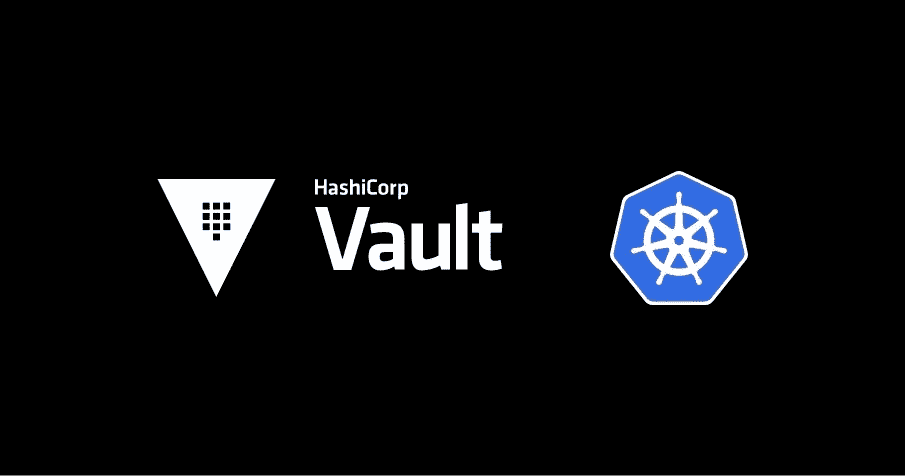
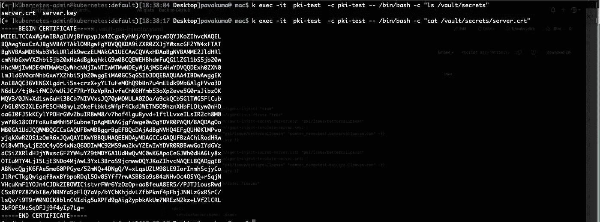

# 使用保险库代理注入器向 K8s Pods 注入 PKI 证书

> 原文：<https://medium.com/nerd-for-tech/pki-certs-injection-to-k8s-pods-with-vault-agent-injector-d97482b48f3d?source=collection_archive---------0----------------------->

使用保管库代理注入器将 PKI 证书动态注入到 Kubernetes Pods

想象你的应用在 Kubernetes 上运行。想象一下，在运行 Pod 之前，你也有一大堆秘密要被拉入 Pod。所以你有一个保险库代理注入器运行并从中提取秘密。啊，太好了。你正在遵循存储和提取秘密的最佳实践。你都准备好了，不是吗？坚持住！！你是如何获得 SSL / TLS 证书的？又是库伯内特的秘密？不要。！为什么我们不用同一个保险库代理注射器？可能吗？是的，为什么不呢。所以你可能已经猜到了这篇文章的内容。在本文中，我们将了解如何使用 Vault Agent Injector 动态生成 PKI 证书并将其注入 Pod。Vault Agent Injector 更改了 pod 规范，以包括使用 [Vault Agent 模板](https://www.vaultproject.io/docs/agent/template)将 Vault 机密呈现到共享内存卷的 Vault Agent 容器。通过将机密呈现给共享卷，pod 中的容器可以在不知道 Vault 的情况下使用 Vault 机密。

注射器是一个 [Kubernetes 突变 Webhook 控制器](https://kubernetes.io/docs/reference/access-authn-authz/admission-controllers/)。如果请求中存在注释，控制器会截获 pod 事件并对 pod 应用突变。该功能由 [vault-k8s](https://github.com/hashicorp/vault-k8s) 项目提供，可以使用 [Vault Helm](https://github.com/hashicorp/vault-helm) 图表自动安装和配置。



# 整个故事是关于什么的？(TLDR)

1.  使用 Vault K8s 注入器生成 PKI 证书。
2.  动态生成 PKI 证书。

# 先决条件

1.  一个库贝内特斯集群(EKS、阿克、金德等)

# 故事资源

1.  GitHub 链接:[https://github.com/pavan-kumar-99/medium-manifests](https://github.com/pavan-kumar-99/medium-manifests)
2.  GitHub 分支: [pki 代理注入器](https://github.com/pavan-kumar-99/medium-manifests/tree/pki-agent-injector)

# 使用舵图安装 Hashicorp 保险库

我们将为金库安装官方头盔图，并手动解封。但是，这不是在生产环境中运行存储库的理想方式。您可能希望使用 KMS 密钥(如果安装在 AWS 中)或谷歌 KMS 密钥(如果安装在 GCP)来解封保险库。

## 掌舵安装 PKI 保险库

一旦安装了 helm chart，您应该会发现创建了一个名为 vault 的有状态集合，还创建了一个名为 **vault-0** 的 pod。但是，pod 未处于就绪状态，这是因为保险库尚未启封。现在让我们通过执行进入吊舱来打开保险库。

vault _ pki _ 开封. sh

让我们理解 init 命令的作用

> *金库操作员 init-key-shares = 1-key-threshold = 1*
> 
> *-key-shares =将生成的主密钥拆分成的密钥份额数。默认情况下是 5 把，需要 3 把钥匙才能打开保险库*
> 
> *-key-threshold =重建主密钥所需的密钥份额数。这必须小于或等于密钥份额。默认为 3。*

# 生成根 CA 和中间 CA

Vault PKI 后端可以生成自己的自签名 CA。但是让我们创建我们自己的 CA，然后将它上传到 vault PKI 中，以签署我们的证书。

我们现在已经生成了我们的证书，现在让我们配置我们的 vault PKI 后端，以将这些证书添加为 CA。我们还必须创建保管库角色以及保管库发布和 CRL URLs。

# 配置保管库的 PKI 后端

让我们一个一个地理解这些命令

> *vault log in $ VAULT _ ROOT _ TOKEN =用于使用根令牌登录 VAULT。*
> 
> *vault secrets enable pki =用于启用 vault pki 后端。*
> 
> *vault secrets tune-max-lease-ttl = 8760h pki =我们将 PKI 后端的 TTL 配置为 8760 小时。*
> 
> *vault write PKI/config/ca PEM _ bundle = @ PEM _ bundle ttl = 8760h =>我们将 CA 证书写入 vault，并将其 TTL 设置为 8760h*

现在，我们已经将 PKI 证书上传到了保险库中。现在让我们创建一个 Vault PKI 角色。角色定义设置生成证书的条件。

一旦创建了角色，我们就应该配置可以颁发和撤销证书的端点。

现在，让我们为相应的 vault PKI 角色创建一个 vault 策略。

# 启用 Kubernetes 身份验证方法

Kubernetes auth 方法可用于使用 Kubernetes 服务帐户令牌对 vault 进行身份验证。这将帮助保管库将保管库令牌注入到 Kubernetes Pod 中。为此，让我们通过 exec 在 pod 中启用 vault Kubernetes 后端，因为必须从 vault pod 中传递 **token_reviewer_jwt** 。

我们现在已经创建了一个 Kubernetes auth 角色。此角色被绑定到服务帐户名 issuer 和名为 default 的命名空间以及先前创建的名为 betttercallpavan_pki 的策略。

```
$ git clone [https://github.com/pavan-kumar-99/medium-manifests.git](https://github.com/pavan-kumar-99/medium-manifests.git) \
-b pki-agent-injector$ cd medium-manifests$ kubectl apply -f pki-pod.yaml
```

使用带有 PKI 证书的 Vault 注入器。

所有注释的列表可以在[这里](https://www.vaultproject.io/docs/platform/k8s/injector/annotations)找到



> kubectl exec-it PKI-test-c PKI-test—/bin/bash-c " ls/vault/secrets "
> 
> ku bectl exec-it PKI-test-c PKI-test—/bin/bash-c " cat/vault/secrets/server . CRT "


现在，您应该可以看到 pod 中的证书和密钥。这就是 PKI 证书可以自动注入的方式，而不需要任何 sidecar 或 init 容器或任何其他额外的更改。因此，每当 pod 重新启动时，证书会自动重新生成并注入到 Pod 中。

**清理**

```
$ git clone [https://github.com/pavan-kumar-99/medium-manifests.git](https://github.com/pavan-kumar-99/medium-manifests.git) \
-b pki-agent-injector$ cd medium-manifests$ kubectl delete -f pki-pod.yaml
```

# 被推荐的

[](/nerd-for-tech/using-hashicorp-vault-as-a-certificate-issuer-in-cert-manager-9e19d7239d3d) [## 在证书管理器中将 Hashicorp Vault 用作证书颁发者

### 在证书管理器中将 vault PKI 后端配置为证书提供商

medium.com](/nerd-for-tech/using-hashicorp-vault-as-a-certificate-issuer-in-cert-manager-9e19d7239d3d) [](/nerd-for-tech/terraforming-the-cost-with-infracost-c28dc6c981c9) [## 用 Infracost 分析地形成本(GitOps 方法)

### 用基础成本分析土地改造成本

medium.com](/nerd-for-tech/terraforming-the-cost-with-infracost-c28dc6c981c9) [](/nerd-for-tech/terraforming-the-gitops-way-9417cf4abf58) [## 地球化吉托普斯之路！！！

### 使用 Atlantis(拉式请求自动化)通过 GitOps 建立 Terraform。

medium.com](/nerd-for-tech/terraforming-the-gitops-way-9417cf4abf58) [](/nerd-for-tech/kubernetes-cluster-autoscaler-in-action-6172a023f542) [## Kubernetes 集群自动缩放器正在运行

### 使用 Kubernetes 集群自动缩放器有效节约成本

medium.com](/nerd-for-tech/kubernetes-cluster-autoscaler-in-action-6172a023f542)