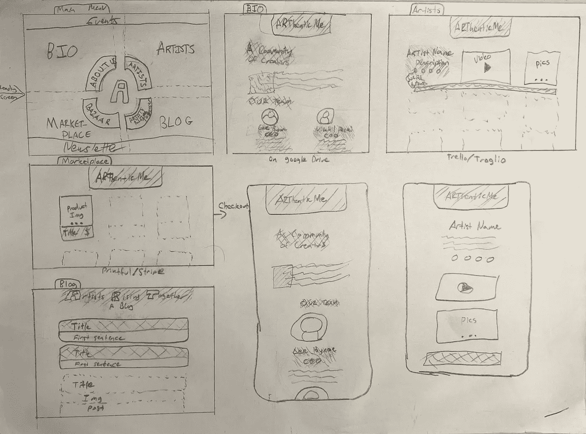
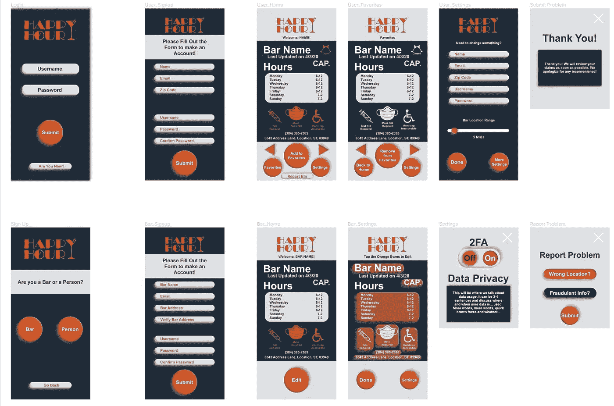

# 放置布局

> 原文：<https://medium.com/nerd-for-tech/placing-a-layout-c7c7149e85a6?source=collection_archive---------3----------------------->

网站的纸质线框[吸引了我](http://www.arthenticme.com)

顺应是第一步，也是最后一步；是我做网站布局时考虑最多的事情。如果设计在特定的屏幕上不起作用，那么就需要彻底检查这个断点。考虑移动优先的方法很重要，因为[超过 50%的互联网用户使用手机](https://www.statista.com/statistics/274774/forecast-of-mobile-phone-users-worldwide/)。

一旦[信息架构图](https://nikhildesigns.medium.com/organizing-information-fbf437d4b7da)创建完成，内容的大小和形状将决定信息的布局。线框应该很快在屏幕上显示出东西的位置。视觉吸引力应该让位于传达物体的位置。关于布局的 UX 定律有助于指导这一过程，例如菲特定律:

> "点击按钮的时间与按钮的距离和大小有关."

这指导了拥有足够大的按钮的原则，这些按钮间隔足够远以至于不会产生冲突的用户响应。说到信号，线框也可以传达不同的用户状态，包括(但不限于)悬停、聚焦和活动。我喜欢在 Figma 制作我的线框，因为添加颜色变得非常容易批量处理。

来自 Figma 的彩色线框；这可以被认为是一个无功能的原型。