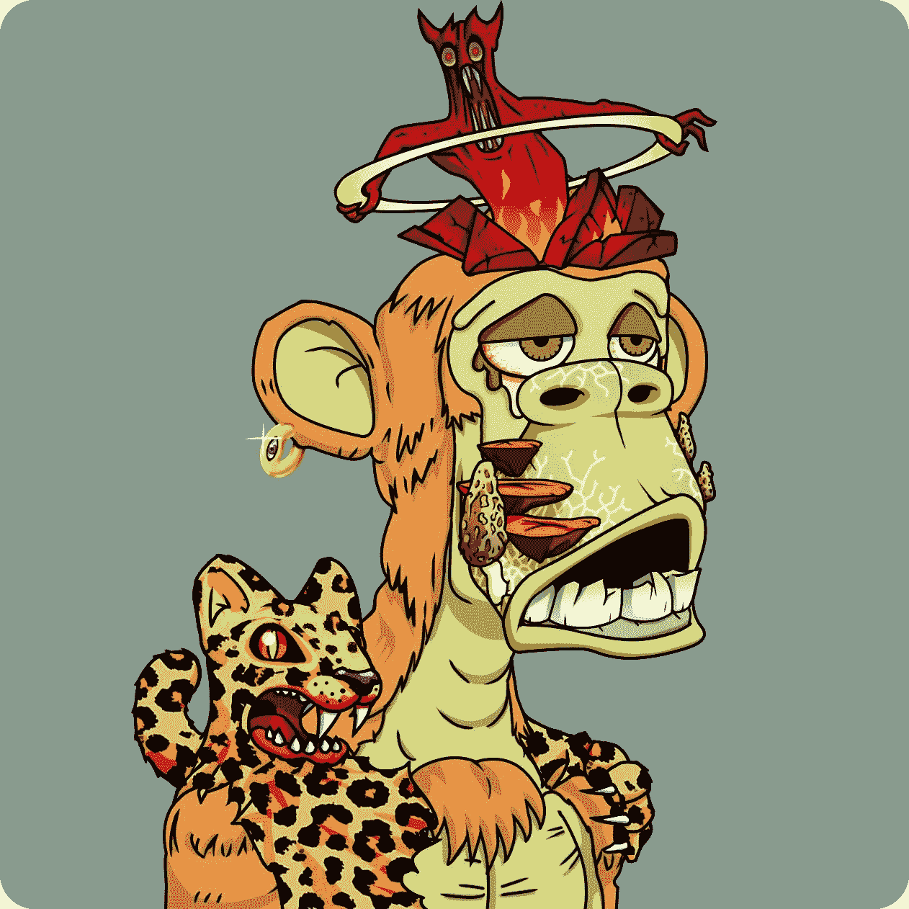

# 人猿星球

> 原文：<https://medium.com/nerd-for-tech/planet-of-the-apes-d495d1224b31?source=collection_archive---------4----------------------->

## 理解 NFT 热

[变异猿游艇俱乐部#22488](https://opensea.io/assets/0x60e4d786628fea6478f785a6d7e704777c86a7c6/22488)

去吧，下载这张图片。它是免费的。

不过，要真正“拥有”这一形象，你必须付出一大笔钱——大约相当于一辆全新丰田车的价格。

唯一的区别？分布式分类账上的一串数字和字母，表示此图像是您的，证明此图像是不可替换的令牌或 NFT。

这是一个名为 MAYC 或变异猿游艇俱乐部的项目——是无聊猿游艇俱乐部的衍生项目——三天前启动。截至今天，MAYC 已经完成了近 2 亿美元的销售额。每张猩猩图片的价格在 2 万到 30 万美元之间，它们正在被抢购一空。猿类正在席卷世界。我们生活在类人猿星球。

虽然灵长类动物仍然是最受欢迎的，但也出现了各种各样的动物衍生品——企鹅、狮子、猫、狗、考拉，只要你能想到的。每天你都会看到像这样的新项目涌现，仅仅从一组计算机生成的图像中就筹集了数百万美元。

NFT 热是艺术和文化新时代的先兆，还是所有泡沫之母？只有时间能证明一切。我们可以肯定的是，世界已经发生了不可逆转的变化。改变消费者的预期极其困难——旧的习惯很难改变，我们天生会对几代人自然选择过程中设定的某些触发按钮做出反应。

然而……在如此短的时间内，NFT 已经完全颠覆了我们对价值、所有权和创造的标准观念。

为什么？他们有什么特别之处？上周，我深入 NFT 兔子洞寻找答案，从那以后，我完全被消耗掉了。

《财富》杂志的这个[标题](https://fortune.com/2021/08/28/rolex-lamborghini-nft-comeback-digital-flex/)试图解释其中的原因。

> 劳力士和兰博基尼已经过时了。NFT 是新的数字“flex”

在这个越来越虚拟的世界里，拥有某些非正规金融工具会给人一种立竿见影的感觉。人类有一种天生的炫耀倾向。由于疫情的原因，在现实世界中没有这样做，人们正在寻找新的方式在网上使用他们的 NFT 收藏和个人资料图片。

一张令人垂涎的 NFT 个人资料照片，比如 crypto 朋克或无聊的猿，可能比劳力士或兰博基尼更具弹性。你不仅仅是穿着或者开着它；NFT 是你在网上的形象和身份。

NFT 也是一个信号，表明你是“群体中的一员”。它就像一张会员卡，让主人可以进入虚拟世界中的专属俱乐部社区。这是一种与志同道合的人建立网络和联系的新方式。有了 NFT，你就可以参与这种新的社交游戏。

说到游戏，购买、投标、拥有和出售 NFTs 的整个体验本身就感觉像一个大游戏。有一种抓住具有一系列特殊稀有属性的 NFT 的兴奋感。把你的 NFT 以目标价格挂牌出售，然后有人把它拿走，这种感觉几乎同样令人兴奋。一些人在交易 JPEGs 时获得了 10 倍、100 倍甚至 1000 倍的回报，造成了市场上巨大的 FOMO。这就像是打了类固醇的股票，它挠了人们可能有的赌痒。

当然，也有真正关心艺术的收藏家，新的数字赞助人，他们将 NFTs 视为支持艺术家和联系创作者的新方式。NFT 革命要真正开花结果，最终将取决于这些中坚分子。如果没有他们，这种狂热可能会演变成一场投机性的音乐椅游戏，可能会失去控制并内爆。

NFTs 的大奖是元宇宙——互联网的下一个阶段。购买 NFT 是一场赌博，我们有一天会在虚拟世界中以数字化身的身份度过大部分时光。这是一个打赌，人们会想拥有自己最酷的数字表现，并愿意为此花大价钱。

随着 NFTs 的兴起，世界开始变得更像一个视频游戏。现实世界和虚拟世界之间的界限越来越模糊，就像免费物品和昂贵物品之间的界限越来越模糊一样。从表面上看，这些都没有意义，但是当我们将 NFT 视为数字劳力士、高级赌场筹码和高级俱乐部会员时，它就开始变得有意义了。图像中的艺术本身几乎只是一个意外收获。

观察这一领域的发展将会非常有趣。现在回到浏览 Opensea 寻找下一个我可以模仿的 NFT。