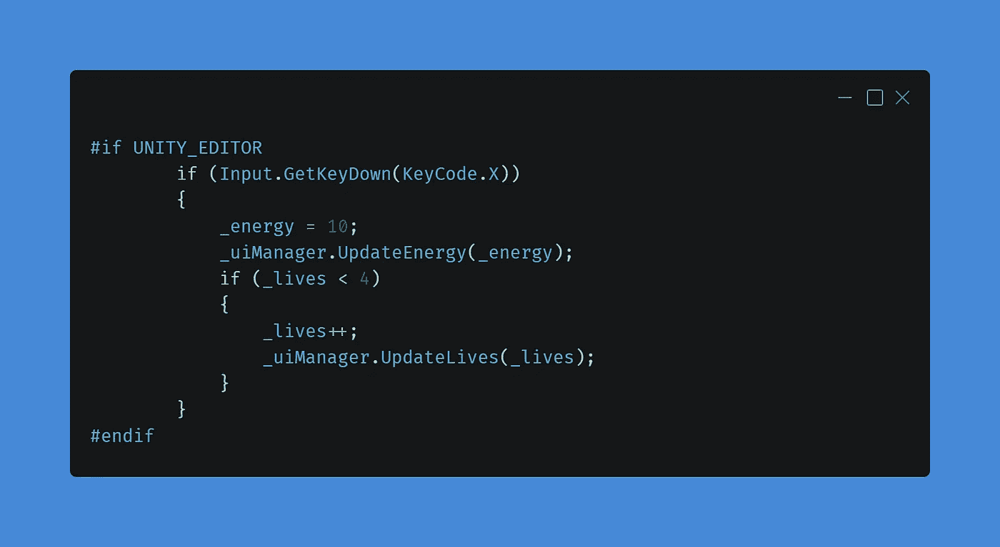

# 平台相关编译

> 原文：<https://medium.com/nerd-for-tech/platform-dependent-compilation-371c523f30dd?source=collection_archive---------25----------------------->

学分:RubyMotion

当我写第二次火力增强的文章时，我需要一种不玩很长时间来获得足够能量的方法来测试武器。我决定在游戏中实现我的第一个“作弊”，但这只是为了测试的目的，但我也不想让这个作弊在我的任何版本中出现。我想过用一些 bool 来检查“作弊模式”是否是真的，但在这一点上，我不想再次经历这一切，想起在我的第一个 Unity 游戏中使用(或忘记使用)这种检查的恐怖。

# 背景故事激活

当我刚进入游戏开发和 unity 的时候，我必须运用我所掌握的知识来完成我的工作。当我在努力开发一个为 WebGL 和 mobile 开发的游戏时，如果它是一个移动版本，我必须将 bool 设置为 true。我用它来激活或关闭移动控件，有时我会忘记检查移动构建的 bool，不得不重新构建项目。

你看，我不想再次犯那些过去的错误，忘记设置布尔为真或假，允许作弊进入游戏。作为游戏开发人员或软件工程师，我们被教授解决问题的技巧，这是我必须解决的问题，所以我跳进了谷歌的兔子洞来寻找我的问题的解决方案。

我在 Unity 文档中发现了一个名为“[平台相关编译](https://docs.unity3d.com/Manual/PlatformDependentCompilation.html)”的东西，它的作用是你可以阻止或允许你的代码的某些部分编译，这取决于你分配给代码片段的参数。这真的引起了我的兴趣，我做了更多的挖掘，找到一些人们使用它或询问它的文章和论坛，以获得更清晰的图片。

# 那么它是如何工作的呢？

Unity 有一系列平台定义指令。它们几乎就像布尔值，但它们是由 unity 创建的，并且根据您所在的平台设置为真或假。如果你在一个特定的平台上，想要编译你的代码的某些部分，或者停止代码的编译，这是非常有用的。

在我的例子中，当我在编辑器中测试时，我想运行一些作弊按钮，但不希望这些代码在我的任何构建中编译，不管平台如何。

有一个名为“UNITY_EDITOR”定义引起了我的注意。这个函数解释说这个指令是从你的游戏代码中调用 Unity 编辑器脚本。这是我需要的。我只希望在编辑器中测试时作弊功能能够正常工作。

# 实现 Define 指令

在我的 Fire()函数的播放器脚本中，我有另一个 if 语句来检查我是否按下了 x 键来将能量棒填充到最大，如果我没有足够的生命，它会给我一个额外的生命。这对我来说很重要，因为我的次级火焰消耗了 10 点能量和 1 点生命。

我首先在“if(输入”的正上方添加了“#if UNITY_EDITOR”。GetKeyDown(KeyCode。x))”，并在右括号后添加了“#endif”。不幸的是，第一次实现它时，我在不正确的括号下面添加了“#endif ”,这在我运行测试构建时中断了我的游戏。因此，我建议您小心实现这些已定义指令，并仔细检查您的代码。

# 结论

对我来说，这开启了一个在构建跨平台应用或游戏时提高代码性能的全新世界。如果你正在开发一个移动或 PC 游戏，并希望移动控件在 Android 或 iOS 版本上有效，但在 PC 上不可见，那么你可以使用像“UNITY_IOS”和“UNITY_ANDROID”这样的定义指令。

我希望你喜欢今天这篇短文，并学到了一些新东西。我喜欢学习新的做事方法，喜欢与世界分享我的新知识。