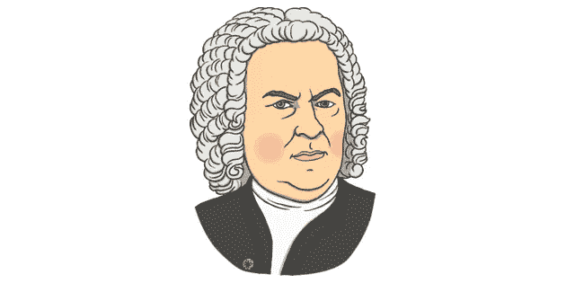

# 演奏巴赫:让一个神经网络为你演奏。第一部分。

> 原文：<https://medium.com/nerd-for-tech/play-bach-let-a-neural-network-play-for-you-part-1-596e54b1c912?source=collection_archive---------14----------------------->

我不知道如何演奏音乐。但是我仍然可以玩音乐。



来源 twinlk.com

这一切都始于一个长久的遗憾。我小时候，父母没有给我上过音乐课。

所以我不知道如何玩音乐，但我仍然可以玩音乐。

怎么会？我的想法是用深度学习自动生成音乐。这首音乐将受到某个作者的启发，希望听起来有趣。

即使生成的音乐将类似于实际作曲家的音乐，它也将基于我个人对深度学习的神经网络的调整，因此将是独特的。那样的话，也是我自己的音乐。

所以是时候对神经网络进行一些修补了。

我选择巴赫作为我的沙盒，因为我非常喜欢他的音乐，我希望它有一些潜在的数学结构，神经网络应该能够利用这些结构。

> 这是一系列文章的一部分，这些文章将探讨该项目的许多方面，包括静态 MIDI 文件生成、实时流、Tensorflow/Keras 顺序和功能模型、LSTM、过拟合和欠拟合、注意机制、嵌入层、多头模型、概率分布、向 TensorflowLite 的转换、TPU/硬件加速器的使用、在多个平台(Raspberry PI、edge 设备)上运行应用程序等。

参见第二部分。[第三部](/nerd-for-tech/play-bach-let-a-neural-network-play-for-you-part-3-9f59c9a5d57f)。[第四部](https://pboudalier.medium.com/play-bach-let-a-neural-network-play-for-you-part-4-aec253deb385)。

github 上有完整的代码

生成音乐的第一个例子。更多内容将在下一篇文章中介绍

# 一句话(或两句话)的深度学习

本质上，深度学习是一个神奇的黑匣子，它将输入数据转换为关于数据中包含的“某些东西”的预测。被打死的例子:输入数据是一张图片，预测是:‘这是狗还是猫？’(好像有人在乎似的)

首先，人们必须通过输入许多许多“例子”(例如，数千、数万、数百万张狗和猫的图片)来“训练”网络。在训练过程中，网络会自动配置其内部参数，以越来越好地“猜对”。这个阶段需要大量的训练数据和大量的计算能力。

一旦训练完成，神经网络只不过是几百万、几十亿个参数，巧妙地组织起来。

然后奇迹发生了。如果一个人给网络提供一张新的猫的图片(一张从未用于训练的图片)，网络应该/将会猜对它。该模型能够将新数据概括为新数据。网络中的数十亿个参数一起工作，计算出一张图片，上面有两个向上的三角形(耳朵)，中间有两个圆圈(眼睛)，还有一系列水平线(胡须)，看起来像一只猫。

这个网络只是一堆数字，对猫是什么完全没有理解或“意识”。它查看图像中的像素，并将它们与从大量训练示例中学习到的模式进行比较。

# 我们将建造什么

我们的深度学习应用程序将使用原始音乐的片段作为输入(巴赫创作的一系列音符)，并将被训练来预测接下来应该是什么音符。

最终结果将是几秒钟的原创音乐，后面跟着一串自动生成的音符。会好听吗？奇怪吗？无趣吗？无聊？WTF？我们会看到的。

# 电脑是如何表现音乐的？

如你所知，(如果你没有，没问题，你现在有了)，神经网络要求训练数据用数字表示。

对于图片来说，这不是问题，已经用一串数字表示了(每个像素是 3 个数字，即红色、绿色和蓝色的强度)。对于其他类型的输入，比如文本，每个单词都可以很容易地转换成数字(所有可能单词在字典中的索引)。但是音乐呢？

在计算机世界里，音乐可以用不同的方式表现:

*   传统的音频格式(如. mp3，.wav，。高射炮火等。).这本质上是空气传播声音时振动方式的一种表现。这种空气振动(声波)被转换成电波(使用麦克风)，这种电波被表示为一组数字(采样)。
*   [MIDI](https://en.wikipedia.org/wiki/MIDI) :这是一种“计算机”语言，其中每个音符都由一个整数(MIDI 代码)表示。因为在 MIDI 格式中，音乐已经用数字编码了，所以让我们把它用于我们的神经网络。


MIDI 表。注 A4 的 MIDI 代码为 69。

公共领域的 MIDI 音乐可以很容易地在网上找到。MIDI 文件的扩展名为. mid。

# 对我们的目的有用的一些非常基本的音乐概念(非常简化)

音乐由**音符组成。**每个音符都是给定频率的空气振动。例如，在上面的 MIDI 表中，音符 A4 对应于 440 赫兹的空气振动，由 MIDI 代码 69 表示。

每个音符都有许多特征，其中包括频率(也称为音高)、持续时间、音量..等等..A4 是**音符的音高**。

几个世纪以来，在不同的地理区域，音符的音高有不同的写法。我们将使用盎格鲁-撒克逊符号。C，C#，D，D#，E，F，F#，G，G#，A，A#，b。

在我的祖国法国，音符被写成 Do，re，Mi，Fa，Sol，La，Si。这是有历史背景的，但这太离题了。随意参考 [*这篇*](https://en.wikipedia.org/wiki/Solf%C3%A8ge) *。*

音符以八度音阶排列。**一个八度**是一系列频率递增的 12 个音符(如上图所示，从 C 到 B 共有 12 个音符)。

如果你对 Oct 的意思是 8，一个八度有 12 个音符感到困惑，不要担心，这一切都有很多历史背景。

一个八度相当于两倍的频率。例如:八度音阶 5 (A5)中的音符 A 的频率为 880 赫兹。它是 A4 的两倍频率(八度 4 中的音符 A)

多个音符可以一起演奏。这是一个**和弦**。沉默是一种特殊的东西。这被称为**休息**。

音符(或和弦或休止符)可以演奏得更长或更短。这是**持续时间。**有些乐器可以永远演奏一个音符(风琴)，而在其他乐器的情况下，比如小提琴，音符会衰减。

最后，一个音符(或和弦)可以放得更大声或更柔和。体积的别称是**速度。**

# 让音乐在我们的神经网络中流动

现在，让我们建立一个只关注音高的网络。我们将在本系列的下一篇文章中讨论持续时间和速度以及许多其他方面。

下面是一段音乐，即一系列音符、和弦(用句号分隔的多个音符)。比如 A2。G#3 ')和 Rest ('R '):

## “B2”、“A2”、“G2”、“F#2”、“E2”、“D2”、“R”、“C#2”、“A2”。“G#3”，“E3”，“F#3”，“G3”，“F#3”，“G3”。A4 '

我们将训练我们的深度学习网络来预测一个**序列**的下一个元素。以下是 3 个训练样本:网络输入由 5 个音符/和弦的序列组成。我们希望网络学习和预测的是序列中的下一个元素:

```
‘B2’, ‘A2’, ‘G2’, ‘F#2’, ‘E2’ => D2‘A2’, ‘G2’, ‘F#2’, ‘E2’, ‘D2’ => R‘G2’, ‘F#2’, ‘E2’, ‘D2’, ‘R’ => C#2
```

在实际代码中，输入序列更长(40 个音符/和弦),以捕捉数据中足够的“结构”,我们使用数千甚至数百万个训练样本。

一旦一个网络被完全训练好(在下一篇文章中有更多关于这个概念的内容)，它就可以被用来根据现实生活中的数据进行预测(一个预测被称为一个**推理**)。在我们的例子中，一个推论看起来像这样:

*   从一系列音符开始，通常从真实的 MIDI 文件中提取
*   将序列输入神经网络。它将为下面的音符/和弦生成预测
*   用移位更新输入序列
*   以上只要你在乎就去做…

例如:

```
input: ‘B2’, ‘A2’, ‘G2’, ‘F#2’, ‘E2’ and get xx as predictioninput: ‘A2’, ‘G2’, ‘F#2’, ‘E2’, ‘xx’ and get yy as predictioninput: ‘G2’, ‘F#2’, ‘E2’, ‘xx’, ‘yy’ and get zz as prediction
```

最后，播放 B2 '，' A2 '，' G2 '，' F#2 '，' E2 '，' xx '，' yy '，，…..这是你自己生成的音乐。

如果网络训练正确，音乐应该听起来很熟悉，但它不会是训练集的精确副本。网络总是会引入一些变化，随机性，这使得整个过程有趣(嗯..我猜你可以称之为有趣)。

在下一篇文章中，我们将构建实际的深度神经网络，它将看起来像下面的东西。敬请期待！！！！


这将变得非常清楚…