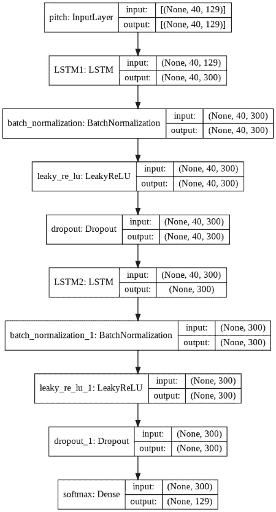
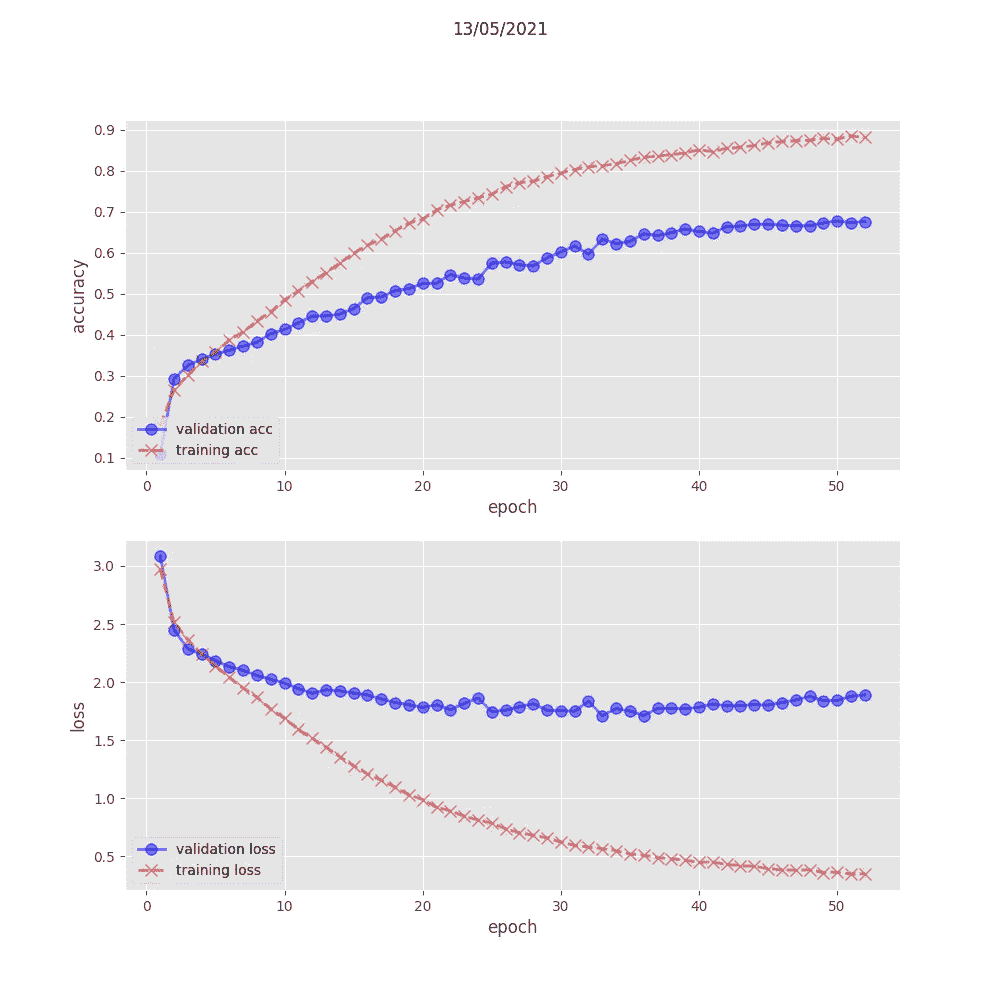

# 演奏巴赫:让一个神经网络为你演奏。第二部分

> 原文：<https://medium.com/nerd-for-tech/play-bach-let-a-neural-network-play-for-you-part-2-3ee01b729057?source=collection_archive---------22----------------------->

我不知道如何演奏音乐。但是我仍然可以玩音乐。

> 这是一系列文章的一部分，这些文章将探讨该项目的许多方面，包括静态 MIDI 文件生成、实时流、Tensorflow/Keras 顺序和功能模型、LSTM、过拟合和欠拟合、注意机制、嵌入层、多头模型、概率分布、向 TensorflowLite 的转换、TPU/硬件加速器的使用、在多个平台(Raspberry PI、edge 设备)上运行应用程序等。

参见第一部分。[第三部。](/nerd-for-tech/play-bach-let-a-neural-network-play-for-you-part-3-9f59c9a5d57f)

完整的代码可以在 github 的[上找到](https://github.com/pabou38/play_bach)

让我们来看看准备数据和训练第一个神经网络的过程。

接受戈德堡变奏曲的训练。用小号演奏

# 数据。

第一步是获取一些你最喜欢的作曲家的 MIDI 文件。然后你可以使用 [Music21 python 库](https://web.mit.edu/music21/)从那些 MIDI 文件中提取一系列音符。

为了这个教程，我选择了大提琴独奏 [***组曲***](http://www.jsbach.net/midi/midi_solo_cello.html) ***，BWV 1007 到 1012*** (我爱巴保罗·卡萨尔斯)

这个语料库总共有 32487 个音符/和弦/休止符*(前 10 个元素的示例:['G2 '，' R '，' R '，' D3 '，' B3 '，' A3 '，' B3 '，' D3 '，' B3 '，' D3'])* 和 129 个**唯一的**音符/和弦*(前 5 个的示例:['A2 '，' A2)。F#3 '，' A2。F3 '，' A3 '，' A3。B3'])*

正如您所记得的(参考。第 1 部分)，神经网络只接受数字作为输入。把音符/和弦转换成整数的一个简单方法是创建一个字典，比如(' A2 '，0)，(' A2。F#3 '，1)，(' A2。F3 '，2)，(' A3 '，3)，(' A3。B3》，4)等。在该序列中，音符 A2 由整数 0 表示，和弦 A2。f '除以整数 1，依此类推…

下一步是将语料库转换成实际的训练数据。训练样本是一系列(n+1)个音符。我使用 n=40，稍后会解释原因。因此，从我的 32487 个元素的语料库中，我获得了 32447 个训练样本的列表。每个样本是 40 个整数(40 个音符)的列表，后跟一个整数(第 41 个音符)。

列表是 python 对象，但是神经网络想要被喂以**张量**。把张量想象成一个多维的数字矩阵。将列表转换成张量的过程称为**向量化**。一旦完成，张量就可以输入网络进行训练。

*作为补充说明:神经网络允许张量处理中的大量并行性，并且一种计算架构针对张量进行了优化:* [*GPU*](https://en.wikipedia.org/wiki/Graphics_processing_unit) *，又名图形处理单元，又名您的优秀老玩家显卡。如果你没有图形处理器，就别想训练什么像样的网络。在通用 CPU 上训练，即使是最快的 CPU，也是无法忍受的*

# 我们的第一个模型。

深度学习中的‘深度’一词是指一个神经网络是一个层的堆叠，有很多层(是一个很深的堆叠)。

下图描绘了我们的第一个模型的堆叠。

我们的神经网络由四种类型的层组成:

*   输入层:在堆栈的顶部，这一层“接收”训练数据(张量)。[None，40，129]表示网络期望输入张量是 40 个数字的序列，每个数字是 1 到 129 之间的值。这就是我们准备训练数据的方式，所以一切都很好。无意味着网络不关心有多少样本可用(在我们的例子中是 32447)
*   输出层(称为 softmax)是底层。(无，129)意味着，给定一个输入张量(40 的序列)，网络将预测第 41 个，这可以是 1 到 129 之间的任何值(即网络知道的任何音符/和弦)。
*   处理层:在这种情况下，他们是 [LSTM](https://en.wikipedia.org/wiki/Long_short-term_memory) ，又名长期短期记忆(如果人类也有这样的处理层不是很好吗？).我们的堆栈中有两个 LSTM 层。可以说 LSTMs 专门从 ***序列中学习。***
*   正常化、ReLU、辍学形式的一些白色魔法。这些层基本上确保了网络在训练期间不会失控。

LSTM 层的数量(在我们的例子中是 2)和它们的大小(300)被称为**超参数**。这些超参数的设置是你自己的，没有固定的规则。这是你的技能，你的直觉。这是一个反复试验的过程。只要找到一个配置，给出好的结果，不需要花费时间来训练。

通过这种配置，我们的神经网络包含 1，278，429 个内部变量。这超过了一百万，但在深度学习领域，这仍然是一个非常小的数字。这些变量是随机初始化的，训练的魔法是调整它们，这样，在最后，它们共同识别出一只猫和一只狗，或者在我们的例子中，给定前 40 个音符，预测第 41 个音符。

# 用数据训练模型。

训练过程是一个循环:

*   获取一个训练样本(40 个整数，代表 40 个音符)，并将其转换为张量
*   将该张量输入模型(即输入层)
*   神经网络随后将执行大量张量运算，这涉及到内部变量；最后，网络将生成第 41 个音符的预测(在它知道的 129 个音符/和弦中)。
*   然后，训练过程将查看网络是否正确，即预测是否是实际的第 41 个音符。*将此步骤视为计算网络预测和“基本事实”之间的“误差”,我们知道这一点，因为在训练期间，我们知道第 41 个音符的真实值。*
*   如果不正确，算法会调整内部变量，以便下一次将相同的张量呈现给网络时，网络的预测将最接近事实，即误差将更低(形式上更低，这里有一个定理)。当然，在训练开始时，网络是正确的可能性为零(记住计算是基于随机初始化的内部变量)。
*   令人作呕地重复

没什么更多的了。

实际上，这种做法略有不同，但原理是相同的:

*   网络通常一次被馈送许多训练样本。这叫做**(如 64 个样本)*。误差计算和内部变量调整算法在每个批次后运行。*
*   *当所有可用的训练样本都被输入后，然后…重新开始。一个这样的周期被称为一个 ***时期。****
*   *当误差“足够小”或者在每个历元之后没有显著减少时，训练停止(不需要浪费计算资源)。*
*   *你(人类)实际上是去喝杯咖啡，而你的 GPU 将电能转化为热能。*

*最后，网络将具有利用可用训练样本以及网络架构和超参数的选择所能实现的最低可能误差。这 120 万个变量的值就是训练好的网络。*

# *捕捉，以及如何观看你的模型。*

*在每个批次/时期后，误差在数学上减少？看起来好得难以置信。是的，这里有一个陷阱。网络只会在处理**训练样本时变得更好。**不能保证网络在其他输入上有良好的性能(参见第 1 部分关于泛化)。*

*因此，目标是确保网络对训练集之外的输入(即“看不见的输入”)表现良好(低误差、准确预测)。*

*为了检查这是否实际发生，可用的训练数据被分成 3 组:*

*   *“**训练集**”:批量数据，用于实际训练。这个集合将被网络一批接一批、一个接一个地“看到”。*
*   *“**验证集**”:不用于内部变量调整算法*(我无意中说漏了嘴，这个算法叫做随机梯度下降和使用偏导数代数)*，而是用于计算每个历元之后的误差/精度。因此，验证集上的误差演变是训练是否进展顺利的良好指示。*
*   *“**测试集**”:从未在训练期间使用，但用于计算完全训练的模型的性能。在某种程度上，测试集是用来给模型“惊喜”的，因为模型在训练期间根本没有机会“适应”这些数据。一旦投入运行，它就是模型性能的最佳代理。*

*查看下图，了解训练的情况(错误的别称)，特别是**准确度**图(准确度是网络预测正确的时间百分比的度量)。*

*该图的纵轴是训练集和验证集的准确度；图表的横轴是纪元。正如预期的那样，训练集的准确性(自动)提高了。要监控的是验证集的准确性。在我们的例子中，在大约 50 个时期后，它增加并稳定在大约 60%的准确度。60%是该模型的最大精度，不值得计算更多的历元。*

**

*注意，60%的准确率意味着网络**确实了解了**一些东西。有 129 个可能的输出，如果网络是随机猜测的，它将是正确的 1/129，即 0.7%的时间，而不是 60%。*

*如果 60%的准确率不够好，那么回到你的模型架构，回到你选择的超参数，获得更多更好的训练数据…再试一次。*

*在下一节中，我们将看看在训练过程中可能出错的地方，以及如何使用训练好的模型来生成实际的音乐。*

*敬请期待！！！！*

**——————如果你对细节不感兴趣，就不要越过这条线——————**

*这是定义我们模型的实际张量流代码。*

*第 1 行到第 16 行描述了我们深度学习模型中的各个层。*

*然后，在第 18 到 22 行，选择一些特定的算法用于训练:*

*   *如何用数学方法计算误差*
*   *使用什么方法来调整内部变量(在我们的例子中是“adam”，这是一个算法的名字，还有许多其他的)*
*   *训练算法应该计算什么度量(它总是计算损失，并且我们也想要准确性)*

*“编译”指令创建模型。Is 还没有经过训练。你将在下一部分看到这一部分*

*那么，越界值得吗？*