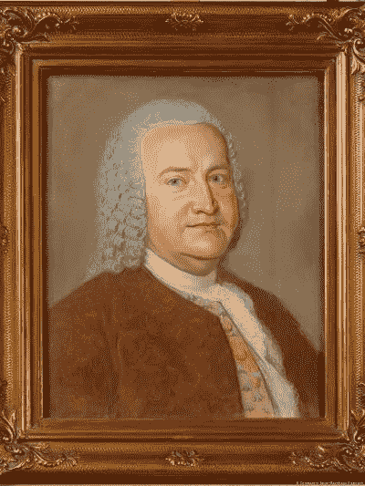
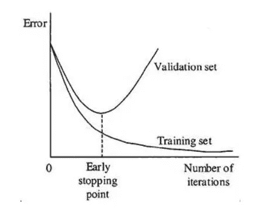

# 演奏巴赫:让一个神经网络为你演奏。第三部分。

> 原文：<https://medium.com/nerd-for-tech/play-bach-let-a-neural-network-play-for-you-part-3-9f59c9a5d57f?source=collection_archive---------13----------------------->

我不知道如何演奏音乐。但是我仍然可以玩音乐。



*这是一系列文章的一部分，这些文章探讨了该项目的许多方面，包括静态 MIDI 文件生成、实时流、Tensorflow/Keras 顺序和功能模型、LSTM、过拟合和欠拟合、注意、嵌入层、多头模型、概率分布、向 TensorflowLite 的转换、TPU/硬件加速器的使用、在 Raspberry PI 上运行推理等。*

参见[第一部分](/nerd-for-tech/play-bach-let-a-neural-network-play-for-you-part-1-596e54b1c912)。[第二部](/nerd-for-tech/play-bach-let-a-neural-network-play-for-you-part-2-3ee01b729057)。[第四部分](https://pboudalier.medium.com/play-bach-let-a-neural-network-play-for-you-part-4-aec253deb385)。

# 培训过程中可能会出现什么问题？

在第[部分](/nerd-for-tech/play-bach-let-a-neural-network-play-for-you-part-2-3ee01b729057) 2 中，我们研究了验证损失如何随着网络的训练而演变。

但是你的第一次神经网络训练很可能看起来像下面这样。为什么？



过度拟合

在网络容量和训练样本的数量之间需要找到一个平衡点。不平衡会产生如上所示的曲线类型。

**容量**定义为模型中变量的数量(在我们的例子中为 120 万个),由我们选择的超参数产生。变量越多，网络的“自由度”就越大。如果与训练样本的数量相比，容量太高，网络可能会“记住”训练集，并擅长根据训练集进行预测，但当它被给予训练集之外的输入时就会失败。无法一概而论。它没有学习，而是简单地记住了训练集。

这被称为**过拟合**并在上图中描述为。验证集上的错误的演变不跟随训练集上的错误的进展。

在训练模型时，防止过度拟合是一个典型的问题。这可以通过以下方式实现:

*   通过调整超参数，确保网络与可用的训练数据相比没有太大的容量。
*   使用一些技术，比如 Dropout(记住，它是我们模型中的一个层— [参见本系列的第 2 部分](/nerd-for-tech/play-bach-let-a-neural-network-play-for-you-part-2-3ee01b729057))。Dropout 随机“中和”模型的一些变量，以确保网络不会变得“懒惰”，并最终“记住”训练集*(这里有很多拟人化的说法)。*
*   获取更多训练数据。

另一方面，如果容量太低，网络就没有办法学到任何有用的东西。这被称为**欠拟合**。在这种情况下，准确性可能不会比随机猜测好多少。

试错法、经验、直觉和一个好的 GPU 是你在欠适应和过适应之间导航的朋友

# 运行实际训练

这个应用程序是用 python 写的，在 github 上有[。它使用两个密钥库:](https://github.com/pabou38/play_bach)

*   [深度学习的 Tensorflow](https://www.tensorflow.org/)
*   [Music21](https://web.mit.edu/music21/) 用于音乐分析

以下是应用程序的关键文件和目录:

```
***In DEEP/music21/:*****models***: directory for trained model and generated MIDI files* **training***: directory containing midi files*  **play_bach.py** *: main python script. Performs both training and inference* **my_model.py** *: TensorFlow model definition* **my_midi.py** *: MIDI file creation* **config_bach.py** *: configuration parameters* **log_play_bach.log** *: created at each run*
```

在运行培训之前，让我们回顾一下 config_bach.py 中的一些配置参数:

```
*seqlen=40 # length of input sequence
epochs=70 # training will stop earlier if accuracy not improving
batch=64 # power of 2
concatenate = False
normal = False
model_type=1**app='cello'*
```

*model_type =1* 就是使用我们在第 2 部分看到的[的模型架构。在以后的文章中，我们将着眼于更复杂的架构。](/nerd-for-tech/play-bach-let-a-neural-network-play-for-you-part-2-3ee01b729057)

*normal = False* 表示和弦用八度音程信息编码。当等于 *True* 时，一个和弦中的所有音符都被假定为同一个八度音阶(#4)。正常模式以丢失八度音程信息为代价，减小了输出层的大小。当模型变得非常大时，可以使用这个。比如:当正常=假和弦 A4。G5 被认为不同于和弦 A5。G5 和当 normal=True 时，它们是相同的，即 A.G

*concatenate = False* 表示我们只预测音符的音高。如果为 True，还会预测音符的持续时间。我们将在以后的文章中讨论持续时间的预测。

*app* 是你为你的语料库选择的一个名字。例如如果 app='cello '，cello midi 文件应该存在于***training****目录中，由此产生的训练模型将存储在 ***models*** 目录中，命名为***cello 1 _ NC _ mo***(cello，模型类型 1，无串接，多个八度)。同样，生成的 midi 文件将被命名为***cello 1 _ NC _ mo . mid .****

*序列长度、批量大小、时期数是我们已经在第 2 部分中描述过的超参数。*

*要开始训练，从 music21 目录执行“python -m play_bach.py -l 0 -f -pm”。*

# **python-m play _ Bach . py-l 0-f-pm**

```
***l 0** is to create a new model (we could also load an already partially trained model and resume training).**f** is to **Fit** the model, i.e. to train it.**pm** is to run predictions on the trained model and create a MIDI file.*
```

*您将看到一些张量流轨迹，显示模型精度如何逐代发展:*

```
**Epoch 00030: val_accuracy* ***improved******from 0.61535 to 0.61721****, saving model to /content/drive/My Drive/DEEP/music21/checkpoint/cp-030.ckpt
Epoch 00031: val_accuracy* ***improved******from 0.61721 to 0.64238****, saving model to /content/drive/My Drive/DEEP/music21/checkpoint/cp-031.ckpt
Epoch 00032: val_accuracy* ***did not improve from 0.64238*** *Epoch 00033: val_accuracy* ***improved******from 0.64238 to 0.65458****, saving model to /content/drive/My Drive/DEEP/music21/checkpoint/cp-033.ckpt**
```

*过了一段时间，准确度不再提高。训练会在这个高原停止。瞧吧..*

```
**Epoch 00057: val_accuracy* ***improved from 0.73717 to 0.74128****, saving model to /content/drive/My Drive/DEEP/music21/checkpoint/cp-057.ckpt
Epoch 00058: val_accuracy* ***did not improve from 0.74128****.
Epoch 00059: val_accuracy* ***did not improve from 0.74128*** *Epoch 00059: early stopping fit ended.
model fitted in 709 sec for 70 configured epochs , and 59 actual epochs**
```

*如前所述，我们监控验证集的准确性，而不是训练集。在上面的例子中，我们指定了最大 70 个时期，但是验证精度在 59 个时期后停止提高，我们得到了 74%的精度。*

# *播放生成的 MIDI 文件*

*一个快速的互联网搜索将返回多个应用程序来播放 MIDI 文件(如 VLC)。你需要一个[声音字体](https://member.keymusician.com/Member/FluidR3_GM/index.html)。*

*MIDI 文件只包含音符的代码。它不会告诉你音符是来自钢琴还是小叮当。 **SoundFont** 用于渲染许多乐器的 MIDI 代码:我的可以做掌声、直升机、枪声，但更有趣的是，许多乐器我都没听说过。*

*MIDI 文件生成的乐器选择是一个配置参数，位于 config_bach.py 中*

```
*my_instrument = instrument.Clavichord()*
```

*当然，为了好玩，你可以尝试不同于原始音乐中使用的乐器。*

*在下一篇文章中，我们将不得不决定从这里向何处去:*

*我们可以改进用户界面，或者探索不同的模型架构，或者查看当前的性能和改进它的方法，或者在各种平台上运行应用程序，或者使用专用的机器学习硬件，或者将应用程序放在 web 上，或者构建 docker 容器…*

*希望我们最终能做到这一切*

*与此同时，敬请关注！！！*

**——————如果你对细节不感兴趣，就不要越过这条线——————**

*[在第 2 部分](/nerd-for-tech/play-bach-let-a-neural-network-play-for-you-part-2-3ee01b729057)中，我提到输出层会预测一个 1 到 129 之间的数字，因为我们的大提琴语料库中有 129 个唯一的音符/和弦。*

*这有点过于简单化了。*

**

*更确切地说，输出层是 max 的 S *，它是一个由 129 个数字**组成的数组，其和构造为 1。**它以概率(或置信水平)的形式表达模型的预测。**

*例如，在下面的例子中，所有这些数字都很小，只有一个例外(其值为 0，98)。这就是模型所说的“我非常确定下面的音符是音符编号 102 (102 是 softmax 数组中值 0，98 的索引)*

```
**softmax_array([6.08105147e-05, 3.24967942e-07, 2.74516833e-06, 2.47346634e-05, 7.15374142e-08, 1.58419255e-06, 1.47027833e-06, 2.51121264e-07, 3.34257456e-05, 1.54934426e-07, 7.13374334e-07,
....
7.70791473e-07, 2.17805621e-07, 3.28565389e-03, 1.46220991e-08, 2.45054448e-08, 1.74178112e-08, 2.71401427e-06,* ***9.83197570e-01,*** *4.78140656e-08, 1.69292580e-08, 2.30138676e-06, 2.89644220e-07,
....
2.28157023e-06, 6.47835404e-05], dtype=float32)**softmax_array[102] = 0.98319757**
```

*所有唯一音符/和弦列表中的索引 102 是‘G # 2’。这就是模型预测！！！*

```
**list_of_all_unique_note-chord: [‘A2’, ‘A2.F#3’, ‘A2.F3’, ‘A3’, ‘A3.B3’, ‘A3.F#3’, ‘A4’, ‘A4.G#4’, ‘B-2’, ‘B-2.E3’, ‘B-2.G#3’, ‘B-2.G3’, ‘B-3’, ‘B-3.D3’, …]**list_of_all_unique_note-chord[102]: ‘G#2’**
```

*如果 softmax 数组中的最高值没有明显高于所有其他值，这意味着模型没有真正的线索(因此您也没有任何线索)*

*那么，越界值得吗？*