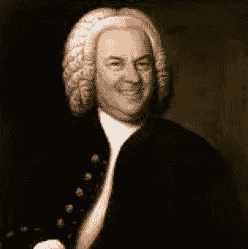
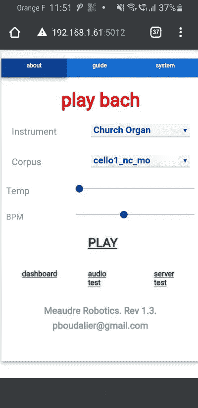
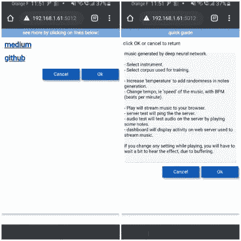

# 演奏巴赫:让一个神经网络为你演奏。第四部分

> 原文：<https://medium.com/nerd-for-tech/play-bach-let-a-neural-network-play-for-you-part-4-aec253deb385?source=collection_archive---------7----------------------->

我不知道如何演奏音乐。但是我仍然可以玩音乐。



来源[wfmt.com](https://www.wfmt.com/2017/05/31/composers-smile/)

> 这是一系列文章的一部分，探讨了该项目的许多方面，包括静态 MIDI 文件生成、实时流、Tensorflow/Keras 顺序和功能模型、LSTM、过拟合和欠拟合、注意机制、嵌入层、多头模型、概率分布、向 TensorflowLite 的转换、TPU/硬件加速器的使用、在多个平台(Raspberry PI、edge 设备)上运行应用程序……

参见[第一部分](https://pboudalier.medium.com/play-bach-let-a-neural-network-play-for-you-part-1-596e54b1c912)。第二部分。[第三部](/nerd-for-tech/play-bach-let-a-neural-network-play-for-you-part-3-9f59c9a5d57f)。

github 上有完整的代码

到目前为止，我们已经生成了一个 MIDI 文件，并在我们的桌面上播放了它。有点无聊？

让我们构建一个稍微好一点的用户界面，我们可以使用任何设备(智能手机、平板电脑、..)，**从互联网上的任何地方**

用例是跟你朋友吹牛，“看我造的”。

你也可以听(希望)有趣的音乐，这是正在生成的，此时此刻，只为你。

实时预测/流应用的高层架构。两个线程，通过队列通信。

实时预测和流式应用程序由两个 Python 线程构成，通过队列通信，并由 GUI(图形用户界面)控制

*   **预测线程**加载已经训练好的模型，运行推理，并将预测的 MIDI 音符/和弦转换为 [PCM](https://en.wikipedia.org/wiki/Pulse-code_modulation) 音频样本。PCM 是一种对模拟声音信号进行数字编码的技术。这个“声音块”被放在一个队列中，预测线程继续进行下一个推理。
*   流媒体线程从队列中读取音频样本，并发送到智能手机的浏览器。浏览器将数据识别为 PCM，并使用智能手机/平板电脑/桌面音频系统播放。然后，流式线程从队列中读取下一个音频样本。
*   **GUI**用于配置推理参数，启动预测线程，开始播放音乐。

GUI、预测和流线程运行在功能强大到足以运行推理的服务器上。客户只需要一个浏览器和一个音响系统。

这种双线程方法的目标是最大化并行性并提高服务器的整体性能。我们将在以后的文章中讨论低端平台上的性能和运行。

预测线程使用 [Tensorflow](https://www.tensorflow.org/) 进行推理，使用 python F [luidSynth](https://www.fluidsynth.org/) 模块将 midi 代码转换成 PCM。

流媒体线程使用 [Flask](https://flask.palletsprojects.com/en/2.0.x/) ，一个 python 微型网络服务器。

GUI 是使用 REMI 开发的。



GUI 主屏幕

智能手机浏览器上的 GUI 允许:

*   加载一个训练好的模型。到目前为止，我们根据*大提琴独奏组曲*训练了一个模型，但是*F 大调第一勃兰登堡协奏曲* — BWV 1046，或者*圣诞清唱剧 BWV 248……*怎么样
*   选择一种乐器来播放音乐。典型的 SoundFont 将带有 10 种乐器。
*   选择速度，即音乐的“速度”，单位为 BPM(每分钟节拍数)。
*   选择一个“温度”,这在某种程度上增加了网络预测的随机性。这可能会产生有趣、令人惊讶或怪异的音乐。

点击播放，瞧…音乐将在您的设备上播放

还包括一些监控功能:*服务器测试*以“ping”推理/流服务器，*音频测试*以测试服务器上的音频子系统，以及 Flask web 服务器上的一些*统计数据*。

播放音乐时可以更改推断参数。当所有先前的预测都被播放时，更新的参数将被考虑。

> JSON 文件用于配置 GUI:GUI 和 web 服务器的凭证、IP 地址或 DNS 名称和端口

```
{"user": "bach38",
"password": "xxxxxx",
"remi_port": 5012,
"flask_port": 5011,
"dns" : "[http://192.168.1.61](http://192.168.1.61):"
```



一些其他的 GUI 功能:快速指南、有用的链接(包括到本文的链接)

要启动推理/流/GUI 服务器，请运行:

## p**ython-m play _ Bach . py-ST**

我的经验是，这种应用程序的大部分复杂性(和代码行)不在深度学习模型定义中，而在准备数据以便它们可以馈入模型中，以及在设计如何在“现实世界应用程序”中使用预测中。获得一个预测(一个 softmax —见第 3 部分)是好的，但是使用一个预测来驱动一个影响真实世界和“接触”最终用户的应用程序要好得多。当然，除非音乐真的很糟糕。

下一篇文章将讨论这个项目的另一个方面。

与此同时，敬请关注！！！

如果你对细节不感兴趣，请不要越过这条线

这一系列文章都是关于*监督学习的。*即用实例训练模型。在训练一个模型从猫中识别狗的情况下，将会有许多猫和狗的照片，每张**标上**为“猫”或“狗”。这意味着在某个时间，某个地方，有人做了给照片贴标签的工作，而这项工作必须由人看着照片来完成。当然，标记图片的数据库现在已经存在。

我们的案例确实是*监督学习*，但是我们足够幸运，不必显式标记训练数据。我们的数据结构会自动为我们提供标签(即正确答案)，因为这只是第 41 个注释。

其他类型的学习(此处未涉及)包括:

*   *无监督学习*:当没有标签可用时，因为创建它们的成本太高，或者因为它们根本不存在，模型可以使用无监督学习方法来提取有关原始数据的信息，即，将数据聚类到具有共同特征的组中
*   *强化学习*:一个婴儿会很快学会‘火烧’。他/她试图(可能是随机地)与环境互动，并得到一个反馈，在这种情况下，一个负面的反馈，他/她会记住。在强化学习中，模型与环境交互，采取影响环境的行动，并作为回报获得“奖励”，奖励可以是积极的，也可以是消极的。该模型被训练成使奖励的长期价值最大化。一个典型的例子就是训练一个模型去玩一个游戏。迷人的东西…

那么，越界值得吗？