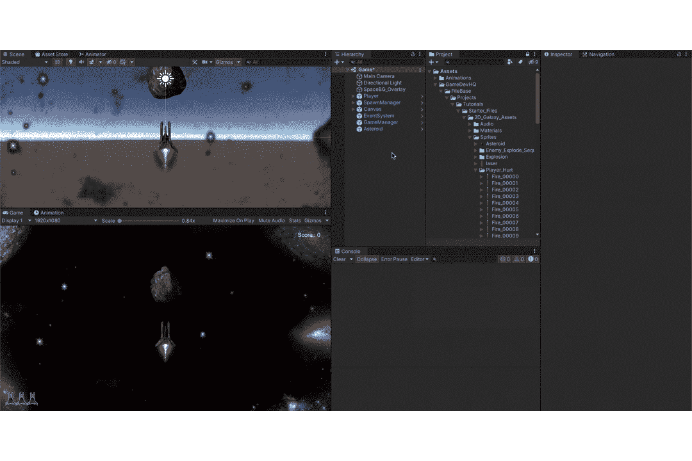
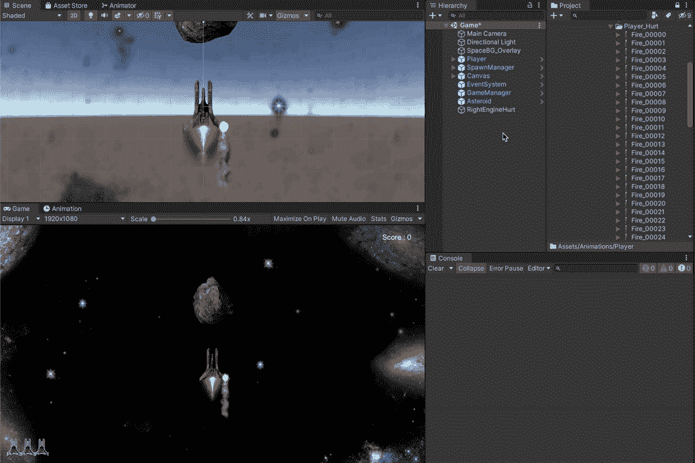
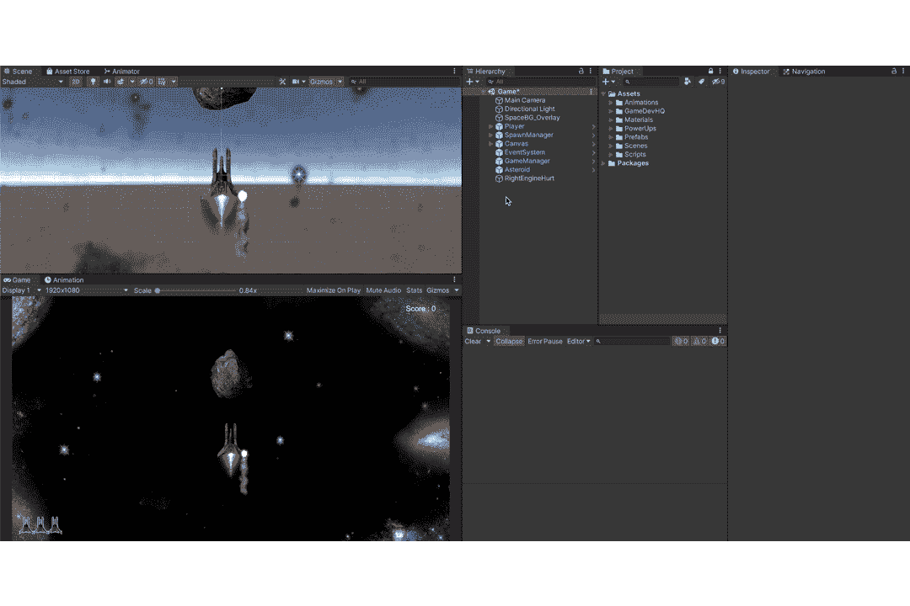
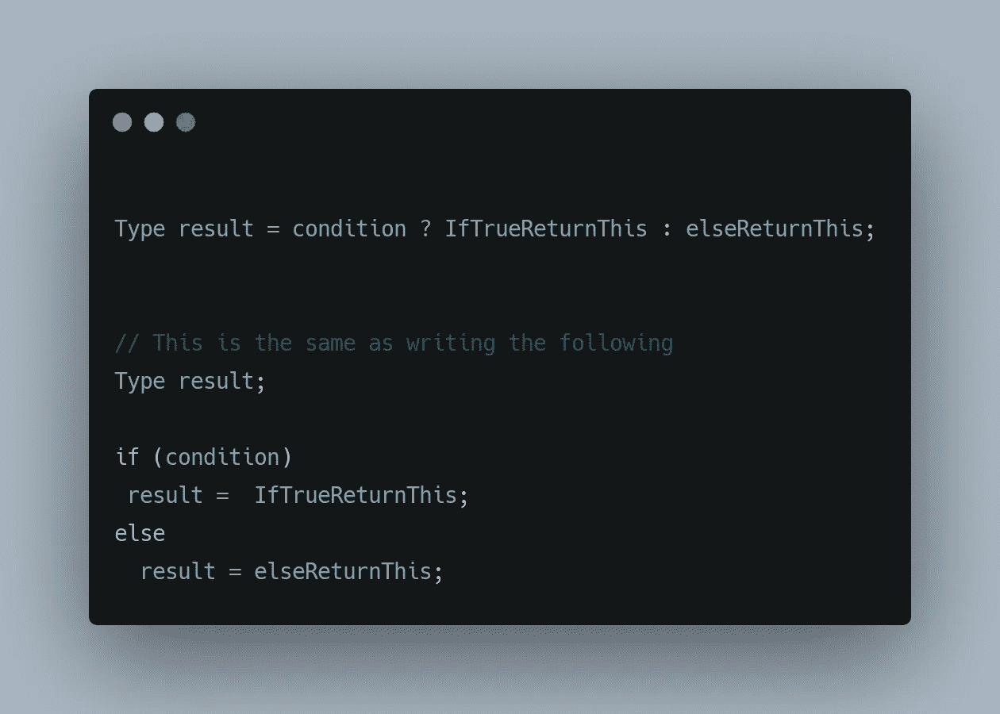
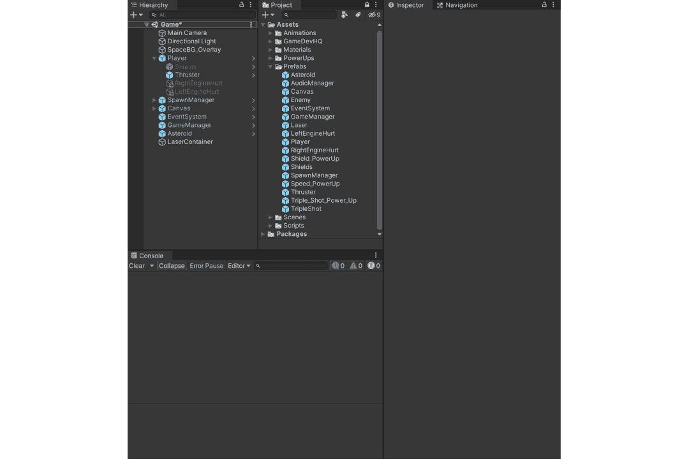
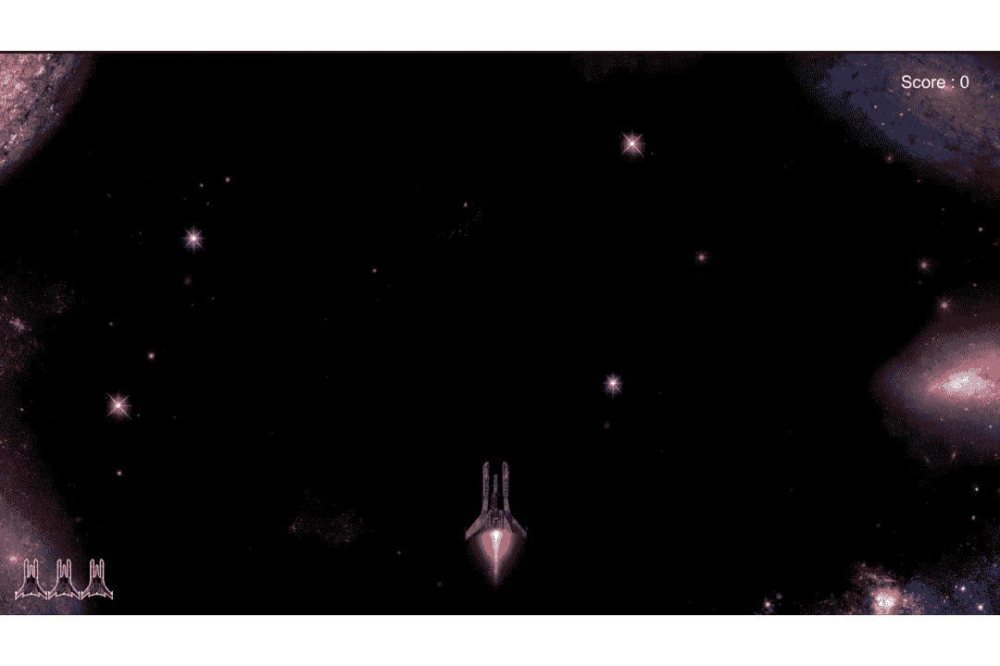

# 玩家在 Unity 中使用动画精灵伤害 VFX

> 原文：<https://medium.com/nerd-for-tech/player-damage-vfx-using-animated-sprites-in-unity-181997620840?source=collection_archive---------20----------------------->

在 Unity 中处理动画精灵的基本原则是一样的，不管它是用来做什么的(点击[这里](/nerd-for-tech/animating-sprites-in-unity-b1c5d995133e)了解更多)。在前一篇文章中，我们实现了[敌人爆炸](/codex/creating-enemy-explosions-a31607120771)，这将建立在它的基础上，因为我们现在使用相同的原理添加了一个玩家伤害视觉效果。

让我们首先创建一个视觉提示来指示播放器已经被损坏。

以前的文章详细介绍了这些步骤。

我们把上面的效果做成动画怎么样？

**玩家**目前有三条命，这意味着如果我们添加一个视觉提示来显示他被击中(而不是在 **UI** 中显示),我们可以显示一个效果，当玩家还有 3 条命时，他毫发无损，2 条命被击中显示伤害效果，1 条命显示两次，最后 0 条命摧毁物体。

因此，让我们复制受伤的游戏对象，并使它们成为玩家的孩子。这样做会让效果随着玩家一起移动。

确保禁用游戏对象。这可以通过选择对象并在检查器中关闭游戏对象来完成。

伤害 VFX 准备好了，让他们在玩家受到伤害时出现。

玩家行为脚本

三元条件运算符用 ***"表示？*:**它暗示着，

所以在上面的玩家行为脚本中，我们检查玩家是否还有 2 次生命，然后显示 LeftEngineHurt 游戏对象，如果玩家还有 1 次生命，则显示 RightEngineHurt 游戏对象。(这都是在假设每个敌人造成单位伤害，玩家最多 3 条命的情况下完成的)。

向玩家行为脚本添加所需的组件

执行上述操作会给我们带来以下结果，

感谢您的阅读。更多即将推出！！！