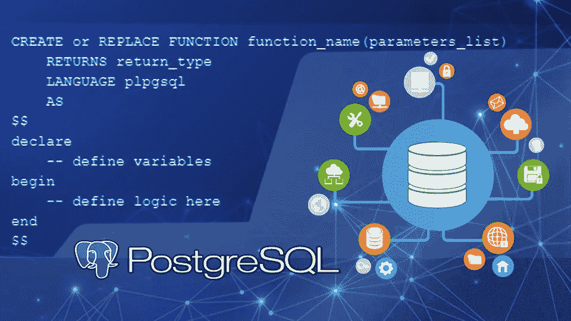
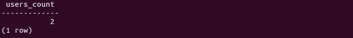

# 使用 PL/PGSQL 的 PostgreSQL 函数

> 原文：<https://medium.com/nerd-for-tech/playing-with-functions-using-pl-pgsql-is-just-a-fun-e38889ddf382?source=collection_archive---------4----------------------->



像其他编程语言一样，PostgreSQL 也支持用户自定义函数。用户自定义函数可以用 SQL 和 c 编写，它还支持过程语言(PLs) PostgreSQL-pgSQL、Python、Perl 和 Tcl。这四种过程语言包含在 PostgreSQL 的滞留分发版中。要定义一个功能，用户必须拥有该语言的权限。

编写函数的基本语法是，

```
CREATE or REPLACE FUNCTION function_name(parameters_list)
    RETURNS return_type
    LANGUAGE plpgsqlAssociation, Aggregation, Composition
    AS
$$
declare 
    -- define variables
begin
    -- define logic here
end
$$
```

*   *返回*定义函数的返回类型。返回类型可以是整数、字符串、查询、表列等。如果没有返回类型，可以指定 **void** 。如果参数列表包含 OUT 或 INOUT 参数，则可以跳过返回。
*   语言定义了函数实现的语言。
*   美元引用的字符串常量($$)指定块。

让我们定义一个用户表，

```
DROP TABLE IF EXISTS users;CREATE TABLE users(
 id INT GENERATED BY DEFAULT AS IDENTITY,
 name VARCHAR(50),
 gems DEC (10),
 PRIMARY KEY (id));
```

用默认的宝石数量填充用户表，

```
INSERT INTO users (name, gems) VALUES ('David', 1000); 
INSERT INTO users (name, gems) VALUES ('John', 2000);
INSERT INTO users (name, gems) VALUES ('Joe', 3000);
```

现在，让我们编写一个函数，返回指定宝石数量的用户数量

```
CREATE or REPLACE FUNCTION users_count(number_of_gems int)
    RETURNS int
    LANGUAGE plpgsql
    AS
$$
DECLARE 
    user_count integer;
BEGIN
    SELECT count(*) INTO user_count
    FROM users WHERE gems > number_of_gems;

    RETURN user_count;
END;
$$;
```

创建函数后，用一个简单的 SELECT 语句调用它，并根据需要传递宝石的数量。

```
SELECT users_count(1500);
```

它将使拥有 gems 的用户数量恢复到 1500 以上。



上述函数从函数中返回整数值。要从函数中返回表，请在函数中使用以下 return 语句，

```
RETURNS table (column_list)
```

column_list 包含列表中的指定列。让我们写一个函数，返回用户的 id、姓名和宝石。

```
CREATE or REPLACE FUNCTION users_gems()
    RETURNS table (id int, 
          name varchar,
          gems DEC (10))
    LANGUAGE plpgsql
    AS
$$
BEGIN
    RETURN query 
    SELECT * FROM users;

END;
$$;
```

现在，获得上述函数的输出

```
SELECT users_gems();
```

该函数接受三种类型的参数 IN、OUT 和 INOUT。users_count()函数有一个 IN 参数，它是默认类型。应该明确提到 OUT 和 INOUT 参数，

```
OUT parameter type
INOUT parameter type 
```

OUT 参数返回函数的输出，并且不需要在块的末尾提到 returns 类型和 return 语句。

```
CREATE or REPLACE FUNCTION total_user_count(OUT user_count int)
    LANGUAGE plpgsql
    AS
$$
BEGIN
    SELECT count(*) INTO user_count
    FROM users;

END;
$$;
```

来获得输出、关联、聚集、合成

```
SELECT total_user_count();
```

INOUT 参数可以接受来自调用者的值，并将返回更新后的值。

PostgreSQL 也支持函数重载。函数重载意味着，函数名相同，但参数不同。当调用重载函数 PostgreSQL 时，根据参数选择最佳函数。

要登记所有用户定义的函数及其详细信息，请使用命令。

```
\df 
```

输出将显示函数的模式、名称、返回类型和参数列表。

若要删除函数，请使用以下语句

```
DROP FUNCTION function_name(argument_type) [ CASCADE | RESTRICT ];
```

如果函数接受任何参数，由于函数重载，您需要显式地提及参数类型。