# 玩弄逻辑回归

> 原文：<https://medium.com/nerd-for-tech/playing-with-logistic-regression-edcfc953c174?source=collection_archive---------8----------------------->

逻辑回归是机器学习中使用的一个关键工具。它用于预测二元事件的概率，如谁将通过考试或谁将从疾病中幸存。在这两个例子中，只有两种可能的结果。这不同于正常的线性回归，后者用于模拟连续变量，如房价。

为了说明这一过程，我从 Kaggle 下载了一个数据集，它观察了两所葡萄牙中学 Gabriel Pereira (GP)和 Mousinho da Silveira (MS ),以及那里的学生是否通过了期末考试。数据集关注学生在两个科目上的表现:数学和葡萄牙语。它也包含了关于学生的背景、学校和社会生活的信息。出于此模型的目的，我省略了最终分数，它可以在 G3 列中找到，因为目标属性 G3 与属性 G2 和 G1 有很强的相关性。并非所有模型都对多重共线性敏感，但逻辑回归对多重共线性敏感。有关数据集特征的其他信息可在下面找到。

属性信息:

*   **学校** —学生的学校(二进制:' GP' — Gabriel Pereira 或' MS' — Mousinho da Silveira)
*   **性别** —学生的性别(二进制:' F' —女性或' M' —男性)
*   **年龄** —学生年龄(数字:15-22)
*   **地址** —学生的家庭地址类型(二进制:' U' —城市或' R' —农村)
*   **famsize** —家庭规模(二进制:' LE3' —小于或等于 3 或' GT3' —大于 3)
*   **Pstatus** —父母的同居状态(二进制:' T' —同居或' A' —分居)
*   **Medu** —母亲的教育程度(数字:0 —无，1 —初等教育(四年级)，2“五至九年级，3—中等教育或 4—高等教育)
*   **Fedu** —父亲的教育程度(数字:0 —无，1 —初等教育(四年级)，2—五至九年级，3—中等教育或 4—高等教育)
*   **Mjob** —母亲的工作(名义上:“教师”、“保健”相关、民事“服务”(如行政或警察)、“在家”或“其他”)
*   **Fjob** —父亲的工作(名义上:“教师”、“健康”护理相关、民事“服务”(例如行政或警察)、“在家”或“其他”)
*   **理由** —选择这所学校的理由(名义上:靠近'家'、学校'声誉'、'课程'偏好或'其他')
*   **监护人** —学生的监护人(名义上:“母亲”、“父亲”或“其他”)
*   **行程时间** —从家到学校的行程时间(数字:1-1 小时)
*   **学习时间** —每周学习时间(数字:1-10 小时)
*   **故障** —过去类故障的数量(数字:n 如果 1 < =n❤，否则 4)
*   **学校支持** —额外教育支持(二进制:是或否)
*   **famsup** —家庭教育支持(二元:是或否)
*   **付费** —课程科目(数学或葡萄牙语)内的额外付费课程(二进制:是或否)
*   **活动** —课外活动(二元:是或否)
*   **托儿所** —上过托儿所(二进制:是或否)
*   **高等** —想接受高等教育(二进制:是或否)
*   **互联网** —在家上网(二进制:是或否)
*   **浪漫**——有浪漫的关系(二元:是或否)
*   **famrel** —家庭关系的质量(数值:从 1 —很差到 5 —极好)
*   **自由时间** —放学后的自由时间(数字:从 1 —很低到 5 —很高)
*   **goout**——和朋友出去(数值:从 1——很低到 5——很高)
*   **Dalc** —工作日酒精消耗量(数值:从 1 —非常低到 5 —非常高)
*   **Walc** —周末饮酒量(数字:从 1 —非常低到 5 —非常高)
*   **健康状况** —当前健康状况(数字:从 1 —非常差到 5 —非常好)
*   **缺勤** —学校缺勤的次数(数字:从 0 到 93)

这些成绩与课程科目有关，数学或葡萄牙语:

*   **G1** —第一期成绩(数字:从 0 到 20)
*   **G2** —第二周期等级(数字:从 0 到 20)
*   **G3** —最终等级(数值:从 0 到 20，输出目标)

在导入相关的库并读取数据集后，我做了一些快速 EDA，发现总共有 30 列，395 个条目。数据集中包含的所有信息都是浮点形式的，没有丢失的值，这意味着我不需要做太多的工作来清理数据。总共有 265 名学生及格，130 名学生不及格。

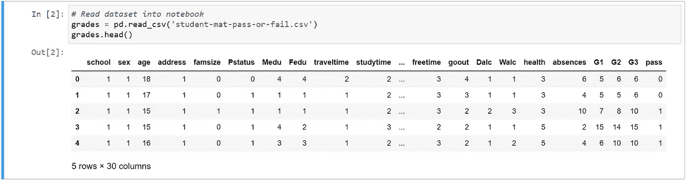

原始数据集

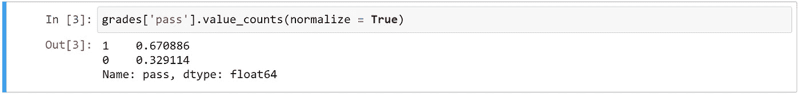

通过(1)和未通过(0)的学生百分比

我的模型的第一步是为我的目标(y)和特征(X)创建变量。

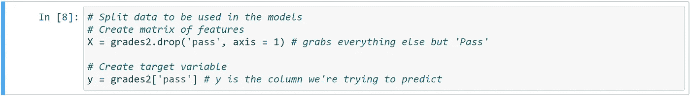

创建特征变量和目标变量

之后，我将数据分成训练集和测试集。在缩放之前拆分数据以避免数据泄漏是非常重要的，数据泄漏是指在模型训练过程中使用在您进行预测时不可获得的信息。如果在拆分数据之前先对其进行缩放，将会破坏您的预测。

执行列车测试分离

逻辑回归会自动进行正则化，因此缩放数据非常重要，否则某些要素的系数可能会受到不公平的惩罚。

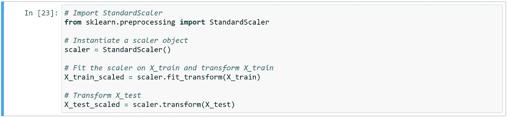

缩放数据

从这里，我拟合了一个逻辑回归模型，并检查了系数。

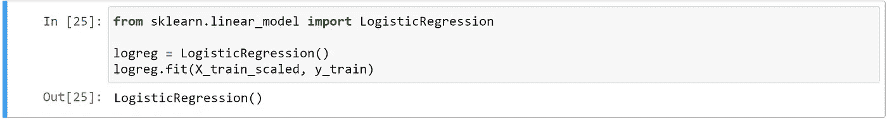

拟合逻辑回归模型

检查系数

一旦我拟合了模型，我就能够在测试集上进行预测，并生成一个分类报告来评估我的预测。

创建类别预测(不是预测的概率)

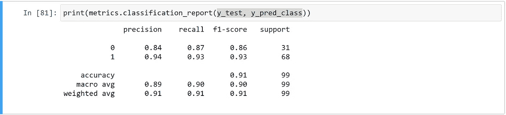

这些类的精确度、召回率、f1 分数、支持度和准确度的摘要。

分类报告为我们提供了几条重要的信息，第一条是精度，即真阳性除以真阳性加上假阳性。第二个重要的信息是回忆，它是真阳性除以真阳性加上假阴性。f-1 分数允许我们将精确性和回忆性结合在一起。数学上，这是调和平均值。在这种情况下，f1 分数非常高。

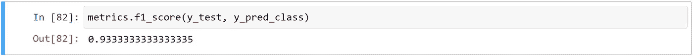

计算 f-1 分数

重要的是要注意，准确性分数并不是特别有用，因为我们的数据中存在类别不平衡。

我在下面画了一个混淆矩阵来帮助可视化结果。该模型成功预测了 87%的 0 班学生和 93%的 1 班学生。

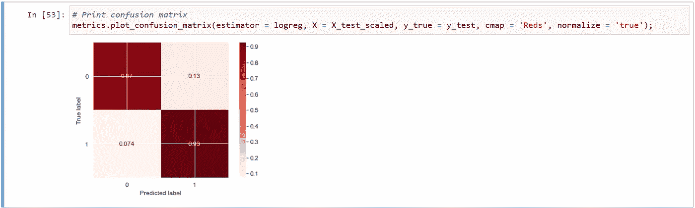

混淆矩阵

下面，我进一步详细介绍了上面分类报告中的分数。

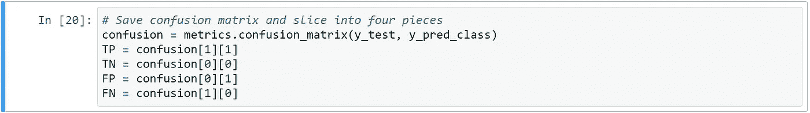

保存混淆矩阵并将其分成四份

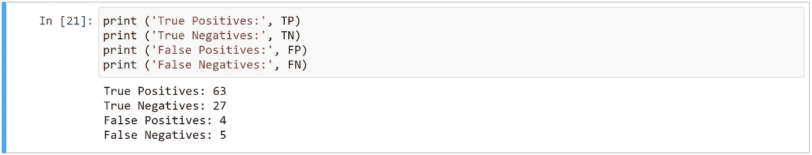

真阳性、真阴性、假阳性、假阴性的结果

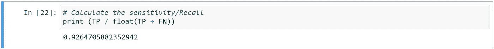

计算 1 类(通过)的召回

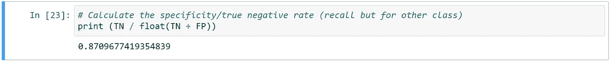

计算特异性/真阴性率。这是对 0 级(不合格)的召回

存储预测的概率

最后，我制作了预测概率的直方图以及 ROC(受试者操作特征)曲线。ROC 曲线告诉我们，随着假阳性率的增加，真阳性率也增加。基线 AUC(曲线下面积)为 0.5。这个模型的 AUC 是 0.97，非常好。

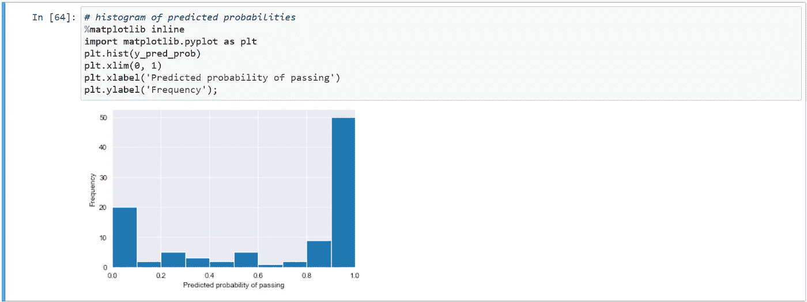

预测概率直方图

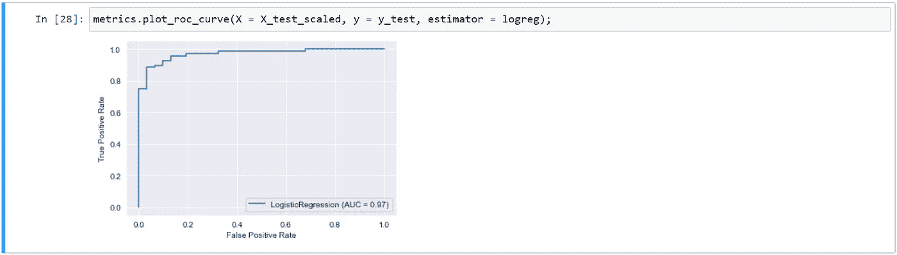

受试者工作特征曲线

这就是你如何执行一个简单的逻辑回归！