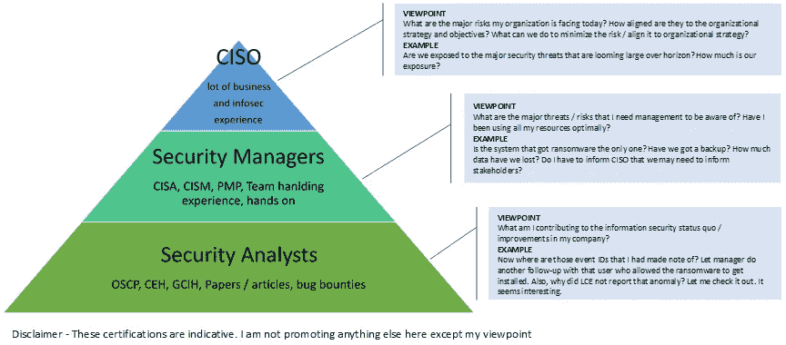

# 如果你的 CISO 不知道病毒是如何工作的，请不要杀他

> 原文：<https://medium.com/nerd-for-tech/please-dont-kill-your-ciso-if-he-doesn-t-know-how-a-virus-works-facecd6cdf5d?source=collection_archive---------0----------------------->

我在 LinkedIn 上看到了这种咆哮(带有通常的“不要杀我，我只是随便发表声明，并完全打算逃脱”的免责声明)，关于 CISO 如何对病毒如何工作一无所知，即使有 CISA/CISM 和十年的经验。这让我对这种说法在很多层面上都是错误的感到愤怒，但后来我决定以更好的方式整理它，并用更有条理的方式用键盘和鼠标输入我的想法(无论如何，我的想法听起来有点陈词滥调)。我可能是错的，但我愿意从读者的反馈和评论中学习(如果有的话)。我是现实主义者)。

首先声明——除了我的观点之外，我并不想在这里宣传任何东西。

## CISO 90%是管理岗位，10%是技术岗位。

我们来看这个思路。

依我看，管理就是在手头没有完整数据的情况下做出决策。这意味着整个组织必须被置于一个抽象中(没有什么能如此快速地给出一个高层次的视图)。然而，它导致了大量的欺骗和政治欺诈，给管理层带来了坏名声。在一个理想的世界里，每一个管理人员在他的公司所做的每一件事情上都有实践经验。然而，现实却不同。因此，企业寻求实用知识和管理技能的理想结合，结果喜忧参半。就像管理人员很难学习技术一样，技术人员也很难学习管理技能。

公司很少因为缺乏技术而倒闭。他们失败的原因是缺乏管理/商业意识和领导力(尽管市场混乱)。史蒂夫·乔布斯让苹果走到了今天。是比尔·盖茨的决策和管理技能让微软走到了今天。

现在是另一个免责声明的时候了。

**我并不是说不需要技术或技术人员。我只是说管理也是需要的**。

是时候看看我创造的一张图片来说明我的观点了。我在这里试图提出的是信息安全食物链中不同角色的观点，以及这种观点在实践中的一个例子。看看随着角色越来越接近业务，抽象是如何建立起来的。

信息安全食物链

根据拉菲克·拉赫曼(我非常钦佩的人)的说法，以下是 CISO 这些天要进行的不同活动([http://rafeeqrehman . com/WP-content/uploads/2016/10/CISO _ Job _ V8 _ A0 . pdf](http://rafeeqrehman.com/wp-content/uploads/2016/10/CISO_Job_v8_A0.pdf))。你会注意到，这些活动中有很多是领导活动，而不是技术活动。虽然，技术知识是必需的，但它处于使能水平(换句话说，理解你的团队在说什么，以便你可以做出决定)，因为 CISO 本质上是一个决策者/领导者，有时是一个经理(如果公司很小，CISO 可能最终也会自己做一点技术工作)。而且，人们相信我说的话- *这是一份全职工作*。

CISO 人需要知道病毒是如何工作的吗？这不是正确的问题。正确的问题是-

CISO 需要知道病毒是如何工作的吗？就像他团队中的事件响应者一样？

答案是响亮的不。

如果你给 CISO 带来一个 OSCP(没有商业经验)，你会吃亏的。如果你带一个 CISA / CISM(没有必要的事件处理经验)来领导一个事件处理团队，我表示哀悼。

## CISA / CISM 是技术专家，但不是你想的那样。

让我用不同的方式来处理它。

我认为，任何属于专业知识的东西都是技术性的。因此，如何审计的详细程序是技术性的东西(与审计有关)。其软件工具的使用可能仅限于 MS Excel 和 Access，但它仍然是技术性的，因为它描述了该领域的内部内容(例如，如何采样，审计的意义是什么，它与评估有何不同，如何进行审计等)。).

CISA(认证信息系统审计员)是为审计信息系统(安全是其中的一部分)的审计员(现在的和想要的)准备的。CISM(认证信息安全经理)是为管理信息安全管理系统的经理(现有的和想要的)。他们共同拥有一个知识基础，如果内化了，可以帮助一个人获得比没有内化的领域更多的洞察力。这并不意味着每个人都能忍受。没有一个所谓的技术人员可以在阅读 CoBIT 时不睡着(这并不意味着你声称自己是技术人员，只是因为你不能忍受 CoBIT 文档)，但决策者会立即对该文档有一种宾至如归的感觉，因为它为他提供了一个组织的整个信息安全控制景观的有利位置。不仅如此，这将给他足够的弹药来监督现有的信息安全系统。因为决策者习惯于抽象地看待事物。

然而，这也不意味着每个 CISA / CISM 的人都已经吸收了教学大纲中的所有知识(你不会认为我是在为无能的家伙担保吧？).这就引出了下一部分。

## 认证不是知识药丸，你仍然需要努力。

有证书只意味着你通过了考试。这并不意味着你在考试后和随后的几年里仍然保留、交叉引用、更新和内化教学大纲中的所有知识。这也意味着你仍然需要接受面试，以了解上述所有动词以及你是否适合这个角色。我就讲到这里，因为这个话题已经被打了太多次了，再踩着不变已经没有意义了。只要谷歌一下“信息安全认证有必要吗”就知道我的意思了。有证书并不能保证在这个领域有工作材料。

## 标准和遵从并不是坏事，也不是导致当前可悲状况的原因。人是。

就我而言，我们所有的问题都源于人口的增长。但那是另一篇文章。让我们把重点放在当前的点上。

Bruce Schneier 在他的一本书中提出了一个有趣的观点(我认为是“秘密和谎言”，但我不确定),防火墙之所以出名，不是因为它们在技术上是合理的，是因为它们的缺失被审计人员标记为不合规！你以为你的 CCIE 尽了最大努力！

尽管所有的笑话都围绕着《合规》和《ISO 27K1》展开，但我仍然认为，缺陷在于执行，而不在于精神。

如今，安全有很多方面，这是一项全职工作，只需保持所有的球在空中，并确保它们不会崩溃。再加上每天向高层推销安全性的压力，这样你就可以保住你的工作，以免一个无知的安全主管或其他高级职位决定他不需要你准备好所有华而不实的工具(SIEM / DLP / IDAM，一旦安装，必须自己学习),你就会同情自 infosec 一词诞生以来所有的 CISO。玩笑归玩笑，管理层需要一个能翻译 jargonic(等等，那是一个词吗？)安全的各个方面整合到一个更易于管理的块中，以便他们可以决定将资金和监督导向何处(换句话说，告诉我它是否为业务工作，并向我展示如何工作)。标准(如 ISO 27001)和遵从性/法规应该帮助决策者用他们理解的语言理解安全性。但是，正如伊恩·蒂布尔(Ian Tibble)在他的著作《安全去工程化》(Security De-engineering)中尖锐地指出的那样，excel masters 接管了这一切，他们夺走了人们的全部注意力。而且从那以后我们一直在诅咒管理层！

换句话说(意思是我本可以避免所有这些咆哮，而是说这些台词，仍然表达我的观点):-

> 安全管理和技术必须共存，才能创造出对企业来说有品位的美丽食谱。单数不行。