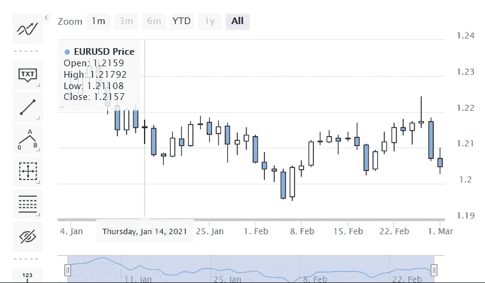
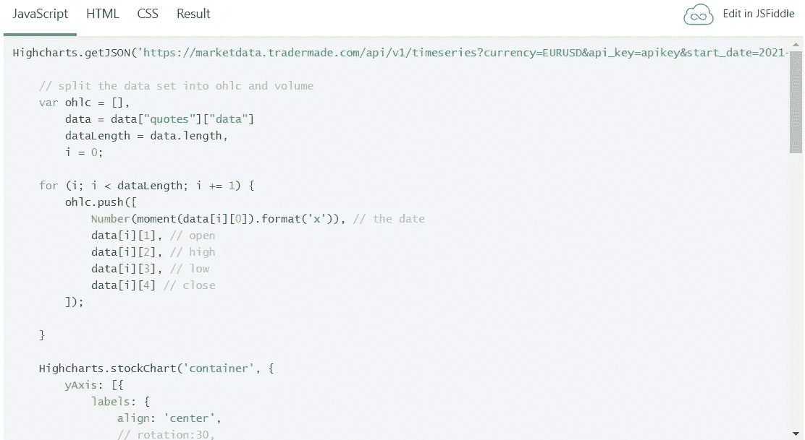

# 在 5 分钟内使用 Javascript 的交互式烛台图表

> 原文：<https://medium.com/nerd-for-tech/plot-forex-api-in-highcharts-and-highstock-8f1afbef6aef?source=collection_archive---------8----------------------->

在本教程中，我将向你展示如何使用 Javascript 通过 API 绘制外汇数据。我们正在使用 Highcharts，现在对于那些不知道的人来说，Highcharts 是一个基于 Javascript 和 HTML5 的图表库，是用于商业用途的付费产品。然而，对于测试和非商业用途，它是免费的。

首先让我告诉你，Highcharts 有大量的例子和文档，它们提供了一些股票的预设数据，以帮助测试它们提供的例子。然而，我没有遇到外汇数据的例子，一些读者要求我提供例子，说明如何在图表中绘制我们的外汇 API。所以我们在这里。

我首先建议通过免费加入 API 从 Tradermade 获得 API 密钥。不到一分钟。

你可以在下面看到我们的例子，它已经包含了来自 Highcharts JSfiddle 代码的修改，以使它能够工作。

现在，在您进入示例之前，我想指出我们为使其工作所做的一些更改。首先，您需要在代码的 HTML 部分导入 Momentjs 库。

```
<script src="https://cdnjs.cloudflare.com/ajax/libs/moment.js/2.14.1/moment.min.js"></script>
```

然后，您将调用我们的 Timeseries API URL，如下所示。此外，您需要将下面显示的 api_key 替换为注册时获得的 API _ key。

```
Highcharts.getJSON('https://marketdata.tradermade.com/api/v1/timeseries?currency=EURUSD&api_key=apikey&start_date=2021-01-01&end_date=2021-03-01&format=split', function (data) {
```

然后，您将必须格式化您从我们的 API 获得的日期，如下所示。就这样，你可以看到每日时间序列数据图！

```
Number(moment(data[i][0]).format('x'))
```



你可以在这里看到你需要的 [JSfiddle 示例](https://jsfiddle.net/rahulkhanna/o5jsh47k/8/)。只要在示例中添加 api_key 就可以看到剧情了。



请让我们知道你的想法，分享并鼓掌表示感谢。另外，建议一篇你想看的文章。