# 通过 Unity 输入系统事件点击移动多个单元

> 原文：<https://medium.com/nerd-for-tech/point-click-movement-for-multiple-units-with-unity-input-system-events-fdafb922f032?source=collection_archive---------4----------------------->

## 战术团队运动力学

已选择单位。

今天的挑战:点击一个单位进行选择，右键将选择的单位移动到最近的整数网格坐标。对于这一个，我们将回到等距视图。

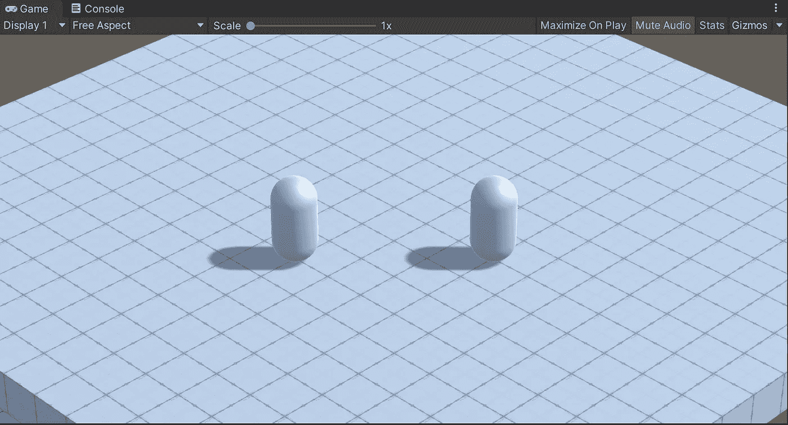

我的场景是用 1m ProBuilder 立方体的 20x20 网格和两个胶囊“单元”建立的我还准备了一台等轴摄影机，在 *x* 轴上旋转 34 度，在*y*轴上旋转 45 度。如果你想更详细地了解如何设置一台等轴摄影机，请查看[这篇文章](https://michael-l-davis.medium.com/isometric-player-movement-in-unity-998d86193b8a)。最后，我们需要将地板烘焙成一个 NavMesh，并为每个单元赋予一个 NavMesh 代理组件。你可以在[我的原始观点中查看如何设置，并点击教程文章](https://michael-l-davis.medium.com/point-and-click-movement-in-unity-3d-2ff602b33437)。

之后，我们需要配置输入系统。确保您已经安装了输入系统包，并且创建了输入动作和输入设置资产(在[之前链接的文章](https://michael-l-davis.medium.com/isometric-player-movement-in-unity-998d86193b8a)中也有涉及)。对于这个实现，我们不需要播放器输入组件，但是我们*将*需要从检查器面板为输入动作资产生成一个 C#脚本:

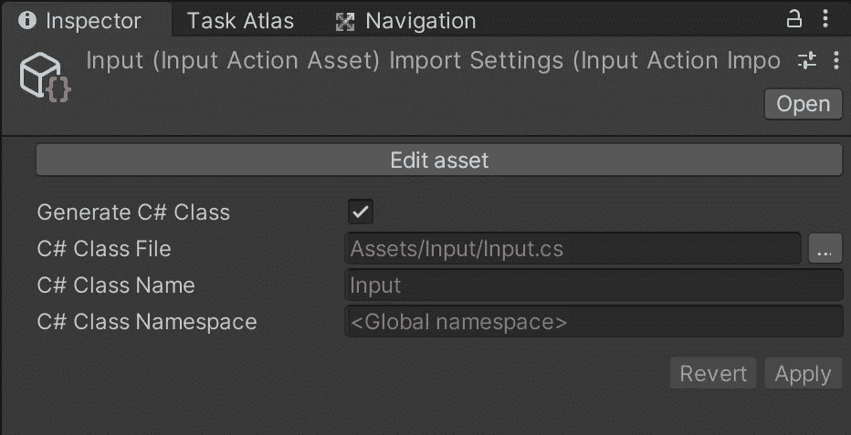

现在，我们需要在输入动作资产中配置三个输入动作:

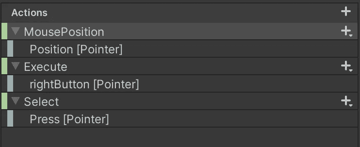

第一个动作是与鼠标位置相关的 Vector2 动作。接下来，我们有一个右键，用于执行任何需要执行的命令。左键(默认按下)将进行选择。

接下来，我需要一种方法将我点击的任何对象加载到内存中作为“选择”由于我有多个对象要处理，因此让选择机制受它们中的任何一个控制都没有意义，所以我将在场景中创建一个空对象，并为其附加一个 SelectionManager C#脚本组件。

因为我们没有使用播放器输入组件，所以我们需要初始化自己的输入类实例。我们还需要将实例设置为启用和禁用运行实例的对象。以下是 C#方法:

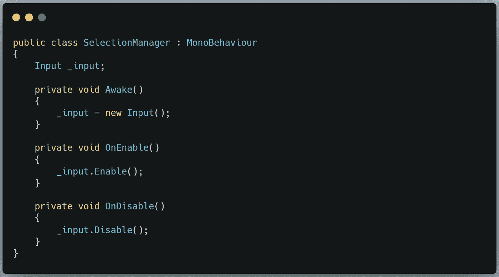

现在，我们将创建一个名为 SelectUnit()的方法。我们希望在执行 Select Input 操作时触发该事件，因此我们将创建一个 Start()方法，将 SelectUnit()方法委托给在输入设置期间生成的 C#类中的事件。

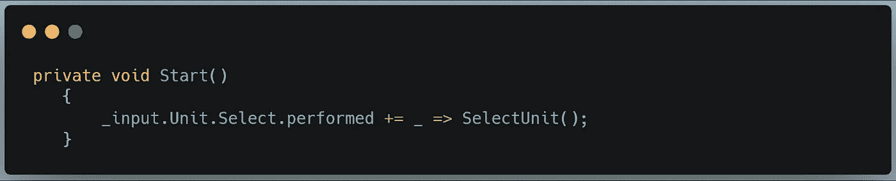

我们在 Awake()中创建的 _input 实例正在访问单元输入动作映射，并通过它访问选择动作，我们感兴趣的事件是动作是否被执行。如果我们将鼠标悬停在 performed 上，我们会看到它是行动号召的简写:

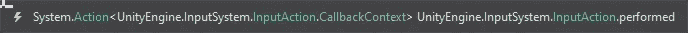

因此，我们为该操作订阅了 SelectUnit()。那里的小下划线是输入系统的*上下文*参数。我们在这里不需要它，因为我们实际上完全是从另一个输入动作读取数据:鼠标位置动作(稍后会有更多的介绍)。因此，强调这一点是为了避免混乱，使其具有可读性。

现在我们已经订阅了我们的方法，让我们定义它。首先是伪代码:

> 从 mouse position 动作中获取鼠标位置
> 使用鼠标位置投射一个相机屏幕点 toray
> 如果它击中一个单位，获取它的单位组件
> …将该单位指定为 _selectedUnit
> 否则将 _selectedUnit 设置为空(也称为取消选择)

在 C#中是这样的:

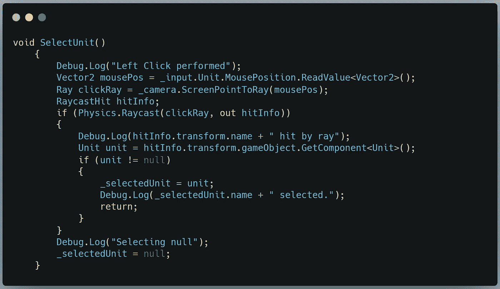

我还没有一个系统来识别谁被选中，所以现在我们将依赖于良好的旧调试日志。当然，在这个类的范围内，你需要声明一个 _selectedUnit 变量。

让我们看看我们有什么。我将单击一个单元来选择它们，然后在地面上取消选择。

太棒了。

现在让我们让这些单位动起来。为此，我们将为单元创建一个新的 C#类。现在它只需要一个方法:HandleMovement(Vector2 mousePos)

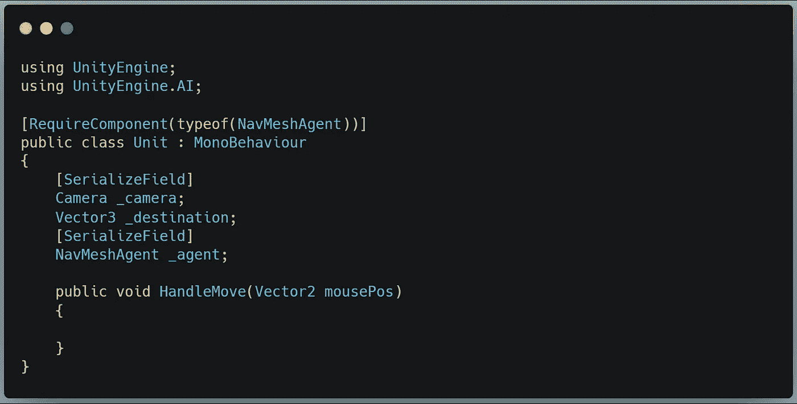

回到 SelectionManager 类，我们将创建一个 Execute()方法，并为其订阅另一个输入动作事件:

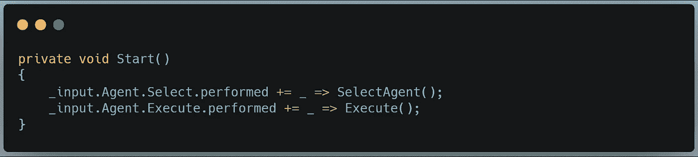

同样，我们并没有真正使用回调上下文变量，所以我们可以把它加下划线。当执行动作被执行时，我们的 Execute 方法将把鼠标位置发送给我们选择的单元的 HandleMovement()方法。

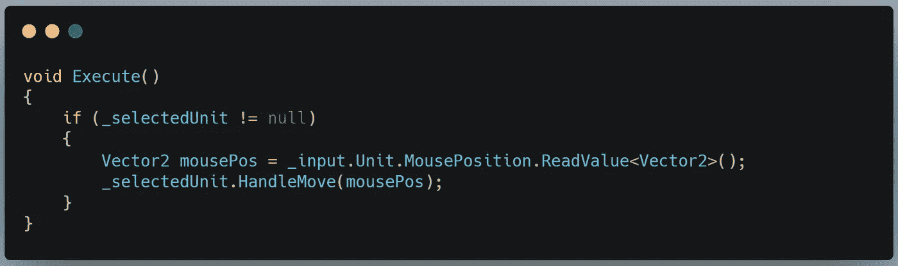

当然，如果我们没有选定的单位，我们什么都不想做。

最后，在 HandleMove 方法中，我们将经历大致相同的过程:

> 从 mouse position 动作中获取鼠标位置
> 使用鼠标位置
> 投射一个相机屏幕点如果它碰到地面
> …收集所单击空间的世界空间向量
> …将每个坐标四舍五入为最接近的整数
> …将 NavMesh 代理的目的地设置为四舍五入后的坐标

我把这些四舍五入的原因是为了确保单位总是停在一个整数网格坐标上。这让我们假装我们在格子上移动，以达到战术游戏的目的。

C#方法应该类似于:

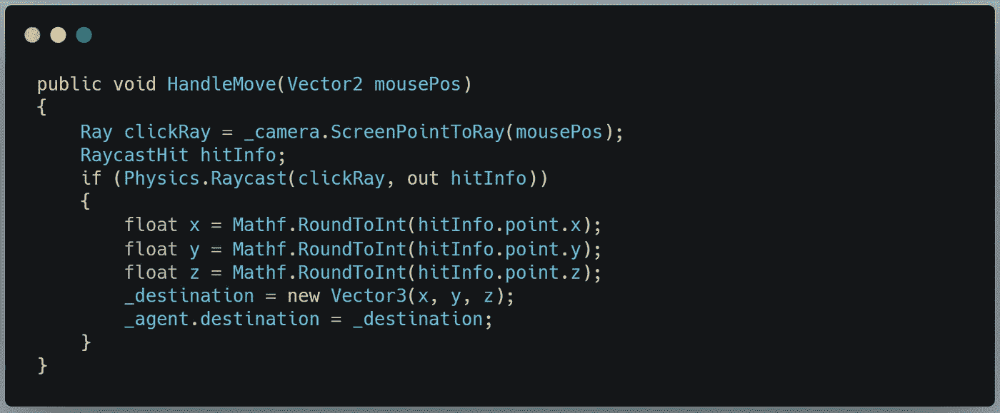

这应该可以了。来看看 gif:

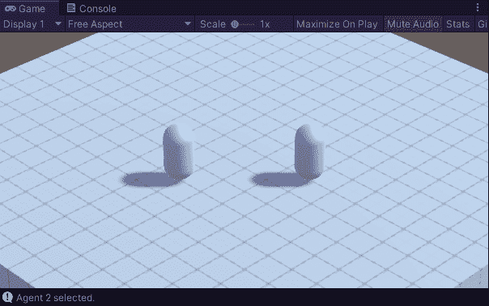

太棒了！

这就是你需要知道的关于新输入系统的点击运动的一切。通过将你的输入信息分成两种不同类型的输入动作，你可以将按钮和矢量动作组合成一个对玩家来说明显的动作。轻松点。