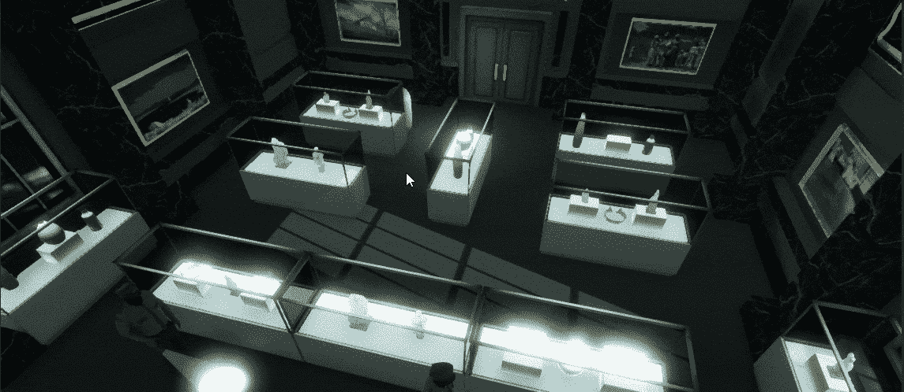

# Unity 2021 中的点击运动

> 原文：<https://medium.com/nerd-for-tech/point-click-to-move-in-unity-2021-98a8d682737f?source=collection_archive---------6----------------------->

使用光线投射和导航网格

指向并点击操作。

点击运动很容易实现。今天我将看看如何在 Unity 3D 中快速创建一个基本点并点击角色控制器。

首先，我们的游戏中需要两样东西。一个要移动的玩家对象(上面的胶囊)和一个供玩家移动的 NavMesh。