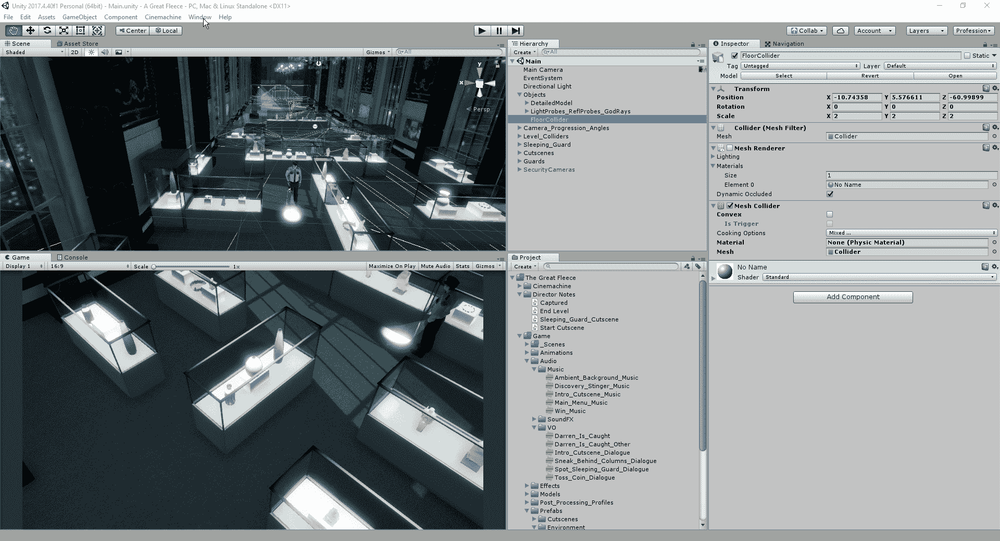
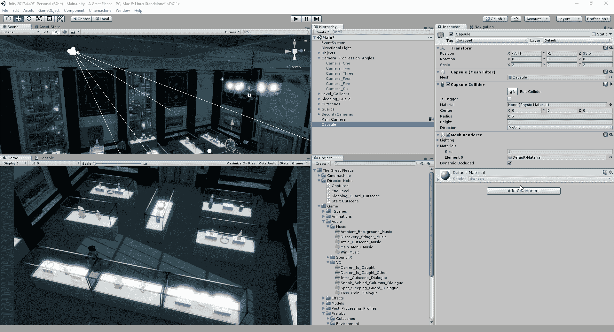
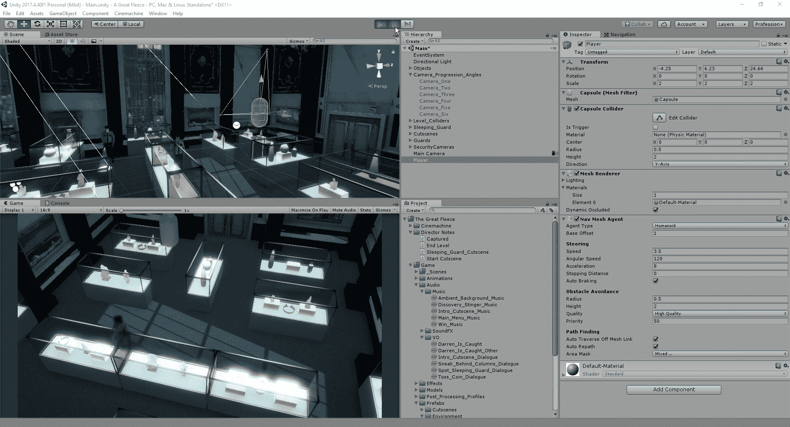
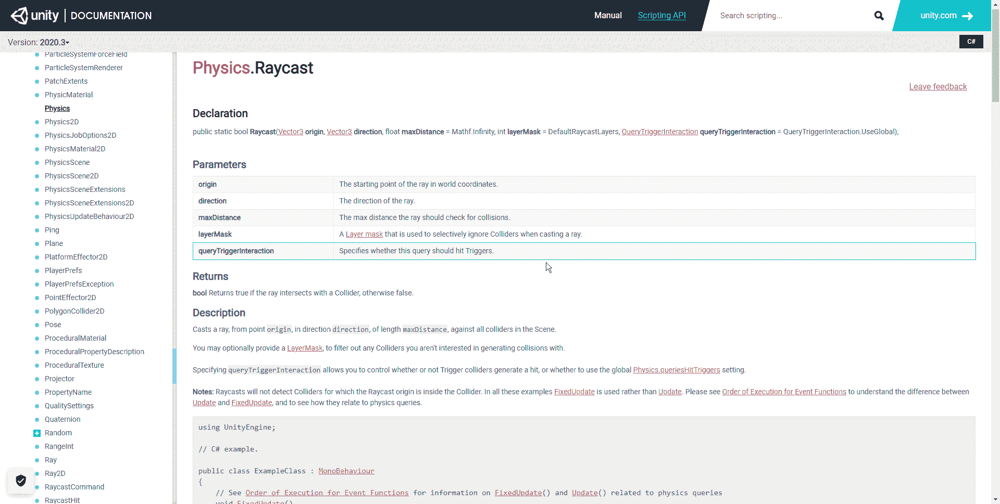
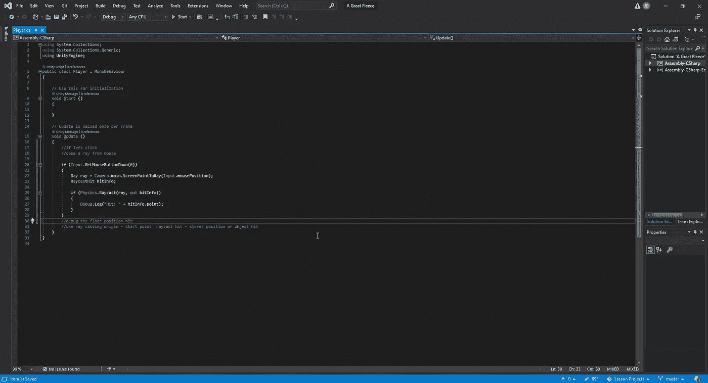
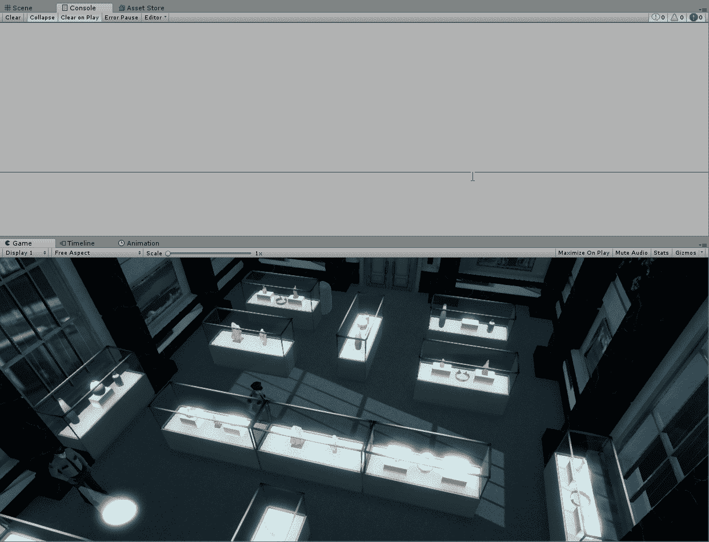
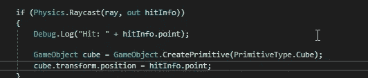
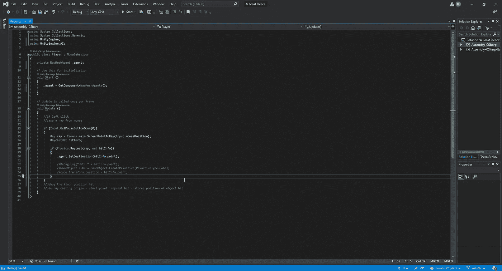
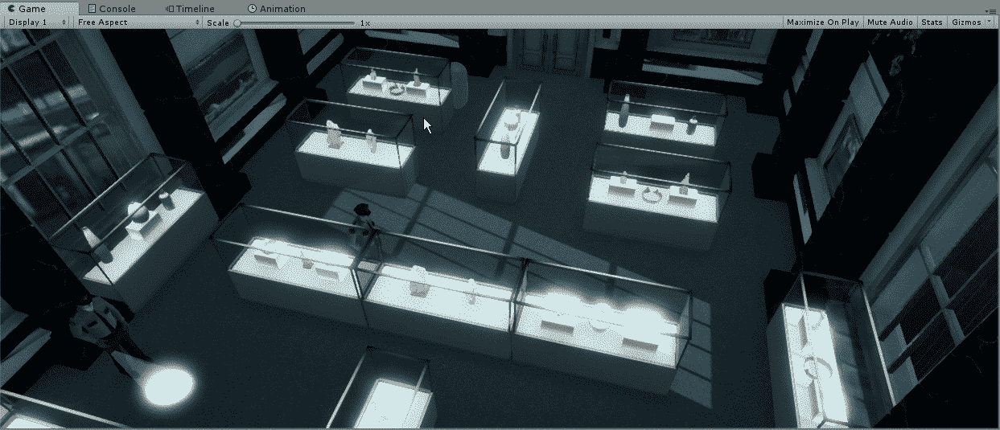

# 指向并单击以统一移动

> 原文：<https://medium.com/nerd-for-tech/point-click-to-move-in-unity-d5b6400076ee?source=collection_archive---------25----------------------->

现在我们已经有了过场动画，让我们开始工作在我们的游戏方面。首先，我们需要一种移动玩家的方式，对于这种类型的游戏，我们将使用点击式的移动方式。我们需要做的第一件事是“烘烤”地板，这样我们就有一个表面供我们的玩家和 AI 行走，并且防止我们点击和移动到指定区域之外。为了支持我们的地板，我们将想要打开为这个特别的游戏制造的碰撞器:

一旦我们烘烤了地板，我们会注意到它变蓝了。这个蓝色的亮点是我们能够行走的区域，它覆盖了这个场景的整个位置。
现在我们已经烤好了地板，让我们来设置我们的播放器，这样我们就可以开始构建我们的运动了。只是为了测试的目的，我们现在将使用一个 3d 圆柱体作为我们的播放器。一旦我们有了合适的位置，我们将希望添加一个导航网格代理到我们的对象，使它保持附着在我们新烤的地板上:

正如我们所看到的，如果我们让我们的物体漂浮在地板上，当我们开始游戏时，它会吸附到地板上。

现在我们将努力让我们的玩家在点击鼠标时移动。首先，我们需要了解一下 raycast，让我们看看 Unity 是怎么说的:

现在有了脚本的基础，我们可以开始创建玩家对象需要移动的逻辑。首先，我们将创建它，以便我们可以看看是否可以获得鼠标单击的位置来注册游戏:

通过这段代码，我们可以看到我们点击的位置，所以让我们在游戏中测试一下:

现在我们已经显示了我们点击的位置，让我们来玩玩它，在我们点击的位置创建一个立方体，给出我们的玩家将要走的路径的外观:

现在我们可以更好地想象我们点击的位置，让我们开始为我们的玩家创造实际的移动。让我们看看我们将要编写的代码:

我们需要在脚本的顶部创建一个新的名称空间“使用 UnityEngine”。艾”。我们把它放在这里，以便我们可以访问用于我们将要使用的这种类型的脚本的代码库。在这里，我们将创建一个 NavMeshAgent，并告诉它获取我们添加到播放器上的 NavMeshAgent。最后，我们将进入刚刚创建的脚本部分，并在 SetDestination 中添加 unity 来告诉我们的玩家移动到我们点击的位置。
Nest，我们需要快速调整我们的对象，使其保持静态，这样我们的玩家就不会像在全息图中一样穿行。为此，我们只需单击我们拥有的所有对象，然后单击检查器中的静态选项:

从这里，我们只需转到导航，清除当前的烘焙，并创建一个新的烘焙。完成后，我们的玩家将正确地在物体周围走动，我们现在可以测试:

现在我们已经为我们的球员创造了移动，我们可以展望我们游戏的下一步。