# 点击移动| Unity

> 原文：<https://medium.com/nerd-for-tech/point-click-to-move-unity-6e2a0ab858fc?source=collection_archive---------6----------------------->

## 统一指南

## 关于如何在 Unity 中使用 NavMesh 代理移动播放器的快速指南

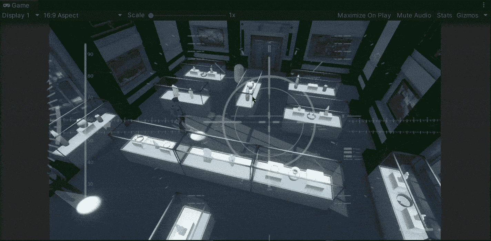

**目标**:将玩家移向地面上由鼠标点击定义的一个点。

在上一篇文章中，我介绍了[如何同步音频和视频来构建过场动画](/nerd-for-tech/synchronizing-audio-visuals-for-cutscenes-unity-2839947296f9)。现在，是时候实现播放器功能了，我们将使用 NavMesh 代理开始移动，它将通过简单的单击向定义的位置移动。

# 当前场景

首先，让我们看看当前的场景。有几个陈列柜，周围有警卫。每个游戏对象都在地板之上，其中包含一个网格碰撞器:

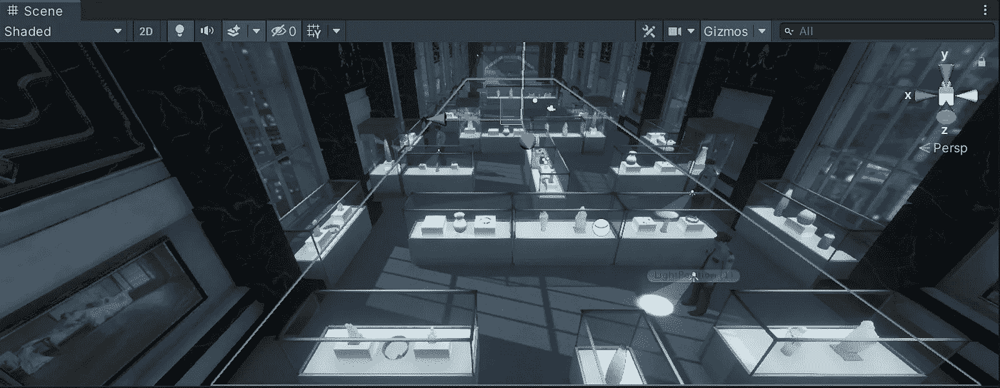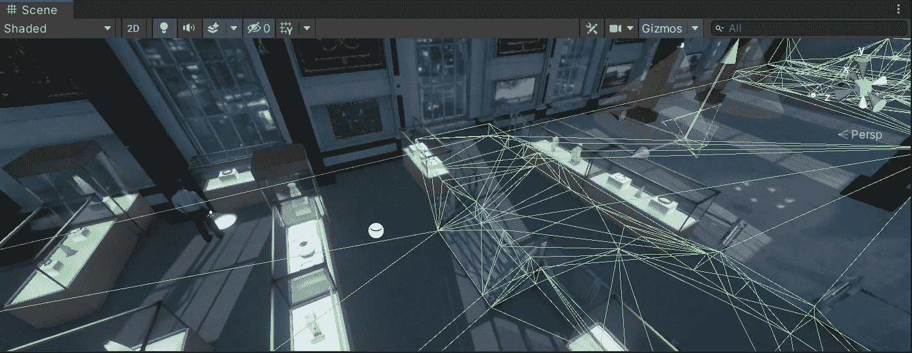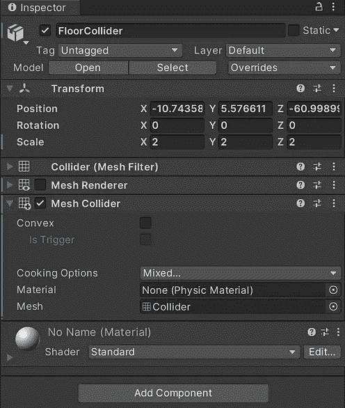

# 烘焙导航网

NavMesh 允许我们通过分析场景中静态的不同网格和地形来创建导航网格。所以，为了创建一个导航网格，我们应该通过*烘焙*来选择和处理影响导航的游戏对象。

为此，让我们通过点击*窗口> AI >导航*来打开导航窗口。窗口打开后，我们点击“烘焙”选项卡，根据需要修改属性，最后我们点击*烘焙*按钮:

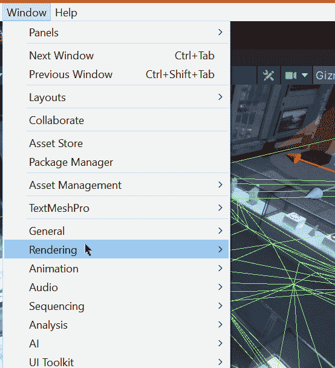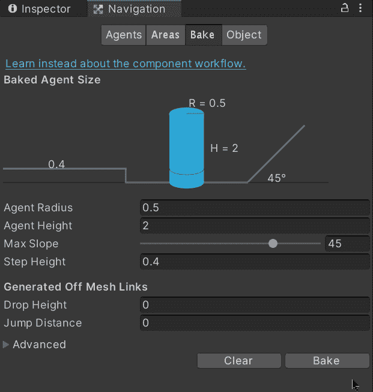

一旦地板完成烘焙，我们将能够通过场景窗口看到蓝色的导航网格。这是地板上可行走表面的近似值:

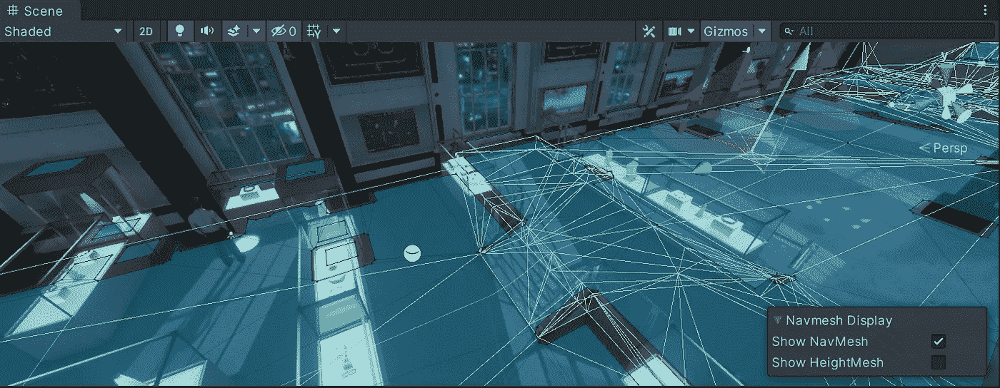

如果您想了解更多关于 ***NavMesh*** 的信息，您可以访问 Unity 文档:

 [## 构建导航网格

### 从层级几何体创建 NavMesh 的过程称为 NavMesh 烘焙。该进程收集渲染…

docs.unity3d.com](https://docs.unity3d.com/Manual/nav-BuildingNavMesh.html) 

# 测试导航网格

现在，为了测试烘焙的 NavMesh，我们将使用一个简单的胶囊来代表我们游戏中的玩家:

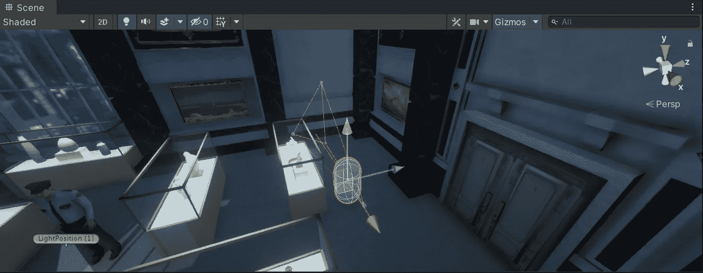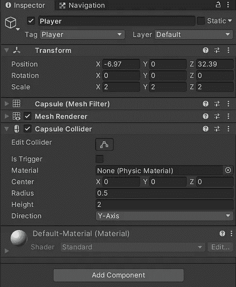

要使用导航网格来导航场景，我们需要将一个***导航网格代理*** 组件附加到胶囊:

如果您想了解更多关于 ***导航网代理*** 的信息，您可以访问 Unity docs:

 [## 创建 NavMesh 代理

### 一旦你有了 Unity 生成的一个网格来近似你环境中的可行走区域和障碍物…

docs.unity3d.com](https://docs.unity3d.com/Manual/nav-CreateNavMeshAgent.html) 

现在，为了移动胶囊，让我们创建一个新的**玩家**脚本并附加它:

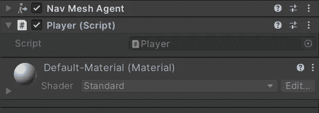

然后，为了能够处理 ***导航网格代理*** ，让我们打开脚本并将 AI 库包含到脚本中:

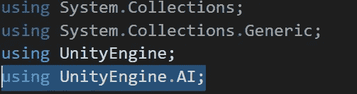

现在，让我们创建一个新的私有 **NavMeshAgent** 来存储播放器中组件的引用:

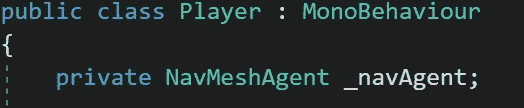

然后，在 **Start** 方法中，让我们通过使用 **GetComponent** 方法**来初始化变量，并对其进行空检查以遵循最佳实践:**

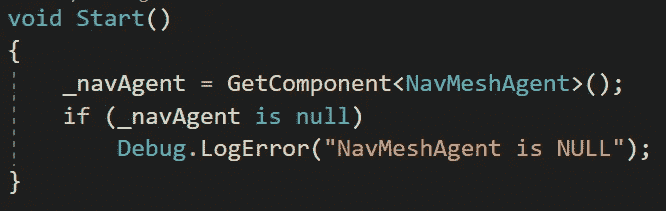

现在，为了移动播放器，让我们通过使用 **GetMouseButtonDown** 方法来检查 **Update** 方法中的左键单击输入:

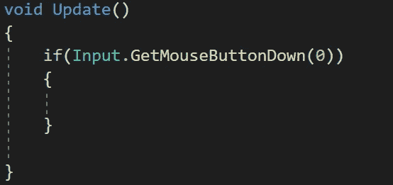

当游戏收到左击输入时，我们需要从主摄像机使用 **ScreenPointToRay** 方法创建一个新的光线。这种方法将允许我们从摄像机向屏幕点发送光线，该点将由鼠标光标的位置定义:

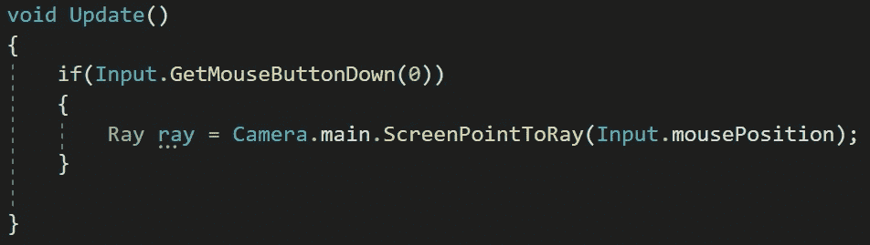

如果您想了解更多关于 **ScreenPointToRay** 方法的信息，您可以访问 Unity 文档:

 [## 相机。屏幕点存储

### 建议更改感谢您帮助我们提高 Unity 文档的质量。虽然我们不能接受所有的…

docs.unity3d.com](https://docs.unity3d.com/ScriptReference/Camera.ScreenPointToRay.html) 

一旦光线被创建，让我们通过使用**物理来检查它是否击中了什么东西(100 单位距离内的一个对撞机)。光线投射**法。如果射线碰到碰撞器，我们将在一个 **RaycastHit** 变量中得到结果。这个变量将包含关于 hit 的信息，我们将使用它来设置 ***导航网格代理*** 的目的地，方法是使用它的 **SetDestination** :

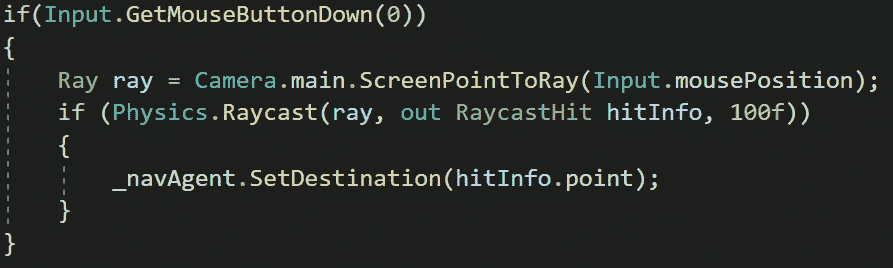

如果你想了解更多关于**物理学的知识。Raycast** 方法您可以访问 Unity 文档:

 [## 物理。光线投射

### 建议更改感谢您帮助我们提高 Unity 文档的质量。虽然我们不能接受所有的…

docs.unity3d.com](https://docs.unity3d.com/ScriptReference/Physics.Raycast.html) 

这样，每次我们输入左击，我们就能够将胶囊移动到光标位置:

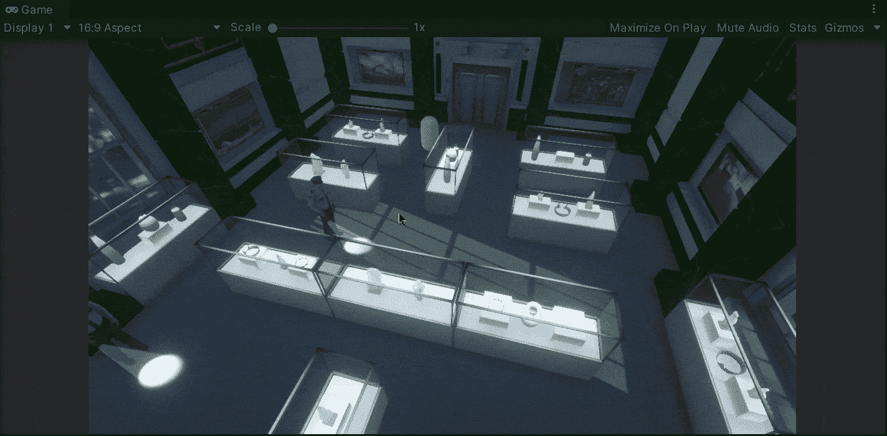

你会注意到胶囊可以穿过场景中的游戏物体。因此，如果要确保 NavMesh 包含场景中的障碍物，请选择所有障碍物:

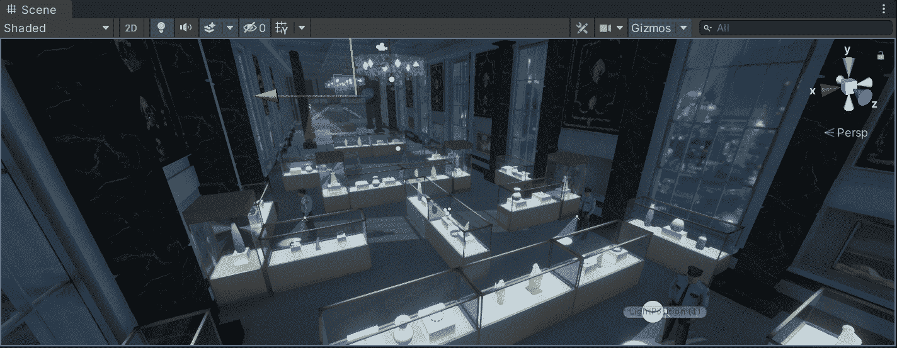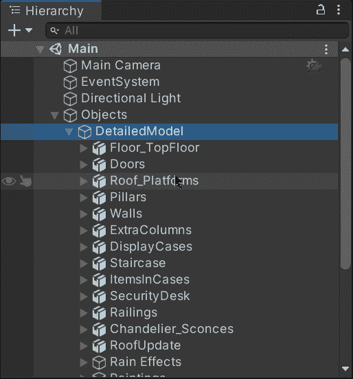

选中后，点击检查器右上角的**静态**复选框。这将使游戏对象及其子对象保持静态:

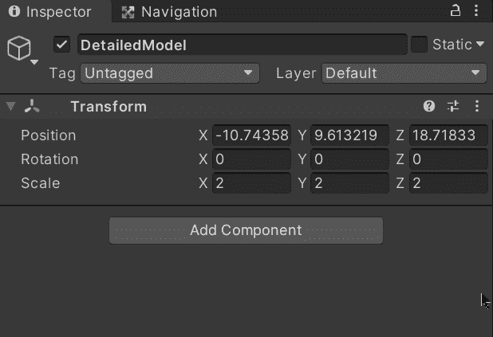

最后，要更新 NavMesh，再次打开*导航*窗口，点击左侧的*清除*按钮。然后，再次点击*烘焙*按钮，你会在你的场景视图中注意到新的 NavMesh:

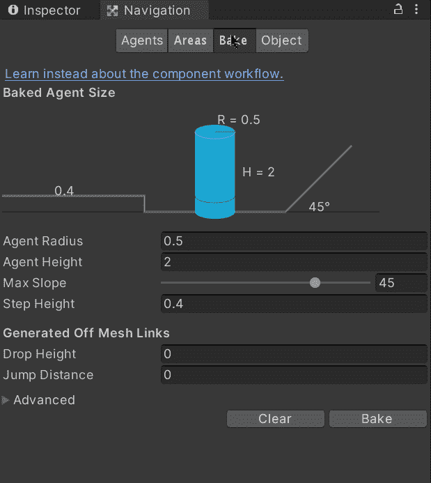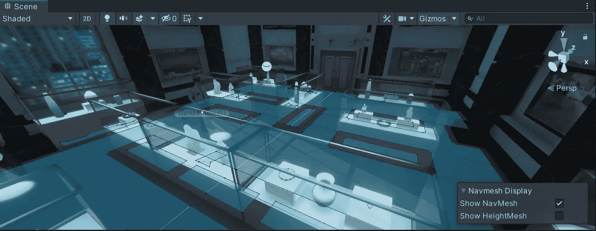

如果我们用 Unity 运行游戏，我们会注意到胶囊找到了一条不与静态游戏对象冲突的路径来到达它的目的地:

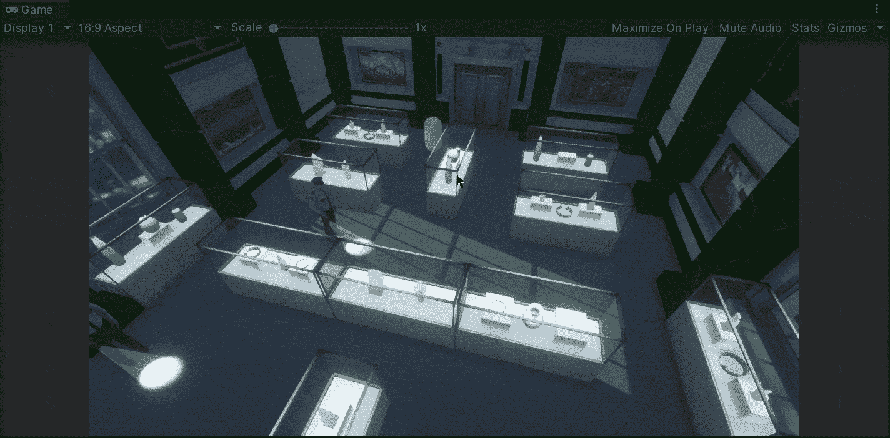

就是这样，我们可以用 Unity 点击移动玩家！:d .我将在下一篇文章中看到你，在那里我将展示如何使用 Unity 的动画系统来移动玩家及其相应的 3D 模型。

> *如果你想更多地了解我，欢迎登陆*[***LinkedIn***](https://www.linkedin.com/in/fas444/)**或访问我的* [***网站***](http://fernandoalcasan.com/) *:D**