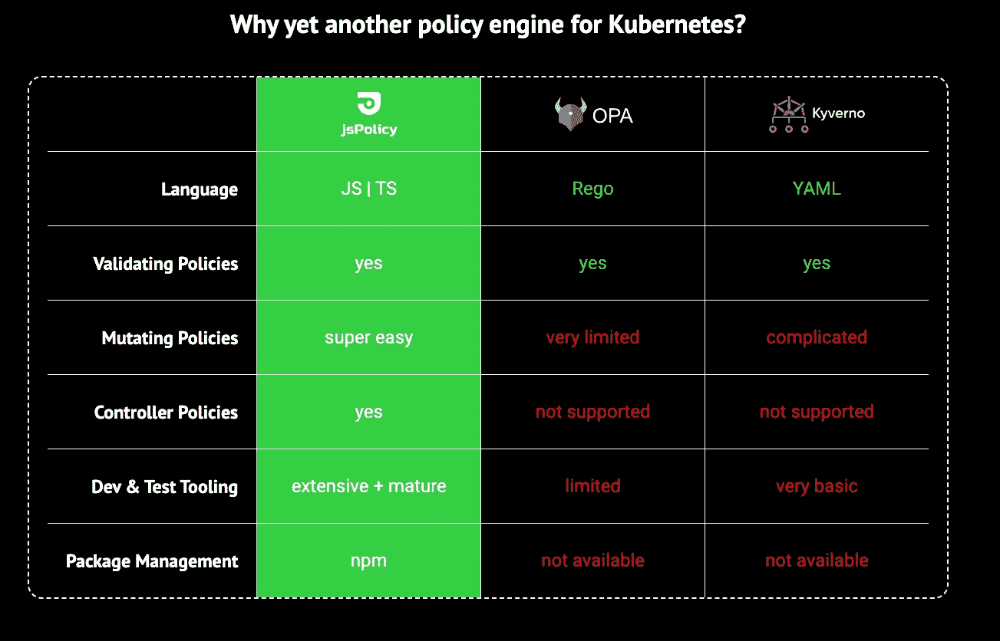
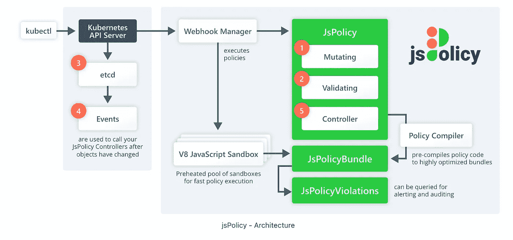
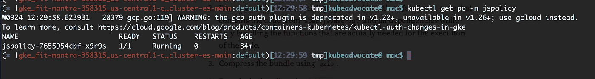
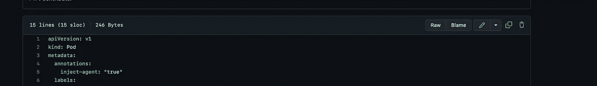
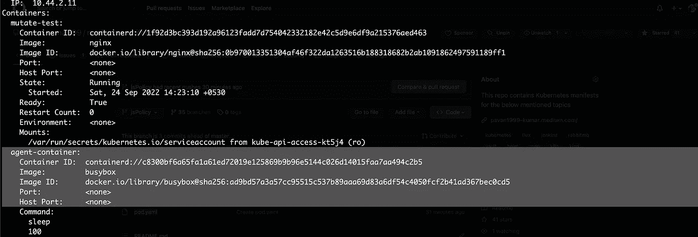

# 使用 jsPolicy 在 Kubernetes 中将策略作为代码

> 原文：<https://medium.com/nerd-for-tech/policies-as-code-in-kubernetes-using-jspolicy-8d358d064bfd?source=collection_archive---------0----------------------->

使用 jsPolicy 在 Kubernetes 中进行开发

库伯内特星团现在到处都是。要运行 ML 模型，您需要 Kubernetes 集群；要运行数据分析，您需要 Kubernetes 集群；要部署前端应用程序、后端应用程序或任何类型的应用程序，您都需要 Kubernetes 集群。但是您的集群安全吗？您曾经担心过集群的安全性吗？假设您正试图运行一些自动化脚本，它意外地删除了生产中的所有名称空间。嘣，这将是 DevOps 工程师一生中最漫长的一天。甚至想到这一点可能会让 DevOps 的工程师们感到不寒而栗。有办法避免这种情况吗？有没有有效控制这类灾害的方法？jsPolicy 来拯救。jsPolicy 是 Kubernetes 的一个策略引擎，允许您用 JavaScript 或 TypeScript 编写策略。



jsPolicy 的优势

## **js policy 的优势**

a) **闪电般的速度&安全的策略执行** : jsPolicy 通过谷歌的超高速 V8 JavaScript 引擎在一个预先加热的沙盒环境中运行策略。大多数策略执行起来甚至不需要一毫秒。

b) **伟大的策略语言** : JavaScript 是为处理和操纵 JSON 对象而生的(简称“JavaScript Object Notation”(！))而 Kubernetes 通过在每个 API 请求期间将您的 YAML 转换为 JSON 来使用 JSON。

# 整个故事是关于什么的？(TLDR)

1.  使用 jsPolicy 保护您的 K8s 集群。
2.  使用 jsPolicy 在 JavaScript 中创建安全策略。

# 先决条件

1.  一个 Kubernetes 集群(EKS、AKS、Kind 等)。

# 故事资源

1.  GitHub 链接:[https://github.com/pavan-kumar-99/medium-manifests](https://github.com/pavan-kumar-99/medium-manifests)
2.  GitHub 分支: [jsPolicy](https://github.com/pavan-kumar-99/medium-manifests/tree/jsPolicy)

## jsPolicy 安装和架构



jsPolicy 架构

# 成分

尽管 jsPolicy 在单个容器中运行其所有组件(当您增加副本数量以获得高可用性时，不考虑副本)，但 jsPolicy 在逻辑上由三个主要组件组成:

*   [Webhook 管理器](https://www.jspolicy.com/docs/architecture#webhook-manager)
*   [V8 JavaScript 沙盒池](https://www.jspolicy.com/docs/architecture#v8-javascript-sandbox-pool)
*   [策略编译器](https://www.jspolicy.com/docs/architecture#policy-compiler)

# Webhook 管理器

webhook 管理器负责向 Kubernetes API 服务器注册和管理许可 web hook，以便 API 服务器请求将应用定义为`JsPolicy`对象的变异和验证 web hook。

# V8 JavaScript 沙盒池

为了更快地执行策略代码，jsPolicy 维护了一个预热的 V8 JavaScript 沙箱池，可用于运行包含策略逻辑的 JavaScript 代码。

# 策略编译器

策略编译器是一个控制器，它监控`JsPolicy`资源，并为定义`spec.javascript`字段的所有`JsPolicy`对象创建和更新`JsPolicyBundle`对象。编译过程大概是这样的:

1.  检索`spec.dependencies`中指定的所有必需的`npm`包(类似于`npm install`下载常规 JavaScript 项目的`package.json`文件中指定的`dependencies`)
2.  运行`webpack`创建一个高度优化的 JavaScript 代码包，其中包含来自`spec.javascript`的代码和所有依赖项，同时只捆绑执行代码所需的函数。
3.  使用`gzip`压缩管束。
4.  使用`base64`对包进行编码。
5.  将`spec.bundle`中的包存储在各自的`JsPolicyBundle`对象中。

## 安装 jsPolicy

jsPolicy 在一个容器中运行它的所有组件。这可以很容易地安装使用舵图表。

```
$ helm install jspolicy jspolicy -n jspolicy --create-namespace --repo [https://charts.loft.sh](https://charts.loft.sh)
```



jsPolicy pods

## 是时候看看 jsPolicy 的实际应用了

这些策略有三种类型

a)变更:在 API 服务器执行认证和授权(RBAC)之后，变更策略作为`kubectl`请求的一部分被执行。变更策略的目的是改变请求中提供的有效负载(Kubernetes 对象),例如，在创建 pod 时自动添加一个边车容器。

b)验证:在执行变异策略之后，验证策略作为`kubectl`请求的一部分被执行。验证策略的目的是检查请求，然后拒绝或允许它。例如，如果名称空间是默认的，则拒绝创建 pod，或者如果图像来自公共储存库，则拒绝创建 pod。

c)控制器:与变更和验证策略不同，控制器策略不是 Kubernetes API 服务器请求生命周期的一部分。控制器策略由 Kubernetes 为 etcd 中集群状态的每次变化创建的`Events`触发，例如，在每个新创建的名称空间中自动创建某些资源(例如`LimitRange`、`NetworkPolicy`等)。)

让我们看看他们三人的行动。

## 变更策略:

这个 jsPolicy 说它属于变异类型(第 6 行)，并且在创建 pod 时适用(第 7、8 行)，并且该策略说如果正在创建的 pod 具有注释**“inject-agent”:“true”(第 10 行)**，那么 pod 应该通过一个额外的边车容器进行变异(第 16 行)。现在让我们创建策略和 pod 来测试这一点。

```
$ git clone [https://github.com/pavan-kumar-99/medium-manifests.git](https://github.com/pavan-kumar-99/medium-manifests.git) \
-b jsPolicy$ cd medium-manifests$ kubectl apply -f [mutate-policy.yaml](https://github.com/pavan-kumar-99/medium-manifests/blob/jsPolicy/mutate-policy.yaml)$ kubectl apply -f [pod.yaml](https://github.com/pavan-kumar-99/medium-manifests/blob/jsPolicy/pod.yaml)
```



pod 具有所需的注释，并且现在应该创建了两个容器(并且边车被自动变异)。



边车自动注入

## 验证策略:

让我们删除之前创建的 pod，然后应用验证策略。

默认拒绝

验证策略要求拒绝在默认命名空间中创建任何资源。

```
$ git clone [https://github.com/pavan-kumar-99/medium-manifests.git](https://github.com/pavan-kumar-99/medium-manifests.git) \
-b jsPolicy$ cd medium-manifests## Delete the Pod created earlier$ kubectl delete -f [pod.yaml](https://github.com/pavan-kumar-99/medium-manifests/blob/jsPolicy/pod.yaml)## Apply the validation webhook$ kubectl apply -f [default-ns-deny.yaml](https://github.com/pavan-kumar-99/medium-manifests/blob/jsPolicy/default-ns-deny.yaml)
```

现在让我们再次尝试创建相同的 pod。

```
$ kubectl apply -f [pod.yaml](https://github.com/pavan-kumar-99/medium-manifests/blob/jsPolicy/pod.yaml)
```

> **服务器出错(禁止):创建“pod”时出错。YAML ":admission web hook " deny-default-namespace . devsecops . com "拒绝了请求:不允许在默认命名空间内创建资源！**

当您尝试在默认名称空间中创建任何资源时，您将会看到这种情况。

## 控制器策略:

在本例中，我们将尝试在创建名称空间时自动创建资源配额。假设命名空间应该有标签**“create-rq”:“true”。**

```
$ git clone [https://github.com/pavan-kumar-99/medium-manifests.git](https://github.com/pavan-kumar-99/medium-manifests.git) \
-b jsPolicy$ cd medium-manifests$ kubectl apply -f [controller-policy.yaml](https://github.com/pavan-kumar-99/medium-manifests/blob/jsPolicy/controller-policy.yaml)## Let us now create the namespace with the required labels$ kubectl apply -f [namespace.yaml](https://github.com/pavan-kumar-99/medium-manifests/blob/jsPolicy/namespace.yaml)
```

一旦创建了名称空间，您会发现 ResourceQouta 也会自动创建。


自动创建资源配额

这就是如何利用 jsPolicy 在 JavaScript 和 TypeScript 中使用 jsPolicy 编写各种类型的策略。请在评论区分享你在制定这些政策时的经验。

直到下一次…..

# 被推荐的

[](/nerd-for-tech/mlops-machine-learning-pipelines-using-kubeflow-fc06508a3f0d) [## MlOps:使用 kubeflow 的机器学习管道

### 使用 Kubeflow 对 Kubernetes 进行有效的 MLOps

medium.com](/nerd-for-tech/mlops-machine-learning-pipelines-using-kubeflow-fc06508a3f0d) [](https://pavan1999-kumar.medium.com/hashicvault-secrets-in-kubernetes-with-csi-driver-ec917d4a2672) [## 与 CSI 司机在 Kubernetes 哈希克沃特秘密

### 使用 Vault CSI 驱动程序向 Kubernetes Pods 注入秘密

pavan1999-kumar.medium.com](https://pavan1999-kumar.medium.com/hashicvault-secrets-in-kubernetes-with-csi-driver-ec917d4a2672) [](/nerd-for-tech/terraforming-the-gitops-way-9417cf4abf58) [## 地球化吉托普斯之路！！！

### 使用 Atlantis(拉式请求自动化)通过 GitOps 建立 Terraform。

medium.com](/nerd-for-tech/terraforming-the-gitops-way-9417cf4abf58) [](/nerd-for-tech/using-hashicorp-vault-as-a-certificate-issuer-in-cert-manager-9e19d7239d3d) [## 在证书管理器中将 Hashicorp Vault 用作证书颁发者

### 在证书管理器中将 vault PKI 后端配置为证书提供商

medium.com](/nerd-for-tech/using-hashicorp-vault-as-a-certificate-issuer-in-cert-manager-9e19d7239d3d)