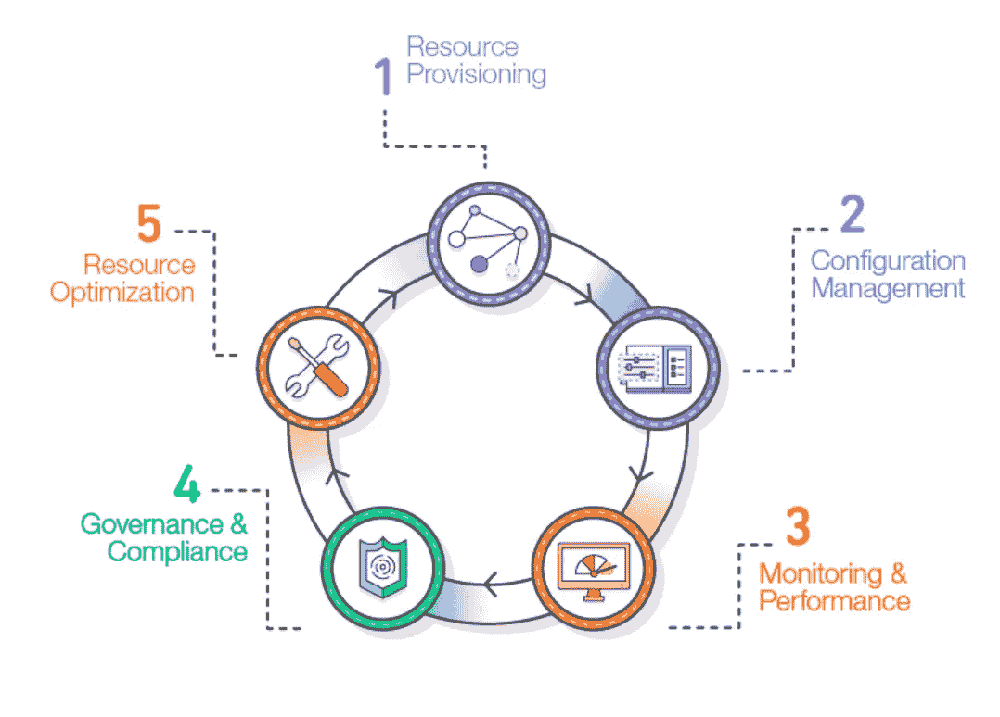
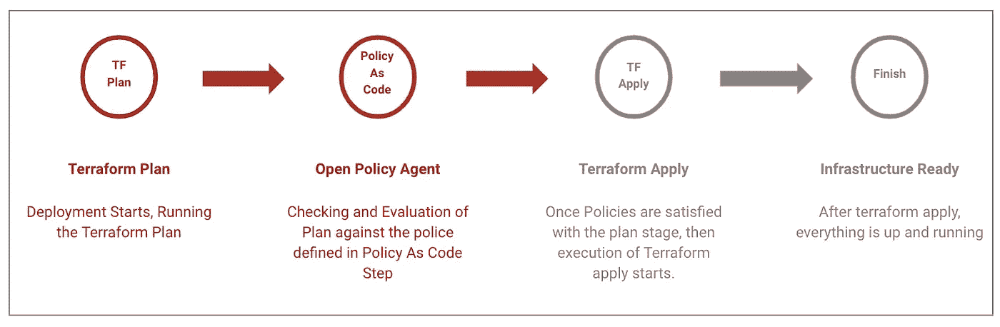

# 策略即代码—云本机堆栈中的开放策略代理

> 原文：<https://medium.com/nerd-for-tech/policy-as-code-open-policy-agent-in-cloud-native-stack-5a7b7266db06?source=collection_archive---------8----------------------->

当我们想到端到端自动化任何流程时，我们想到的是自动化该特定流程的每一个末端。我们脑海中闪现的一个术语是，我们在整个过程或管道中“不需要人工干预”。作为 DevOps 和云爱好者，让我们考虑在任何云提供商(AWS、谷歌云平台或微软 Azure)或任何裸机服务器或机器集群上部署基础设施。目前有许多工具和技术可以以优化的方式灵活地实现基础架构的自动化和资源调配。

此外，我们将**基础架构的概念作为代码**，这是通过声明性配置文件管理和配置基于云的系统或此类基础架构的明确流程，而不是物理硬件配置或一些其他配置管理工具。我们有几个工具可以在不同的平台上实现自动化和流程编排。我们有不同的工具范围，从开源解决方案到基于企业级 SaaS 的应用程序。在这篇博客中，我们将了解 OPA(开放策略代理)，它是开源**“策略即代码”**测试工具。

# 开放策略代理(OPA)

它是一个开源工具，为我们提供了策略即代码的概念，通过在基础设施代码进入生产环境之前对其进行评估，帮助我们快速测试专门为任何基础设施定义的策略和规则。例如，我们可以将其视为一个预部署步骤，首先检查策略和法规，然后发送部署特定基础架构的执行命令。OPA 只是为我们提供了基于策略的控制，用于云原生环境和类似的堆栈。OPA 的使用可以作为一个统一的工具集和框架，用于跨云原生堆栈的策略。

如果您只考虑您的一个服务或整个堆栈中的所有服务，可以使用 OPA 将策略从服务代码中分离出来，这样您就可以发布、分析和审查策略，而不会影响基础架构的可用性或性能。

在这篇博客中，我们将探讨用不同的供应和自动化工具实现 OPA。

# **将 OPA 与 Terraform 供应工作流程合并**

Terraform 是一个著名的开源工具，它使用**基础设施的概念作为代码**，用于许多云、基础设施或此类服务的自动化和供应。它由 HashiCorp 开发，可为任何应用提供一致的工作流来配置、保护、连接和运行任何基础设施。



图 1:来自 [AWS 文档](https://d1.awsstatic.com/whitepapers/DevOps/infrastructure-as-code.pdf)的典型基础设施资源生命周期

借助 terraform 配置中的 OPA，我们可以轻松地编写策略，在 Terraform 做出更改之前测试它将要做出的更改。这些特定的测试可以帮助我们检查要应用的更改的健全性，此外，它可以减少同行审查的负担，使流程完全自动化，并有助于在将 Terraform 应用于试运行后发现在将它应用于生产时出现的问题。

# 使用 OPA 测试您的地形配置

OPA 在实际供应任何基础设施之前充当了一个关口，因此团队可以很容易地在最早的时机发现合规性问题。下面是一个工作流，它使用 OPA 来确定给定的 Terraform (TF)代码在管道中是否有效。



使用开放策略代理执行地形配置的管道。

# **测试微软 Azure Terraform 配置的示例**

在这里，我们可以获取 terraform 的一个示例配置，它创建了创建虚拟机所需的少量资源，为了全面了解使用 Azure 的 terraform 配置，您可以在这里查看。

1) **首先创建一个样本 terraform 代码，以便在 Azure 环境中配置虚拟机。**

```
# Configure the Microsoft Azure Providerterraform {
  required_providers {
     azurerm = { # Configure the Microsoft Azure Providerprovider "azurerm" {
   features {}
}# Create virtual machine
resource "azurerm_linux_virtual_machine" "myterraformvm" {
    name                  = "myVM"
    location              = "eastus"
    resource_group_name   = "test-resource-group"
    network_interface_ids = "xxxxx"
    size                  = "Standard_A0"
    os_disk {
        name                 = "myOsDisk"
        caching              = "ReadWrite"
        storage_account_type = "Standard_LRS"
        disk_size_gb         = "30"
    }
    source_image_reference {
        publisher = "Canonical"
        offer     = "UbuntuServer"
        sku       = "18.04-LTS"
        version   = "latest"
    }
    computer_name  = "myvm"
        admin_username = "azureuser"
        disable_password_authentication = true
    admin_ssh_key {
        username       = "azureuser"
        public_key     = file("")
    }
    tags = {
        environment = "Demo"
    }
}
```

这里使用这个 terraform 脚本创建了一个 Azure 虚拟机，特别是 Ubuntu 18.04-LTS。

**2)设置好配置后，我们将执行地形规划，输出为二进制文件。**

```
terraform init
terraform plan --out tfplan.binary
```

**3)向前移动，将 terraform 计划转换为 JSON，有几个选项，这里是** [**一个**](https://github.com/palantir/tfjson) **:**

```
tfjson tfplan.binary > tfplan.json
```

现在到了我们必须编写策略检查的部分。

例如，我们可以检查资源类型(尤其是 vm_size 参数)。我们已经使用 terraform 代码创建了上面的虚拟机，其中包含我们想要的虚拟机大小，即`Standard_A0`。为此，我们将编写一个. rego 文件，可以是 instance_check.rego。

**什么是减压阀，**这是用来编写《外地加工措施政策》的语言。这里可以了解更多关于 rego 的信息。OPA 提供了一个在线互动环境，我们可以在这里测试政策。这里你可以看一下。

```
# Multi proivder rule to enforce instance type/sizepackage terraform.analysisimport input.tfplan as tfplan# Allowed sizes by provider
allowed_types = {
    "azurerm": ["Standard_A0", "Standard_A1"],
}# Attribute name for instance type/size by provider
instance_type_key = {
    "azurerm": "vm_size",
}array_contains(arr, elem) {
  arr[_] = elem
}get_basename(path) = basename{
    arr := split(path, "/")
    basename:= arr[count(arr)-1]
}# Extracts the instance type/size
get_instance_type(resource) = instance_type {
    provider_name := get_basename(resource.provider_name)
    instance_type := resource.change.after[instance_type_key[provider_name]]
}deny[reason] {
    resource := tfplan.resource_changes[_]
    instance_type := get_instance_type(resource)
    provider_name := get_basename(resource.provider_name)
    not array_contains(allowed_types[provider_name], instance_type)reason := sprintf(
        "instance type %q is not allowed",
        [instance_type]
    )
}
```

现在，您可以在 Mac 或任何其他操作系统上运行以下命令，以评估您编写的策略；

```
opa eval — format pretty — data instance_check.rego — input tfplan.json "data.terraform.analysis"
```

**5)输出:**

输出将是原因，因为我们已经在`instance_type.rego`文件中为`reason`设置了打印命令。如果实例类型不匹配，它将像这样打印；

```
"instance type Standard_B1s is not allowed"
```

# 简单地

在了解了使用 OPA 和 terraform 的强大功能后，人们可以很容易地想到将其用作部署前检查，或者在应用 terraform 计划之前使用 OPA，并检查特定项目的所有策略，以便对基础架构进行良好的控制。这是一个强大的组合，可用于调配云基础架构和设置云实例。使用 OPA 的优势之一是它是开源工具，可以免费使用。此外，还有许多其他选项可用，如将 [OPA](https://www.openpolicyagent.org/docs/latest/) 与 Kubernetes、Docker、Prometheus 和其他此类工具和技术一起使用。希望这可以帮助您的研究或您对如何在没有任何手动或人工干预的情况下自动执行策略的兴趣。

这里列出了许多已经制定的 OPA 样本政策[。虽然也可以写他的手动策略检查。rego 文件。因此，请保持基础架构创建和配置流程的自动化。](https://github.com/Scalr/sample-tf-opa-policies)