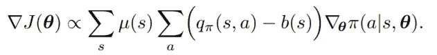
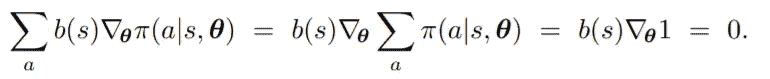
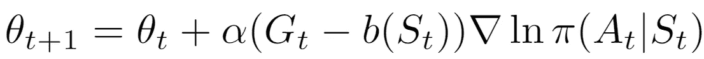
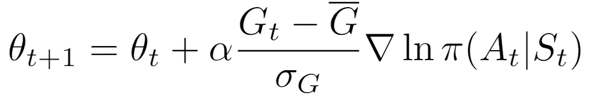
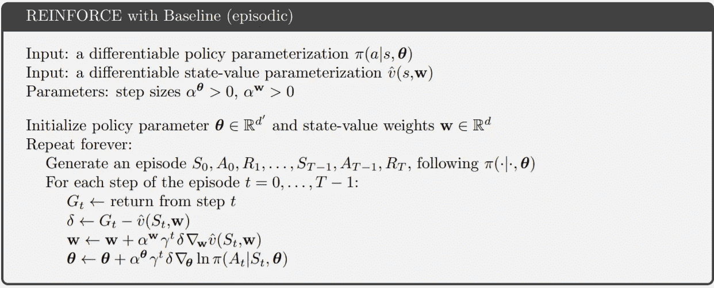
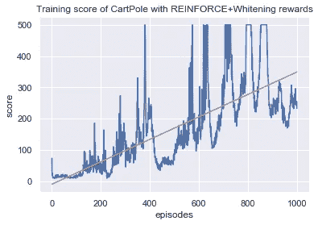
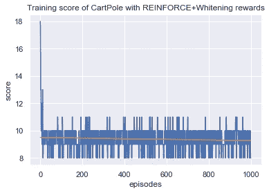
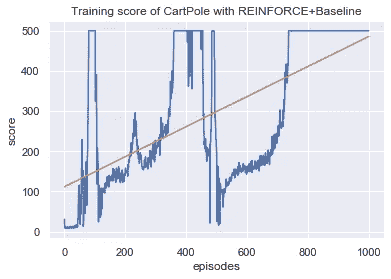
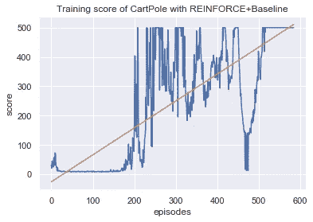
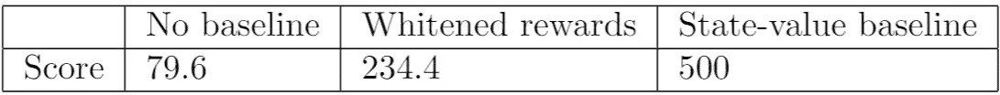

# 政策梯度:用基线加强

> 原文：<https://medium.com/nerd-for-tech/policy-gradients-reinforce-with-baseline-6c871a3a068?source=collection_archive---------2----------------------->

在对增强算法进行了[介绍之后，我想进一步探索一下这个从策略梯度定理派生出来的简单算法。在这篇文章中，我将用基线和一些小的修改来实现增强，并在 CartPole 环境中测试它。在文章的最后，我回顾了我在使用 Pytorch 库时遇到的一些错误。](/nerd-for-tech/reinforcement-learning-introduction-to-policy-gradients-aa2ff134c1b)


摘自萨顿&巴尔托 2017

回想一下我们推导出的政策梯度定理。我们已经确定了样本梯度的期望值等同于实际梯度，因此我们可以重新编写一个包含样本动作和样本状态的更新方程。这让我们想到了这个:


在我们的实现中，我们使用神经网络来帮助我们更新参数，并对负梯度执行“梯度下降”，这基本上只是执行梯度上升的一种变通方法。然而，在训练了 1000 集之后，我们只能在代理人玩所学政策的 50 集上获得 79.6 的平均分数。在查看了训练历史之后，我们可以注意到训练分数有很高的变化，分数突然达到 400 以上，然后立即下降。强化方法的缓慢学习速度和高方差使我们有了一个改进的变体:基线强化。

在政策梯度定理的基础上扩展，我们可以通过增加一个从国家行为价值函数中减去的任意基线函数来进一步推广该定理。



摘自萨顿&巴尔托 2017

这还是和之前推导的定理一样，b(s) = 0。我们可以用任意函数甚至常数来代替 b(s)函数，只要它不随 a 变化，这是因为被减的量等于零，如下所示，所以定理仍然成立。



摘自萨顿&巴尔托 2017

我们的更新等式也将随着基线函数而改变，如下所示:



现在是最重要的问题:基线函数应该是什么？我们可以使用的一个非常简单的基线是对奖励应用[白化变换](https://en.wikipedia.org/wiki/Whitening_transformation)。如果你看过 naive REINFORCE 的其他实现，大多数都使用这种技术来减少差异，消除奖励中的偏差，但这也是一种基线函数，我们可以用它来修改更新函数。



我们可以使用的更复杂的基线是状态值函数。由于这个算法的学习是间断的，我们可以使用一个状态值函数，它也是间断倾斜的。Gₜ - (Sₜ)只是时间步长 t 的折现回报和我们的状态价值函数认为的回报之间的差额。这也是我们调整状态函数参数的一个简单方法。我们可以从萨顿和巴尔托的教科书中看到用基线加固的伪代码:



# 实施情况和结果

对于我的实现，我使用我以前的代码作为基础，并对它进行了一些清理。我使用策略网络来学习参数θ，使用单独的网络来学习参数 w。为了更新状态值函数参数，我改为使用均方误差来计算 Gₜ和 v(Sₜ之间的差异。下面是对我的社交网络的一个快速浏览:

```
class PolicyNetwork(nn.Module):

    #Takes in observations and outputs actions
    def __init__(self, observation_space, action_space):
        super(PolicyNetwork, self).__init__()
        self.input_layer = nn.Linear(observation_space, 128)
        self.output_layer = nn.Linear(128, action_space)

    #forward pass
    def forward(self, x):
        #input states
        x = self.input_layer(x)

        #relu activation
        x = F.relu(x)

        #actions
        actions = self.output_layer(x)

        #get softmax for a probability distribution
        action_probs = F.softmax(actions, dim=1)

        return action_probs
```

国家价值网络:

```
class StateValueNetwork(nn.Module):

    #Takes in state
    def __init__(self, observation_space):
        super(StateValueNetwork, self).__init__()

        self.input_layer = nn.Linear(observation_space, 128)
        self.output_layer = nn.Linear(128, 1)

    def forward(self, x):
        #input layer
        x = self.input_layer(x)

        #activiation relu
        x = F.relu(x)

        #get state value
        state_value = self.output_layer(x)

        return state_value
```

以下是我在这个算法中使用的超参数:

*   γ(折扣系数):0.99
*   剧集数量:1000
*   最大步数:10000
*   α(政策 LR): 0.01
*   β(值 LR): 0.1

让我们先来看看使用美白奖励的简单基线的结果:



我们的经纪人在 50 集的比赛中，按照我们所学的策略，取得了 234.4 的平均分数。这比用朴素的强化算法得到的 79.6 分要好。然而，仅使用白化奖励仍然给我们训练分数带来很高的方差。事实上，在一次试验中，模型参数停留在次优的局部最大值:



让我们看看使用学习的状态值函数作为基线的结果:



我们的代理在 50 集里取得了 500 分的平均分，这是使用我们所学政策的最高分！这远远好于没有基线的 79.6 的平均分。下面是我们代理的一个快速演示:


看训练历史，很明显分数有上升趋势。虽然还有些不稳定，但远不如之前那种上下波动不断的训练历史。我们还可以在训练历史中观察到一种模式。代理在 100 集左右达到 500 的得分平台，然后下降并“重新学习”，直到第 400 集再次下降。这种模式在 1000 集里不断重复。这种行为可以用 Q-learning 中发生的类似现象来解释，我们通过经验回放解决了这一问题，称为[灾难性遗忘](https://en.wikipedia.org/wiki/Catastrophic_interference)。网络被调整以适应新的输入并“忘记”旧的输入，这可能导致性能崩溃。我们可以适应这种情况的一种方法是实现代理停止训练的一些条件，以防止过度适应。

根据 [CartPole 文档](https://github.com/openai/gym/blob/master/gym/envs/classic_control/cartpole.py)，当代理在过去 100 集的平均得分为 195 时，环境被视为已解决。如果我们看看我们的培训历史，我们的网络在不到 100 集的培训中轻松获得了 195 分。让我们将已解决的分数提高到 450，并留有一些变动余地。



我们能够在仅仅 584 集内实现一个最佳策略，训练速度提高了大约 50%!在 50 集的测试中，我们得到了 500 分的平均分，这是最高分。

在没有提前停止的情况下查看训练历史，我们可以观察到学习模式中的巨大差异。在这次运行中，代理在稳定在 500 集左右之前获得了高方差的最高分。在之前的训练历史中，在崩溃之前，有三个代理在第 100、350、700 集学习最优策略的实例。结果的不良再现性是由于强化的随机性质，并且仍然是强化学习领域中的一个大问题。我又进行了四次实验，并在 5 次试验中获得了 400.6 集的平均停止点，所有试验在 50 集内的平均得分为 500。



# 最后的想法

虽然我并不期望在这上面花很长时间，但是由于我对这个库缺乏了解，我确实在 Pytorch 上遇到了很多 bug。当我在更新价值网络后试图反向传播我的策略网络时，我不断遇到一个错误:*“运行时错误:试图第二次反向浏览图表…”。*这是因为我没有使用张量来计算我的保单损失，而是试图调用 loss.backward()。

那么这里出了什么问题呢？在 Pytorch 中，张量不仅用于执行类似 NumPy 数组的操作，而且它还跟踪张量输入和张量上使用的函数，形成一个直接非循环图，其中根是张量的最终输出，叶节点是输入张量。当我们调用 loss.backward()时，Pytorch 通过从 loss(根节点)遍历到叶节点进行反向传播，有点像链式法则。由于没有使用张量来计算保单损失，该网络不知道如何反向传播，并认为我正试图通过价值网络形成的 DAG 第二次反向传播。

总的来说，我从我所认为的强化的短期延续中学到了很多，并希望能够慢慢建立起更先进的政策梯度方法，以应对持续的行动空间。

我的代码:[https://github . com/cheng i600/rl stuff/blob/master/Policy % 20 gradients/REINFORCE-baseline . ipynb](https://github.com/chengxi600/RLStuff/blob/master/Policy%20Gradients/REINFORCE-Baseline.ipynb)

参考资料:

*   [强化学习:导论(萨顿&巴尔托 2017)](http://incompleteideas.net/book/bookdraft2017nov5.pdf)