# 使用 Python FastApi WebSockets、PyMongo、HTML 和 JavaScript 实时轮询 web 应用程序

> 原文：<https://medium.com/nerd-for-tech/polling-web-application-with-python-fastapi-websockets-pymongo-html-javascript-832c931eca59?source=collection_archive---------1----------------------->

> 让我们通过使用这些
> 1 来构建一个全栈实时投票 web 应用程序。 **Python 的 FastApi
> 2。Websockets。
> 3。**py mango
> 4。HTML，CSS，JavaScript 。
> **5。**[**chart . js**](https://www.chartjs.org/)**(**对于轮询图，我们要用**)。**

[](https://www.freepik.com/vectors/background)

[rawpixel.com 创建的背景向量](https://www.freepik.com/vectors/background)

坚持住！难道我刚才说的是 **WebSockets** 🤨？

## 以下是 WebSockets 的原因:

我们都知道，我们可以使用 Http 调用将用户的投票发送到服务器。但是如果你想建立一个实时的网络应用程序，我们需要使用 WebSockets。让我解释清楚:

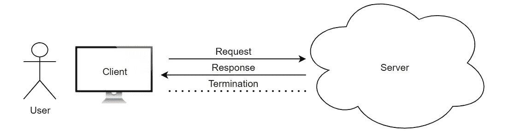

Http 协议工作流

当我们使用 Http 协议作为我们的数据传输机制时，Http 协议是单向的。这意味着服务器只有在客户端请求时才会发送数据&关闭连接。
即，将为每个 HTTP 请求创建一个新的 TCP 连接。

# WebSockets

**WebSockets** 是**双向**连接，它创建一个有状态协议，这意味着客户端&服务器之间的连接可以保持活动。所以我们不需要为每个服务器请求创建一个新的 TCP 连接，相反我们可以使用相同的连接。

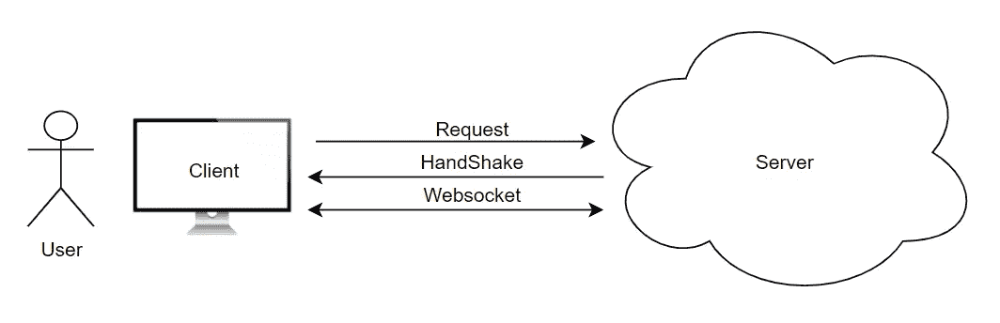

WebSocket 协议工作流

> 我从这篇精彩的文章(什么是 web socket，它与 HTTP 有什么不同？)，查看此[条](https://www.geeksforgeeks.org/what-is-web-socket-and-how-it-is-different-from-the-http/)

# 使用 FastAPI Websockets、Html 和 JS 轮询网站

我们用 Python 的 **FastAPI WebSockets & Html，js(尤其是 chart.js)搭建一个披萨 vs 汉堡投票网站。**

这是我们输出的图像。

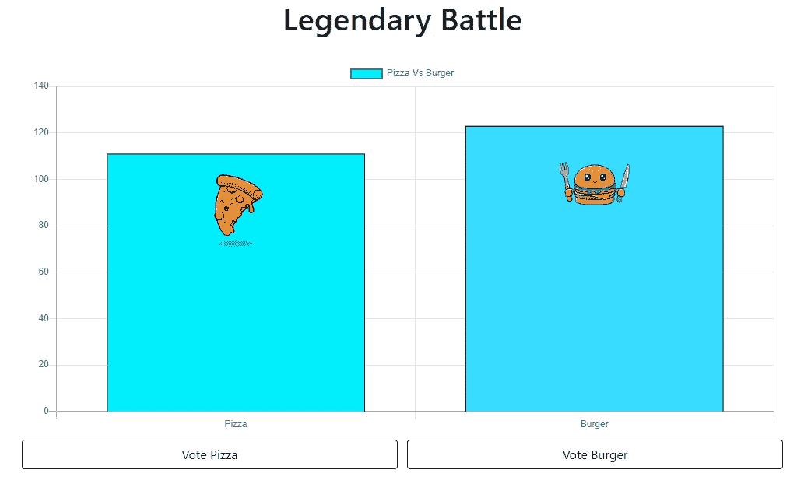

比萨 vs 汉堡实时轮询应用程序示例输出

## 我们将首先构建我们的后端

注意:在创建我们的项目之前。我只是想让你知道，在这个项目中，我将只使用 3 个文件。
1。application.py(这里我写 websocket apis，是 M **iddleware** )。
2。pizzaVsburger.html(这里我将写 html 代码，显示如上图的条形图，它是**前端**)。
3。main.js(这里将编写我们的 javascript 功能)。
4。我将使用 MongoDB 作为我们的数据库，来存储我们的用户投票。(**后端**)

我将反复修改这三个文件中的代码。你在这里看到的任何代码块，它们只属于这些文件。我还会提到代码块所属的文件名。

## 设置项目的虚拟环境

让我们创建名为 **pizzaVsburger** 的项目文件夹。在该文件夹中，我们将设置项目的虚拟环境。
我假设你已经在本地机器上安装了**python**&**virtualenv**。如果没有，请按照本指南进行安装。
然后我们将创建我们的**后端虚拟环境**，其中将安装您项目的所有后端 python 依赖项。
运行该命令:

```
virtualenv backend
```

运行该命令后，将创建包含 2 个子文件夹(Lib & Scripts)& a . git ignore & pyvenv . CFG 文件的后端文件夹

我们需要安装一些依赖项，这样我们就可以编写我们的后端 API。在命令提示符下运行这些命令。

```
backend\Scripts\activate
pip install fastapi "uvicorn[standard]" numpy
```

**FastAPI** 编写我们的后端 API&**uvicon**为我们的应用程序创建 ASGI 服务器。

## 使用 FastAPI 编写 WebSocket APIs

接下来，我们需要在后端文件夹中创建一个 **application.py** 文件，在这里我们将编写我们的 WebSocket APIs。

我正在设置与 MongoDB 客户端的连接，这样我们就可以存储用户投票并初始化应用程序。

```
from fastapi import **FastAPI**
from pymongo import **MongoClient**

**# App initialization**
app = FastAPI()

**# Setting up connection with MongoDB**
**client** = MongoClient("mongodb://localhost:27017/")
**database** = client["pizzaVsburger"]
**# database's table which stores the user votes.
collection** = database["votes"] 
```

> 我们已经连接了 **MongoDB** ，接下来我们需要一个默认端点，它返回我们的投票 **html 页面** &我将其命名为 pizzaVsburger.html**。**
> 
> **所以我们需要从 **fastapi.templating** 中导入并使用 **Jinja2Templates** 来返回 html 文件作为输出。**

```
from fastapi import FastAPIfrom fastapi.templating import Jinja2Templates
from pymongo import MongoClient

**# App initialization**
app = FastAPI()

**# Setting up connection with MongoDB**
**client** = MongoClient("mongodb://localhost:27017/")
**database** = client["pizzaVsburger"]
**# database's table which stores the user votes.
collection** = database["votes"]**# Templates directory, in which our html & javascript files are stored.**
templates = Jinja2Templates(directory="templates")
app.mount("/templates", StaticFiles(directory="templates", html=True), name="templates")**# API which returns HTML file as response.** @app.websocket("/")
async def get(request: Request):
 **# Here in list 1 represent pizza's vote & 0 represents burger's.**    votes = [1,0]
    return templates.TemplateResponse("pizzaVsburger.html", {'request': request, 'votes', })
```

**让我们运行上面的代码，检查下面的命令。**

```
uvicorn application:app --reload
```

**运行上述代码后，application.py 文件在**默认端口 8000** 上运行。**

**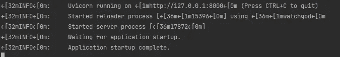**

**使用 uvicorn 在本地运行 fastapi**

**下面是点击 [http://localhost:8000](http://localhost:8000) 后的输出**

**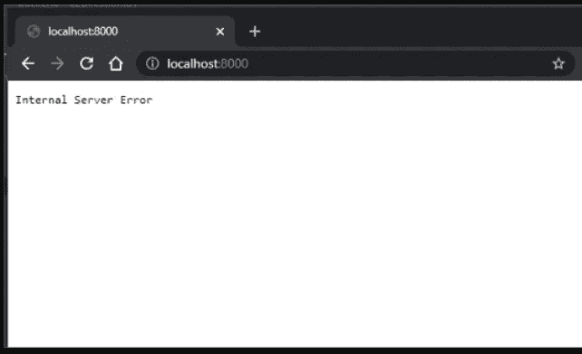**

**披萨与汉堡投票应用程序出错**

**如果我们在模板目录中有**pizzaVsburger.html**文件，上面的代码是有效的。所以我们需要创建**模板**文件夹在后台目录【pizzaVsburger.html】中添加**文件**在里面。**

## **让我们为投票应用程序编写 HTML 代码**

**创建**pizzaVsburger.html 文件后，**添加这段代码。这是我们项目的前端部分。**

```
<html lang="en">
   <head>
      <title>Pizza Vs Burger</title>
      <script src="./templates/js/main.js"></script>
   </head>
   <body>
      <div style="width:50%; display: block; margin: 0px auto; text-align: center;">
         <h1>Legendary Battle</h1>
      <d
   </body>
</html>
```

**让我们刷新页面，然后我们得到这个**

**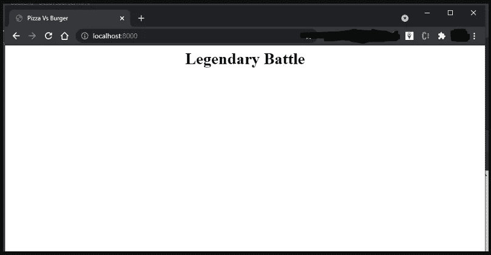**

**比萨 vs 汉堡投票 web 应用程序的基本 Html 页面。**

**实际工作开始了。我们已经准备好了 websocket & html 页面，剩下的工作是一个条形图，它显示了投票&一个在 MongDB 中存储数据(用户投票)的端点。**

## **让我们编写一个 API，它将投票存储在 MongoDB 的投票表中。将这些内容添加到 application.py 文件中**

```
@app.websocket("/sendVote")
async def user_vote(websocket: WebSocket):
    ***"""
    This is a websocket method, which responds to the call /sendVote.
    Client will use this websocket api as a medium to send their votes.
    """***await websocket.accept()
    try:
        while True:
            data = await websocket.receive()
            if data['type'] != 'websocket.disconnect':
                vote = {
                    'pizza': 1,
                    'burger': 0
                } if data['text'] == 'pizza' else {
                    'pizza': 0,
                    'burger': 1
                }
                add_vote(vote)

            await websocket.send_json(data)
    except Exception as ex:
        return exdef add_vote(vote):
    ***"""
    This method stores the user votes in 'votes' table of pizzaVsburger database in MongoDB
    """***collection.insert_one(vote)
```

**从上面的代码中，当我们点击上面的端点“/sendVote”时，我们从 javascript 中发送“pizza”或“burger”作为**数据[‘text’]的**值。
我们在 **main.js** 中的 javascript 代码。**

```
var ws = new WebSocket("ws://localhost:8000/sendVote");/**
Function will be called on clicking vote button from pizzaVsburger.html
*/
function myVote(voteTo) {
    var vote = voteTo === 'pizza' ? 0 : 1;
    pollingChart.data.datasets[0].data[vote] += 1;
    pollingChart.update();
    sendMessage(voteTo);
}

/**
Function will send the vote to server by using websocket.
*/
function sendMessage(votedTo) {
    ws.send(votedTo);
    event.preventDefault();
}
```

**我们通过单击按钮从 html 页面调用 myVote('string ')方法。**

```
<html lang="en">
   <head>
      <title>Pizza Vs Burger</title>
      <script src="./templates/js/main.js"></script>
   </head>
   <body>
      <div style="width:50%; display: block; margin: 0px auto; text-align: center;">
         <h1>Legendary Battle</h1>
         <br>
         <button onclick="myVote('pizza')">Pizza</button>
         <button onclick="myVote('burger')">Burger</button>
      <div>
   </body>
</html>
```

**输出:**

**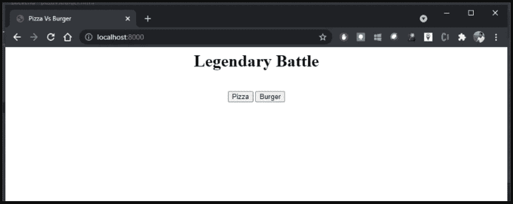**

**工作比萨 vs 汉堡 web 应用程序，其中没有图表**

**如果我点击 **Pizza** 按钮，它将调用 main.js 文件中的 my vote(‘Pizza’)。然后 myVote 方法要调用 sendMessage(vote)方法，实际上是用数据['text']打 websocket 的 api " **/sendVote** "作为' pizza '。
然后在服务器中，sendVote api 要添加“披萨栏中的 1”&“汉堡栏中的 0”。**

**我正在使用[**MongoDB Compass**](https://www.mongodb.com/cloud/atlas/lp/try2?utm_source=google&utm_campaign=gs_footprint_row_search_brand_phrase_intent_test_atlas_desktop&utm_term=mongodb&utm_medium=cpc_paid_search&utm_ad=p&utm_ad_campaign_id=11295578158&gclid=CjwKCAjw_JuGBhBkEiwA1xmbRUnChPOdeSEEPxVbCh-3mnuWBuWff5FiVHkQ8rYhKtW3P4F_VTbf0BoCczkQAvD_BwE)，在我们的数据库中查看我的投票。**

**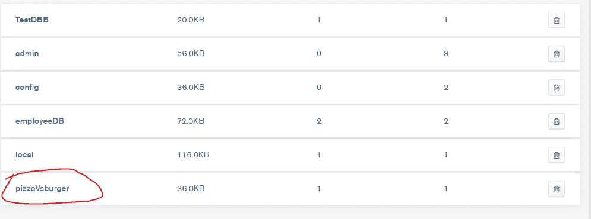**

**显示 pizzaVsburger 数据库的 MongoDB 指南针**

**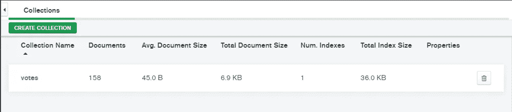**

**选票集合存储在 MongoDB 的 pizzaVsburger 数据库中**

**所以，我在我们的 html 页面中随机点击了披萨和汉堡按钮，我将这些投票存储在我们的 MongoDB 中**

**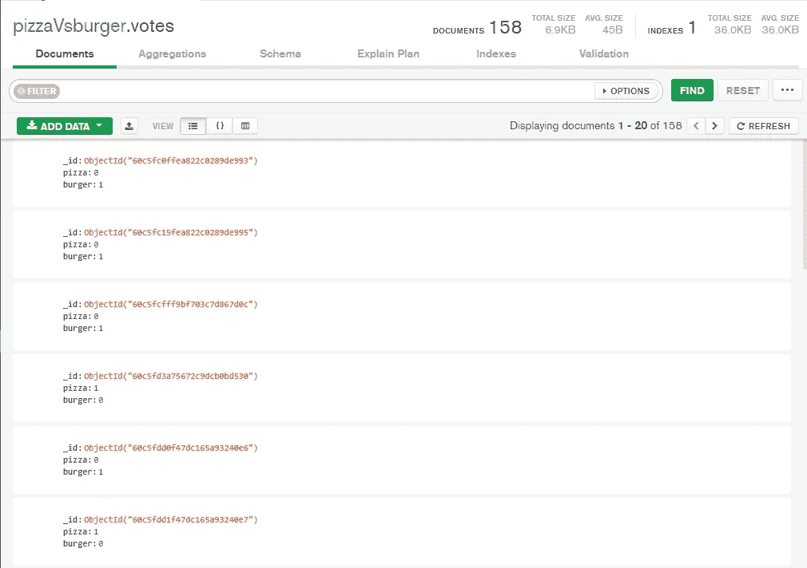**

**存储在投票集合(MongoDB)中的用户投票**

**酷，工作正常！！😎**

## **让我们使用 Chart.js 在 html 页面中创建一个条形图**

**我们在前端有投票按钮，API 作为中间件，MongoDB 作为后端。现在我们需要在 pizzaVsburger.html 页面中可视化投票。**

**我用的是 [chart.js(是开源的 HTML5 charts lib)](https://www.chartjs.org/) 。Chart.js 是一个很棒的 javascript 库，它为网站提供了简单、灵活的 javascript 图表。**

**首先，我们需要在我们的**pizzaVsburger.html 文件**中添加这些行。**

```
<html lang="en">
   <head>
      <title>Pizza Vs Burger</title>
      <link rel="stylesheet" href="https://stackpath.bootstrapcdn.com/bootstrap/4.3.1/css/bootstrap.min.css" integrity="sha384-ggOyR0iXCbMQv3Xipma34MD+dH/1fQ784/j6cY/iJTQUOhcWr7x9JvoRxT2MZw1T" crossorigin="anonymous">
      <style>
         .btn-primary {
            margin: 6px;
            background: #fff;
            color: #000;
            border: 1px solid black;
         }
      </style>
      <script src="https://cdnjs.cloudflare.com/ajax/libs/Chart.js/2.9.3/Chart.bundle.min.js"></script>
      <script src="https://cdn.jsdelivr.net/gh/emn178/chartjs-plugin-labels/src/chartjs-plugin-labels.js"></script>
      <script src="./templates/js/main.js"></script>
   </head>
   <body translate="no">
      <div style="width:50%; display: block; margin: 0px auto; text-align: center;">
         <h1>Legendary Battle</h1>
         <br>
         <canvas id="mycanvas"></canvas>
         <div class="row">
         <button class="btn btn-primary col" onclick="myVote('pizza')">
            Vote Pizza
         </button>
         <button class="btn btn-primary col" onclick="myVote('burger')">Vote Burger</button>
         </div>
      </div>
      <script>
         setUpChart({{ votes }})
      </script>
   </body>
</html>
```

**在上面的代码中，我使用了 chart.js 提供的 bootstrap 和几个 javascript 文件。
我们需要从 application.py 的默认 get 方法发送{ { votes } },&显示我们投票的条形图，**修改** **main.js** 文件如下。**

```
pollingChart;

function setUpChart(dataVotes) {
var ctx_live = document.getElementById("mycanvas");
         var myChart = new Chart(ctx_live, {
         type: 'bar',
           data: {
             labels: ['Pizza', 'Burger'],
             datasets: [{
               label: 'Pizza Vs Burger',
               data: **dataVotes**,
               fill: false,
               backgroundColor: ['#00eefa','#37dbff'],
               borderColor: '#000',
               borderWidth: 1
             }]
           },
           options: {
             plugins: {
               labels: {
                 render: 'image',
                 textMargin: -130,
                 images: [
                   {
                     src: 'https://image.freepik.com/free-vector/cute-pizza-cartoon-vector-icon-illustration-fast-food-icon-concept-flat-cartoon-style_138676-2588.jpg',
                     width: 120,
                     height: 120
                   },
                   {
                     src: 'https://image.freepik.com/free-vector/cute-burger-holding-knife-fork-cartoon-fast-food-icon-concept-isolated-flat-cartoon-style_138676-2204.jpg',
                     width: 120,
                     height: 120
                   }
                 ]
               }
             },
             scales: {
               yAxes: [{
                 ticks: {
                   beginAtZero: true
                 }
               }]
             }
           }
         });

pollingChart = myChart;
}
```

**从上面的代码中，我们正在设置我们的条形图&从**[**【freepik.com】**](https://freepik.com)**(你可以从这个网站获得免费的&高级图片)在我们的条形图上添加图片。** 
在上面的代码中，函数 **setUpChart(dataVotes)** 将把 dataVotes 作为输入。这里的 dataVotes 值将是一个包含两个值的数组。
**dataVotes =【披萨投票数，汉堡投票数】。** &我们从 websocket api 中检索它们。让我们在我们的**应用程序中添加这些行******

```
**def get_votes():
  **  *"""
    Method returns all the votes from 'votes' table of pizzaVsburger database in MongoDB
    """***x = [vote for vote in collection.find()]
    return x**
```

****&我们将 user_vote 方法& default get 方法修改为****

```
**@app.get("/")
async def get(request: Request):
    ***"""
    GET method to return html page, when user hit's the endpoint '/'.
    This method first gets all the votes from the votes table from Mongo Database
    & counts the votes for Pizza & Burger & return html file the votes in a single list.
    output format: votes = [(pizza votes),(burger votes)]
    """***votes = [[x['pizza'], x['burger']] for i, x in enumerate(get_votes())] user_votes = np.array(votes)
    response = np.sum(user_votes, 0)
    votes = list(response) return templates.TemplateResponse("pizzaVsburger.html", {'request': request, 'votes': votes})"""-------------------------------------------------------------"""@app.websocket("/sendVote")
async def user_vote(websocket: WebSocket):
    ***"""
    This is a websocket method, which responds to the call /sendVote.
    Client will use this websocket api as a medium to send their votes.
    """***await websocket.accept()
    try:
        while True:
            data = await websocket.receive()
            if data['type'] != 'websocket.disconnect':
                vote = {
                    'pizza': 1,
                    'burger': 0
                } if data['text'] == 'pizza' else {
                    'pizza': 0,
                    'burger': 1
                }
                add_vote(vote)
            else:
                data = get_votes()
            await websocket.send_json(data)
    except Exception as ex:
        return ex**
```

## ****最后，这是输出****

****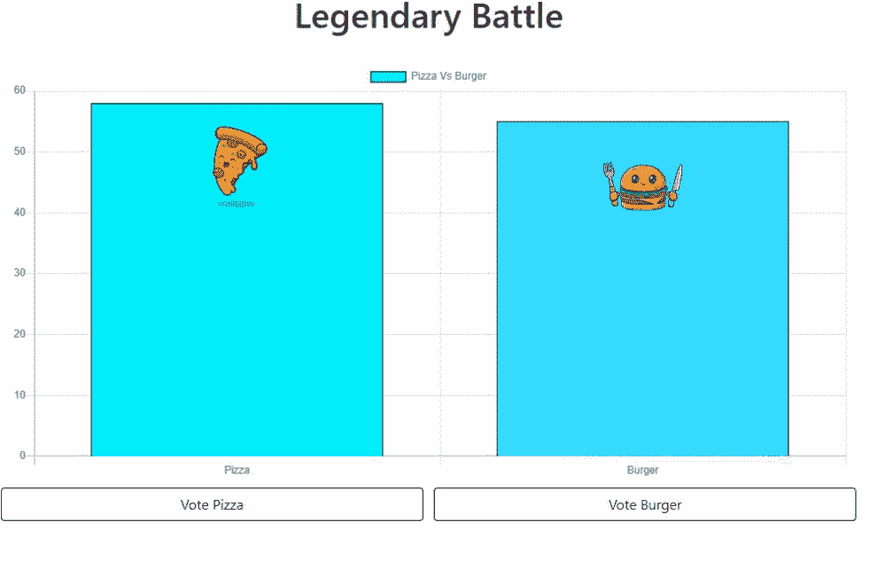****

****比萨与汉堡的最终输出 gif 图像****

****此处是该项目的 Github 回购链接[😀](https://github.com/vinaynvd/pizzaVsburger)。****

## ****结论:****

****我们建立了可怕的实时比萨饼对汉堡投票网站。您可以用这种方式构建出色的实时 web 应用程序。提出你酷的实时网络应用的想法，并在这里发表评论。****

****如果你喜欢这篇文章，想表达一些爱和支持，请给我买一杯☕咖啡😀****

****[](https://www.buymeacoffee.com/vinaynvd)

[https://www.buymeacoffee.com/vinaynvd](https://www.buymeacoffee.com/vinaynvd)****