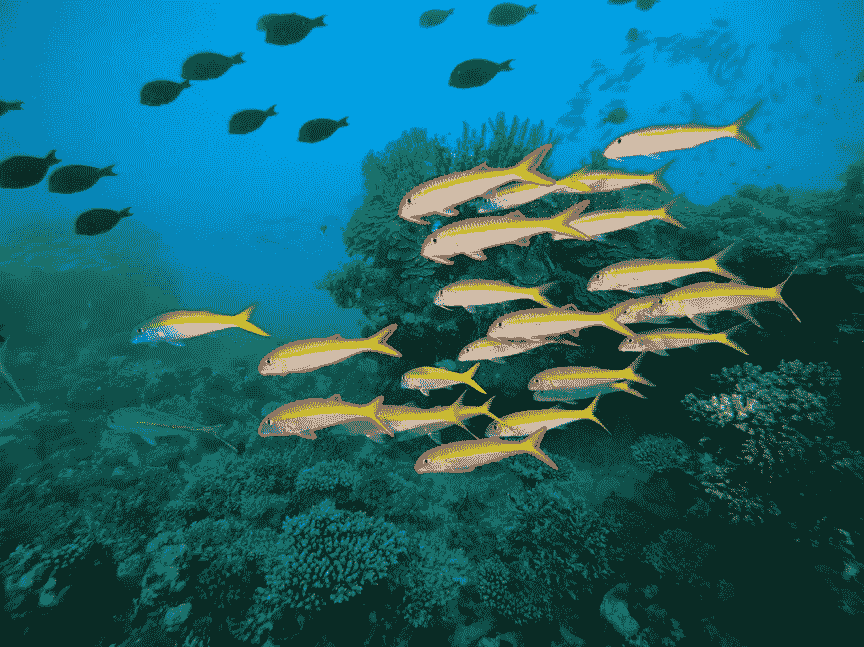

# 多边形注记案例研究

> 原文：<https://medium.com/nerd-for-tech/polygon-annotation-case-study-97b98cc06210?source=collection_archive---------11----------------------->

## 多边形数据注记

有许多形状不规则的项目是 2D 边界框无法准确识别的。而多边形数据标注可以标注曲线和不同角度，更准确地反映目标的真实形状。

在数据标注领域，机器模型的水平取决于数据精度。因此，面数据注记工具是确保训练数据像素级精度的最佳方式。

## 应用领域

通常，多边形数据标注应用于机器人捕捉、医学图像识别、卫星图像识别以及城市景观中的不规则物体，例如车辆、树木和水池。

## 鱼类多边形项目

与客户的沟通

1 对于截断部分，要不要标注？

2 对于下面的标签要求，哪一个适合您？

I .只有 100%可见的鱼(包括鱼鳍)才需要贴标签。

二。具有一般轮廓的鱼需要被标记(鳍可以被排除，因为它们总是被其他东西覆盖)

三。能见度在 **50%** 以上的鱼需要贴标签。(百分比可以改变)

3 我们想知道每张图片中鱼的密度

一. 10 岁以下

二。10–20

三。20 以上

4 精度水平:标签低至 5 个像素(或任何其他要求)

## 注释要求

1 多边形边界与包括主体在内的主体轮廓完全匹配

2 如果一个任务包含多个需要用多边形标注的主题，每个主题应该分别进行标注

3 目标的不可见部分也应该被标记

4 没有多边形丢失，没有不完整的多边形，没有不正确的多边形

# 结束

将你的数据标注任务外包给[字节桥](https://tinyurl.com/4h3zjpb3)，你可以更便宜更快的获得高质量的 ML 训练数据集！

*   无需信用卡的免费试用:您可以快速获得样品结果，检查输出，并直接向我们的项目经理反馈。
*   100%人工验证
*   透明标准定价:[有明确定价](https://www.bytebridge.io/#/?module=price)(含人工成本)

## 为什么不试一试？