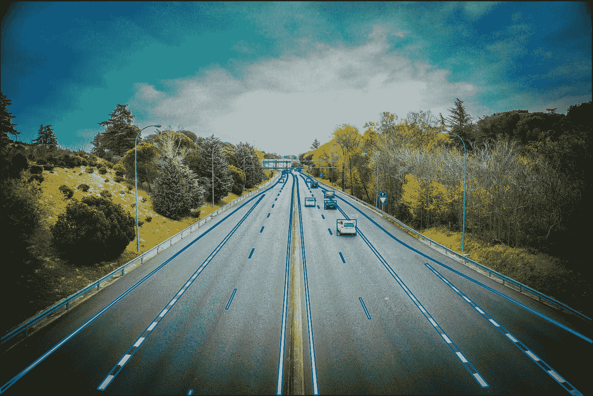

# 折线注释案例研究

> 原文：<https://medium.com/nerd-for-tech/polyline-annotation-case-study-744f56be82e8?source=collection_archive---------3----------------------->

## 给目标贴上标签

给图像中的线条加下划线，并标注它们的属性。

## 标签规则

1.不需要注释的场景

(1)没有需要注释的对象

在正常的道路场景中，当车道线由于损坏而完全不可见时，或者图像中没有线时，不需要进行注释或任何操作。

(2)图像质量

由于质量差，可以跳过该图像。

2.艰难的场景

(1)新旧车道重叠

当新旧车道重叠时，它会被贴上[硬场景]标签。不需要做其他操作。

(2)扭曲的车道线

当车道线由于道路重铺或其他原因而无法连接时，它将被标记为[硬场景]标签。不需要做其他操作。

(3)公园或其他区域内的道路

当图像场景位于内部道路(如公园)上时，它会被贴上[硬场景]标签。不需要做其他操作。

(4)临时道路变更

当映像场景中发生临时路径更改时，会用[hard scenario]标签进行标记。不需要做其他操作。

(5)高速公路收费站

当图像场景是高速公路收费站时，它被标上[硬场景]标签。不需要做其他操作，只需处理下一幅图像。

(6)包括停车线

当一个停车点出现在图像场景中时，它被标上一个[硬场景]标签，不做其他操作，继续处理下一个图像。

(7)包括不能相遇的分流线

当图像中的 Y 线或 V 线不相交时，用[hard scenario]标记，不做其他操作，继续处理下一幅图像。

## 画线的一般规则

1.线需要画在车道线的中心，左右偏移不超过 2px。路面不平整造成的变形也需要标注在线的中心。

2.路缘被标记在中间边缘附近，即标记的路缘的下边缘。

3.该线需要靠近当前汽车所在的位置，远离它可以被看到的位置，并且该线需要穿过闭塞物。但想象或延伸长度不能超过可见长度。

4.当车道线的可见部分小于圆尺的直径时，车道线不需要标注。

5.当车道线的虚线部分小于标尺内圆的直径时，线的虚线端不需要标注。

6.视野中的所有线都应该被标记。

## 注意:

1.如果有无法通行的隔离带(如花坛、围栏等。)，不需要标注对面车道线。

2.如有可通行的隔离带(如双黄实线)，应标注对向车道线。

3.如果在交叉路口可以看到对向车道的线，那么不管隔离带的种类如何，都应该标注对向车道的线。

4 同方向主路和辅路有花坛等不可通行的隔离带的，还应标注隔离带外的同车道线。

## 要标记的车道类型

除了以下几类，其他专线不需要标注。

1.标线用于分隔相反方向的车流，一般位于道路中间。

2.标线用于分隔同方向的车流，一般位于道路中间。

3.道路边缘线:常见的线有单根白色实线、单根黄色实线、不可跨越的围栏/花坛/绿化带/锥桶等。

4.这种车道(双黄线)用于分隔相反方向的车流。禁止越过对面车道的边界。常见的线有双黄线、左实线右虚线、左虚线右实线、单黄实线、不可通行的围栏/花坛/植物带/锥等。

5.不要越过同车道分割线:用于禁止车辆越过车道分割线变更车道或超车。这条标注的线是实白线，或者是无法通行的栅栏/花坛/植物带/圆锥等。

6.停车线:车辆避让、等待起步时的停车位置等。停止线是一条白色实线。

7.Y 形线:Y 形线是车道坡度区和匝道入口分成两部分的车道线。形状类似英文字母“Y”，包括正 Y 形和倒 Y 形。

8.V 形线:V 形线是车道入口处由两条线组成的 V 形区域的边界，包括正 V 形和倒 V 形。

9.岔路口的宽线:标记为 Y 形线。记住分离和汇合点在第一个/最后一个线段的中心的原则。

## 虚线的末端:

1.当有一条很长的虚线时，每条虚线的末端都需要标注，点要附在线上。

2.当车道线的虚线部分小于直尺内圆直径时，虚线的虚线端不需要标注。

## 车道线属性

1.  磨损/无磨损:

根据车道线是否有隐形磨损来选择。

磨损:由于各种外界原因，车道线油漆流失或稀释，变化面积超过当前车道的 20%。

2.颜色:

根据车道颜色选择白色、黄色或其他颜色。

3.定义:

(1)线:线完全附着在路面上

(2)路缘:路缘是由水泥台阶/植物带/锥体/栅栏等物体组成的路齿。

## 定时注释

1.用相同的轨道 ID 标记不同帧中的相同车道

2.当同一车道线在某些帧中不可见时，通过判断前后帧，尝试用相同的轨道 ID 标注同一车道线。

## 两个特殊场景

1.想象延伸长度不超过可见长度，只是遮挡在中间。

2.自我车辆自身的遮挡:不算遮挡。被自我车辆本身遮挡的车道线不应被标注遮挡属性。

## 注意:

1.对于线条

(1)如果线条清晰可见，则连续标注。

(2)如果不可见或模糊，则断开标注。

2.对于路缘(绿化带路缘/普通路缘)

(1)如果是交叉路口，断开标志。

(2)如果是安全岛，连续标注。

(3)如果斑马线不是路口，连续标注。

3.对于锥形/栅栏

根据实际位置贴标签。

4.当中间道路与障碍物重合时

在障碍物下面的线上贴上标签。

比如:如果围栏下面有一条双黄线，就给黄线贴上标签。

5.斑马线/禁止停车线/停车线/安全圈线

如果停车线在交通道路旁边，最外面的垂直停车位线仍然需要正常标注，但水平停车线和住宅区、商场的停车线都不标注。

6.对于严重的闭塞

不需要贴标签。当车辆或其他无关物体占图像的 80%以上时，应视为严重遮挡，无需标记。

7.因为离车道线太近了

当车道线与延伸后的路缘重合时，只能标记一个路缘。没有明显的物理道路边缘，仅标记了一个路缘。

## 验收方法

1.图像标准

没有遗漏的行，没有错误标记的行，也没有多余的行。

2.生产线标准

(1)线要标注在中心，像素误差在 2px 以内。

(2)所有属性选择正确。

(3)轨道 id 被正确划分。

## 您可以手动配置和 ByteBridge 注释

## 输出

字节桥折线批注

# 结束

把你的数据标注任务外包给 [ByteBridge](https://tinyurl.com/vhd3cdyp) ，你可以更便宜更快的获得高质量的 ML 训练数据集！

*   无需信用卡的免费试用:您可以快速获得样品结果，检查输出，并直接向我们的项目经理反馈。
*   100%人工验证
*   透明标准定价:[有明确的定价](https://www.bytebridge.io/#/?module=price)(含人工成本)

# 为什么不试一试？