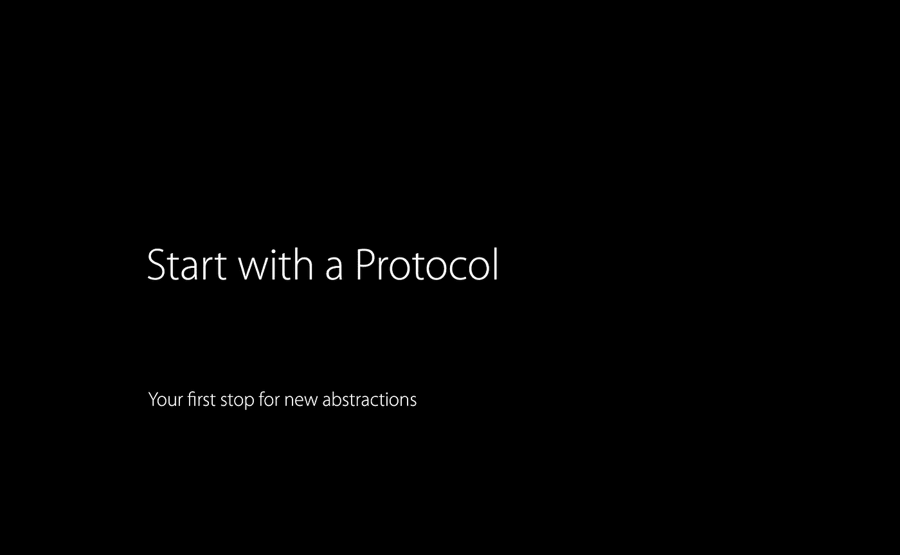
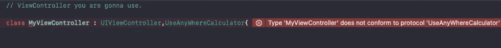
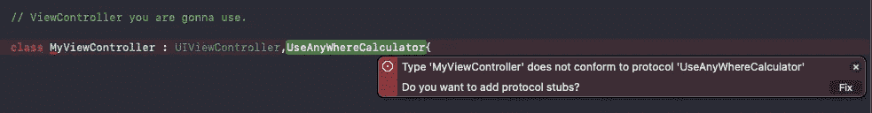

# POP-使协议成为面向协议编程的首选

> 原文：<https://medium.com/nerd-for-tech/pop-make-protocols-your-first-pick-1545b0ef3e?source=collection_archive---------4----------------------->

## iOS 编程指南



让我们看一个例子。

假设我们的项目在很多地方需要一些数学运算，你想创建一个助手类来做同样的事情。


# 协议

这时候其实不需要上课。我不想用你为什么不应该做那件事来烦你。然而，我会很简短😁协议是轻量级的，我听到有人说它们就像蓝图。类让你担心内存问题，比如死锁和其他与内存相关的问题。

> “一个*协议*定义了适合特定任务或功能的方法、属性和其他需求的蓝图。”- [Swift docs](https://docs.swift.org/swift-book/LanguageGuide/Protocols.html)

好了，让我们直接跳到代码

用你需要的所有好东西创建一个协议。对于我们的计算器，我们需要两个输入和一些数学函数。

```
// UseAnyWhereCalculator Protocolprotocol UseAnyWhereCalculator{var a:Int { get }var b:Int { get }func addValues(inputA:Int,inputB:Int)->Intfunc addAB()->Int}
```

# **引入协议扩展**

协议扩展是 swift 工具集的强大功能之一。许多人对此不太关注，因为这不是主流对话的一部分。你甚至可以通过扩展添加更多你需要的东西，比如我们的乘法方法。

> 协议可以被扩展来为符合的类型提供方法、初始化器、下标和计算的属性实现。这允许你在协议本身上定义行为，而不是在每种类型的单个一致性或一个全局函数中。”- [协议扩展](https://docs.swift.org/swift-book/LanguageGuide/Protocols.html#ID521)

```
// Protocol Extension
extension UseAnyWhereCalculator{   

func addValues(inputA:Int,inputB:Int)->Int{ return inputA+inputB    
}  

func addAB()->Int{  

return addValues(inputA: a, inputB: b)  

 } func multiplyValues(inputA:Int,inputB:Int)->Int{ 

             return inputA*inputB   

}   

func multiplyAB()->Int{ 

return multiplyValues(inputA: a, inputB: b)  

}
}
```

在您的类或您已经继承的类之后声明您的协议。

```
// ViewController you are gonna use.class MyViewController : UIViewController,UseAnyWhereCalculator{
```

使您的 ViewController 符合协议。不要担心这个 Xcode 会通过抛出错误信息让你遵从它。它也会帮助你修复它。



编译器因不符合声明的协议而引发错误

单击警告左侧的圆形红色按钮查看更多信息。



编译器提供了一个单击即可修复的选项

单击“修复”以消除错误。这将把强制存根添加到您的类中。

```
var a: Intvar b: Int
```

就这样，伙计们，你们完成了重任。现在让我们享受工作的好处。


```
// Where you are gonna use.// Your inputvar a: Int = 3  

var b: Int = 4// Use the addAB method to add two given valueslabelAdd.text = "\(a)+\(b)=\(addAB())"// Use the multiplyAB method to multiply two given valueslabelMultiply.text = "\(a)x\(b)=\(multiplyAB())" 
```

好了，我该走了。

*在此链接中查找完整代码—*

[https://github.com/Rajaikumar-iOSDev](https://github.com/Rajaikumar-iOSDev/Simple-POP-Example)

[](https://github.com/Rajaikumar-iOSDev/Simple-POP-Example/tree/main/SimplePOPExample.playground) [## rajaikumar-IOs dev/Simple-POP-Example

### 🍿这是在 iOS-Swift 中使用面向协议编程的一个例子。…

github.com](https://github.com/Rajaikumar-iOSDev/Simple-POP-Example/tree/main/SimplePOPExample.playground)