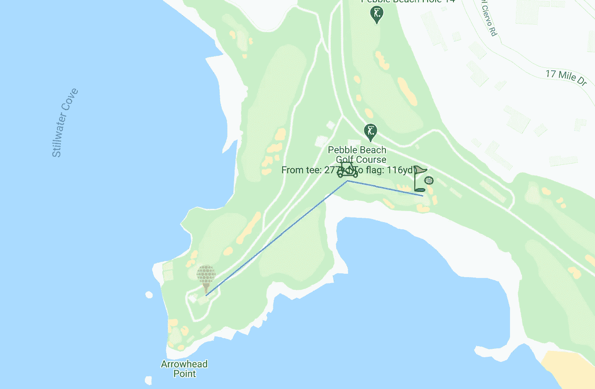
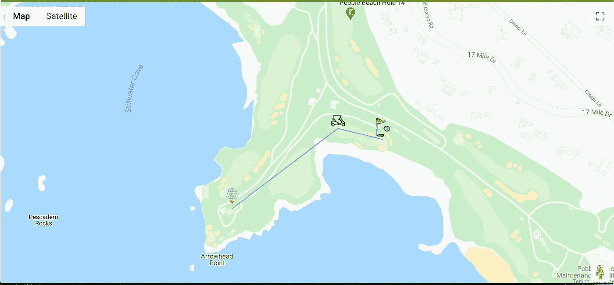
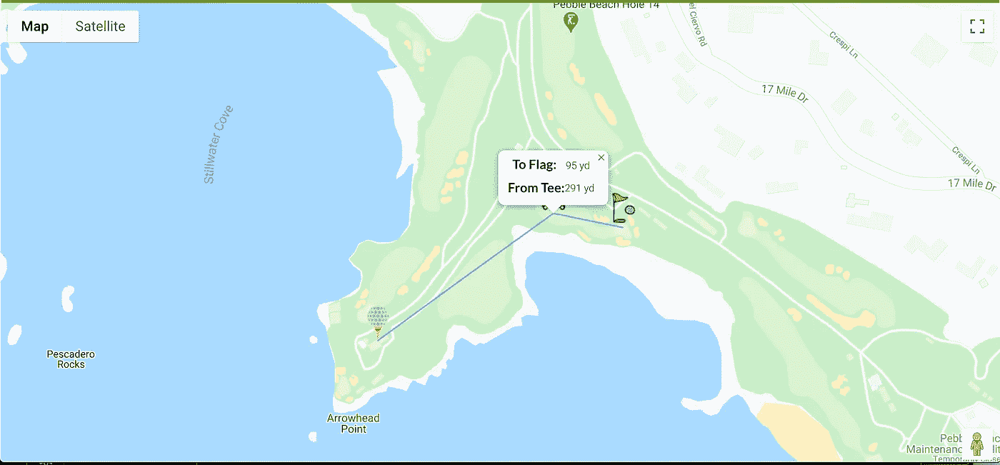
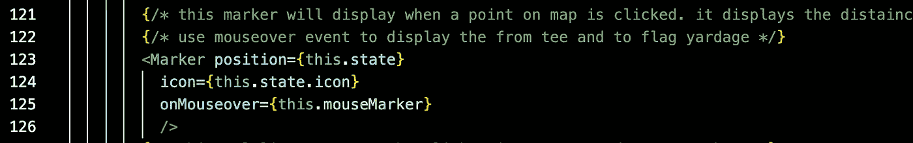
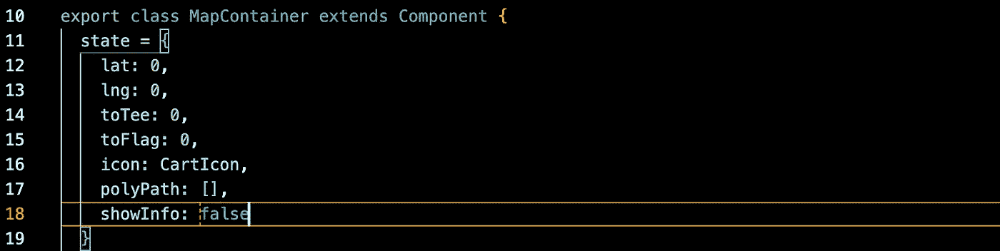
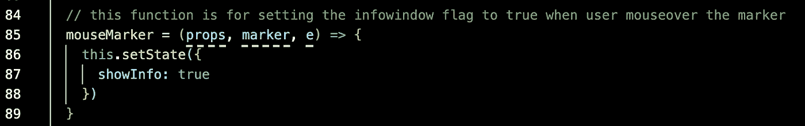
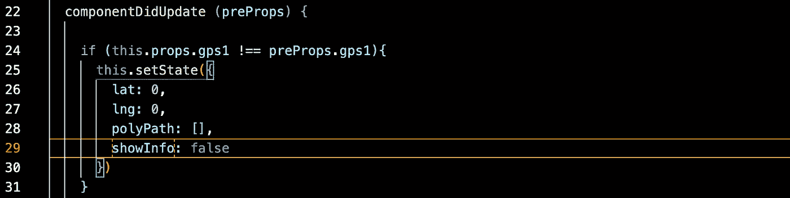

# 当鼠标悬停在谷歌地图标记上时弹出一个信息窗口

> 原文：<https://medium.com/nerd-for-tech/pop-up-an-infowindow-when-mouseover-a-google-maps-marker-c11215715531?source=collection_archive---------5----------------------->

在我最近的一篇博客中，我写了关于用多个标记创建折线的内容(你可以在这里[阅读](https://levelup.gitconnected.com/how-to-make-a-polyline-with-multiple-markers-on-react-google-maps-3c1cdb64de76))。在应用程序中，我将创建的标记的距离显示为一个标签。它服务于目的，但看起来有点分散注意力，坦率地说，有点不登大雅之堂。这是最初的样子:

如果只是按需显示距离信息，效果会好很多。嗯，我还想多看些那个厚脸皮的高尔夫球车图标。大概是这样的:

然后，当我将鼠标指针移到购物车上时，我会看到这样的码数信息:

读完之后，我可以点击“x”来关闭窗口。现在这样就不那么让人分心了，不是吗？这是通过使用 Google Maps React 中的 infoWindow 和 Marker 组件上的 onMouseover 事件来实现的。如果您还记得最初的博客，那么标记是通过使用从地图上的单击中获得的 GPS 坐标来创建的。我首先必须为这个标记添加 onMouseover 事件。

关联函数需要做的唯一事情是打开信息窗口显示。这是通过该州的一面旗帜来实现的。

当调用该函数时，它所做的只是将标志设置为 true。

就像标记本身一样，当用户单击地图上的不同位置时，需要重置标记。我只需要在 componentDidUpdate 生命周期事件中将显示标志设置回 false。请确保完成此操作，因为如果不执行重置，地图上会出现意外行为。

但是，如果您希望信息在鼠标单击而不是鼠标悬停时显示，那么您只需要使用标记上的“onclick”事件。被调用的函数将执行相同的任务来设置打开显示器的状态。你可能想用其中的一个，而不是两个都用。我尝试在同一个标记上同时单击和鼠标悬停，但结果不尽如人意。