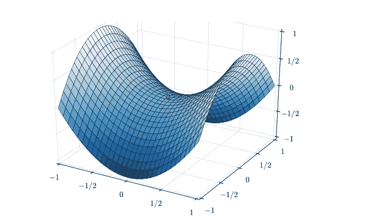
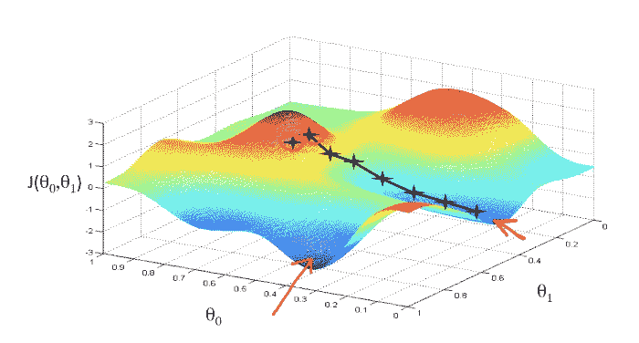

# 流行的机器学习优化算法

> 原文：<https://medium.com/nerd-for-tech/popular-machine-learning-optimization-algorithms-f24830dc28b4?source=collection_archive---------3----------------------->

康尼·施耐德在 [Unsplash](https://unsplash.com?utm_source=medium&utm_medium=referral) 上的照片

机器学习中的优化是在给定一组输入的情况下寻找正确预测的迭代过程。在每次迭代中，目标是减少预测值和实际值之间的误差，也就是所谓的基本真实值。深度学习中的优化有几种实现方式。一个好的损耗优化方法应该尽可能地收敛到全局最小值，并且避免像平台、鞍点和局部最小值(如果有的话)这样的陷阱。在向前传递之后，需要优化算法来更新模型权重。梯度下降是所述优化的一个流行例子。梯度下降的一些实现包括 Momentum 或 AdaMax。一些梯度下降方法是:

函数空间中的一个鞍点，由于有几个极小值，它会给优化带来问题。Nicoguaro，CC BY 3.0，通过维基共享

**香草渐变下降**

普通梯度下降法对于简单的凸函数非常有效，但是由于所有边上的梯度都没有进一步降低，它们往往会卡在平台或可能的局部最小值附近。下降也不是平滑的，有时会以之字形移动，这减慢了收敛。其他实现有助于避免这些问题。

公式:

*   *delta = —学习率*梯度*
*   *θ+=δ*

梯度下降

**气势**

动量是普通梯度下降法的一种改进，它在函数的步长上增加了一些动量。这种势头有助于越过某些高原和局部最小值。这是通过将前一步的移动添加到当前计算的步来实现的。这个想法类似于将一个碗滚下碗，而不是停在底部，而是基于其初始动量滚过中心，并慢慢停留在碗的底部。动量有助于减少梯度下降的振荡，并平滑向最小值的移动。衰减率乘以前面的步骤有助于衡量前面的步骤要添加到当前步骤中的量。衰减率为 0 类似于具有大量摩擦的普通网络，而衰减率为 1 时，总是添加上一步，这是一个没有摩擦的永无止境的运动。通常使用 0.8 到 0.9 的衰减率值，这通常会给机芯一些摩擦力，并提供足够的动量来加快步伐，但会逐渐稳定下来。

公式:

*   *梯度总和=梯度+先前梯度总和*衰减率*
*   *delta =-learning _ rate *****sum _ of _ gradient***
*   *θ+=*

*动量公式的另一个版本是添加(1-decay_rate)来缩放梯度:*

*   **梯度总和=*(1-衰减率)* *梯度+先前梯度总和*衰减率**

*无论选择哪个公式版本，都必须选择适当的学习率超参数，以便以更平滑的方式将梯度移向最小值。*

***AdaGrad(自适应渐变)***

*动量的问题是，它可能很容易通过最小值，或者可能首先选择最陡的路径而忽略其他可能的路径，尽管最陡的路径不一定是到达最小值的最快路径。AdaGrad 通过引入梯度平方和来惩罚在相同方向上探索下降。探索的特征梯度越多，其平方和就越高，最终其步长就越小。这对于稀疏要素来说非常有用，否则这些要素的下降幅度可能会很小。每个特征参数都有自己的下降学习率，因此该算法并不严重依赖学习率超参数。阿达格拉德的缺点是，由于平方和分数的快速增加，下降速度最终会慢到可以忽略不计。*

*公式:*

*   **sum _ of _ gradient _ squared = previous _ sum _ of _ gradient _ squared+梯度**
*   **delta =-学习率*梯度****/sqrt(sum _ of _ gradient _ squared)****
*   **θ****+=δ****

***RMSProp(均方根传播)***

*RMSProp 是 Adagrad 的改进版本，它在梯度平方的和中添加了一个衰减因子。它优先考虑当前梯度步骤，同时减少过去梯度的累积效应。这有助于加快收敛速度，因为与阿达格拉德相反，下降速度不断增加。例如，0.9 的衰减率将(1–0.9)标度应用于当前的平方梯度，与 Adagrad 相比增加了 10%。*

*公式；*

*   **sum _ of _ gradient _ squared = previous _ sum _ of _ gradient _ squared * decay _ rate+渐变* (1- decay_rate)**
*   *****=****-learning _ rate***** gradient/sqrt(sum _ of _ gradient _ squared)*****
*   ***θ****+=δ*****

****ADAM(自适应矩估计)****

**Adam 优化器使用下降法的最佳部分，是目前最流行的选择。它实现了动量(速度)和 RMSProp 算法(稀疏特征下降)。衰减参数β1 应用于梯度的总和(一阶矩),通常设定为约 0.9。第二衰减参数β2 也应用于通常设置为大约 0.999 的平方梯度的和。**

**公式:**

*   ***sum _ of _ gradient = previous _ sum _ of _ gradient * beta 1+gradient *(1—beta 1)*【动量】**
*   ***sum _ of _ gradient _ squared = previous _ sum _ of _ gradient _ squared * beta 2+gradient *(1-beta 2)*【rms prop】**
*   ***delta =-learning _ rate *****sum _ of _ gradient****/sqrt(****sum _ of _ gradient _ squared****)***
*   ***θ+=δ***

****结论****

**我希望这篇文章为你找到适合你的机器学习模型的优化技术提供了一些基本的解释。请在评论区留下你的想法和问题。谢谢你**