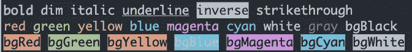

# 受欢迎的 NPM 套餐

> 原文：<https://medium.com/nerd-for-tech/popular-npm-packages-d950b74cede4?source=collection_archive---------23----------------------->

## 作为我上周关于如何制作你自己的 npm 包的博客的后续，我想与你分享一些最流行的 npm 包，并回顾一下它们的作用。


在开始讨论单个产品包之前，我们先来看一下 npm 产品包的总数:

*   现在他们有超过 160 万个 npm 包可供下载。
*   现在 npm 有超过 250 亿，是的，10 亿，每周下载他们的软件包。
*   现在 npm 有大约 1200 亿的月下载量！

正如你从数字中看到的，npm 包非常受欢迎，被全世界所有不同类型的开发者和公司所使用。

既然我们已经检查了总体数字，现在让我们检查一些最流行的 npm 包。

# 反应


**周下载量:9092242**

**首页:**[**【https://reactjs.org/】**](https://reactjs.org/)

**资源库:**[**https://github.com/facebook/react**](https://github.com/facebook/react)

**安装:** `**npm i react**`

React 是一个用于构建用户界面的 JavaScript 库。目前，它是最流行的 JavaScript 前端框架之一(如果不是最流行的话)。

反应是:

1.  **声明性**

React 使得创建交互式 ui 变得不那么痛苦。为应用程序中的每个状态设计简单的视图，当数据发生变化时，React 将有效地更新和呈现正确的组件。声明性视图使您的代码更加可预测，也更容易调试。

2.**基于组件的**

构建管理自身状态的封装组件，然后将它们组合成复杂的 ui。由于组件逻辑是用 JavaScript 而不是模板编写的，所以您可以轻松地通过您的应用程序传递丰富的数据，并将状态保留在 DOM 之外。

3.**学一次，随地写**

React 不对您的技术堆栈的其余部分做出假设，因此您可以在 React 中开发新功能，而无需重写现有代码。React 还可以使用 Node 在服务器上渲染，并使用 [React Native](https://reactnative.dev/) 为移动应用提供动力。

# **洛达什**


**周下载量:36970633 次**

**首页:**[**https://lodash.com/**](https://lodash.com/)

**储存库:**[**https://github.com/lodash/lodash**](https://github.com/lodash/lodash)

**安装:** `**npm i lodash**`

Lodash 是一个 JavaScript 库，帮助程序员编写更简洁、更易维护的 JavaScript。

它可以分为几个主要方面:

*   **实用程序:**用于简化常见的编程任务，如确定类型以及简化数学运算。
*   **功能**:简化绑定、修饰、约束、节流、去抖、[curring](https://en.wikipedia.org/wiki/Currying)，改变指针。
*   **字符串:**转换函数，用于执行基本的字符串操作，如修剪、转换为大写、[骆驼大小写](https://en.wikipedia.org/wiki/Camel_case)等。
*   **数组:**创建，拆分，合并，修改，压缩。
*   **集合:**迭代、排序、过滤、拆分、构建。
*   **对象:**访问、扩展、合并、默认、转换。
*   **序列:**链接、包装、过滤和测试。

# 白垩



**周下载量:79105438 次**

**首页:**[**https://github.com/chalk/chalk#readme**](https://github.com/chalk/chalk#readme)

**资源库:**[**https://github.com/chalk/chalk**](https://github.com/chalk/chalk)

**安装:**

Chalk 允许安装它的用户在使用 node 时自定义文本打印到控制台的方式。

## 粉笔亮点:

*   表达 API
*   高性能
*   嵌套样式的能力
*   [256/真彩色颜色支持](https://github.com/chalk/chalk#256-and-truecolor-color-support)
*   自动检测颜色支持
*   不延伸`String.prototype`
*   干净专注
*   积极维护

Chalk 附带了一个易于使用的可组合 API，您只需链接和嵌套您想要的样式。

以下是粉笔使用的最新样式列表:

## 修饰语

*   `reset` -重置当前颜色链。
*   `bold` -使文本加粗。
*   `dim` -只发出少量的光。
*   `italic` -使文本倾斜。*(未得到广泛支持)*
*   `underline` -给文本加下划线。*(未得到广泛支持)*
*   `inverse` -反转背景和前景色。
*   `hidden` -打印文本，但使其不可见。
*   `strikethrough` -在文本中央画一条水平线。*(未得到广泛支持)*
*   `visible` -仅当粉笔的色阶为> 0 时打印文本。对纯装饰性的东西很有用。

## 颜色；色彩；色调

*   `black`
*   `red`
*   `green`
*   `yellow`
*   `blue`
*   `magenta`
*   `cyan`
*   `white`
*   `blackBright`(别名:`gray`，`grey`)
*   `redBright`
*   `greenBright`
*   `yellowBright`
*   `blueBright`
*   `magentaBright`
*   `cyanBright`
*   `whiteBright`

## 背景颜色

*   `bgBlack`
*   `bgRed`
*   `bgGreen`
*   `bgYellow`
*   `bgBlue`
*   `bgMagenta`
*   `bgCyan`
*   `bgWhite`
*   `bgBlackBright`(别名:`bgGray`，`bgGrey`)
*   `bgRedBright`
*   `bgGreenBright`
*   `bgYellowBright`
*   `bgBlueBright`
*   `bgMagentaBright`
*   `bgCyanBright`
*   `bgWhiteBright`

# tslib


**周下载量:46480601**

**首页:**[**https://www.typescriptlang.org/**](https://www.typescriptlang.org/)

**储存库:**[**https://github.com/Microsoft/tslib**](https://github.com/Microsoft/tslib)

**安装:** `**npm i tslib**`

Tslib 是用于 [TypeScript](http://www.typescriptlang.org/) 的运行时库，它包含了所有的 TypeScript 助手函数。

这个库主要由 TypeScript 中的`--importHelpers`标志使用。当使用`--importHelpers`时，在下面发出的文件中使用类似`__extends`和`__assign`的帮助函数的模块:

```
var __assign = (this && this.__assign) || Object.assign || function(t) {
    for (var s, i = 1, n = arguments.length; i < n; i++) {
        s = arguments[i];
        for (var p in s) if (Object.prototype.hasOwnProperty.call(s, p))
            t[p] = s[p];
    }
    return t;
};
exports.x = {};
exports.y = __assign({}, exports.x);
```

将改为发出如下内容:

```
var tslib_1 = require("tslib");
exports.x = {};
exports.y = tslib_1.__assign({}, exports.x);
```

因为这样可以避免类似`__extends`、`__assign`等东西的重复声明。，这意味着向用户交付平均更小的文件，以及更少的运行时开销。对于带有 TypeScript 的优化包，你绝对应该考虑使用`tslib`和`--importHelpers`。

# axios


**周下载量:15546143**

**首页:**[**https://github.com/axios/axios**](https://github.com/axios/axios)

【https://github.com/axios/axios】[**储存库:**](https://github.com/axios/axios)

**安装:**

Axios 是一个基于 [*承诺的*](https://javascript.info/promise-basics) HTTP 客户端，用于`[node.js](https://nodejs.org/)`和浏览器。是 [*同构*](https://www.lullabot.com/articles/what-is-an-isomorphic-application) (可以在浏览器和 nodejs 中运行相同的代码库)。在服务器端，它使用 native node.js `http`模块，而在客户端(浏览器)它使用 XMLHttpRequests。

## 特点:

*   从浏览器发出 [XMLHttpRequests](https://developer.mozilla.org/en-US/docs/Web/API/XMLHttpRequest) 。
*   从 node.js 发出 [http](http://nodejs.org/api/http.html) 请求。
*   支持[承诺](https://developer.mozilla.org/en-US/docs/Web/JavaScript/Reference/Global_Objects/Promise) API。
*   拦截请求和响应。
*   转换请求和响应数据。
*   取消请求。
*   JSON 数据的自动转换。
*   客户端支持防御 [XSRF](http://en.wikipedia.org/wiki/Cross-site_request_forgery) 。

Axios 很大程度上受到了 [Angular](https://angularjs.org/) 中提供的 [http 服务](https://docs.angularjs.org/api/ng/service/$http)的启发。最终，axios 努力提供一个独立的类似于`http`的服务，供 Angular 之外的人使用。

# 表达


每周下载量:14，352，772

**首页:**[**http://expressjs.com/**](http://expressjs.com/)

**储存库:**[**https://github.com/expressjs/express**](https://github.com/expressjs/express)

**安装:**

Express 是一个快速的、非自以为是的、极简的 web 框架，用于节点。

快速用于:

## 网络应用

Express 是一个最小且灵活的 Node.js web 应用程序框架，为 web 和移动应用程序提供了一组强大的功能。

## 蜜蜂

有了无数的 HTTP 实用程序方法和中间件，创建一个健壮的 API 变得既快又容易。

## 表演

Express 提供了一个基本的 web 应用程序特性的薄层，不会掩盖您所了解和喜爱的 Node.js 特性。

## 结构

很多[流行的框架](http://expressjs.com/en/resources/frameworks.html)都是基于 Express 的。

Express 是流行开发栈的后端组件，如 [MEAN](https://en.wikipedia.org/wiki/MEAN_(software_bundle)) 、 [MERN](https://en.wikipedia.org/w/index.php?title=MERN&action=edit&redlink=1) 或 [MEVN](https://en.wikipedia.org/w/index.php?title=MEVN&action=edit&redlink=1) 栈，以及 [MongoDB](https://en.wikipedia.org/wiki/MongoDB) 数据库软件和一个 JavaScript 前端框架或库。

这些只是众多流行的 npm 包中的一部分。你可以在 [npm 主页](https://www.npmjs.com/)上查看其他受欢迎的图书馆，并根据自己的标准发现新的图书馆。享受探索和利用 npm 所提供的一切吧！