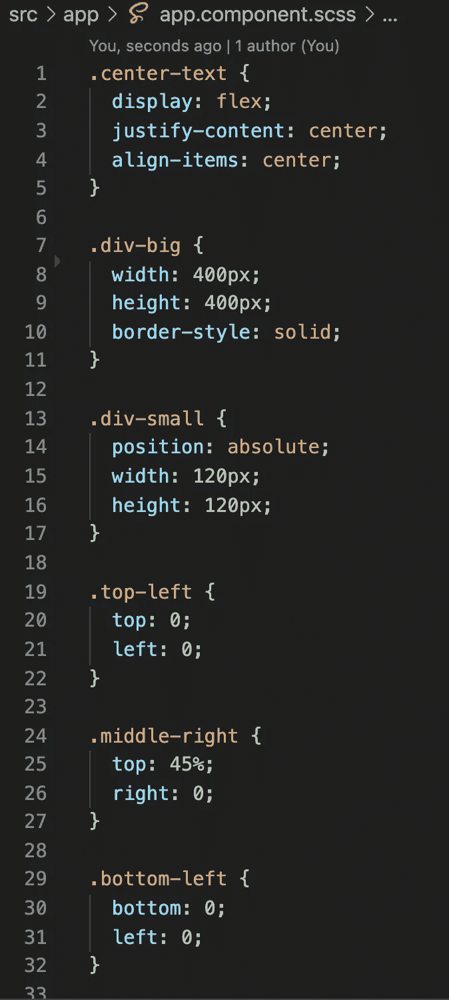
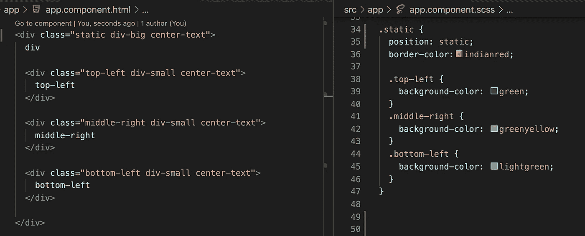
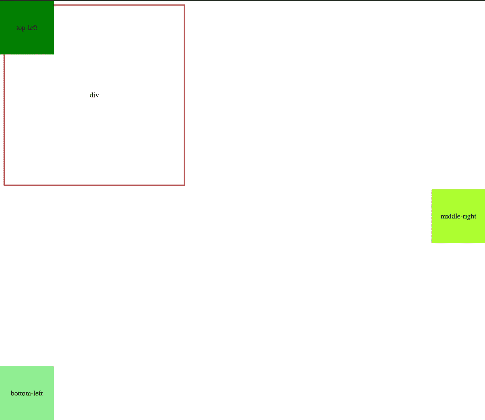
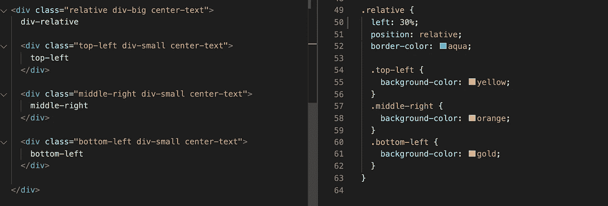
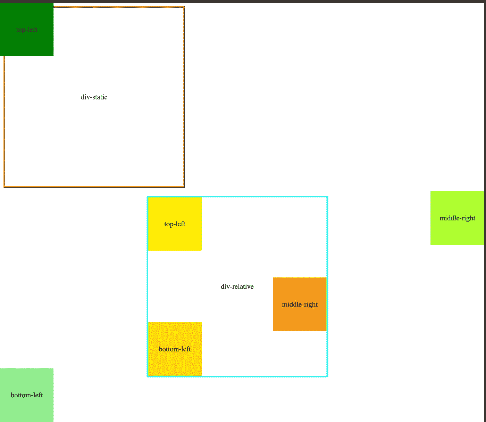

# 将元素放置在父元素内部

> 原文：<https://medium.com/nerd-for-tech/position-elements-inside-of-the-parent-element-908f71db6ead?source=collection_archive---------2----------------------->

## CSS 位置

前端工作的主要部分是将 UI 的每个元素放在正确的位置。有时你需要在父项目的角落放置一个元素。你可能认为我只需要将 position absolute 设置为子元素，然后设置 top 0 和 left 0。

我们来举个小例子。这是我们的主要款式。

主 HTML 和其余的 CSS 样式。

应该管用吧？

不是子 div 在父 div 中设置位置，而是选择设置 HTML 主体的位置。怎么才能修好？div 的默认位置是静态的。让我们使用主 div 位置，并将其设置为相对位置。

现在一切都如我们所愿。子元素设置父元素的位置。

如果你需要仔细看看这个项目[，这里是链接](https://github.com/8Tesla8/Position-items-inside-of-the-parent-element)。

*原载于 2021 年 10 月 31 日*[*【http://tomorrowmeannever.wordpress.com】*](https://tomorrowmeannever.wordpress.com/2021/10/31/position-elements-inside-of-the-parent-element/)*。*