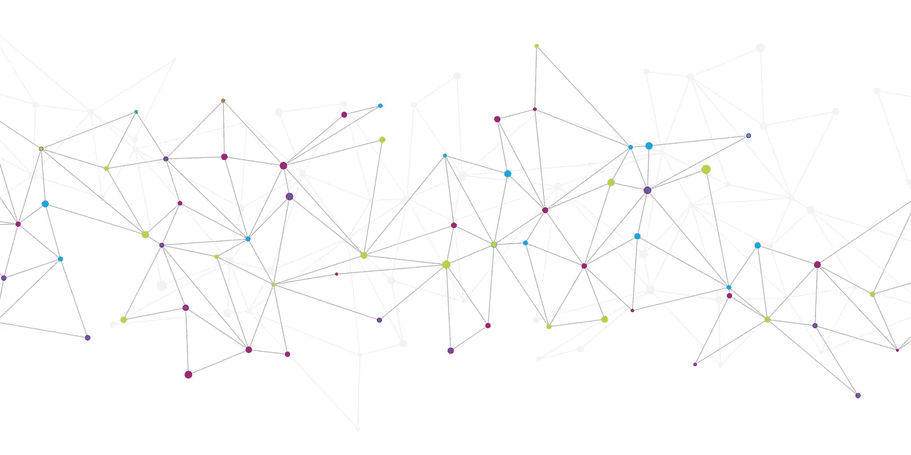
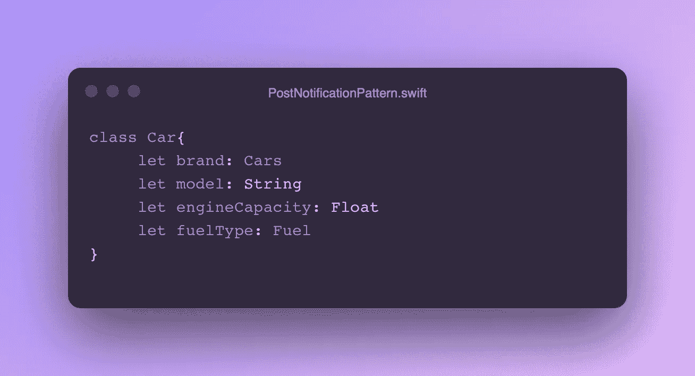
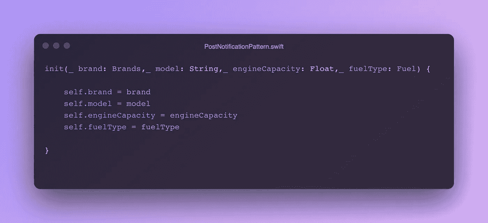
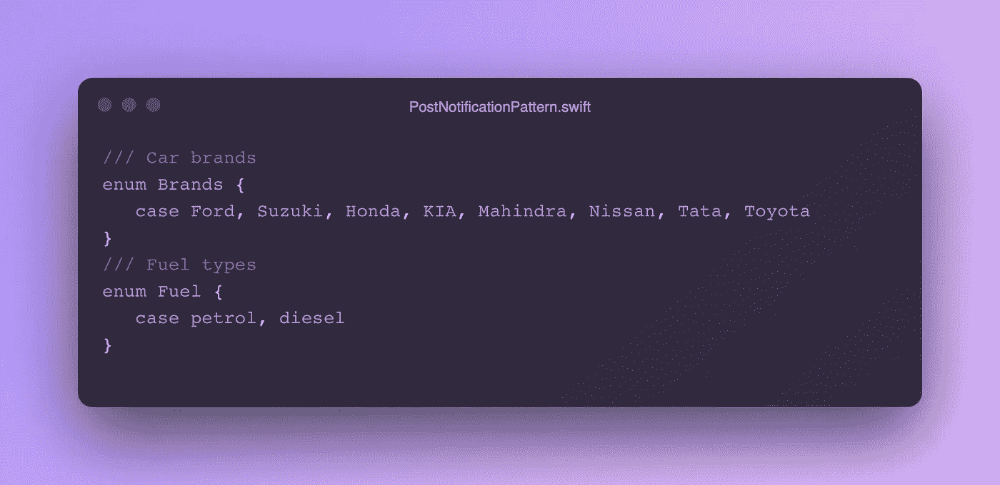
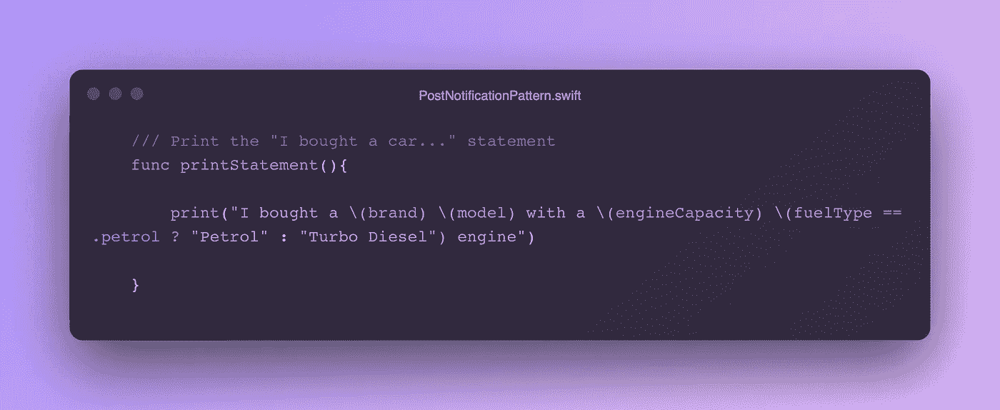
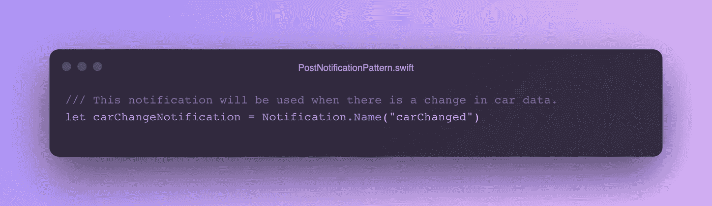
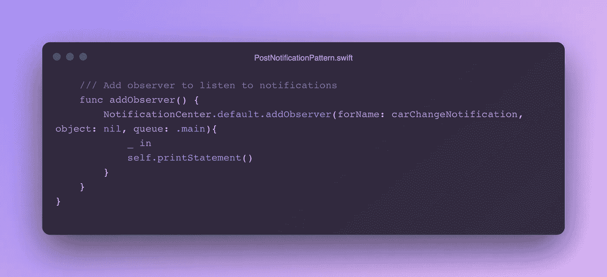
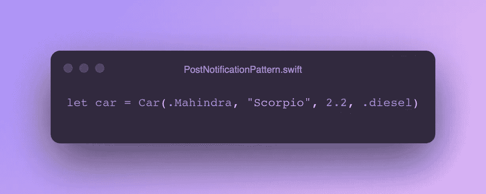
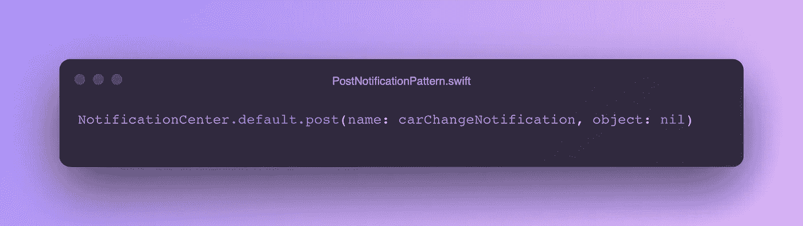

# 通过通知中心发布您的更改

> 原文：<https://medium.com/nerd-for-tech/post-your-changes-with-notificationcenter-3990a26aebfa?source=collection_archive---------1----------------------->

由 [kjpargeter](https://www.freepik.com/author/kjpargeter) 创建

你好 devs，

有很多方法可以使用通知中心，我只是想向你展示一些你可能已经知道的东西。我们试图通知变化/更新，并基于它触发一个动作。

# 现在让我们跳到代码…

## 第一步:

为此开辟一个新的游乐场。

我们将创建一个名为 car 的具有一些属性的类。

雷，所以呢

## 第二步:

为这些属性编写初始化程序。

雷，所以呢

你可能想知道这些品牌和燃料类型是从哪里来的。别担心，我也会提供的。

雷，所以呢

## 第四步:

因此，我们需要采取一些行动。因此，我们将创建一个函数，用我们要收集的数据打印一份报表。

## 第五步:

我们需要创建一个表示数据更改的通知。

## 第六步:

现在创建一个添加观察者的方法。在 NotificationCenter 的帮助下，我们需要用之前创建的通知创建一个观察者。打印报表功能将是触发的操作。在初始化器中调用这个方法。

雷，所以呢

**第七步:**

让我们用数据创建一个**汽车**类的对象。

**第八步:**

最后发布 **carChangeNotification** 通知来触发打印动作。

***就这样了伙计们，我该走了。下面给出了完整的代码。***

# 👾要点

**🙏🏽**谢-[雷.索](https://ray.so)，[雨燕](https://www.youtube.com/channel/UCeHYBwcVqOoyyNHiAf3ZrLg)