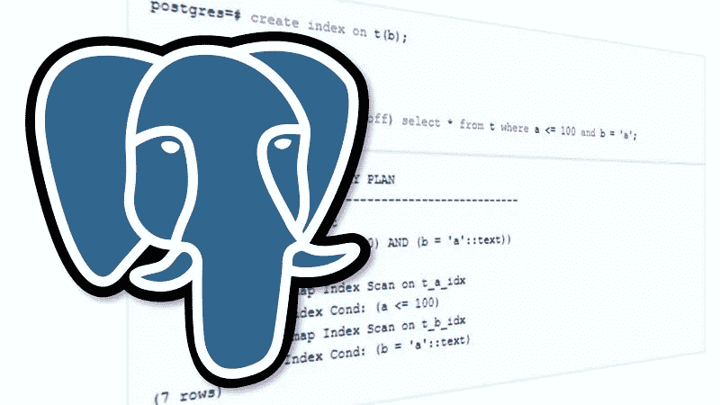

# Postgres —带更新/删除的布林索引

> 原文：<https://medium.com/nerd-for-tech/postgres-brin-index-77b2b8128aef?source=collection_archive---------7----------------------->



*PostgreSQL* 是一个受欢迎的*开放* - *来源*关系数据库，在 AWS、Azure 和 GCP 等大型云玩家中提供了许多功能和产品，使其成为首选数据库。Postgres 支持许多不同类型的索引，如 Gin/Gist/Partial/BRIN。我读到了 BRIN 的概念，并对它进行了进一步的探索。以下是我对布林指数的理解。

**什么是布林指数？**

BRIN 代表“**块范围索引**”。它存储索引创建时由参数 pages_per_range 定义的块范围的最大/最小值。

```
create index idx_test on test using brin (last_updated_date) with (pages_per_range = 32);
```

默认情况下，pages_per_range 为 128，这意味着对于 8kb 的块大小，将按 128*8Kb=1Mb 的块计算最小值/最大值。

Btree Index 在索引结构中存储列值，而 BRIN 只存储各个块范围的最大/最小信息。这就是为什么布林指数比三棵树指数小得多。

**使用模式和反模式:**

1.  由于 BRIN 索引只存储定义了 BRIN 索引块、列的相邻范围的高值和低值，所以数据应该以排序的方式出现。如果数据没有排序，那么 BRIN Index 不能有效地过滤掉数据，需要接触更多的表块。
2.  Btree 索引在 B+树结构中存储列信息，因此通过树的分支遍历树以获得特定值更容易。而在 BRIN 中检查一个值需要扫描 BRIN 索引结构的所有页面。因此，如果一个查询只选择了很少的记录，那么使用 Btree 索引和查询来过滤表中的大量数据是合适的，BRIN 索引更有意义。
3.  表上应该没有(或很少)更新/删除。更新/删除导致块中的死元组，这些元组稍后通过清空过程释放。一旦进行了清空，这些块就是空闲列表的一部分(在 Postgres 中，没有像 Oracle 那样的 **PCTUSED** 参数),新行将进入这些块孔，从而改变这些块的最小/最大范围，使其落入更大的范围内(假设数据按照第 1 点中提到的方式排序)。
4.  在索引列上筛选数据，然后在同一列上进行排序的查询，Btree 索引更合适，因为它以排序的方式存储数据，因此可以避免排序。而 BRIN Index 需要在过滤掉数据后进行排序。

**在具有高 DML 活动的表上演示 BRIN 索引用法:**

*   用于检查表中空闲空间块的扩展。

```
create extension pg_freespacemap;
```

*   创建测试表并填充 100M 行。

```
CREATE TABLE test (id bigint);INSERT INTO test SELECT g.id FROM generate_series(1, 10000000) AS g (id);create index idx_test on test using brin (id) with (pages_per_range = 8);
```

*   检查表格中的块数和每个块的平均行数。

```
SELECT count(*) FROM pg_freespace(‘test’);
44248select 10000000/44248; --rows/blocks
225
```

*   使用布林索引获取记录

```
postgres=> explain analyze select count(*) from test where id > 2000000 and id < 3000000;
QUERY PLAN
Aggregate (cost=62215.24..62215.25 rows=1 width=8) (actual time=621.741..621.741 rows=1 loops=1)
-> Bitmap Heap Scan on test (cost=344.79..59698.52 rows=1006689 width=0) (actual time=47.769..358.479 rows=999999 loops=1)
Recheck Cond: ((id > 2000000) AND (id < 3000000))
**Rows Removed by Index Recheck: 1633**
**Heap Blocks: lossy=4432**
-> Bitmap Index Scan on idx_test (cost=0.00..93.11 rows=1007049 width=0) (actual time=47.722..47.723 rows=44320 loops=1)
Index Cond: ((id > 2000000) AND (id < 3000000))
```

*   在每个表块中创建孔，并向其中插入新数据(最坏的情况)。

```
--currently all blocks are fully packed
select * from pg_freespace(‘test’) where avail != 0;
0--delete record from each of the table block
delete from TEST where mod(id,100) = 0;
DELETE 100000--run vacuum to remove dead tuples
vacuum test;--all the blocks now having free space
select count(*) from pg_freespace(‘test’) where avail != 0;
44248--insert same number of rows as we deleted and in increment “id” order. It will occupy all the existing free space.INSERT INTO test SELECT g.id FROM generate_series(10000000, 10100000) AS g (id);--no block with free space now
select count(*) from pg_freespace(‘test’) where avail != 0;
0
```

*   运行 vacuum 以更新布林指数

```
vacuum test;
```

*   再次运行查询(**堆块**和**被索引重新检查移除的行**显著增加)

```
QUERY PLAN
Aggregate (cost=61994.96..61994.97 rows=1 width=8) (actual time=624.274..624.275 rows=1 loops=1)
-> Bitmap Heap Scan on test (cost=337.11..59554.91 rows=976018 width=0) (actual time=156.340..425.839 rows=990000 loops=1)
Recheck Cond: ((id > 2000000) AND (id < 3000000))
**Rows Removed by Index Recheck: 2011280**
**Heap Blocks: lossy=13280**
-> Bitmap Index Scan on idx_test (cost=0.00..93.10 rows=997987 width=0) (actual time=1.240..1.241 rows=132800 loops=1)
Index Cond: ((id > 2000000) AND (id < 3000000))
```

**结束语:**老实说，我认为 BRIN 概念对于数据量巨大且需要进行批处理的数据仓库查询更有用。BTree 索引降低了对大数据量的 DML 操作的速度，更紧凑的 BRIN 更有意义。

我在亚马逊红移上看过一个类似的概念，叫做排序键/区域映射。在这里，Sort Key 强制对 copy 语句中的整批行进行排序。此外，红移块大小是 1 MB，这是不可变的，这意味着对表的任何更新，即使触及一行，它也会将整个块和更改的数据复制到较新的块中。