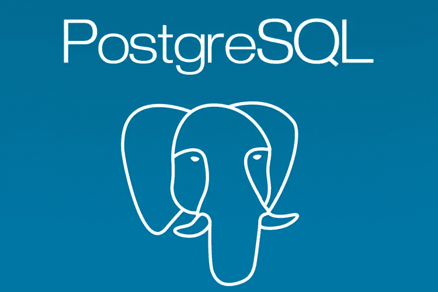

# postgres——适合队列实现吗？

> 原文：<https://medium.com/nerd-for-tech/postgres-good-for-queuing-implementation-8b7980b6409b?source=collection_archive---------4----------------------->



几天前，我们收到了一个 CloudWatch 警报，警告 Amazon Aurora 上托管的一个 Postgres 数据库的 CPU 利用率。查看性能分析，我们得到了消耗 CPU 最多的查询。

```
UPDATE events_tab1 
SET    locked_by = $1, 
       last_updated_by = $2, 
       last_updated=$3, 
       locked_at=$4, 
       rtcount = rtcount + ? 
WHERE  id                       IN ( 
       ( 
              SELECT id 
              FROM   events_tab1 
              WHERE  rtcount < $5 
              AND    locked_at < $6) FOR UPDATE skip locked limit $7 ) returning *Indexes on events_tab1:
    "events_tab1_pk" PRIMARY KEY, btree (id)
    "events_tab1_la_rcnt" btree (locked_at, rtcount)
```

实际上，CPU 消耗最高的 5 个查询都与不同表上的“FOR UPDATE skip locked”相关。我对更新跳过锁定的语法**很陌生，很快在谷歌上搜索，我开始知道关于 Postgres 中的[排队实现](https://www.2ndquadrant.com/en/blog/what-is-select-skip-locked-for-in-postgresql-9-5/)。**

**那很好。**我见过有人使用像 SQS 这样的消息服务来实现队列，从而构建解耦架构。这里 Postgres 提供了内置的排队特性。

回到 CPU 峰值问题，在进一步的检查中，我注意到与所有这 5 个表的行数相比，死元组很高，尽管 autovacuum 定期在这些表上运行。这就是索引碎片化的原因(查询计划正在经历索引扫描)。

```
select n_live_tup,n_dead_tup,last_autovacuum,current_time from pg_stat_user_tables where relname='events_tab1';n_live_tup | n_dead_tup |        last_autovacuum        |   timetz
------------+------------+-------------------------------+----------
        51 |     797750 | 2021-04-03 14:30:32            | 14:49:29select count(*) from events_tab1;
 count
-------
    25
```

经过进一步检查，我发现有一个会话运行了 24 小时以上，并且处于活动状态。现在，清空的一个条件是，它不会在最早运行的事务的 xmin 之后清理死元组，这意味着在过去 24 小时内生成的死元组不会被所有表清理。

然而，这在 Postgres 中是众所周知的事情，我们应该关注长时间运行的事务，尤其是“事务中空闲”的事务。

我之前也遇到过这个问题，但是有一点我不明白，为什么一个在其他表上长时间运行的查询会阻塞所有其他表的清空过程。我在 Postgres 社区提出了这个问题，看到社区成员的快速回复，我很高兴。

> **你可以在这里阅读更多相关内容**—[https://www . PostgreSQL . org/message-id/19474.1572022017% 40 SSS . pgh . pa . us](https://www.postgresql.org/message-id/19474.1572022017%40sss.pgh.pa.us)

老实说，我仍然需要坐下来理解为什么 table2 上的查询阻塞了 table1 上的 vacuuming，然后还要比较其他 RDBMS 在这方面是如何工作的。

这里另一个有趣的事情是，如果相应的表上没有发生清空，那么只有事件表上的这 5 个查询(用于排队机制)消耗了更多的 CPU(CPU 随着事件表中死元组的增加而增加)。其他表的工作负载不会受到太大影响。这可能是因为在那些排队表上进行了太多的删除/更新/选择，然后可能是 Postgres 中队列机制的内部工作方式(更多的 cpu 周期？).

不管怎样，在杀死那个长时间运行的会话(来自用户生成的会话的手动查询)之后，CPU 下降到 40%(在 96 vCPU 机器上)。

> 要终止一个长时间运行的事务/查询，我们可以在仔细考虑工作量后设置**语句 _ 超时**和**空闲 _ in _ 事务 _ 会话 _ 超时和**参数。

**为什么 CPU 还是 40%？**我在顶级 CPU 消耗查询中看到相同的事件表查询。还有许多其他应用程序生成的查询，它们通常运行 2-3 个小时(这些查询是为了在 Reader 实例上进行报告，hot_standby_feedback 在 Aurora 上总是打开的)。因此，在这种情况下，我们不能做太多事情，这意味着在过去的 2-3 小时内，所有表上总会累积死元组。

出于好奇，我又做了一些测试，看看当其他事务正在进行时，数据清除是如何工作的。

```
**Session 1:**
create table test (age int);
CREATE TABLE
insert into test select generate_series(1,100000);
INSERT 0 100000
create index idx on test(age);
CREATE INDEX**Session2: (starts a transaction but does not end)**create table test2(age int);
CREATE TABLEBEGIN;
BEGIN
select count(*) from test2;
 count
-------
     0
```

现在，再次在会话 1 中，运行 delete 语句，我们可以看到 vacuum 并没有清理死行。SELECT 按预期提供了 0 行，但未清除死元组。

```
delete from test;
DELETE 100000

vacuum verbose test;
INFO:  vacuuming "public.test"
INFO:  index "idx" now contains 100000 row versions in 276 pages
DETAIL:  0 index row versions were removed.
0 index pages have been deleted, 0 are currently reusable.
CPU 0.00s/0.00u sec elapsed 0.00 sec.
**INFO:  "test": found 0 removable, 100000 nonremovable row versions in 443 out of 443 pages**
DETAIL:  100000 dead row versions cannot be removed yet.
There were 0 unused item pointers.
Skipped 0 pages due to buffer pins.
0 pages are entirely empty.
CPU 0.00s/0.00u sec elapsed 0.00 sec.select count(*) from test;
 count
-------
     0
```

我试图创建另一个索引，也做了全真空，但正如所料，它们也遵循相同的规则(在新的索引和表中引入死元组，它们的大小保持不变)。

```
\dt+ test

 Schema | Name | Type  |     Owner     | Persistence |  Size   | 
--------+------+-------+---------------+-------------+---------+----
 public | test | table | fintech_admin | permanent   | 3568 kB |\di+ idx

 Schema | Name | Type  |     Owner     | Table | Persistence |  Size   
--------+------+-------+---------------+-------+-------------+------
 public | idx  | index | fintech_admin | test  | permanent  | 2208 kB select count(*) from test;
 count
-------
     0create index idx1 on test(age);
CREATE INDEX\di+ idx1

 Schema | Name | Type  |     Owner     | Table | Persistence |  Size   
--------+------+-------+---------------+-------+-------------+------
 public | idx1 | index | fintech_admin | test  | permanent  | 2208 kB vacuum full test;
VACUUM\dt+ test

 Schema | Name | Type  |     Owner     | Persistence |  Size   | 
--------+------+-------+---------------+-------------+---------+---
 public | test | table | fintech_admin | permanent   | 3576 kB |
```

**可能的解决方案(探索):**

*   PG_REPACK 实用程序在这里可以方便地删除碎片/死元组。当它创建一个新表并切换表名时，它应该只复制那些没有死元组的相关行(这是正常的 vacuum 无法清理的)。然而，pg_repack 需要频繁地进行调度，可能每小时一次(暂时锁定可能是另一个问题)。
*   应用程序团队还希望调整一些队列参数，如并行线程、睡眠时间(多次轮询之间的等待时间)以及批量大小(单次轮询中有多少条记录)。

**结束语:**
乍一看，Postgres 中内置的队列实现看起来相当不错，尽管我们看到由于其他长时间运行的查询，CPU 利用率很高。实际上，这可能与排队机制不完全相关，但总体而言，任何具有非常高的 DML 和高访问率的表都是如此。但归根结底，这就是为什么要为？

有什么想法和经历吗？恳请分享。