# 邮递员——一些提示和技巧

> 原文：<https://medium.com/nerd-for-tech/postman-some-tips-and-tricks-c0cd45c86929?source=collection_archive---------0----------------------->

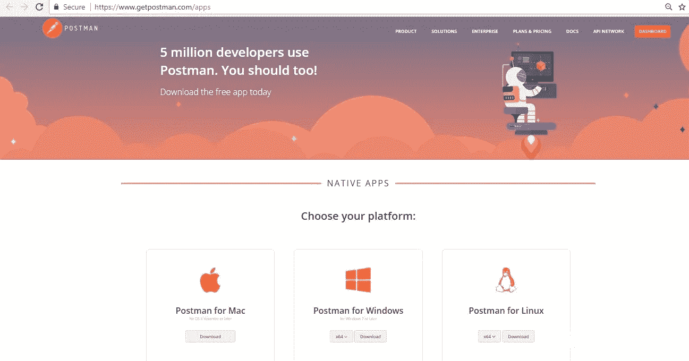

邮递员

由于数百万后端开发人员依赖于这个奇妙的工具，我从它身上学到了一些新的东西，或者我必须说，如果有人已经知道它，我学到晚了。

但我坚信，有像我一样的人每天都在琢磨一些东西，即使已经很晚了，也想学习一些新的东西。因此，这篇文章是为那些想深入了解 Postman 工具的开发人员准备的。

我将生动地讨论几件事，我相信这将在很大程度上帮助你。如果你对任何你熟悉的话题都很熟悉，你可以随时直接跳到你想要的话题

**邮差系列及其用途**

《邮差》中的**环境**

**重用端点中的环境变量**

**在 Postman 中使用测试来执行不同的操作**

# (A)邮递员集合及其用法

邮递员集合只不过是将您的请求存储在一个文件夹中的一种方式，这样您就不会希望一次又一次地运行具有相同细节的请求。

它还节省了您为特定的可重用端点选择请求的时间。我会给你看这是什么样子

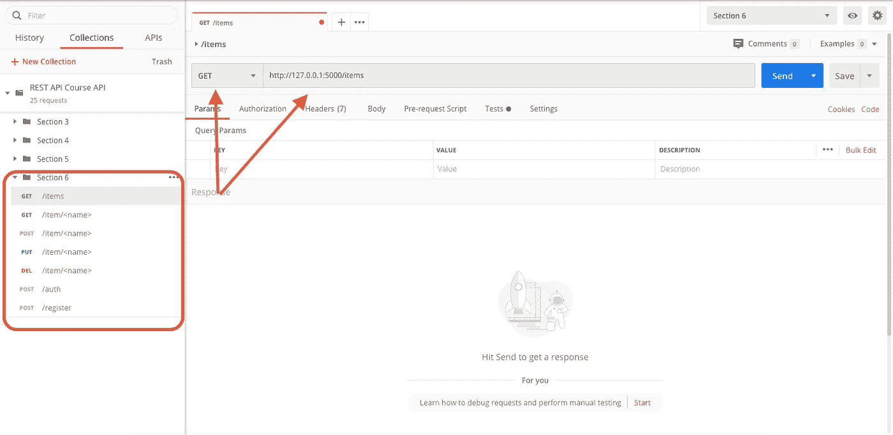

**【A1】**邮差收藏和请求

正如你所看到的标记区域，**第 6 节**是我们称之为**的集合**，它包含许多 HTTP 请求端点，比如 **GET** with **URLs** 。现在，这使我能够直接点击任何一个请求，并运行它，或者用邮递员的话来说，点击**发送**。如你所见，在右手边，点击**后，获得 URL **/items** 的**，这将显示你保存的结果。

> 现在下一个问题出现了，我怎样才能创建一个邮差集合，怎样才能保存我的请求？

这并不困难，可以通过左上角的一个选项来完成，如果你能在图像中看到，那就是 **+新系列**。当你偶然发现它，你会看到一个选项来创建一个。

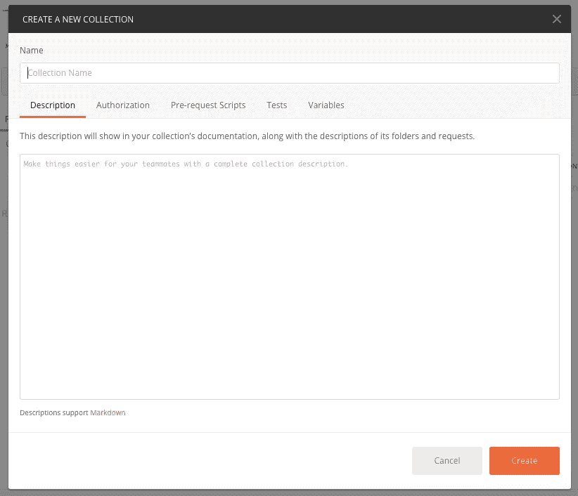

**【A2】**创建邮递员集合

当你点击 **+新收藏**时，你会看到这个屏幕。您需要输入您的收藏的名称，最好对您的收藏做一个简短的描述，以便在导入您的收藏或在将来使用您的收藏时，您将始终有一个描述，它将使您正确理解您最初为什么创建此收藏。

当您完成创建您的集合时，现在是时候存储您所有的可重用请求了。要将您的一个请求存储在您创建的集合下，您必须首先在右侧的 postman 控制台中打开一个选项卡，并使用您喜欢的任何方法发出请求。例如，让我们以第一张图中所示的请求为例，即[**http://127 . 0 . 01/items**，](http://127.0.01/items,)它是一个 **GET** 请求。现在，当你想保存它时，你只需点击**保存**，它位于**发送**字段旁边。当您这样做时，您会看到这个屏幕

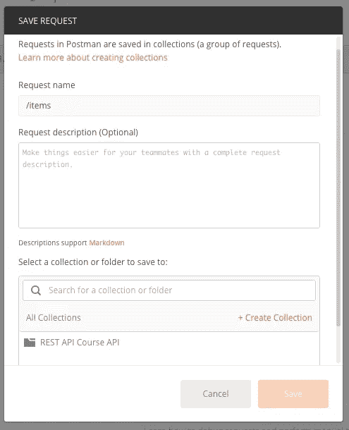

**【A3】**保存邮递员请求

保存您的请求名称。再说一次，描述总是能节省一天的时间，所以一定要添加描述。在底部，您将能够看到您创建的集合名称，在我的例子中，它是， **REST API Course API** 。

**请注意:如果您创建了多个收藏，您将在所有收藏下获得更多收藏。你只需要选择其中一个，然后点击保存**。祝贺您，您已经在收藏中保存了您的第一个请求。你可以随时回来找你的邮递员，你会看到你的收藏，只要你打开收藏文件夹，你就会看到你的请求。你所要做的就是点击它，它将填充那里的数据。

> 此外，不要忘记保存您已经存在的请求 url，如果您想在将来看到它们，而不是有一个旧的数据。这是一个很好的练习

这就是关于邮差收集和如何利用它的基本内容。您可以存储多个请求，并随时使用它。你可以参考第一张图，你会发现我的 **REST API 课程 API 集合文件夹**里存了多少个请求。如果你仍然觉得被困在某个地方，那么我有一个链接给你，利用它，你会很好地去。

 [## 创建收藏

### 邮递员收藏是一组保存的请求，您可以将它们组织到文件夹中。本主题涵盖:您可以创建一个…

learning.postman.com](https://learning.postman.com/docs/postman/collections/creating-collections/#:~:text=Postman%20Collections%20are%20a%20group,you%20can%20organize%20into%20folders.) 

# **(B)邮递员所处的环境**

现在这是一些先进的东西，但它确实是邮差的重要组成部分，我相信你会想知道。

E 环境无非是让用户存储一些**变量**和**它的值**，以便在发出邮递员请求时重用。就像，一次又一次地使用相同的 url，或者每次都需要的任何值，你厌倦了一次又一次地提供它。例如， **JWT** 令牌用于为任何 **JWT 要求的**请求获取数据。

我知道，对于一个学习邮递员的人来说，上面的问题很难回答，但是不要担心，和我在一起，我会用一些简单的例子来解释它。我们将一步一步地学习，它在哪里，以及如何使用它。

为了创建一个环境，你需要看一只眼睛旁边右上角的**齿轮**图标。现在你在想它到底在哪里。让我告诉你它在哪里。

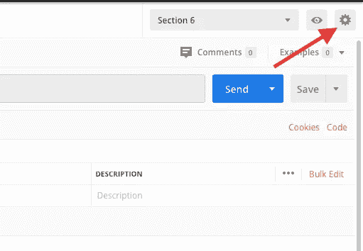

**【B1】**管理邮递员环境图标

现在，当你点击它时，你会看到一个选项，比如在对话框的右下角添加**。如果您已经有一个现有的环境，您会在对话框中看到它。但如果你没有，那么只是一个空白框，选项**全局，进口，在右下角添加**。点击添加，你会看到下面的屏幕**

**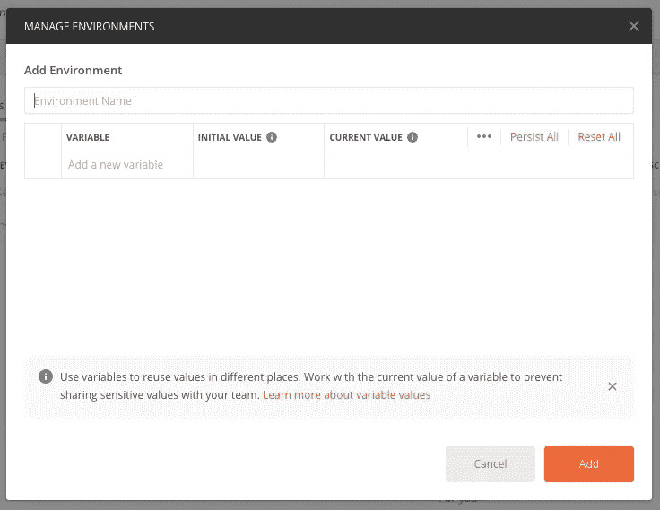**

****【B2】**经营环境**

**您已经命名了您环境，并存储了您的变量及其值，这些变量及其值将在您的邮递员请求中重用。**

**您可以添加以下任一选项下的值，即**初始值**或**当前值**或两者。这是你的选择，并添加它。之后，当你点击返回**嵌齿轮**选项，如图**图**图 **B1** 所示，你会在那里看到你的环境。为了添加更多的变量，只需点击已经存在的环境，并随时为其添加更多的价值。**

# ****(C)重用端点中的环境变量****

**在上一节中，我们学习了如何储存环境，现在我们将学习如何使用它们，否则我们的努力将付诸东流。所以现在，我们有了一个变量的值。假设我们有一个 localhost url，它是[**http://127 . 0 . 0 . 1/**](http://127.0.0.1/)**，**它的出现频率对于使用你的端点来说，当然会是频繁的。像我这种情况[**http://127 . 0 . 0 . 1/items**](http://127.0.0.1/items)**。**你不会想一遍又一遍写这么长的语句吧。因此，我们只是在新创建的环境中存储一个变量 **url** ，并存储其值，该值将是 [**http://127.0.0.1** 。看起来会是这样的](http://127.0.0.1.)**

**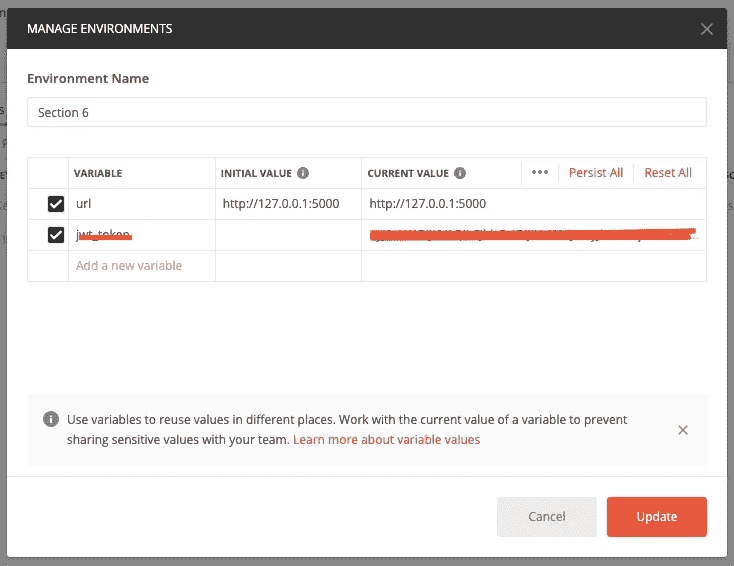**

****【C1】**环境变量值**

**现在你可以看到，上面的**部分 6** 是我们环境的名称，下面有一个变量叫做 **url** 。有它的价值。现在，我们将学习如何在我们的邮差中使用它，而且，我们不必再次键入那个长 url。唷！！**

**和我在一起，我们将一起航行。**

**所以为了使用它，我们需要回到我们的邮差主页，然后通过点击你的**齿轮设置图标**旁边的**下拉菜单**来创建我们的环境。当你点击时，你可以看到你的环境变量名。**

> **重要的是使环境总是活动的，直到您使用存储的变量，在我们的例子中，它是 **url** 。你可以存储 n 个变量，但是要确保它是活动的，否则会出错**

**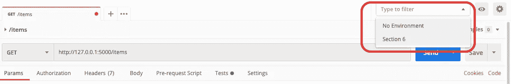**

****【C2】**包含邮递员环境的下拉列表**

**当您选择您的 postman 环境时，您现在可以自由地使用您的变量来处理您的请求。我们如何利用这一点？要使用该变量，我们只需进入您插入 url 的字段，我们通过使用 **{{variable_name}}** 来完成。在我们的例子中，我们将这样做， **{{url}}/items** 。**

> **请记住，我们需要 **/** ，因为我们刚刚使用了**http://127 . 0 . 0 . 1:<port _ number>**，最后没有斜杠。所以总是加上 **/然后是你的路线名，在这个例子中是物品，所以就变成了，/物品**。我只是告诉你，因为我们经常跳过这些小事，然后让自己困惑。**

**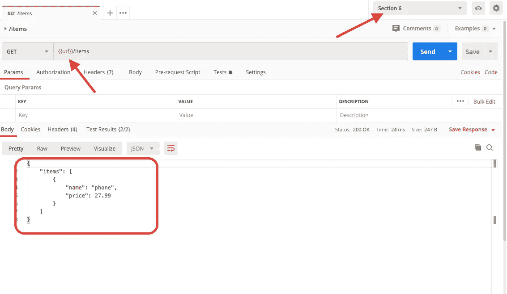**

****【C3】**使用环境变量的图像结果**

**上面的图像，将展示三件需要注意的事情，一、**变量**的用法，二、**环境正在积极地利用我们的变量**和三、**成功的结果，这证明它正在工作**。**

**这就是它的工作方式，知道这一点真的很好，因为它节省了很多时间。**

# ****(D)在 Postman 中使用测试来执行不同的操作****

**最后但并非最不重要的是，我最近学到的最重要的事情是在 Postman **中使用**测试**来处理特定的请求**。为什么我强调，对于一个特定的请求，它只为一个特定的请求运行测试，它就像一个后端代码，为你做一些额外的工作。**

**什么是测试？测试听起来像是对我们的代码进行测试，实际上是一样的，只是在 Postman 中的操作方式有所不同。**

**在《邮差》里，有一个地方，是空着的，大多数人跳过，因为它看起来不那么重要，但是让我告诉你一些事情。这是一件非常重要的事情，你可以从 postman 内部测试你的请求，也可以执行像**存储/更新你的环境变量**这样的操作。我们将通过测试学习一些操作，如:**

*   **对响应时间执行检查**
*   **对状态代码执行检查**
*   **创建一个变量，并存储从特定请求得到的响应的值**

**我敢肯定，休息对你来说是小菜一碟，因为你更有才华:)。**

****(1)执行响应时间检查:**测试总是出现在你可以选择**参数、授权、标题、主体等**的地方。你会发现在图像本身。**

**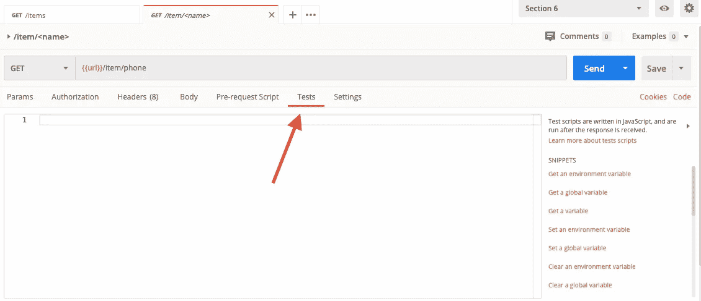**

****【D1】**测试选项邮递员**

**当你点击测试时，你也得到一个空白，在这里你可以用 **Javascript(JS)** 写你的代码，请注意 **JS 支持这种类型的操作**。现在，为了进行各种操作，在右侧，您可以看到**片段**，这将使您的工作变得容易，并且您实际上不必编写代码。你只需要选中操作点击，就会填充代码，然后你要做的就是，**保存**然后**发送**。它将运行您的请求以及测试。**

**我们将执行响应时间检查，无论它是否超过 200。为此，我们应该简单地从**片段**中选择**响应时间小于 200** 。一旦你这样做了，你就会看到下图所示的数据。**

**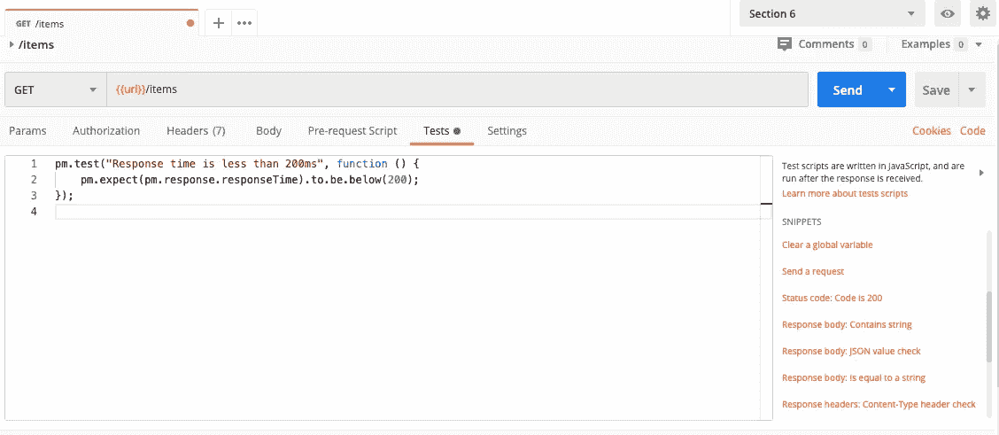**

****【D2】**响应测试的片段**

**现在，不要忘记**保存**，然后**发送**。因此，您也将获得输出，在这里，在图像中，它将向您显示测试结果(N/N) 下的结果**，通过 **(N/N)** 我们的意思是，您已经编写了多少测试用例，有多少通过了测试。****

> **我们总能让我们的测试用例理解请求的次要细节**

**结果将如下所示:**

**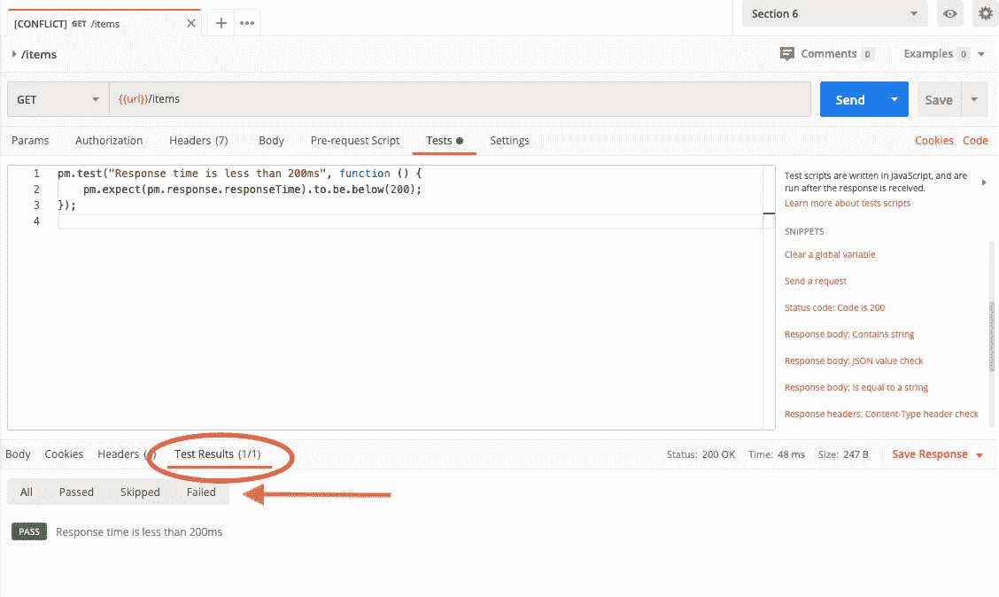**

****【D3】**测试结果邮差**

**从选项中，即**全部/通过/跳过/失败**你可以查看详细描述是什么。如前所述，您可以执行多个测试。我将展示多重运算的结果。**

****(2)对状态码进行检查:**该操作与我们进行的上述操作完全相同。只有一点不同，那就是**代码得到的结果是不同的。同样，代码片段也在那里，所以选择:状态代码:代码是 200****

**你一点击它，就会在邮差里的**测试结果**栏目下得到结果，如 **D3** 所示。**

**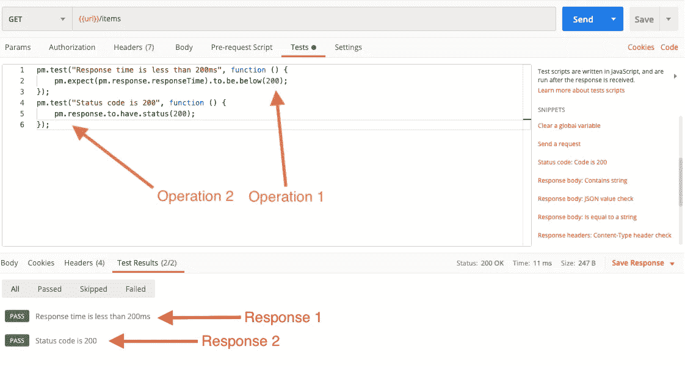**

****【D4】**另一个测试结果邮递员**

**如您所见，响应包含代码提到的名称，即**响应时间小于 200ms** 且**状态代码为 200** 。您也可以重命名它，但是当您从右侧选择一个代码片段时，它是预先编写好的。**

****(3)创建一个变量，并存储从特定请求得到的响应的值:**这个操作有点复杂，但是如果你和我在一起，你会发现它非常有用。为什么我们要学习这个，因为，**当有一个值在我们每次运行请求时被更新，例如，JWT 令牌，现在这个值被刷新，并且需要被插入用于 JWT 认证的请求，如 GET /user** 。如果我们提供过期的令牌，您会得到身份验证错误。在执行此操作**/用户**时，您不想一次又一次地插入值。你要做的是，下面**

1.  **通过测试从请求中获取值，比如， **/auth** ，这给了你一个令牌**
2.  **为了使用该值，我们在 Params 中定义了该值，如 **{{jwt_token}}****

**现在会发生什么，当我们执行 **/auth** 时，它生成 auth_token，通过我们的测试代码，我们接收它，并将其存储到我们的**环境**中，在我们的例子中，它是**部分 6** 。如果我们想通过 **/user** 获得用户详细信息，它会通过您的代码自动为您完成，我们使用上面**部分****(C)****重用环境**中提到的变量。**

**让我们快速看看，我们是如何做到的，如前所述，我们在请求中定义了我们的测试用例，在那里我们获得 auth_token，以便我们可以获取它，并保存它。所以是这样的:**

**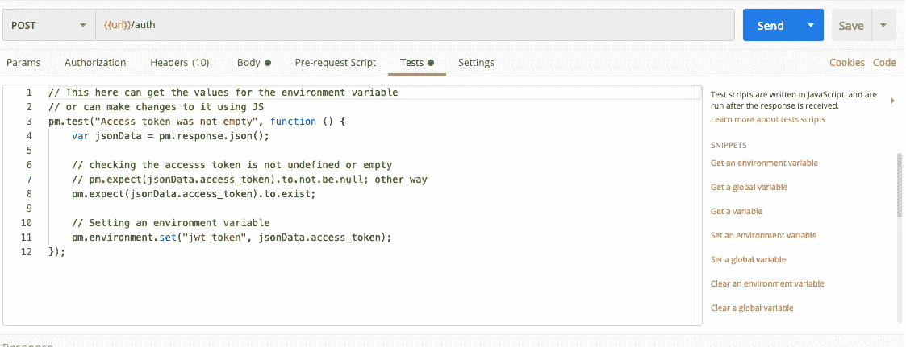**

****【D5】**通过邮递员请求保存令牌**

**现在，代码什么也不做，只是从请求响应中获取值，然后保存到我们当前的环境中。**确保您的环境处于活动状态【请参考 B 和 C 部分了解更多相关信息】**。它将检查哪个环境是活动的，然后用变量名存储该值，并用以下代码存储它的值:**

> **pm.environment.set("jwt_token "，JSON data . access _ token)；**

**现在，为了查看它是否保存成功，我们可以**保存**，然后**在邮递员中发送**。在我们完成这些之后，我们检查**测试结果，**来查看状态。一旦确认，然后通过，点击齿轮设置图标旁边的**眼睛图标、**当前**、**，您将看到数据存储在上面。**

**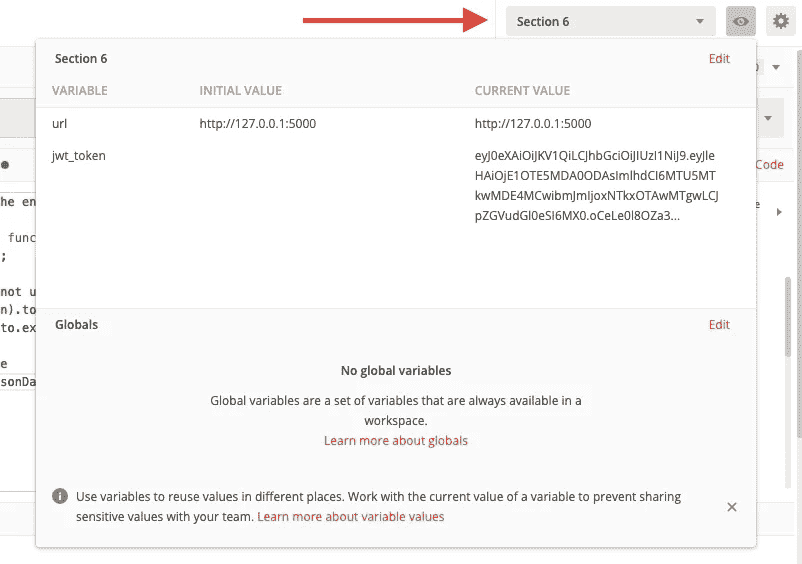**

****【D6】**变量保存的验证**

**看，环境是活动的，值被保存了。现在已经保存了，随时随地都可以使用，通过使用 **{{jwt_token}}** 。变量的命名由您决定。**

**这些是我想分享的东西，并希望它可以帮助很多正在与后端工作的人，并不知道我已经分享的任何事情。要获得更多的信息，你可以依靠邮差文档，或者谷歌。快乐学习。这是我的第一篇关于媒体的博客，所以请原谅我，我写这篇文章时犯的任何错误。表示你的支持，并与你的朋友分享，让他们知道一些很酷的技巧:)。到那时，快乐的编码！！**